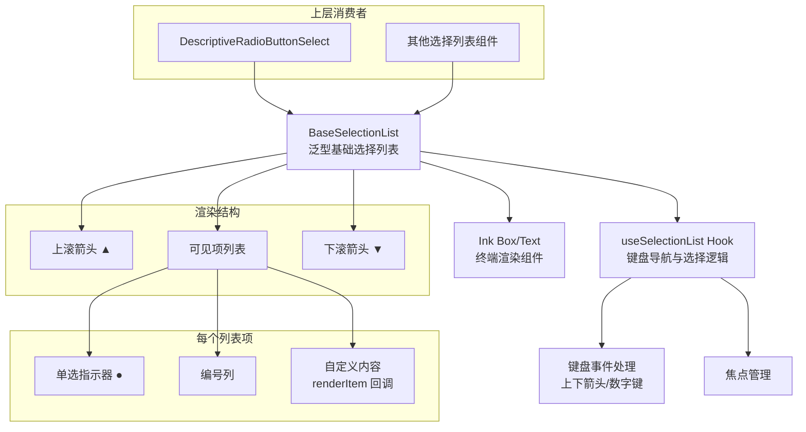

# BaseSelectionList.tsx

## 概述

`BaseSelectionList` 是一个泛型基础选择列表组件，为所有需要"从列表中选择一项"的 UI 场景提供统一的底层支持。它封装了键盘导航、滚动分页、编号显示、单选指示器和颜色主题等通用逻辑，并通过 **render prop 模式**（`renderItem`）允许上层组件自定义每一项的具体渲染内容。

该组件是 Gemini CLI 终端 UI 中选择列表类组件的核心基石，被 `DescriptiveRadioButtonSelect` 等上层组件复用。

## 架构图（Mermaid）



## 核心组件

### 1. 导出接口

#### `RenderItemContext`
传递给 `renderItem` 回调的上下文信息：
```typescript
export interface RenderItemContext {
  isSelected: boolean;   // 当前项是否被选中（高亮）
  titleColor: string;    // 标题推荐颜色
  numberColor: string;   // 编号推荐颜色
}
```

#### `BaseSelectionListProps<T, TItem>`
组件的 Props 定义（泛型）：

| 属性 | 类型 | 默认值 | 说明 |
|------|------|--------|------|
| `items` | `TItem[]` | 必填 | 列表项数组 |
| `initialIndex` | `number` | `0` | 初始选中索引 |
| `onSelect` | `(value: T) => void` | 必填 | 确认选择回调 |
| `onHighlight` | `(value: T) => void` | - | 高亮变化回调 |
| `isFocused` | `boolean` | `true` | 组件是否获得焦点 |
| `showNumbers` | `boolean` | `true` | 是否显示项目编号 |
| `showScrollArrows` | `boolean` | `false` | 是否显示滚动箭头指示器 |
| `maxItemsToShow` | `number` | `10` | 可视区域最大显示项数 |
| `wrapAround` | `boolean` | `true` | 到达末尾是否循环回首项 |
| `focusKey` | `string` | - | 焦点管理键 |
| `priority` | `boolean` | - | 焦点优先级 |
| `selectedIndicator` | `string` | `'●'` | 选中项的指示符号 |
| `renderItem` | `(item, context) => ReactNode` | 必填 | 自定义项渲染回调 |

### 2. 滚动偏移量管理

组件通过 `scrollOffset` 状态和 `effectiveScrollOffset` 计算实现虚拟滚动：

```
如果 activeIndex < scrollOffset:
    滚动到 activeIndex 位置
如果 activeIndex >= scrollOffset + maxItemsToShow:
    滚动使 activeIndex 可见（靠近底部）
```

关键设计点：使用"推导式滚动偏移"（在渲染期间计算 `effectiveScrollOffset`），而非在 `useEffect` 中异步更新，避免了选中项短暂不可见导致的闪烁。

### 3. 渲染结构

每个列表项的布局为水平排列的三列：

```
[●] [1.] [自定义内容]
 ^    ^       ^
 |    |       └─ renderItem 回调渲染
 |    └─ 编号列（可选）
 └─ 单选指示器
```

### 4. 颜色逻辑

颜色基于多个条件的组合确定：

| 条件 | titleColor | numberColor |
|------|-----------|-------------|
| 选中 | `theme.ui.focus` | `theme.ui.focus` |
| 禁用 | `theme.text.secondary` | `theme.text.secondary` |
| 未聚焦且未禁用 | 保持 | `theme.text.secondary` |
| 不显示编号 | 保持 | `theme.text.secondary` |
| 默认 | `theme.text.primary` | `theme.text.primary` |

选中项还会获得 `theme.background.focus` 背景色。

### 5. 滚动箭头

当 `showScrollArrows` 为 `true` 且列表项超过 `maxItemsToShow` 时：
- 顶部显示 `▲`：当可向上滚动时为主色，否则为次色（灰色）
- 底部显示 `▼`：当可向下滚动时为主色，否则为次色（灰色）

这种"始终渲染、条件着色"的设计避免了箭头出现/消失导致的布局跳动。

## 依赖关系

### 内部依赖

| 模块 | 导入内容 | 用途 |
|------|----------|------|
| `../../semantic-colors.js` | `theme` | 语义化颜色主题常量 |
| `../../hooks/useSelectionList.js` | `useSelectionList`, `SelectionListItem` | 键盘导航和选择逻辑的核心 Hook |

### 外部依赖

| 包名 | 导入内容 | 用途 |
|------|----------|------|
| `react` | `useState` | 状态管理（滚动偏移量） |
| `ink` | `Text`, `Box` | 终端 UI 布局和文本渲染组件 |

## 关键实现细节

1. **泛型设计**：组件使用双层泛型 `<T, TItem extends SelectionListItem<T>>`，其中 `T` 是选择值的类型，`TItem` 是列表项类型。这使得列表可以承载任意类型的数据，同时上层组件可以扩展列表项的结构。

2. **渲染期间的滚动偏移校正**：组件在渲染函数体内（而非 `useEffect` 中）计算 `effectiveScrollOffset`，并在偏差时通过 `setScrollOffset` 同步状态。这是一种刻意的"渲染中触发 setState"模式，React 会在同一帧内合并处理，从而消除了高亮项短暂不在视口内的闪烁问题。

3. **编号列宽度自适应**：`numberColumnWidth = String(items.length).length`，确保无论列表有多少项（如 9 项 vs 100 项），编号列宽度始终对齐。编号使用 `padStart` 左对齐。

4. **Render Prop 模式**：通过 `renderItem` 回调将具体内容渲染权交给上层组件，同时传递 `RenderItemContext`（包含选中状态和推荐颜色），使上层组件无需关心选择逻辑和颜色计算。

5. **逻辑与渲染分离**：所有键盘导航、选择、数字键跳转等逻辑都封装在 `useSelectionList` Hook 中，`BaseSelectionList` 仅负责视觉呈现和滚动管理。

6. **编号隐藏机制**：列表项可通过 `hideNumber` 属性单独隐藏编号，`showNumbers` 属性控制全局编号显示。即使全局启用编号，单个项也可选择不显示。

7. **可访问性考虑**：单选指示器标记了 `aria-hidden`，编号列标记了 `aria-state={{ checked: isSelected }}`，为终端辅助技术提供语义信息。
