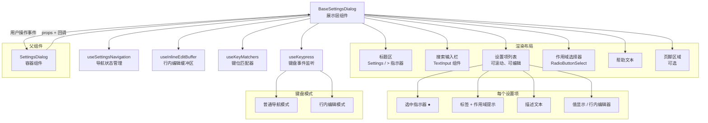

# BaseSettingsDialog.tsx

## 概述

`BaseSettingsDialog` 是设置对话框的**通用展示层组件**，负责渲染完整的设置管理界面并处理所有键盘交互。它是一个高度可配置的"纯 UI"组件，不包含具体的业务逻辑（如设置的读写、搜索过滤等），而是通过 Props 和回调将这些职责交给父组件（如 `SettingsDialog`）。

该组件实现了以下核心功能：
- 带圆角边框的对话框容器
- 搜索输入栏（可选）
- 可滚动的设置项列表，支持行内编辑
- 作用域选择器（User / Workspace / System）
- 键盘导航（上下移动、Tab 切换焦点区域、Enter 选择/编辑、Esc 关闭）
- 动态布局自适应终端高度
- 自定义页脚（如重启提示）

## 架构图（Mermaid）



## 核心组件

### 1. 导出接口

#### `SettingsDialogItem`
设置项的数据结构：

| 字段 | 类型 | 说明 |
|------|------|------|
| `key` | `string` | 唯一标识符 |
| `label` | `string` | 显示标签 |
| `description` | `string?` | 标签下方的描述文本 |
| `type` | `SettingsType` | 设置类型（决定交互行为） |
| `displayValue` | `string` | 预格式化的显示值（修改过的带 `*`） |
| `isGreyedOut` | `boolean?` | 是否灰显（使用默认值） |
| `scopeMessage` | `string?` | 作用域提示（如 "(Modified in Workspace)"） |
| `rawValue` | `SettingsValue?` | 原始值（用于编辑模式初始化） |
| `editValue` | `string?` | 预格式化的编辑缓冲区值（复杂类型） |

#### `BaseSettingsDialogProps`
组件 Props（分组归类）：

**头部配置：**
- `title`: 对话框标题
- `borderColor`: 自定义边框颜色

**搜索配置：**
- `searchEnabled`: 是否启用搜索（默认 `true`）
- `searchPlaceholder`: 搜索占位文本（默认 `"Search to filter"`）
- `searchBuffer`: 搜索输入的文本缓冲区

**列表数据：**
- `items`: 设置项数组

**作用域选择：**
- `showScopeSelector`: 是否显示（默认 `true`）
- `selectedScope`: 当前选中作用域
- `onScopeChange`: 作用域变更回调

**布局：**
- `maxItemsToShow`: 最大可见项数
- `maxLabelWidth`: 标签最大宽度（对齐用）
- `availableHeight`: 可用终端高度

**操作回调：**
- `onItemToggle`: 切换布尔/枚举项
- `onEditCommit`: 提交编辑值
- `onItemClear`: 清除/重置项
- `onClose`: 关闭对话框
- `onKeyPress`: 自定义按键处理（返回 `true` 表示已处理）

**其他：**
- `keyMatchers`: 自定义键位匹配器
- `footer`: 页脚配置（内容 + 高度）

### 2. 动态布局计算

通过 `useMemo` 根据 `availableHeight` 动态计算：

```
可用高度 = 终端高度 - 对话框内边距(4)
固定高度 = 标题(1) + 搜索区(5或1) + 滚动箭头(2) + 间距(1) + 帮助文本(1) + 页脚
每项高度 = 3（标签行 + 描述行 + 间距）
```

智能降级策略：
- 当终端高度 < 25 行时，如果隐藏作用域选择器能多显示 1 项以上，则自动隐藏
- 最少保证显示 1 个设置项

### 3. 内部状态

| 状态/Hook | 类型 | 用途 |
|-----------|------|------|
| `activeIndex` | `number` | 当前高亮的设置项索引 |
| `windowStart` | `number` | 可见窗口的起始索引 |
| `editState` | 对象 | 行内编辑的状态（编辑中的键、缓冲区、光标位置） |
| `focusSection` | `'settings' \| 'scope'` | 当前焦点区域 |

### 4. 键盘交互系统

组件实现了两套键盘处理模式：

#### 行内编辑模式（`editingKey` 存在时）

| 按键 | 动作 |
|------|------|
| 左右箭头 | 光标在编辑缓冲区内移动 |
| Home / End | 光标跳到行首 / 行尾 |
| Backspace | 删除光标左侧字符 |
| Delete | 删除光标右侧字符 |
| Escape / Enter | 提交编辑 |
| 上下箭头（非可插入键） | 提交编辑并导航 |
| 其他字符 | 插入到编辑缓冲区 |

关键设计：上下箭头在编辑模式中只响应"非可插入键"（`!key.insertable`），这样 `j/k` 等字母可正常输入编辑缓冲区而不会被拦截为导航键。

#### 普通导航模式

| 按键 | 动作 |
|------|------|
| 上/下箭头 | 移动高亮 |
| Enter | 布尔/枚举类型切换；其他类型进入编辑模式 |
| Ctrl+L | 清除/重置当前项 |
| 数字键 | 数字类型设置快速编辑 |
| Tab | 切换焦点区域（设置列表 <-> 作用域选择器） |
| Escape | 关闭对话框 |

优先级链：父组件自定义按键 > 编辑模式 > 导航模式 > 全局按键

### 5. 行内编辑的光标渲染

编辑模式下，值区域显示编辑缓冲区内容和光标：
- 光标在文本中间：`前半部分 + chalk.inverse(光标处字符) + 后半部分`
- 光标在末尾：`全部文本 + chalk.inverse(' ')`（反色空格模拟光标）
- 光标不可见时：直接显示缓冲区文本

使用 `cpSlice`、`cpLen`、`cpIndexToOffset` 等代码点感知的工具函数处理 Unicode 字符。

### 6. 渲染布局结构

```
┌─────────────────────────────────┐  ← 圆角边框 borderStyle="round"
│  > Settings                     │  ← 标题（> 指示焦点）
│  ┌─────────────────────────────┐│
│  │ Search to filter            ││  ← 搜索栏（可选）
│  └─────────────────────────────┘│
│                                 │
│  ▲                              │  ← 上滚指示器
│  ● Label          Value         │  ← 设置项（高亮行）
│    Description                  │
│                                 │
│    Label          Value         │  ← 普通设置项
│    Description                  │
│  ▼                              │  ← 下滚指示器
│                                 │
│  > Apply To                     │  ← 作用域选择器
│    ● User                       │
│      Workspace                  │
│      System                     │
│                                 │
│  (Use Enter to select, ...)     │  ← 帮助文本
│  重启提示...                     │  ← 页脚（可选）
└─────────────────────────────────┘
```

## 依赖关系

### 内部依赖

| 模块 | 导入内容 | 用途 |
|------|----------|------|
| `../../semantic-colors.js` | `theme` | 语义化颜色主题 |
| `../../../config/settings.js` | `LoadableSettingScope` 类型 | 设置作用域类型 |
| `../../../config/settingsSchema.js` | `SettingsType`, `SettingsValue` 类型 | 设置类型定义 |
| `../../../utils/dialogScopeUtils.js` | `getScopeItems` | 获取作用域选择项 |
| `./RadioButtonSelect.js` | `RadioButtonSelect` | 单选按钮选择组件 |
| `./TextInput.js` | `TextInput` | 文本输入组件 |
| `./text-buffer.js` | `TextBuffer` 类型 | 文本缓冲区类型 |
| `../../utils/textUtils.js` | `cpSlice`, `cpLen`, `cpIndexToOffset` | 代码点感知的文本工具 |
| `../../hooks/useKeypress.js` | `useKeypress`, `Key` | 键盘事件监听 Hook |
| `../../key/keyMatchers.js` | `Command`, `KeyMatchers` | 命令枚举和键位匹配器类型 |
| `../../hooks/useSettingsNavigation.js` | `useSettingsNavigation` | 设置导航 Hook |
| `../../hooks/useInlineEditBuffer.js` | `useInlineEditBuffer` | 行内编辑缓冲区 Hook |
| `../../key/keybindingUtils.js` | `formatCommand` | 格式化命令显示文本 |
| `../../hooks/useKeyMatchers.js` | `useKeyMatchers` | 全局键位匹配器 Hook |

### 外部依赖

| 包名 | 导入内容 | 用途 |
|------|----------|------|
| `react` | `React`, `useMemo`, `useState`, `useCallback` | React 核心和 Hooks |
| `ink` | `Box`, `Text` | 终端 UI 布局和文本组件 |
| `chalk` | `chalk` | 终端文本样式（用于光标反色） |

## 关键实现细节

1. **容器/展示分离的展示侧**：`BaseSettingsDialog` 是纯展示组件，所有业务逻辑（设置读写、搜索过滤、重启检测）通过 Props 和回调由父组件注入。这使得它可以被不同的设置对话框复用。

2. **双焦点区域管理**：通过 `focusSection` 状态实现"设置列表"和"作用域选择器"两个焦点区域的切换。当作用域选择器被隐藏时，`effectiveFocusSection` 自动回退到 `'settings'`。

3. **自适应终端高度**：布局计算精确到每个 UI 元素的行高（标题 1 行、搜索栏 5 行、每项 3 行等），在小终端（< 25 行）下自动隐藏作用域选择器以腾出更多空间。

4. **行内编辑与导航的冲突解决**：在编辑模式中，通过检查 `key.insertable` 属性区分"可输入字符"和"导航键"。例如 `j` 和 `k` 是可输入字符（用于编辑），而上下箭头不是（用于导航）。

5. **Unicode 安全的文本处理**：使用 `cpSlice`、`cpLen`、`cpIndexToOffset` 等代码点级别的工具函数处理编辑缓冲区，确保 Emoji 和多字节字符不会被截断或错位。

6. **按键优先级链**：`useKeypress` 回调中，父组件的 `onKeyPress` 最先被调用，若返回 `true` 则短路后续处理。编辑模式下的按键处理优先于普通导航模式，确保编辑不被中断。

7. **光标闪烁效果**：`cursorVisible` 来自 `useInlineEditBuffer` Hook，实现光标闪烁效果。光标位置使用 `chalk.inverse` 反色渲染，在终端中模拟传统文本编辑器的光标。

8. **数字键快捷编辑**：当高亮项是数字类型时，直接按数字键即可进入编辑模式并以该数字作为初始值，提供快速输入体验。

9. **滚动指示器始终渲染**：与 `BaseSelectionList` 类似，滚动箭头只要列表项超过可见数量就始终显示，通过颜色（而非有无）指示是否可滚动，避免布局跳动。
