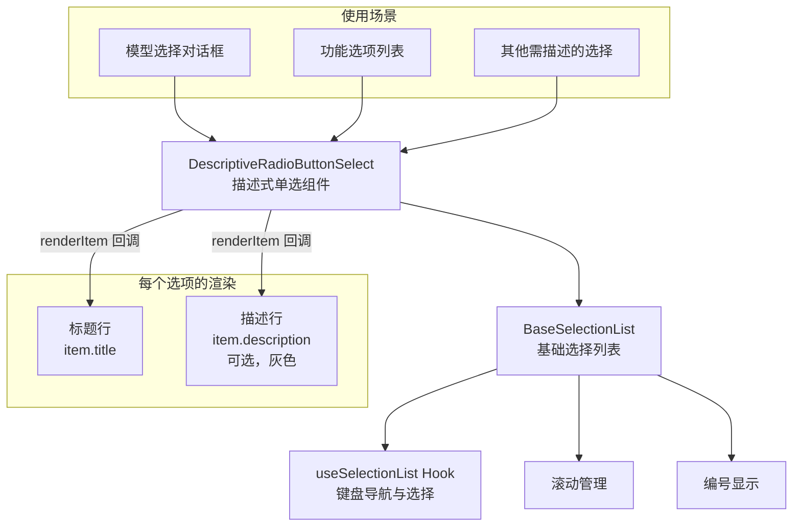

# DescriptiveRadioButtonSelect.tsx

## 概述

`DescriptiveRadioButtonSelect` 是一个带有标题和描述文字的单选按钮选择组件。它基于 `BaseSelectionList` 构建，通过提供自定义的 `renderItem` 实现，为每个选项添加了**标题行**和**可选的描述行**两层展示。

这是对基础选择列表的一种典型应用：在不修改底层导航和选择逻辑的前提下，仅通过 render prop 定制每个选项的视觉呈现。适用于需要为每个选项提供额外说明信息的场景，如模型选择、功能介绍等。

## 架构图（Mermaid）



## 核心组件

### 1. 导出接口

#### `DescriptiveRadioSelectItem<T>`
扩展自 `SelectionListItem<T>`，增加了描述式选项特有的字段：

```typescript
export interface DescriptiveRadioSelectItem<T> extends SelectionListItem<T> {
  title: string;         // 选项标题（必填）
  description?: string;  // 选项描述文字（可选）
}
```

继承自 `SelectionListItem<T>` 的字段包括：
- `key`: 唯一标识
- `value`: 选项值（泛型 `T`）
- `disabled`: 是否禁用
- `hideNumber`: 是否隐藏编号

#### `DescriptiveRadioButtonSelectProps<T>`
组件 Props：

| 属性 | 类型 | 默认值 | 说明 |
|------|------|--------|------|
| `items` | `DescriptiveRadioSelectItem<T>[]` | 必填 | 选项数组 |
| `initialIndex` | `number` | `0` | 初始选中索引 |
| `onSelect` | `(value: T) => void` | 必填 | 确认选择回调 |
| `onHighlight` | `(value: T) => void` | - | 高亮变化回调 |
| `isFocused` | `boolean` | `true` | 是否获得焦点 |
| `showNumbers` | `boolean` | `false` | 是否显示编号（默认关闭） |
| `showScrollArrows` | `boolean` | `false` | 是否显示滚动箭头 |
| `maxItemsToShow` | `number` | `10` | 最大可见项数 |

### 2. 渲染实现

组件的核心是提供给 `BaseSelectionList` 的 `renderItem` 回调：

```tsx
renderItem={(item, { titleColor }) => (
  <Box flexDirection="column" key={item.key}>
    <Text color={titleColor}>{item.title}</Text>
    {item.description && (
      <Text color={theme.text.secondary}>{item.description}</Text>
    )}
  </Box>
)}
```

每个选项渲染为垂直布局的两行：
```
  ● 选项标题         ← titleColor（选中时高亮色，未选中时主色）
    选项描述文字      ← theme.text.secondary（始终灰色）
```

关键点：
- 标题颜色由 `BaseSelectionList` 通过 `RenderItemContext.titleColor` 提供，自动跟随选中/禁用状态变化
- 描述文字始终使用次要颜色（灰色），不随选中状态变化
- 描述文字为可选字段，无描述时仅显示标题单行

### 3. 与 BaseSelectionList 的组合

该组件向 `BaseSelectionList` 传递了明确的泛型参数：
```tsx
<BaseSelectionList<T, DescriptiveRadioSelectItem<T>>
```
这确保了类型安全 -- `renderItem` 回调中的 `item` 参数携带 `title` 和 `description` 字段。

## 依赖关系

### 内部依赖

| 模块 | 导入内容 | 用途 |
|------|----------|------|
| `../../semantic-colors.js` | `theme` | 语义化颜色主题（描述文字颜色） |
| `./BaseSelectionList.js` | `BaseSelectionList` | 基础选择列表（核心渲染和导航逻辑） |
| `../../hooks/useSelectionList.js` | `SelectionListItem` 类型 | 列表项基础类型定义 |

### 外部依赖

| 包名 | 导入内容 | 用途 |
|------|----------|------|
| `react` | `React` 类型 | JSX 类型支持 |
| `ink` | `Text`, `Box` | 终端 UI 文本和布局组件 |

## 关键实现细节

1. **轻量级封装**：该组件本身不包含任何状态或副作用逻辑，仅作为 `BaseSelectionList` 的薄包装层，通过 `renderItem` 回调注入自定义渲染。这是 render prop 模式的典型应用。

2. **默认值差异**：与 `BaseSelectionList` 的默认值不同，该组件将 `showNumbers` 默认设为 `false`（基础组件默认 `true`）。这是因为描述式选项通常不需要编号，标题本身已提供足够的辨识度。

3. **泛型透传**：组件完整透传了泛型参数 `T`，使得 `onSelect` 和 `onHighlight` 的回调参数类型与传入的 `items[].value` 类型保持一致，提供端到端的类型安全。

4. **垂直布局的选项**：与普通的单行 `RadioButtonSelect` 不同，每个选项占据多行（标题 + 描述），这使得在计算 `maxItemsToShow` 时需要注意每项的实际高度。

5. **无循环包裹（wrapAround）配置暴露**：该组件未暴露 `wrapAround` prop，使用 `BaseSelectionList` 的默认值 `true`，意味着到达列表末尾时自动循环回首项。如需禁用循环，需扩展 Props 接口。

6. **组件职责边界清晰**：所有键盘导航（上下移动、数字键跳转、Enter 确认）、滚动管理、选中指示器渲染等逻辑完全由 `BaseSelectionList` 处理，该组件只关心"一个选项长什么样"。
