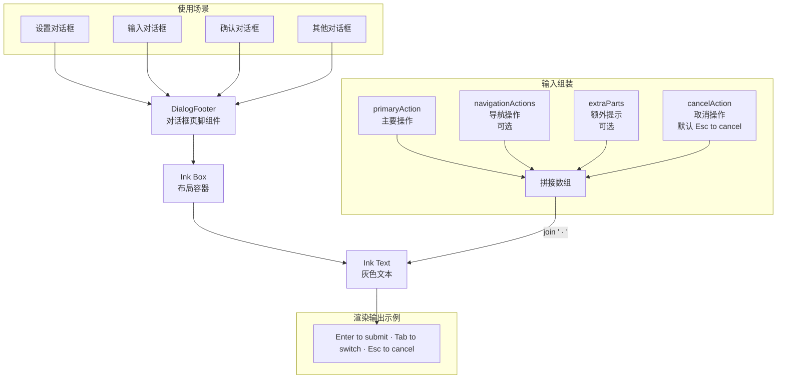

# DialogFooter.tsx

## 概述

`DialogFooter` 是一个用于对话框底部快捷键提示栏的共享组件。它将所有键盘快捷操作（主要操作、导航操作、额外操作、取消操作）以统一的格式拼接并展示，确保项目中所有对话框的底部帮助文本具有一致的视觉风格。

该组件非常轻量，核心逻辑仅为：将传入的各种快捷键描述字符串用 ` · `（中点分隔符）连接，以灰色文本渲染在对话框底部。

## 架构图（Mermaid）



## 核心组件

### 1. 导出接口

#### `DialogFooterProps`

| 属性 | 类型 | 默认值 | 必填 | 说明 |
|------|------|--------|------|------|
| `primaryAction` | `string` | - | 是 | 主要操作提示（如 `"Enter to submit"`） |
| `navigationActions` | `string` | - | 否 | 导航操作提示（如 `"Tab to switch questions"`） |
| `cancelAction` | `string` | `'Esc to cancel'` | 否 | 取消操作提示 |
| `extraParts` | `string[]` | `[]` | 否 | 额外快捷键提示数组（如 `["Ctrl+P to edit"]`） |

### 2. 渲染逻辑

组件的核心渲染流程：

1. **组装文本片段数组**：按固定顺序拼接各部分
   ```
   [主要操作] + [导航操作（可选）] + [额外提示...] + [取消操作]
   ```

2. **连接并渲染**：使用 ` · `（空格-中点-空格）作为分隔符连接所有片段

3. **样式**：
   - 容器：`marginTop={1}`（顶部留 1 行间距）
   - 文本颜色：`theme.text.secondary`（灰色次要文本）

### 3. 输出示例

给定以下 Props：
```typescript
{
  primaryAction: "Enter to submit",
  navigationActions: "Tab to switch",
  extraParts: ["Ctrl+P to preview"],
  cancelAction: "Esc to cancel"
}
```

渲染结果为：
```
Enter to submit · Tab to switch · Ctrl+P to preview · Esc to cancel
```

## 依赖关系

### 内部依赖

| 模块 | 导入内容 | 用途 |
|------|----------|------|
| `../../semantic-colors.js` | `theme` | 语义化颜色主题（`theme.text.secondary` 用于灰色文本） |

### 外部依赖

| 包名 | 导入内容 | 用途 |
|------|----------|------|
| `react` | `React` 类型 | `React.FC` 函数组件类型 |
| `ink` | `Box`, `Text` | 终端 UI 布局和文本渲染组件 |

## 关键实现细节

1. **固定的拼接顺序**：文本片段始终按"主要操作 > 导航操作 > 额外提示 > 取消操作"的顺序排列。取消操作（Esc）始终位于末尾，这符合用户阅读习惯 -- 最常用的操作在前，退出操作在后。

2. **`cancelAction` 有默认值**：默认为 `'Esc to cancel'`，调用者无需每次重复传入。如果某个对话框的退出操作不同（如 `'Esc to close'`），可以覆盖此默认值。

3. **`navigationActions` 条件插入**：只有当 `navigationActions` 不为 `undefined` 时才会插入数组，避免出现连续分隔符或空白项。

4. **`extraParts` 展开插入**：通过数组展开运算符 `...extraParts` 支持插入任意数量的额外提示，提供极大的灵活性。

5. **函数组件风格**：这是本次分析的 5 个文件中唯一使用 `React.FC` 类型定义（而非普通函数声明）的组件。使用 `const` + 箭头函数的写法。

6. **无状态、无副作用**：组件完全由 Props 驱动，没有内部状态，没有 Hooks 调用，是一个纯展示组件。这意味着它的渲染结果完全可预测，适合用于任何对话框场景。

7. **一致性保障**：通过将页脚提取为共享组件，项目中所有对话框的底部帮助文本使用相同的分隔符（` · `）、相同的颜色（`theme.text.secondary`）和相同的间距（`marginTop={1}`），确保了跨对话框的视觉一致性。
