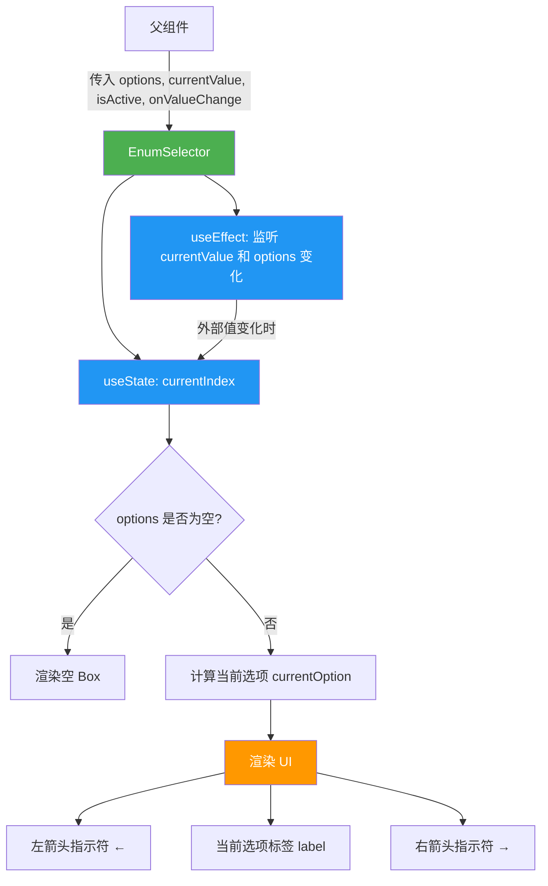

# EnumSelector.tsx

## 概述

`EnumSelector` 是一个基于 Ink 框架的 React 终端 UI 组件，用于在终端界面中提供**左右滚动式的枚举值选择器**。它允许用户在一组预定义的枚举选项中浏览和选择，通过左右箭头指示符展示导航方向。该组件主要用于设置界面中对枚举类型配置项的交互式选择。

组件本身是**纯展示型组件**（display-only），左右导航逻辑由父组件处理，`EnumSelector` 仅负责根据当前状态渲染对应的选项标签和导航箭头。

## 架构图（Mermaid）

## 核心组件

### Props 接口：`EnumSelectorProps`

| 属性 | 类型 | 说明 |
|------|------|------|
| `options` | `readonly SettingEnumOption[]` | 枚举选项数组，每个选项包含 `value` 和 `label` |
| `currentValue` | `string \| number` | 当前选中的值 |
| `isActive` | `boolean` | 组件是否处于激活（聚焦）状态 |
| `onValueChange` | `(value: string \| number) => void` | 值变更回调函数（保留接口兼容性，组件内部未使用） |

### 状态管理

- **`currentIndex`**（`useState`）：当前选中项在 `options` 数组中的索引。初始化时通过 `findIndex` 查找 `currentValue` 对应的索引，找不到则默认为 `0`。
- **`useEffect` 副作用**：监听 `currentValue` 和 `options` 的外部变化，当外部传入的值发生改变时，自动同步更新 `currentIndex`。

### 渲染逻辑

1. **空选项防护**：如果 `options` 为空或 `undefined`，直接返回一个空的 `<Box />`，避免渲染异常。
2. **导航箭头**：
   - 当选项数量大于 1 时，显示左箭头 `←` 和右箭头 `→`。
   - 箭头颜色根据 `isActive` 状态变化：激活时为 `AccentGreen`，未激活时为 `Gray`。
3. **当前选项标签**：
   - 显示 `currentOption.label`。
   - 激活时颜色为 `AccentGreen` 且加粗，未激活时为 `Foreground` 色。

### 导出

- 默认导出 `EnumSelector` 函数组件。
- 类型导出 `EnumSelectorProps` 接口，供外部组件使用。

## 依赖关系

### 内部依赖

| 依赖 | 路径 | 说明 |
|------|------|------|
| `Colors` | `../../colors.js` | 终端 UI 颜色常量对象，提供 `AccentGreen`、`Gray`、`Foreground` 等颜色定义 |
| `SettingEnumOption` | `../../../config/settingsSchema.js` | 枚举选项的类型定义，包含 `value` 和 `label` 属性 |

### 外部依赖

| 依赖 | 版本 | 说明 |
|------|------|------|
| `react` | - | React 核心库，提供 `useState`、`useEffect` 钩子和 `React.JSX.Element` 类型 |
| `ink` | - | 终端 React 渲染框架，提供 `Box` 和 `Text` 组件用于终端 UI 布局和文本渲染 |

## 关键实现细节

1. **纯展示组件设计**：虽然接口中保留了 `onValueChange` 回调，但组件内部并未使用它（参数被重命名为 `_onValueChange`）。所有的导航逻辑（左右切换选项）由父组件负责，`EnumSelector` 仅根据传入的 `currentValue` 做展示。这种设计使得导航逻辑可以集中在父组件中统一处理，降低了组件间的耦合度。

2. **防御性编程**：组件在三个关键位置对空 `options` 数组进行了防护：
   - `useState` 初始化函数中检查 `options` 是否为空。
   - `useEffect` 回调中检查 `options` 是否为空。
   - 渲染逻辑开始前检查 `options` 是否为空，为空则返回空 `<Box />`。

3. **外部值同步**：通过 `useEffect` 监听 `currentValue` 和 `options` 的变化，确保当外部组件（如设置管理器）修改了当前值时，选择器能够正确地更新显示索引。如果传入的 `currentValue` 在 `options` 中找不到对应项，则安全地回退到索引 `0`。

4. **视觉反馈**：
   - 激活状态下箭头和标签使用醒目的绿色（`AccentGreen`），提供清晰的焦点指示。
   - 非激活状态下箭头为灰色（`Gray`），标签为前景色（`Foreground`），视觉上淡化。
   - 标签在激活状态下加粗（`bold={isActive}`），进一步强化焦点感知。

5. **布局结构**：采用 `flexDirection="row"` 的水平布局，元素排列为：`← [空格] 标签文本 [空格] →`，各元素之间通过 `<Text> </Text>` 添加间距。
