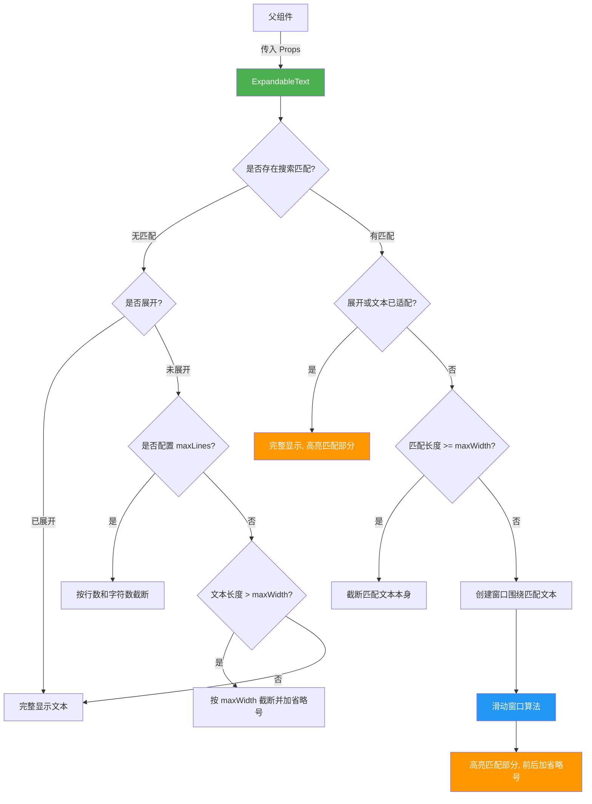

# ExpandableText.tsx

## 概述

`ExpandableText` 是一个基于 Ink 框架的 React 终端 UI 组件，用于在终端中展示**可展开/折叠的文本**，并支持**搜索匹配高亮**功能。组件会根据文本长度和配置的最大宽度/最大行数自动截断文本，在折叠状态下显示截断后的文本并附加省略号 `...`，在展开状态下显示完整内容。

当存在搜索匹配时，组件会智能地围绕匹配位置创建一个"窗口"，确保匹配文本始终可见，并使用反色（`inverse`）高亮显示匹配部分。

组件使用 `React.memo` 进行性能优化，避免不必要的重渲染。

## 架构图（Mermaid）

## 核心组件

### 常量

| 常量 | 值 | 说明 |
|------|-----|------|
| `MAX_WIDTH` | `150` | 默认的最大显示宽度（字符数），作为导出常量供外部使用 |

### Props 接口：`ExpandableTextProps`

| 属性 | 类型 | 默认值 | 说明 |
|------|------|--------|------|
| `label` | `string` | （必填） | 要显示的文本内容 |
| `matchedIndex` | `number \| undefined` | `undefined` | 搜索匹配在文本中的起始索引位置 |
| `userInput` | `string` | `''` | 用户输入的搜索关键词，用于确定匹配的长度 |
| `textColor` | `string` | `theme.text.primary` | 文本颜色 |
| `isExpanded` | `boolean` | `false` | 是否处于展开状态 |
| `maxWidth` | `number` | `MAX_WIDTH (150)` | 折叠状态下的最大显示字符宽度 |
| `maxLines` | `number \| undefined` | `undefined` | 折叠状态下的最大显示行数（可选） |

### 渲染逻辑

#### 无搜索匹配时的截断策略

1. **已展开**：直接显示完整 `label`。
2. **配置了 `maxLines`**：
   - 先按换行符 `\n` 分割文本，取前 `maxLines` 行。
   - 如果截断后的文本总长度超过 `maxWidth`，再按字符截断并加 `...`。
   - 如果未超过 `maxWidth` 但有更多行，在末尾加 `...`。
3. **未配置 `maxLines`**：如果 `label.length > maxWidth`，按字符截断至 `maxWidth` 并加 `...`。

#### 有搜索匹配时的三种情况

1. **Case 1 - 全文显示**：文本已展开或总长度 <= `maxWidth`，直接显示完整文本，高亮匹配部分。
2. **Case 2 - 匹配过长**：匹配文本本身长度 >= `maxWidth`，截断匹配文本并加 `...`。
3. **Case 3 - 滑动窗口**：计算匹配文本周围的上下文空间，创建一个以匹配为中心的可视窗口：
   - 将可用空间均分为匹配前和匹配后的上下文。
   - 如果窗口超出文本边界，自动滑动窗口以充分利用空间。
   - 窗口起始位置 > 0 时，前面加 `...` 前缀。
   - 窗口结束位置 < 文本总长时，后面加 `...` 后缀。

#### 匹配高亮渲染

匹配文本按空白字符分割（`/(\s+)/`），每个片段用 `<Text inverse>` 包裹，实现反色高亮效果。这样处理确保空白字符也能被正确高亮显示。

## 依赖关系

### 内部依赖

| 依赖 | 路径 | 说明 |
|------|------|------|
| `theme` | `../../semantic-colors.js` | 语义化颜色主题对象，提供 `theme.text.primary` 作为默认文本颜色 |

### 外部依赖

| 依赖 | 说明 |
|------|------|
| `react` | React 核心库，提供 `React.FC` 类型、`React.memo` 高阶组件 |
| `ink` | 终端 React 渲染框架，提供 `Text` 组件用于文本渲染（支持 `wrap`、`color`、`inverse`、`bold` 等属性） |

## 关键实现细节

1. **`React.memo` 性能优化**：组件通过 `React.memo` 包裹（`export const ExpandableText = React.memo(_ExpandableText)`），在 Props 未变化时跳过重渲染，这对于可能包含大量文本项的列表场景非常重要。

2. **滑动窗口算法**：当文本需要截断且存在搜索匹配时，组件使用滑动窗口算法来确保匹配文本始终处于可见区域内：
   - 先计算理想的窗口范围：匹配前后各分配 `(maxWidth - matchLength) / 2` 的上下文空间。
   - 如果窗口起始位置 `start < 0`（匹配在文本开头附近），将窗口右移。
   - 如果窗口结束位置 `end > label.length`（匹配在文本末尾附近），将窗口左移。
   - 最终确保 `start >= 0`。

3. **省略号替换策略**：在添加前缀/后缀省略号时，如果 `before`/`after` 文本长度 >= 3，则替换开头/末尾 3 个字符为 `...`，保持总长度不变；否则直接替换为 `...`。

4. **匹配有效性检测**：`hasMatch` 变量综合判断四个条件：`matchedIndex` 不为 `undefined`、`matchedIndex >= 0`、`matchedIndex < label.length`、`userInput.length > 0`，全部满足才视为有效匹配。

5. **双重截断机制**：在配置了 `maxLines` 的场景下，文本先按行数截断，再按字符数截断，防止单行超长文本导致大量换行（文件中注释称之为"visual approximation"以防止大量包裹）。

6. **空白字符分割高亮**：匹配文本通过 `match.split(/(\s+)/)` 分割后逐个片段渲染为 `<Text inverse>`，使用捕获组 `(\s+)` 确保空白字符也被保留在分割结果中并获得高亮效果。
