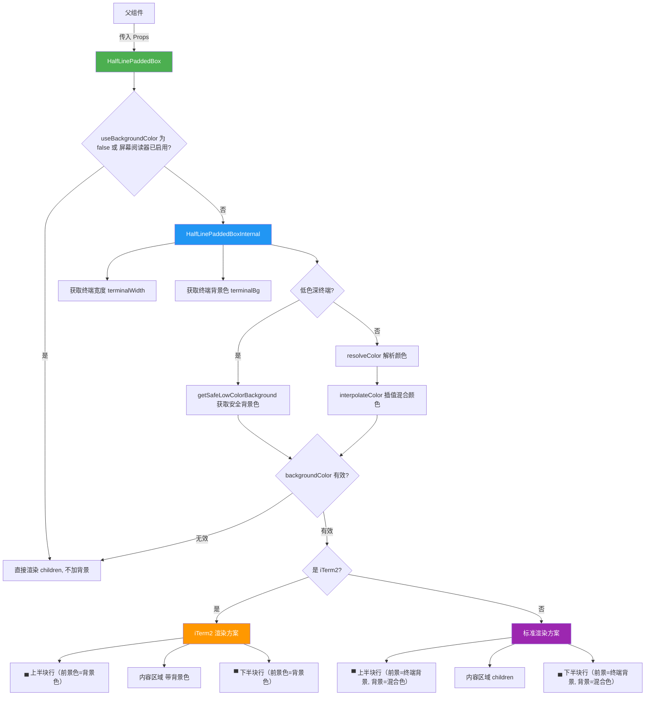

# HalfLinePaddedBox.tsx

## 概述

`HalfLinePaddedBox` 是一个基于 Ink 框架的 React 终端 UI 容器组件，用于在终端中渲染一个**带有半行（half-line）上下内边距的实色背景容器**。它利用 Unicode 方块字符（`▀` 上半块和 `▄` 下半块）来模拟半行高度的视觉边距效果，使内容区域在视觉上更加精致和紧凑。

组件支持背景颜色与终端背景的**插值混合**（interpolation），通过指定基础颜色和不透明度来计算最终的背景色。同时兼容低色深终端（256 色）、iTerm2 终端和屏幕阅读器等不同环境。

## 架构图（Mermaid）



## 核心组件

### Props 接口：`HalfLinePaddedBoxProps`

| 属性 | 类型 | 默认值 | 说明 |
|------|------|--------|------|
| `backgroundBaseColor` | `string` | （必填） | 要与终端背景混合的基础颜色 |
| `backgroundOpacity` | `number` | （必填） | 颜色混合的不透明度，范围 0-1 |
| `useBackgroundColor` | `boolean \| undefined` | `undefined` | 是否启用背景色渲染，`false` 时直接渲染子组件 |
| `children` | `React.ReactNode` | （必填） | 子组件内容 |

### 组件结构

#### `HalfLinePaddedBox`（外层组件）

外层入口组件，负责判断是否需要渲染背景效果：
- 如果 `useBackgroundColor === false`，直接渲染 `children`。
- 如果屏幕阅读器已启用（通过 `useIsScreenReaderEnabled()` 检测），直接渲染 `children`，因为视觉装饰对屏幕阅读器无意义。
- 其他情况交给 `HalfLinePaddedBoxInternal` 处理。

#### `HalfLinePaddedBoxInternal`（内层组件）

核心渲染逻辑组件：

1. **获取终端状态**：通过 `useUIState()` 获取 `terminalWidth`，通过 `theme.background.primary` 获取终端背景色。
2. **计算背景色**：
   - 低色深终端：使用 `getSafeLowColorBackground()` 获取安全的低色深背景色。
   - 正常终端：通过 `resolveColor()` 解析颜色值，再用 `interpolateColor()` 将基础颜色按指定不透明度与终端背景混合。
3. **渲染**：根据终端类型选择不同的渲染策略。

### 两种渲染方案

#### iTerm2 渲染方案

```
┌──────────────────────────────┐
│ ▄▄▄▄▄▄▄  (前景色=背景混合色)    │  ← 半行上边距
│ 内容区域  (backgroundColor)     │  ← 主内容区
│ ▀▀▀▀▀▀▀  (前景色=背景混合色)    │  ← 半行下边距
└──────────────────────────────┘
```

在 iTerm2 中，方块字符仅设置前景色（`color={backgroundColor}`），不设置背景色。内容区域通过 `Box` 的 `backgroundColor` 设置背景。

#### 标准渲染方案

```
┌──────────────────────────────┐
│ ▀▀▀▀▀▀▀  (前景=终端背景, 背景=混合色) │  ← 半行上边距
│ 内容区域                              │  ← 主内容区
│ ▄▄▄▄▄▄▄  (前景=终端背景, 背景=混合色) │  ← 半行下边距
└──────────────────────────────┘
```

在标准终端中，通过组合前景色和背景色来实现半行效果：
- 上半块 `▀`：前景色设为终端背景色，背景色设为混合色，使得字符上半部分显示终端背景色，下半部分显示混合色。
- 下半块 `▄`：前景色设为终端背景色，背景色设为混合色，使得字符上半部分显示混合色，下半部分显示终端背景色。
- 整个外层 `Box` 设置了 `backgroundColor={backgroundColor}`，为内容区域提供背景。

## 依赖关系

### 内部依赖

| 依赖 | 路径 | 说明 |
|------|------|------|
| `useUIState` | `../../contexts/UIStateContext.js` | UI 状态上下文钩子，提供 `terminalWidth` 终端宽度信息 |
| `theme` | `../../semantic-colors.js` | 语义化颜色主题对象，提供 `theme.background.primary` 终端背景色 |
| `interpolateColor` | `../../themes/color-utils.js` | 颜色插值函数，将两个颜色按比例混合 |
| `resolveColor` | `../../themes/color-utils.js` | 颜色解析函数，将颜色标识符解析为实际颜色值 |
| `getSafeLowColorBackground` | `../../themes/color-utils.js` | 为低色深终端获取安全的背景颜色 |
| `isLowColorDepth` | `../../utils/terminalUtils.js` | 检测当前终端是否为低色深（如 256 色） |
| `isITerm2` | `../../utils/terminalUtils.js` | 检测当前终端是否为 iTerm2 |

### 外部依赖

| 依赖 | 说明 |
|------|------|
| `react` | React 核心库，提供 `useMemo` 钩子和类型定义 |
| `ink` | 终端 React 渲染框架，提供 `Box`、`Text` 组件和 `useIsScreenReaderEnabled` 钩子 |

## 关键实现细节

1. **半行效果的 Unicode 技巧**：终端中每个字符占据一整行的高度。通过使用 Unicode 方块字符 `▀`（上半块）和 `▄`（下半块），配合前景色和背景色的组合，可以在一行字符的高度内创建两种不同颜色的视觉区域，从而模拟半行高度的填充效果。

2. **颜色插值混合**：背景色不是直接使用传入的基础颜色，而是将基础颜色按 `backgroundOpacity` 比例与终端背景色进行插值混合。这样产生的颜色与终端背景能更好地融合，视觉上更加自然和谐。通过 `useMemo` 缓存计算结果，避免每次渲染重复计算。

3. **iTerm2 特殊处理**：iTerm2 在渲染 Unicode 方块字符时的行为与标准终端不同，因此组件提供了两套渲染方案。iTerm2 方案中方块字符只使用前景色，而标准方案同时使用前景色和背景色来实现过渡效果。同时注意上下方块字符的选择在两种方案中是相反的（iTerm2 上边用 `▄`，下边用 `▀`；标准方案上边用 `▀`，下边用 `▄`）。

4. **低色深终端兼容**：在 256 色终端中，插值混合出来的颜色可能无法准确显示（注释中提到"often look bad"），因此直接使用 `getSafeLowColorBackground()` 提供一个安全的替代背景色。

5. **无障碍访问支持**：当检测到屏幕阅读器启用时，跳过所有视觉装饰（背景色和半行填充），直接渲染子组件内容。这是因为视觉装饰对使用屏幕阅读器的用户没有意义，反而可能干扰内容阅读。

6. **完整宽度填充**：方块字符通过 `'▀'.repeat(terminalWidth)` 重复铺满整个终端宽度，确保背景色覆盖全行，不留空隙。

7. **防御性降级**：如果 `backgroundColor` 计算结果为空值（falsy），组件会降级为直接渲染 `children`，不添加任何背景装饰。
