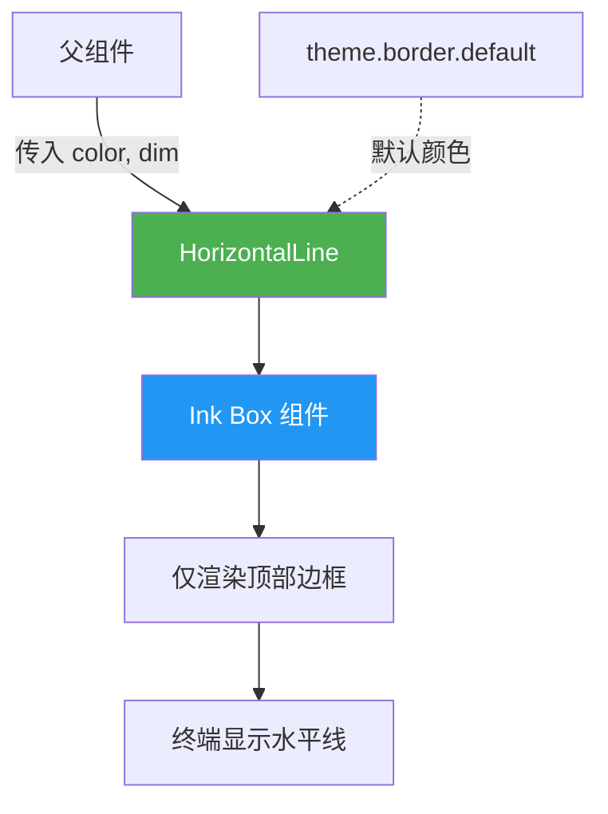

# HorizontalLine.tsx

## 概述

`HorizontalLine` 是一个基于 Ink 框架的 React 终端 UI 组件，用于在终端界面中渲染一条**水平分隔线**。它利用 Ink 的 `Box` 组件的边框功能，仅启用顶部边框来模拟水平线效果，占据容器的 100% 宽度。

该组件简洁轻量，是一个纯展示型的无状态函数式组件，支持自定义颜色和暗化（dim）效果。

## 架构图（Mermaid）

## 核心组件

### Props 接口：`HorizontalLineProps`

| 属性 | 类型 | 默认值 | 说明 |
|------|------|--------|------|
| `color` | `string \| undefined` | `theme.border.default` | 水平线的颜色 |
| `dim` | `boolean \| undefined` | `false` | 是否使用暗化/降低亮度效果 |

### 渲染逻辑

组件渲染一个 `Box`，通过以下 Ink 属性配置实现水平线效果：

| Box 属性 | 值 | 说明 |
|----------|-----|------|
| `width` | `"100%"` | 宽度占满父容器 |
| `borderStyle` | `"single"` | 使用单线边框样式（Unicode 制表符 `─`） |
| `borderTop` | `true` | 启用顶部边框（这条边框就是可见的水平线） |
| `borderBottom` | `false` | 禁用底部边框 |
| `borderLeft` | `false` | 禁用左侧边框 |
| `borderRight` | `false` | 禁用右侧边框 |
| `borderColor` | `color` | 边框颜色，由 Props 传入 |
| `borderDimColor` | `dim` | 是否暗化边框颜色 |

## 依赖关系

### 内部依赖

| 依赖 | 路径 | 说明 |
|------|------|------|
| `theme` | `../../semantic-colors.js` | 语义化颜色主题对象，提供 `theme.border.default` 作为默认边框颜色 |

### 外部依赖

| 依赖 | 说明 |
|------|------|
| `react` | React 核心库，提供 `React.FC` 类型定义 |
| `ink` | 终端 React 渲染框架，提供 `Box` 组件及其边框渲染能力 |

## 关键实现细节

1. **边框模拟水平线**：组件巧妙地利用 Ink 的 `Box` 组件的边框系统来渲染水平线，而不是通过重复打印特殊字符（如 `─`）。通过仅启用 `borderTop` 并禁用其他三边的边框，实现了一条干净的全宽水平线。这种方式的优点是能自动适配父容器宽度（`width="100%"`），无需手动计算终端宽度。

2. **主题化颜色**：默认颜色来自语义化主题 `theme.border.default`，与项目整体的主题系统保持一致。使用者也可以通过 `color` 属性传入自定义颜色来覆盖默认值。

3. **暗化效果**：`borderDimColor` 属性对应终端的 ANSI dim 修饰符，可以降低线条的亮度/对比度。这在需要更微妙的视觉分隔时非常有用，例如在不太重要的区域使用较弱的分隔线。

4. **无状态设计**：组件完全无状态，没有使用任何 Hook，是一个纯函数式组件。所有渲染行为完全由 Props 决定，符合 React 的纯组件理念。

5. **`borderStyle="single"`**：使用 Ink 内置的单线边框样式，渲染的字符通常是 Unicode Box Drawing 字符集中的 `─`（U+2500），在绝大多数现代终端中都能正确显示。
