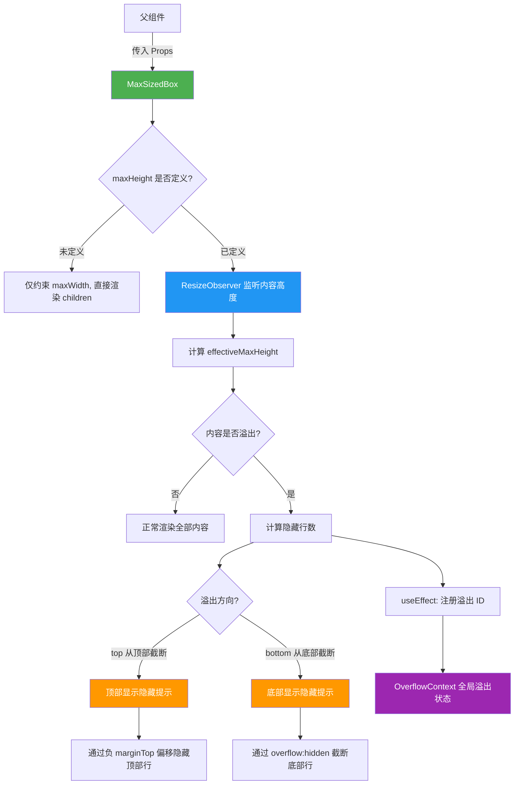

# MaxSizedBox.tsx

## 概述

`MaxSizedBox` 是一个基于 Ink 框架的 React 终端 UI 容器组件，用于**约束子组件的最大尺寸**（宽度和高度），并在内容超出指定的 `maxHeight` 时提供**内容感知的截断（truncation）功能**。

当内容溢出时，组件会自动隐藏超出部分的行，并显示一条提示信息（如 `... first 10 lines hidden (key to show) ...`），告知用户有多少行被隐藏以及如何查看更多内容。溢出方向可配置为从顶部截断（隐藏最早的内容）或从底部截断（隐藏最新的内容）。

组件还与全局的 `OverflowContext` 上下文集成，在发生溢出时向上层通知自身的溢出状态，以便其他组件（如状态栏）能够感知并做出响应。

## 架构图（Mermaid）



## 核心组件

### 常量

| 常量 | 值 | 说明 |
|------|-----|------|
| `MINIMUM_MAX_HEIGHT` | `2` | 最小高度限制，确保至少能显示 1 行内容和 1 行截断提示信息 |

### Props 接口：`MaxSizedBoxProps`

| 属性 | 类型 | 默认值 | 说明 |
|------|------|--------|------|
| `children` | `React.ReactNode` | `undefined` | 子组件内容 |
| `maxWidth` | `number \| undefined` | `undefined` | 最大宽度限制（字符数） |
| `maxHeight` | `number \| undefined` | `undefined` | 最大高度限制（行数），未定义时不限制高度 |
| `overflowDirection` | `'top' \| 'bottom'` | `'top'` | 溢出截断方向：`top` 表示隐藏顶部内容，`bottom` 表示隐藏底部内容 |
| `additionalHiddenLinesCount` | `number` | `0` | 额外的隐藏行数，由外部传入，会累加到总隐藏行数中 |

### 状态与 Hooks

| Hook | 类型 | 说明 |
|------|------|------|
| `useId()` | `string` | 生成组件唯一标识符，用于在 OverflowContext 中注册/注销 |
| `useOverflowActions()` | `{ addOverflowingId, removeOverflowingId }` | 从溢出上下文获取注册/注销溢出状态的方法 |
| `useRef(observerRef)` | `ResizeObserver \| null` | 保存 ResizeObserver 实例的引用 |
| `useState(contentHeight)` | `number` | 追踪内容区域的实际高度 |
| `useCallback(onRefChange)` | 回调函数 | 当内容 DOM 节点挂载/卸载时设置 ResizeObserver |

### 核心计算逻辑

1. **`effectiveMaxHeight`**：取 `Math.max(Math.round(maxHeight), MINIMUM_MAX_HEIGHT)`，确保至少为 2 行。
2. **`isOverflowing`**：当内容高度超过 `effectiveMaxHeight` 或 `additionalHiddenLinesCount > 0` 时为 `true`。
3. **`visibleContentHeight`**：溢出时为 `effectiveMaxHeight - 1`（留出 1 行给截断提示信息），非溢出时等于 `effectiveMaxHeight`。
4. **`hiddenLinesCount`**：`Math.max(0, contentHeight - visibleContentHeight)`，即内容实际高度减去可见高度。
5. **`totalHiddenLines`**：`hiddenLinesCount + additionalHiddenLinesCount`，总隐藏行数。
6. **`offset`**：当从顶部截断时，使用负 `marginTop`（`-hiddenLinesCount`）将内容向上偏移以隐藏顶部行。

### 渲染结构

```
┌─ 外层 Box (maxHeight=effectiveMaxHeight) ──────────────────┐
│                                                              │
│  [条件] 溢出方向为 top 时：截断提示文本                         │
│                                                              │
│  ┌─ 内容裁剪 Box (overflow=hidden, maxHeight=可见高度) ────┐  │
│  │                                                          │  │
│  │  ┌─ 内容 Box (ref=onRefChange, marginTop=offset) ────┐  │  │
│  │  │  children                                           │  │  │
│  │  └────────────────────────────────────────────────────┘  │  │
│  │                                                          │  │
│  └──────────────────────────────────────────────────────────┘  │
│                                                              │
│  [条件] 溢出方向为 bottom 时：截断提示文本                       │
│                                                              │
└──────────────────────────────────────────────────────────────┘
```

### 截断提示信息

根据终端宽度和溢出方向，显示不同格式的提示：

| 条件 | 提示格式 |
|------|----------|
| 窄宽度 + top | `... N hidden (key) ...` |
| 正常宽度 + top | `... first N line(s) hidden (key to show) ...` |
| 窄宽度 + bottom | `... N hidden (key) ...` |
| 正常宽度 + bottom | `... last N line(s) hidden (key to show) ...` |

提示中的 `key` 由 `formatCommand(Command.SHOW_MORE_LINES)` 生成，告知用户可以使用哪个快捷键查看更多行。

## 依赖关系

### 内部依赖

| 依赖 | 路径 | 说明 |
|------|------|------|
| `theme` | `../../semantic-colors.js` | 语义化颜色主题对象，提供 `theme.text.secondary` 用于截断提示文本颜色 |
| `useOverflowActions` | `../../contexts/OverflowContext.js` | 溢出上下文钩子，提供注册/注销溢出状态的方法 |
| `isNarrowWidth` | `../../utils/isNarrowWidth.js` | 判断给定宽度是否为"窄宽度"，影响提示信息的格式 |
| `Command` | `../../key/keyBindings.js` | 键绑定命令枚举，提供 `Command.SHOW_MORE_LINES` 命令标识 |
| `formatCommand` | `../../key/keybindingUtils.js` | 将命令枚举格式化为用户可读的快捷键字符串 |

### 外部依赖

| 依赖 | 说明 |
|------|------|
| `react` | React 核心库，提供 `useCallback`、`useEffect`、`useId`、`useRef`、`useState` 等钩子 |
| `ink` | 终端 React 渲染框架，提供 `Box`、`Text`、`ResizeObserver` 组件和 `DOMElement` 类型 |

## 关键实现细节

1. **ResizeObserver 动态监听**：组件通过 Ink 提供的 `ResizeObserver` API 实时监听内容区域的高度变化。当内容（如流式输出的文本）动态增长时，`contentHeight` 会自动更新，触发重新计算溢出状态。Observer 通过 `ref` 回调模式（`onRefChange`）绑定到内容 Box 上，在节点挂载时创建 Observer，卸载时断开连接。

2. **负 marginTop 实现顶部截断**：当 `overflowDirection` 为 `'top'` 时，组件使用负 `marginTop`（`-hiddenLinesCount`）将内容 Box 向上偏移，配合外层 `overflow: hidden` 的裁剪 Box，实现了"隐藏顶部内容，保留底部最新内容"的效果。这比删除 DOM 节点更高效，且不影响 ResizeObserver 的测量。

3. **OverflowContext 全局通知**：通过两个 `useEffect` 管理溢出状态的生命周期：
   - 第一个 `useEffect`：当 `totalHiddenLines > 0` 时调用 `addOverflowingId(id)` 注册，为 0 时调用 `removeOverflowingId(id)` 注销。
   - 第二个 `useEffect`（清理函数）：组件卸载时自动调用 `removeOverflowingId(id)`，防止内存泄漏和状态残留。

4. **最小高度保证**：`MINIMUM_MAX_HEIGHT = 2` 确保即使 `maxHeight` 被设为很小的值（如 0 或 1），组件至少能显示 1 行内容 + 1 行截断提示。计算 `effectiveMaxHeight` 时使用 `Math.max` 进行下限保护。

5. **溢出时预留提示行**：当检测到溢出时，`visibleContentHeight = effectiveMaxHeight - 1`，即从可见内容区域扣除 1 行用于显示截断提示信息。这确保了提示信息不会导致内容区域额外溢出。

6. **`additionalHiddenLinesCount` 外部累加**：允许父组件传入额外的隐藏行数，这些行数会累加到总隐藏计数中。这对于父组件已经知道有部分内容被其他方式隐藏（例如虚拟滚动）的场景非常有用。

7. **窄宽度自适应提示**：通过 `isNarrowWidth()` 检测终端宽度是否较窄，在窄宽度下使用更紧凑的提示文本格式，避免提示信息本身被换行截断。

8. **无 maxHeight 时的降级行为**：当 `maxHeight` 未定义时，组件不执行任何高度约束或溢出检测，仅作为一个可选 `maxWidth` 约束的简单 `Box` 容器。

9. **`useCallback` 优化 Observer 回调**：`onRefChange` 通过 `useCallback` 记忆化，依赖项仅为 `[maxHeight]`，避免每次渲染都重新创建 Observer。在回调中先断开旧的 Observer（如果存在），再创建新的，确保不会出现多个 Observer 同时观察同一节点。
