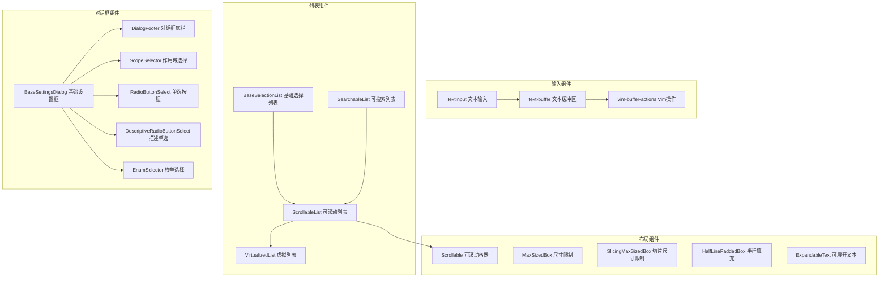

# shared

## 概述

`shared` 目录包含可在整个 UI 中复用的基础组件和底层原语。这些组件提供了列表选择、滚动容器、文本输入、对话框基础、文本缓冲区等核心 UI 能力，是上层业务组件（对话框、消息展示等）的构建基础。

## 目录结构

```
shared/
├── BaseSelectionList.tsx             # 基础选择列表
├── BaseSettingsDialog.tsx            # 基础设置对话框框架
├── DescriptiveRadioButtonSelect.tsx  # 带描述的单选按钮
├── DialogFooter.tsx                  # 对话框底部操作栏
├── EnumSelector.tsx                  # 枚举值选择器
├── ExpandableText.tsx                # 可展开/折叠的文本块
├── HalfLinePaddedBox.tsx             # 半行填充盒子
├── HorizontalLine.tsx               # 水平分隔线
├── MaxSizedBox.tsx                   # 最大尺寸限制容器
├── RadioButtonSelect.tsx             # 单选按钮选择组件
├── ScopeSelector.tsx                 # 设置作用域选择器（User/Workspace）
├── Scrollable.tsx                    # 可滚动容器（支持鼠标滚轮和键盘）
├── ScrollableList.tsx                # 可滚动列表（虚拟化）
├── SearchableList.tsx                # 可搜索列表（集成搜索框）
├── SectionHeader.tsx                 # 区域标题头
├── SlicingMaxSizedBox.tsx            # 切片式最大尺寸容器
├── TabHeader.tsx                     # 标签页头部
├── TextInput.tsx                     # 文本输入组件（支持光标、选中等）
├── VirtualizedList.tsx               # 虚拟化列表（高性能大列表渲染）
├── text-buffer.ts                    # 文本缓冲区（光标、选中、编辑操作）
├── vim-buffer-actions.ts             # Vim 模式缓冲区操作
└── __snapshots__/                    # 测试快照
```

## 架构图



## 核心组件

### 文本输入系统

| 组件/模块 | 职责 |
|-----------|------|
| `TextInput` | 终端文本输入组件，支持光标移动、选中、多行、撤销/重做、粘贴 |
| `text-buffer` | 底层文本缓冲区，实现高性能的文本编辑操作（插入、删除、选中范围等） |
| `vim-buffer-actions` | Vim 模式的文本操作（`w`/`b` 单词跳转、`dd` 删除行、`x` 删除字符等） |

### 列表选择系统

| 组件 | 职责 |
|------|------|
| `BaseSelectionList` | 通用选择列表基类，支持键盘导航、高亮、选中回调 |
| `ScrollableList` | 可滚动列表，基于 VirtualizedList 实现，支持大量数据 |
| `VirtualizedList` | 虚拟化列表，仅渲染可视区域内的行，优化性能 |
| `SearchableList` | 在 ScrollableList 基础上增加搜索过滤能力 |

### 布局容器

| 组件 | 职责 |
|------|------|
| `Scrollable` | 通用可滚动容器，支持鼠标滚轮、键盘翻页、滚动条动画 |
| `MaxSizedBox` | 限制子内容最大高度，超出部分可折叠并显示 "展开" 提示 |
| `SlicingMaxSizedBox` | 切片式高度限制，从底部截取内容 |
| `ExpandableText` | 可展开/折叠的文本块，支持点击展开 |
| `HalfLinePaddedBox` | 半行上下填充的容器，用于视觉间距 |

### 对话框基础

| 组件 | 职责 |
|------|------|
| `BaseSettingsDialog` | 设置对话框的通用框架，提供标签页切换和统一布局 |
| `DialogFooter` | 对话框底部，显示操作提示（如 "Enter 确认, Esc 取消"） |
| `ScopeSelector` | 设置作用域选择（用户级 / 工作区级） |
| `RadioButtonSelect` | 单选按钮组 |
| `DescriptiveRadioButtonSelect` | 带描述文本的单选按钮组 |
| `EnumSelector` | 枚举值下拉选择 |

## 依赖关系

### 内部依赖
- `../../contexts/`: KeypressContext、ScrollProvider、OverflowContext
- `../../hooks/`: useKeypress、useMouse、useBatchedScroll
- `../../key/`: keyMatchers（键盘绑定匹配）
- `../../themes/`: 颜色主题

### 外部依赖
- `ink`: Box、Text 终端渲染原语
- `react`: 组件框架

## 数据流

### 文本输入流程
1. `KeypressContext` 将键盘事件分发给 `TextInput`
2. `TextInput` 根据按键类型（插入字符 / 控制键 / 快捷键）更新 `text-buffer`
3. `text-buffer` 执行具体的文本操作（插入、删除、光标移动等）
4. 如果启用 Vim 模式，`vim-buffer-actions` 拦截并转换 Vim 命令
5. 文本变更通过 `onChange` 回调传递给父组件

### 虚拟化列表渲染流程
1. 父组件传入完整数据列表和行高
2. `VirtualizedList` 计算当前可视窗口范围
3. 仅渲染可视范围内的行，用空白占位上下不可见区域
4. 滚动时重新计算并更新可视窗口
