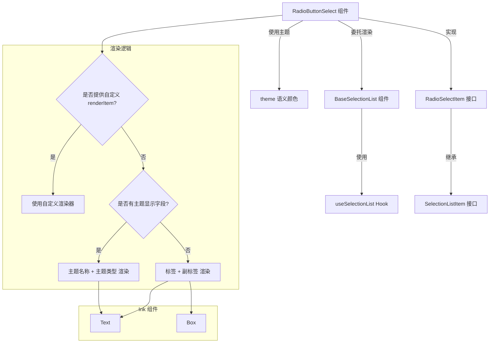

# RadioButtonSelect.tsx

## 概述

`RadioButtonSelect` 是一个泛型 React 组件，用于展示一组带有单选按钮样式的可选项列表。它基于 `BaseSelectionList` 构建，提供键盘导航、滚动支持以及自定义渲染能力。该组件主要用于 CLI 界面中需要用户从多个选项中选择一个的场景，例如主题选择对话框（ThemeDialog）。

组件接收泛型参数 `T`，代表每个选项关联的值的类型，使其在不同数据类型场景下均可复用。

## 架构图（Mermaid）

## 核心组件

### RadioSelectItem<T> 接口

扩展自 `SelectionListItem<T>`，为单选按钮选项定义数据结构：

| 属性 | 类型 | 必填 | 说明 |
|------|------|------|------|
| `label` | `string` | 是 | 选项的显示文本 |
| `sublabel` | `string` | 否 | 选项的附加描述文本，显示在主标签下方 |
| `themeNameDisplay` | `string` | 否 | 主题名称显示文本，用于 ThemeDialog 兼容 |
| `themeTypeDisplay` | `string` | 否 | 主题类型显示文本，用于 ThemeDialog 兼容 |

### RadioButtonSelectProps<T> 接口

组件的 Props 定义：

| 属性 | 类型 | 默认值 | 说明 |
|------|------|--------|------|
| `items` | `Array<RadioSelectItem<T>>` | - | 要显示的单选选项数组 |
| `initialIndex` | `number` | `0` | 初始选中项的索引 |
| `onSelect` | `(value: T) => void` | - | 选中某项时的回调，接收选中项的 `value` |
| `onHighlight` | `(value: T) => void` | - | 高亮某项时的回调，接收高亮项的 `value` |
| `isFocused` | `boolean` | `true` | 组件是否获得焦点并响应键盘输入 |
| `showScrollArrows` | `boolean` | `false` | 是否显示滚动箭头指示 |
| `maxItemsToShow` | `number` | `10` | 一次最多显示的项目数 |
| `showNumbers` | `boolean` | `true` | 是否在选项旁显示编号 |
| `priority` | `boolean` | - | Hook 是否优先于普通订阅者 |
| `renderItem` | `(item, context) => ReactNode` | - | 自定义项目渲染器 |

### RadioButtonSelect<T> 函数组件

核心组件逻辑。它将所有 props 转发给 `BaseSelectionList`，并提供默认的 `renderItem` 实现：

1. **主题显示模式**：当 `item.themeNameDisplay` 和 `item.themeTypeDisplay` 同时存在时，渲染主题名称（主色）加主题类型（次要色）的组合显示。
2. **常规显示模式**：渲染 `label` 作为主文本，若存在 `sublabel` 则以次要颜色显示在下方。

## 依赖关系

### 内部依赖

| 模块 | 导入内容 | 用途 |
|------|----------|------|
| `../../semantic-colors.js` | `theme` | 获取语义化颜色主题（如 `theme.text.secondary`） |
| `./BaseSelectionList.js` | `BaseSelectionList`, `RenderItemContext` | 基础选择列表组件，RadioButtonSelect 的渲染核心 |
| `../../hooks/useSelectionList.js` | `SelectionListItem` (类型) | 选项数据的基础接口类型 |

### 外部依赖

| 包名 | 导入内容 | 用途 |
|------|----------|------|
| `react` | `React` (类型) | React 类型定义，用于 JSX 和类型注解 |
| `ink` | `Text`, `Box` | 终端 UI 渲染组件，用于文本显示和布局 |

## 关键实现细节

1. **泛型委托模式**：`RadioButtonSelect<T>` 将泛型参数 `T` 透传给 `BaseSelectionList<T, RadioSelectItem<T>>`，确保类型安全在整个组件链中保持一致。

2. **默认渲染器的双分支逻辑**：
   - 当没有提供自定义 `renderItem` 时，组件内置了两种渲染策略。
   - 通过检查 `themeNameDisplay` 和 `themeTypeDisplay` 是否同时存在来决定使用哪种渲染分支。
   - 主题渲染分支使用 `item.key` 作为 React key，而常规分支依赖 Box 容器的 key 管理。

3. **文本截断处理**：所有 `Text` 组件都设置了 `wrap="truncate"`，确保在终端宽度不够时文本会被截断而非换行，避免布局混乱。

4. **颜色主题应用**：
   - 主文本颜色通过 `RenderItemContext` 中的 `titleColor` 控制（由 `BaseSelectionList` 根据选中/高亮状态计算）。
   - 次要文本（sublabel、themeTypeDisplay）统一使用 `theme.text.secondary` 颜色。

5. **组件职责分离**：`RadioButtonSelect` 本身不处理键盘事件、滚动逻辑或选中状态管理，这些全部委托给 `BaseSelectionList`。它只负责定义数据结构和渲染逻辑。

6. **ThemeDialog 兼容性**：`themeNameDisplay` 和 `themeTypeDisplay` 字段是专门为 ThemeDialog 组件设计的，允许在同一行内显示主题名称和类型信息，且使用不同颜色区分。
