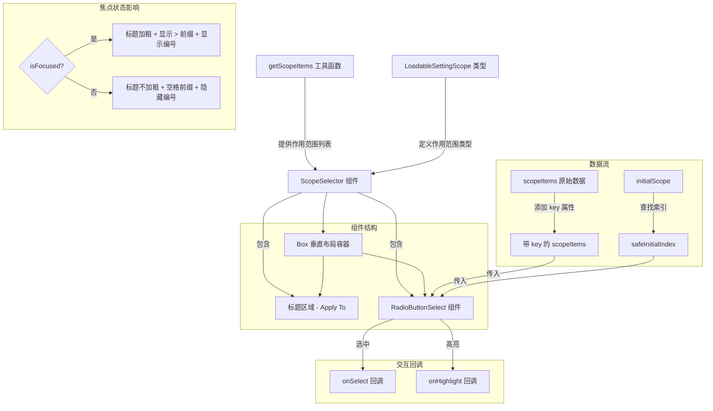

# ScopeSelector.tsx

## 概述

`ScopeSelector` 是一个 React 组件，用于让用户选择配置的作用范围（Scope）。它封装了 `RadioButtonSelect` 组件，提供了一个带有 "Apply To" 标题的作用范围选择器。该组件用于设置对话框中，允许用户指定某项配置应用于哪个层级（如全局、项目等）。

组件通过 `getScopeItems()` 工具函数动态获取可用的作用范围列表，并将其转化为 `RadioButtonSelect` 所需的数据格式。

## 架构图（Mermaid）

## 核心组件

### ScopeSelectorProps 接口

| 属性 | 类型 | 必填 | 说明 |
|------|------|------|------|
| `onSelect` | `(scope: LoadableSettingScope) => void` | 是 | 用户选中某个作用范围时的回调函数 |
| `onHighlight` | `(scope: LoadableSettingScope) => void` | 是 | 用户高亮（光标移动到）某个作用范围时的回调函数 |
| `isFocused` | `boolean` | 是 | 组件是否当前获得焦点 |
| `initialScope` | `LoadableSettingScope` | 是 | 初始选中的作用范围值 |

### ScopeSelector 函数组件

组件的主要逻辑包括：

1. **数据准备**：调用 `getScopeItems()` 获取可用作用范围列表，并为每个项目添加 `key` 属性（使用 `item.value` 作为 key）。
2. **初始索引计算**：通过 `findIndex` 在列表中查找 `initialScope` 对应的索引，如果找不到则安全回退到索引 `0`。
3. **UI 渲染**：垂直布局容器内包含标题文本和 `RadioButtonSelect` 列表。

## 依赖关系

### 内部依赖

| 模块 | 导入内容 | 用途 |
|------|----------|------|
| `../../../config/settings.js` | `LoadableSettingScope` (类型) | 可加载配置作用范围的类型定义 |
| `../../../utils/dialogScopeUtils.js` | `getScopeItems` | 获取可用作用范围项目列表的工具函数 |
| `./RadioButtonSelect.js` | `RadioButtonSelect` | 单选按钮选择列表组件 |

### 外部依赖

| 包名 | 导入内容 | 用途 |
|------|----------|------|
| `react` | `React` (类型) | React 类型定义 |
| `ink` | `Box`, `Text` | 终端 UI 布局和文本渲染组件 |

## 关键实现细节

1. **焦点状态的视觉反馈**：
   - 标题文本的粗体状态由 `isFocused` 控制：聚焦时加粗（`bold={isFocused}`）。
   - 标题前缀在聚焦时显示 `> ` 指示符，非聚焦时显示等宽空格 `  ` 以保持对齐。
   - 编号的显示也受焦点控制：`showNumbers={isFocused}`，仅在聚焦状态下显示数字快捷键。

2. **安全的初始索引处理**：使用 `findIndex` 查找 `initialScope` 后，通过 `initialIndex >= 0 ? initialIndex : 0` 进行安全处理，防止 `findIndex` 返回 `-1` 导致组件异常。

3. **数据映射**：`getScopeItems()` 返回的数据不包含 `key` 字段，组件通过 `.map()` 将 `item.value` 映射为 `key`，满足 `SelectionListItem` 接口的要求。

4. **职责单一**：`ScopeSelector` 是一个高层封装组件，它不处理任何键盘事件或选中状态逻辑，完全委托给内部的 `RadioButtonSelect` 及其底层的 `BaseSelectionList`。

5. **类型安全**：组件将 `LoadableSettingScope` 作为 `RadioButtonSelect` 的泛型参数 `T`，确保 `onSelect` 和 `onHighlight` 回调接收到的值类型正确。
