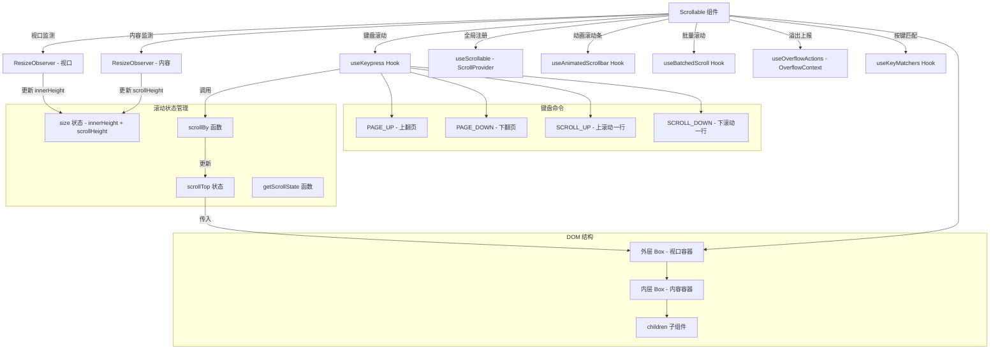

# Scrollable.tsx

## 概述

`Scrollable` 是一个通用的可滚动容器组件，为终端 UI 中的内容提供垂直滚动能力。它是整个 CLI 应用中滚动基础设施的核心组件之一，支持键盘驱动滚动（上下箭头、翻页）、动画滚动条、自动跟随底部（auto-scroll-to-bottom）、视口和内容尺寸的动态检测，以及溢出状态上报。

该组件使用了 Ink 框架的 `ResizeObserver` 来监测视口和内容区域的大小变化，通过 `useKeypress` 监听键盘事件实现滚动交互，并与全局滚动管理系统（`ScrollProvider`）集成。

## 架构图（Mermaid）

## 核心组件

### ScrollableProps 接口

| 属性 | 类型 | 默认值 | 说明 |
|------|------|--------|------|
| `children` | `React.ReactNode` | - | 可滚动区域内的子组件内容 |
| `width` | `number` | - | 容器宽度 |
| `height` | `number \| string` | - | 容器高度 |
| `maxWidth` | `number` | - | 容器最大宽度（当 `width` 未设置时使用） |
| `maxHeight` | `number` | - | 容器最大高度 |
| `hasFocus` | `boolean` | - | 组件是否当前获得焦点（控制键盘响应） |
| `scrollToBottom` | `boolean` | - | 当内容增长时是否自动滚动到底部 |
| `flexGrow` | `number` | - | flex 布局的 grow 值 |
| `reportOverflow` | `boolean` | `false` | 是否向 OverflowContext 上报内容溢出状态 |

### 关键状态与引用

| 名称 | 类型 | 说明 |
|------|------|------|
| `scrollTop` | `useState<number>` | 当前滚动偏移量 |
| `size` | `useState<{innerHeight, scrollHeight}>` | 视口高度和内容总高度 |
| `viewportRef` | `useRef<DOMElement>` | 外层视口 DOM 元素引用 |
| `contentRef` | `useRef<DOMElement>` | 内层内容 DOM 元素引用 |
| `sizeRef` | `useRef` | size 状态的同步引用（避免闭包陈旧值） |
| `scrollTopRef` | `useRef` | scrollTop 状态的同步引用 |

### 核心函数

- **`viewportRefCallback`**：视口元素的 ref 回调，创建 `ResizeObserver` 监听视口尺寸变化。当视口大小改变且当前滚动位置在底部时，自动保持底部位置。
- **`contentRefCallback`**：内容元素的 ref 回调，创建 `ResizeObserver` 监听内容尺寸变化。当内容增长且 `scrollToBottom` 为 `true`，或已在底部时，自动滚动到底部。
- **`scrollBy`**：按指定增量滚动，自动钳制在有效范围 `[0, maxScroll]` 内。当滚动到底部时使用 `Number.MAX_SAFE_INTEGER` 表示"锁定底部"。
- **`getScrollState`**：返回当前滚动状态的快照，包含 `scrollTop`、`scrollHeight`、`innerHeight`。

## 依赖关系

### 内部依赖

| 模块 | 导入内容 | 用途 |
|------|----------|------|
| `../../hooks/useKeypress.js` | `useKeypress`, `Key` | 键盘事件监听 Hook |
| `../../contexts/ScrollProvider.js` | `useScrollable` | 向全局滚动管理系统注册当前可滚动实例 |
| `../../hooks/useAnimatedScrollbar.js` | `useAnimatedScrollbar` | 动画滚动条颜色和闪烁效果 |
| `../../hooks/useBatchedScroll.js` | `useBatchedScroll` | 批量处理滚动更新以提升性能 |
| `../../key/keyMatchers.js` | `Command` | 键盘命令枚举（PAGE_UP、PAGE_DOWN 等） |
| `../../contexts/OverflowContext.js` | `useOverflowActions` | 溢出状态管理上下文 |
| `../../hooks/useKeyMatchers.js` | `useKeyMatchers` | 获取按键匹配器 |

### 外部依赖

| 包名 | 导入内容 | 用途 |
|------|----------|------|
| `react` | `useState`, `useRef`, `useCallback`, `useMemo`, `useLayoutEffect`, `useEffect`, `useId` | React 核心 Hooks |
| `ink` | `Box`, `ResizeObserver`, `DOMElement` | 终端 UI 组件和 DOM 类型 |

## 关键实现细节

1. **双层 Box 架构**：
   - 外层 Box 作为视口（viewport），设置 `overflowY="scroll"` 和 `overflowX="hidden"`，控制可见区域大小和滚动位置。
   - 内层 Box 作为内容容器，设置 `flexShrink={0}` 防止内容被压缩，`paddingRight={1}` 为滚动条预留空间。
   - 这种分离设计确保了内容高度不受视口约束，同时滚动条不会覆盖内容。

2. **ResizeObserver 双监听**：
   - 分别对视口和内容区域创建独立的 `ResizeObserver` 实例。
   - 视口大小变化时更新 `innerHeight`；内容大小变化时更新 `scrollHeight`。
   - 两者都使用 ref callback 模式（而非 `useEffect`），确保 DOM 元素变化时正确清理旧的 observer。

3. **底部锁定机制**：
   - 使用 `Number.MAX_SAFE_INTEGER` 作为特殊的 `scrollTop` 值，表示"始终锁定在底部"。
   - 当检测到用户已在底部（`scrollTop >= scrollHeight - innerHeight - 1`）且视口或内容大小变化时，自动保持底部位置。
   - `-1` 的容差处理了浮点精度和取整问题。

4. **键盘滚动的条件捕获**：
   - 向上滚动事件仅在 `actualScrollTop > 0`（不在顶部）时被捕获处理。
   - 向下滚动事件仅在 `actualScrollTop < maxScroll`（不在底部）时被捕获处理。
   - 不需要处理的按键返回 `false`，允许事件冒泡到父组件，实现了精确的事件分发。

5. **批量滚动优化**：
   - 通过 `useBatchedScroll` Hook 将频繁的滚动更新合并处理，避免过多的重渲染。
   - `getScrollTop()` 获取的是最新的待处理滚动位置，而非 React 状态中的值，确保快速连续滚动时计算正确。

6. **全局滚动系统集成**：
   - 通过 `useScrollable` 将当前组件注册到全局 `ScrollProvider`，暴露 `getScrollState`、`scrollBy`、`hasFocus` 和 `flashScrollbar` 方法。
   - 这允许外部代码（如 Find 功能）程序化控制滚动位置。

7. **溢出上报机制**：
   - 当 `reportOverflow` 为 `true` 且内容超出视口时，通过 `OverflowContext` 注册溢出 ID。
   - 组件卸载时自动清理溢出 ID，防止内存泄漏。

8. **Ref 同步模式**：
   - 使用 `useLayoutEffect` 将 `size` 和 `scrollTop` 的 React 状态同步到 ref，解决闭包中引用陈旧状态值的问题。
   - 这在 `ResizeObserver` 回调和 `scrollBy` 函数中尤为重要，因为它们可能在 React 渲染周期之外被调用。

9. **动画滚动条**：
   - `useAnimatedScrollbar` 提供滚动条颜色 (`scrollbarColor`) 和动画控制。
   - 滚动条颜色通过 `scrollbarThumbColor` 属性传给外层 Box，由 Ink 框架渲染。
   - `flashScrollbar` 方法允许外部触发滚动条闪烁效果以吸引注意力。
