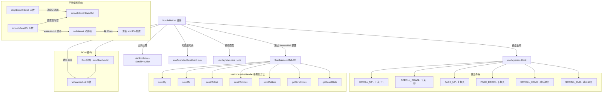

# ScrollableList.tsx

## 概述

`ScrollableList` 是一个基于虚拟化列表（`VirtualizedList`）构建的可滚动列表组件，专为处理大量数据项的高性能滚动场景设计。与 `Scrollable` 组件（针对自由内容的滚动容器）不同，`ScrollableList` 专门用于结构化的列表数据，支持虚拟化渲染（只渲染可见区域的项目）以优化性能。

该组件提供了平滑滚动动画（ease-in-out 缓动）、键盘导航（单行滚动、翻页、Home/End 跳转）、动画滚动条、全局滚动系统集成，以及通过 `forwardRef` 暴露的完整滚动控制 API。

## 架构图（Mermaid）

## 核心组件

### VirtualizedListProps<T> 类型

虚拟化列表的基础属性定义：

| 属性 | 类型 | 必填 | 说明 |
|------|------|------|------|
| `data` | `T[]` | 是 | 列表数据数组 |
| `renderItem` | `(info: {item: T, index: number}) => ReactElement` | 是 | 列表项渲染函数 |
| `estimatedItemHeight` | `(index: number) => number` | 是 | 预估每项高度的函数，用于虚拟化计算 |
| `keyExtractor` | `(item: T, index: number) => string` | 是 | 唯一标识符提取函数 |
| `initialScrollIndex` | `number` | 否 | 初始滚动到的项目索引 |
| `initialScrollOffsetInIndex` | `number` | 否 | 初始滚动索引内的偏移量 |

### ScrollableListProps<T> 接口

扩展 `VirtualizedListProps<T>`，增加滚动容器相关属性：

| 属性 | 类型 | 必填 | 说明 |
|------|------|------|------|
| `hasFocus` | `boolean` | 是 | 组件是否获得焦点（控制键盘响应） |
| `width` | `string \| number` | 否 | 容器宽度 |

### ScrollableListRef<T> 类型

等同于 `VirtualizedListRef<T>`，通过 `useImperativeHandle` 暴露以下方法：

| 方法 | 签名 | 说明 |
|------|------|------|
| `scrollBy` | `(delta: number) => void` | 按增量滚动 |
| `scrollTo` | `(offset: number) => void` | 滚动到指定偏移量 |
| `scrollToEnd` | `() => void` | 滚动到列表末尾 |
| `scrollToIndex` | `(params) => void` | 滚动到指定索引 |
| `scrollToItem` | `(params) => void` | 滚动到指定项目 |
| `getScrollIndex` | `() => number` | 获取当前滚动索引 |
| `getScrollState` | `() => {scrollTop, scrollHeight, innerHeight}` | 获取当前滚动状态 |

### 常量

| 名称 | 值 | 说明 |
|------|------|------|
| `ANIMATION_FRAME_DURATION_MS` | `33` | 平滑滚动动画帧间隔（约 30fps） |

## 依赖关系

### 内部依赖

| 模块 | 导入内容 | 用途 |
|------|----------|------|
| `./VirtualizedList.js` | `VirtualizedList`, `VirtualizedListRef`, `SCROLL_TO_ITEM_END` | 虚拟化列表核心组件和类型 |
| `../../contexts/ScrollProvider.js` | `useScrollable` | 向全局滚动管理系统注册 |
| `../../hooks/useAnimatedScrollbar.js` | `useAnimatedScrollbar` | 动画滚动条 Hook |
| `../../hooks/useKeypress.js` | `useKeypress`, `Key` | 键盘事件监听 |
| `../../key/keyMatchers.js` | `Command` | 键盘命令枚举 |
| `../../hooks/useKeyMatchers.js` | `useKeyMatchers` | 按键匹配器 |

### 外部依赖

| 包名 | 导入内容 | 用途 |
|------|----------|------|
| `react` | `useRef`, `forwardRef`, `useImperativeHandle`, `useCallback`, `useMemo`, `useLayoutEffect` | React 核心 Hooks 和 forwardRef |
| `ink` | `Box`, `DOMElement` | 终端 UI 容器组件和 DOM 类型 |

## 关键实现细节

1. **平滑滚动动画引擎**：
   - `smoothScrollTo` 函数实现了一个基于 `setInterval` 的自定义动画系统。
   - 使用 ease-in-out 缓动函数：`t < 0.5 ? 2*t*t : -1 + (4-2*t)*t`，提供平滑的加速和减速效果。
   - 动画帧间隔为 33ms（约 30fps），在终端环境中提供良好的视觉体验。
   - 动画完成后调用 `flashScrollbar()` 闪烁滚动条以提供视觉反馈。
   - 在测试环境（`NODE_ENV === 'test'`）中，默认动画时长为 0，避免测试中的异步等待。

2. **翻页滚动的连续性**：
   - 当用户连续按下 PAGE_UP/PAGE_DOWN 时，如果当前有正在进行的平滑滚动动画（`smoothScrollState.current.active`），新的滚动目标基于当前动画的目标位置（`.to`）而非实际位置计算。
   - 这确保了快速连续翻页时滚动量的准确累加，不会因为动画延迟导致滚动距离不足。

3. **forwardRef 泛型类型断言**：
   - 由于 React 的 `forwardRef` 对泛型组件的类型推断有限制，组件使用了类型断言 (`as`) 来保持泛型参数 `T` 的传递。
   - 最终导出的 `ScrollableListWithForwardRef` 维持了完整的泛型签名。

4. **useImperativeHandle 代理模式**：
   - 所有通过 ref 暴露的方法都直接代理到内部的 `VirtualizedListRef`，使用可选链 (`?.`) 安全调用。
   - `getScrollState` 和 `getScrollIndex` 在 ref 不可用时提供合理的默认值。

5. **键盘滚动层次化**：
   - 单行滚动（SCROLL_UP/SCROLL_DOWN）：直接停止平滑动画并调用 `scrollByWithAnimation` 进行即时滚动。
   - 翻页滚动（PAGE_UP/PAGE_DOWN）：使用 `smoothScrollTo` 进行平滑动画滚动。
   - 首尾跳转（SCROLL_HOME/SCROLL_END）：使用 `smoothScrollTo` 滚动到 0 或 `SCROLL_TO_ITEM_END`。
   - 所有键盘事件在 `hasFocus` 为 `false` 时不响应。

6. **滚动状态管理的分层**：
   - `smoothScrollState` 通过 `useRef` 管理，因为它是动画状态，不需要触发重渲染。
   - `useLayoutEffect` 中注册清理函数 `stopSmoothScroll`，确保组件卸载时清除定时器，防止内存泄漏。

7. **全局滚动系统集成**：
   - `scrollableEntry` 对象暴露给 `ScrollProvider` 时，额外提供了 `scrollTo: smoothScrollTo`，使外部代码也能使用平滑滚动。
   - 这比 `Scrollable` 组件提供了更丰富的滚动控制能力。

8. **SCROLL_TO_ITEM_END 特殊值处理**：
   - `smoothScrollTo` 对 `SCROLL_TO_ITEM_END` 进行了特殊处理，将其映射到 `maxScrollTop`。
   - 当动画完成或 duration 为 0 时，如果目标是末尾，使用 `Number.MAX_SAFE_INTEGER` 确保锁定到底部。
