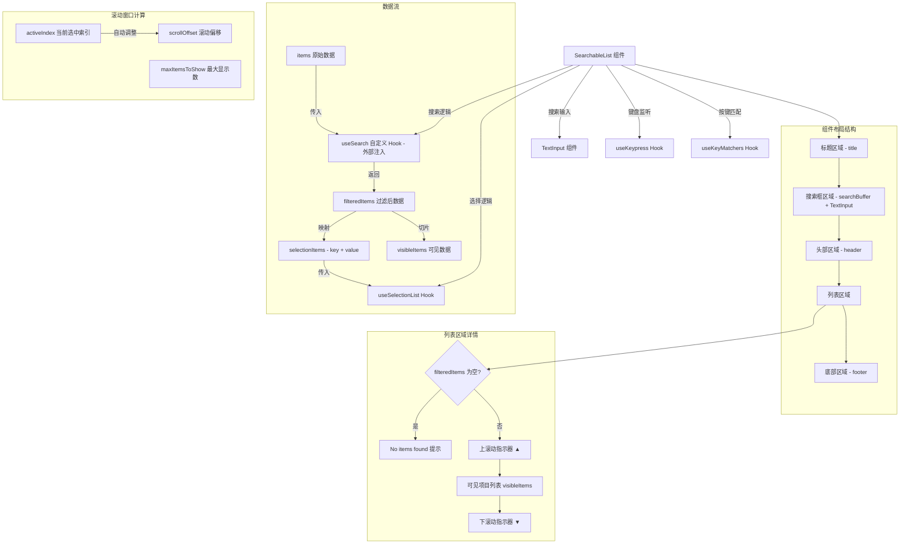

# SearchableList.tsx

## 概述

`SearchableList` 是一个泛型可搜索列表组件，结合了文本搜索输入框、键盘导航和可自定义渲染的列表展示。它是一个高层组合组件，将搜索功能、选择逻辑和列表渲染整合在一起，适用于需要用户在大量选项中通过搜索快速过滤并选择某一项的场景。

该组件采用了"搜索逻辑外部注入"的设计模式——通过 `useSearch` 自定义 Hook 属性，允许调用者完全控制搜索过滤逻辑，使组件在不同搜索策略（模糊匹配、前缀匹配、正则匹配等）下均可复用。

## 架构图（Mermaid）

## 核心组件

### GenericListItem 接口

列表项目的通用接口定义：

| 属性 | 类型 | 必填 | 说明 |
|------|------|------|------|
| `key` | `string` | 是 | 唯一标识符 |
| `label` | `string` | 是 | 显示文本 |
| `description` | `string` | 否 | 描述文本 |
| `[key: string]` | `unknown` | 否 | 允许额外的自定义属性（索引签名） |

### SearchListState<T> 接口

搜索 Hook 返回的状态结构：

| 属性 | 类型 | 说明 |
|------|------|------|
| `filteredItems` | `T[]` | 经过搜索过滤后的项目列表 |
| `searchBuffer` | `TextBuffer \| undefined` | 搜索输入框的文本缓冲区（undefined 时不显示搜索框） |
| `searchQuery` | `string` | 当前搜索查询字符串 |
| `setSearchQuery` | `(query: string) => void` | 设置搜索查询的函数 |
| `maxLabelWidth` | `number` | 所有标签的最大宽度，用于对齐 |

### SearchableListProps<T> 接口

| 属性 | 类型 | 默认值 | 说明 |
|------|------|--------|------|
| `title` | `string` | - | 列表标题（可选） |
| `items` | `T[]` | - | 原始数据列表 |
| `onSelect` | `(item: T) => void` | - | 选中某项时的回调 |
| `onClose` | `() => void` | - | 关闭列表的回调（Escape 键触发） |
| `searchPlaceholder` | `string` | `'Search...'` | 搜索框占位符文本 |
| `renderItem` | `(item, isActive, labelWidth) => ReactNode` | - | 自定义项目渲染器 |
| `header` | `React.ReactNode` | - | 搜索框下方、列表上方的头部内容 |
| `footer` | `(info) => React.ReactNode` | - | 列表下方的底部内容渲染函数 |
| `maxItemsToShow` | `number` | `10` | 一次最多显示的项目数 |
| `useSearch` | `(props) => SearchListState<T>` | - | 搜索逻辑 Hook（外部注入） |
| `onSearch` | `(query: string) => void` | - | 搜索回调，传入 useSearch |
| `resetSelectionOnItemsChange` | `boolean` | `false` | 列表项变化时是否重置选中到第一项 |
| `isFocused` | `boolean` | `true` | 组件是否获得焦点 |

### 默认项目渲染器 defaultRenderItem

内置的默认渲染逻辑：

- 左侧显示选中指示器：选中时为绿色实心圆 `●`，未选中时为空白。
- 右侧垂直排列：`label`（标签文本，使用 `padEnd` 对齐到最大宽度）和可选的 `description`（次要色、截断显示）。
- 选中项的标签和指示器使用 `theme.status.success` 颜色，未选中使用 `theme.text.primary` / `theme.text.secondary`。

## 依赖关系

### 内部依赖

| 模块 | 导入内容 | 用途 |
|------|----------|------|
| `../../semantic-colors.js` | `theme` | 语义化颜色主题 |
| `../../hooks/useSelectionList.js` | `useSelectionList` | 列表选择逻辑 Hook（键盘上下导航、回车选中） |
| `./TextInput.js` | `TextInput` | 文本输入组件，用于搜索框 |
| `./text-buffer.js` | `TextBuffer` (类型) | 文本缓冲区类型 |
| `../../hooks/useKeypress.js` | `useKeypress` | 键盘事件监听（Escape 键） |
| `../../key/keyMatchers.js` | `Command` | 键盘命令枚举 |
| `../../hooks/useKeyMatchers.js` | `useKeyMatchers` | 按键匹配器 |

### 外部依赖

| 包名 | 导入内容 | 用途 |
|------|----------|------|
| `react` | `React`, `useMemo`, `useCallback`, `useState`, `useRef`, `useLayoutEffect` | React 核心功能 |
| `ink` | `Box`, `Text` | 终端 UI 布局和文本组件 |

## 关键实现细节

1. **搜索逻辑外部注入模式（策略模式）**：
   - `useSearch` 是一个通过 props 注入的自定义 Hook，这是一种非常灵活的设计模式。
   - 组件本身不关心搜索如何实现（模糊搜索、精确匹配、异步搜索等），只消费搜索 Hook 返回的 `SearchListState`。
   - `useSearch` 返回的 `searchBuffer` 如果为 `undefined`，则搜索框不会渲染，实现了可选搜索功能。

2. **渲染时滚动偏移计算（无闪烁）**：
   - `scrollOffset` 的计算在渲染过程中同步完成（不在 `useEffect` 中），避免了先渲染旧位置再更新到新位置导致的视觉闪烁。
   - 计算逻辑确保 `activeIndex` 始终在可见窗口 `[scrollOffset, scrollOffset + maxItemsToShow)` 内：
     - 如果 `activeIndex < scrollOffset`，窗口上移到 `activeIndex`。
     - 如果 `activeIndex >= scrollOffset + maxItemsToShow`，窗口下移使 `activeIndex` 位于窗口底部。
   - 同时确保 `scrollOffset` 不超过 `maxScroll`（`filteredItems.length - maxItemsToShow`）。
   - 如果计算出的 `scrollOffset` 与状态中的不一致，在渲染期间调用 `setScrollOffsetState` 进行同步。

3. **搜索后选中重置**：
   - 当 `resetSelectionOnItemsChange` 为 `true` 时，通过 `useLayoutEffect` 监测 `filteredItems` 引用变化。
   - 使用 `prevItemsRef` 保存上一次的 `filteredItems` 引用进行比较（引用相等性检查，非深比较）。
   - 变化时重置 `activeIndex` 为 0 并重置 `scrollOffsetState` 为 0。

4. **useSelectionList 的配置**：
   - `wrapAround: true`：列表导航到末尾时自动回绕到开头。
   - `priority: true`：键盘事件处理优先级高于其他订阅者。
   - `showNumbers: false`：不显示数字快捷键（因为有搜索功能，数字键可能用于输入）。

5. **滚动指示器**：
   - 当 `filteredItems.length > maxItemsToShow` 时，在列表顶部显示 `▲`、底部显示 `▼` 箭头。
   - 箭头始终以次要颜色显示，目前没有根据滚动位置动态隐藏的逻辑（即使已滚动到顶部或底部仍然显示）。

6. **footer 渲染函数参数**：
   - `footer` 接收一个包含 `startIndex`、`endIndex`、`totalVisible` 的对象，允许底部区域显示当前可见范围和总数等信息（如 "显示 1-10 / 共 50 项"）。

7. **标签宽度对齐**：
   - `maxLabelWidth` 由 `useSearch` Hook 计算并返回，用于 `padEnd` 对标签进行右填充。
   - 这确保了所有列表项的标签区域宽度一致，描述文本能够对齐显示。

8. **Escape 键关闭**：
   - 通过独立的 `useKeypress` 监听 Escape 键，调用 `onClose` 回调。
   - 事件返回 `true` 阻止进一步冒泡，确保 Escape 键只触发列表关闭而非其他行为。

9. **组件布局结构**：
   - 整体为垂直布局（`flexDirection="column"`），宽高均为 `100%`，水平内边距为 1。
   - 各区域通过 `marginBottom={1}` 保持间距。
   - 搜索框使用圆角边框（`borderStyle="round"`）包裹 `TextInput`。
