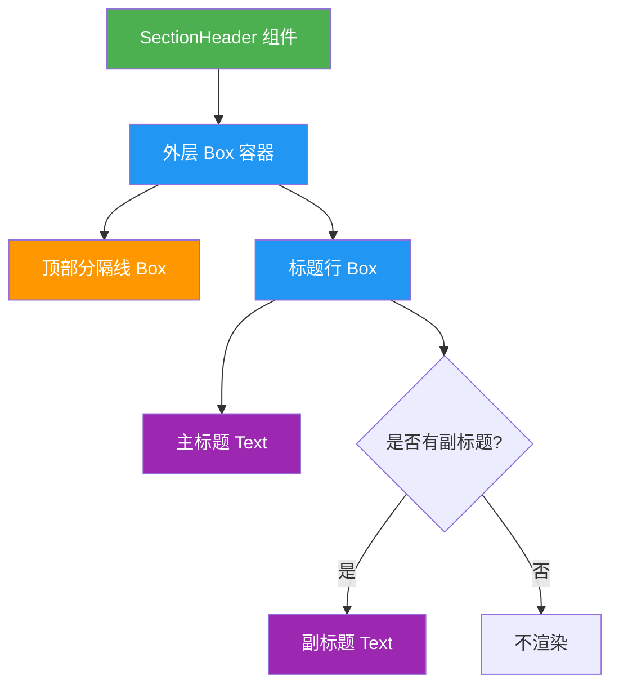
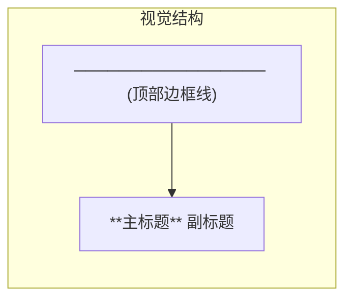

# SectionHeader.tsx

## 概述

`SectionHeader` 是一个 React 函数组件，用于在 CLI 终端界面中渲染一个带有顶部分隔线的段落标题区域。它基于 `ink` 库构建，专为终端 UI 设计。该组件支持主标题和可选的副标题显示，通过语义化的主题色彩系统来区分主次信息层级。

## 架构图（Mermaid）





## 核心组件

### SectionHeader

| 属性 | 类型 | 必填 | 说明 |
|------|------|------|------|
| `title` | `string` | 是 | 主标题文本，以粗体和主色渲染 |
| `subtitle` | `string` | 否 | 副标题文本，以次要颜色渲染 |

**组件签名：**

```tsx
export const SectionHeader: React.FC<{ title: string; subtitle?: string }>
```

**渲染结构：**

1. **外层容器 (`Box`)**：宽度占满 100%，纵向排列（`flexDirection="column"`），溢出隐藏（`overflow="hidden"`）。
2. **顶部分隔线 (`Box`)**：仅渲染顶部边框（`borderTop`），其余三边关闭。边框样式为 `single`（单线），颜色使用主题的次要文本色（`theme.text.secondary`）。
3. **标题行 (`Box`)**：横向排列（`flexDirection="row"`），包含：
   - **主标题 (`Text`)**：使用主题的主要文本色（`theme.text.primary`），加粗（`bold`），文本过长时尾部截断（`wrap="truncate-end"`）。
   - **副标题 (`Text`)**（条件渲染）：仅在 `subtitle` 存在时渲染，使用次要文本色，同样支持尾部截断。

## 依赖关系

### 内部依赖

| 模块 | 路径 | 用途 |
|------|------|------|
| `theme` | `../../semantic-colors.js` | 提供语义化的主题颜色配置，包括 `theme.text.primary` 和 `theme.text.secondary` |

### 外部依赖

| 包名 | 导入内容 | 用途 |
|------|----------|------|
| `react` | `React`（类型导入） | 提供 `React.FC` 类型定义 |
| `ink` | `Box`, `Text` | Ink 终端 UI 框架的布局和文本渲染组件 |

## 关键实现细节

1. **纯函数组件**：`SectionHeader` 是一个无状态的纯展示组件（箭头函数 + 隐式返回 JSX），没有任何副作用或内部状态管理。

2. **分隔线实现技巧**：顶部分隔线并非使用字符串拼接的方式绘制，而是利用 Ink 的 `Box` 组件的边框系统——仅启用 `borderTop`，同时关闭 `borderBottom`、`borderLeft`、`borderRight`，从而实现一条干净的水平分隔线。边框样式为 `single`，即使用 Unicode 制表符绘制单线。

3. **文本截断策略**：主标题和副标题均设置了 `wrap="truncate-end"`，当终端宽度不足以显示完整文本时，会在文本末尾截断而非换行，保证界面布局的稳定性。

4. **条件渲染**：副标题使用 `{subtitle && ...}` 短路求值进行条件渲染，当 `subtitle` 为 `undefined` 或空字符串时不渲染对应的 `Text` 组件，避免多余的空白元素。

5. **类型导入优化**：使用 `import type React from 'react'` 进行仅类型导入，确保 React 的运行时代码不会被打包进最终产物，减小包体积。

6. **主题颜色系统**：组件通过 `theme` 对象获取颜色值，实现了颜色的集中管理和语义化命名，便于全局主题切换和维护。
