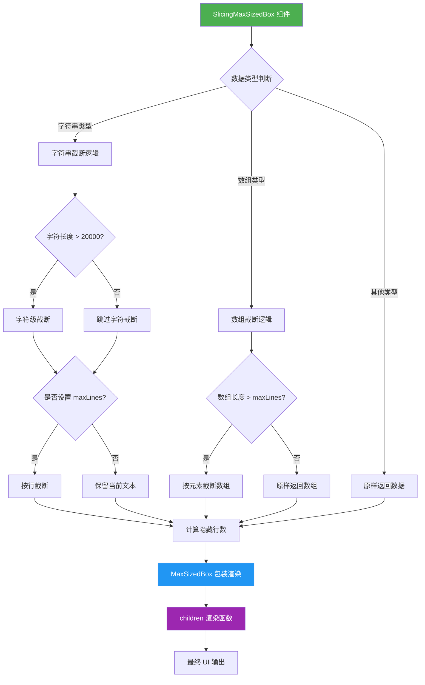
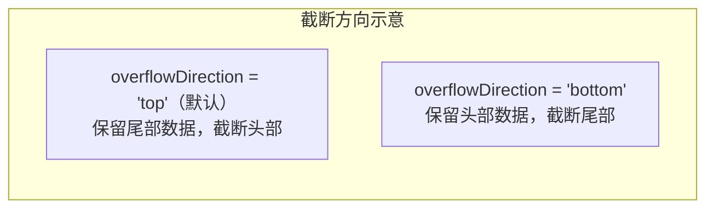

# SlicingMaxSizedBox.tsx

## 概述

`SlicingMaxSizedBox` 是一个泛型 React 组件，是 `MaxSizedBox` 的扩展封装。它在渲染之前对输入数据（字符串或数组）执行显式的截断/切片（slicing）操作，以提升大量输出内容的渲染性能，并确保一致的截断行为。该组件采用 Render Props 模式（`children` 为函数），将截断后的数据传递给子组件进行渲染。

核心设计理念：先在数据层面进行截断（减少需要渲染的数据量），再将截断后的数据传递给 `MaxSizedBox` 做视觉层面的尺寸约束，实现双层截断控制。

## 架构图（Mermaid）





## 核心组件

### 常量

| 常量名 | 值 | 说明 |
|--------|------|------|
| `MAXIMUM_RESULT_DISPLAY_CHARACTERS` | `20000` | 字符串显示的最大字符数阈值，防止超大输出导致性能问题 |

### SlicingMaxSizedBoxProps\<T\> 接口

继承自 `Omit<MaxSizedBoxProps, 'children'>`，额外定义以下属性：

| 属性 | 类型 | 必填 | 说明 |
|------|------|------|------|
| `data` | `T` | 是 | 输入数据，通常为 `string` 或 `T[]` 数组 |
| `maxLines` | `number` | 否 | 最大显示行数限制 |
| `isAlternateBuffer` | `boolean` | 否 | 是否处于备用缓冲区模式（该模式下不截断，允许用户滚动查看完整输出） |
| `children` | `(truncatedData: T) => React.ReactNode` | 是 | 渲染函数（Render Prop），接收截断后的数据并返回 React 节点 |

### SlicingMaxSizedBox\<T\> 函数组件

泛型函数组件，核心逻辑通过 `useMemo` 进行性能优化，依赖项为 `[data, isAlternateBuffer, maxLines, boxProps.overflowDirection]`。

## 依赖关系

### 内部依赖

| 模块 | 路径 | 用途 |
|------|------|------|
| `MaxSizedBox` | `./MaxSizedBox.js` | 基础的尺寸约束容器组件，提供视觉层面的最大尺寸限制 |
| `MaxSizedBoxProps` | `./MaxSizedBox.js` | MaxSizedBox 的 Props 类型定义 |

### 外部依赖

| 包名 | 导入内容 | 用途 |
|------|----------|------|
| `react` | `useMemo` | 缓存截断计算结果，避免不必要的重复计算 |

## 关键实现细节

### 1. 双层截断架构

组件实现了数据层 + 视觉层的双层截断策略：
- **数据层（SlicingMaxSizedBox）**：在渲染之前，对原始数据进行裁剪（字符截断、行截断、数组元素截断），大幅减少传递给渲染层的数据量。
- **视觉层（MaxSizedBox）**：对已截断的数据进行最终的视觉尺寸约束。

### 2. 字符串截断逻辑（两阶段）

**第一阶段 —— 字符级截断：**
- 当字符串长度超过 `MAXIMUM_RESULT_DISPLAY_CHARACTERS`（20000）时触发。
- 根据 `overflowDirection` 决定截断方向：
  - `'bottom'`：保留头部字符，尾部添加 `'...'`。
  - `'top'`（默认）：保留尾部字符，头部添加 `'...'`。

**第二阶段 —— 行级截断：**
- 仅在 `maxLines` 已定义时触发。
- 处理尾部换行符：先移除尾部 `\n` 后按 `\n` 分割行，截断后再恢复尾部换行。
- 预留标签行空间：实际目标行数为 `Math.max(1, maxLines - 1)`，预留 1 行给 MaxSizedBox 的隐藏行数标签。
- 计算 `hiddenLines`（隐藏行数），传递给 MaxSizedBox 用于显示 "还有 N 行被隐藏" 的提示。

### 3. 数组截断逻辑

- 当 `data` 为数组、非备用缓冲区模式、且 `maxLines` 已定义时触发。
- 同样预留 1 行给标签：`targetLines = Math.max(1, maxLines - 1)`。
- 根据 `overflowDirection` 决定保留数组头部还是尾部元素。

### 4. 备用缓冲区模式（Alternate Buffer）

当 `isAlternateBuffer` 为 `true` 时，字符串和数组的截断逻辑均被跳过，数据原样传递。这是为了在终端的备用缓冲区中允许用户通过滚动查看完整输出内容。

### 5. 隐藏行数累加

```tsx
additionalHiddenLinesCount={
  (boxProps.additionalHiddenLinesCount ?? 0) + hiddenLinesCount
}
```

组件将自身计算的 `hiddenLinesCount` 与外部传入的 `additionalHiddenLinesCount` 累加后传递给 `MaxSizedBox`，确保隐藏行数的统计是全链路累加的。

### 6. Render Props 模式与类型安全

`children` 是一个接收截断后数据的函数。由于截断过程中数据类型可能从 `T` 变为 `string`（截断后的字符串），组件使用了 `truncatedData as unknown as T` 的类型断言来保持泛型一致性。这里有一个 ESLint 禁用注释（`@typescript-eslint/no-unsafe-type-assertion`），说明开发者已知晓此处的类型不安全性。

### 7. useMemo 性能优化

截断计算被包裹在 `useMemo` 中，仅在依赖项 `[data, isAlternateBuffer, maxLines, boxProps.overflowDirection]` 变化时重新计算，避免每次渲染都执行开销较大的字符串分割和切片操作。

### 8. 溢出方向默认值

`overflowDirection` 默认值为 `'top'`（通过 `?? 'top'` 设定），即默认保留数据尾部（最新内容），截断数据头部（较早内容），这符合终端日志输出的常见阅读习惯。
