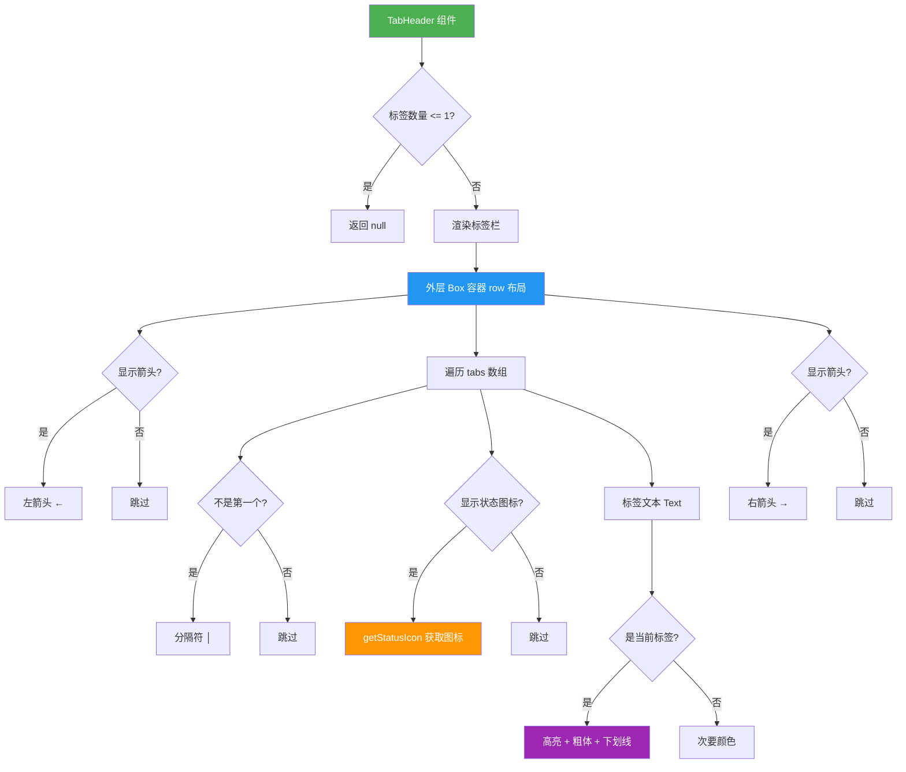
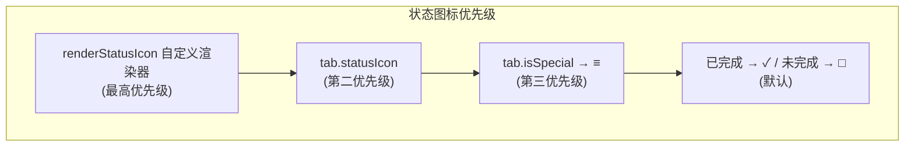

# TabHeader.tsx

## 概述

`TabHeader` 是一个 React 组件，用于在终端多标签页界面中渲染标签页导航头部指示器。组件以水平排列的方式展示多个标签页，支持显示完成状态图标、高亮当前选中标签、左右箭头导航提示等功能。当只有一个或没有标签页时，组件返回 `null` 不渲染任何内容。

典型渲染效果如下：
```
← □ Tab1 │ ✓ Tab2 │ □ Tab3 →
```

## 架构图（Mermaid）





## 核心组件

### Tab 接口

定义单个标签页的数据结构。

| 属性 | 类型 | 必填 | 说明 |
|------|------|------|------|
| `key` | `string` | 是 | 标签的唯一标识符，用于 React 列表渲染的 key |
| `header` | `string` | 是 | 标签头部显示的文本 |
| `statusIcon` | `string` | 否 | 自定义状态图标，优先级高于默认图标 |
| `isSpecial` | `boolean` | 否 | 标记为特殊标签（如"Review"），使用不同的默认图标 `≡` |

### TabHeaderProps 接口

| 属性 | 类型 | 必填 | 默认值 | 说明 |
|------|------|------|--------|------|
| `tabs` | `Tab[]` | 是 | - | 标签页定义数组 |
| `currentIndex` | `number` | 是 | - | 当前选中标签的索引 |
| `completedIndices` | `Set<number>` | 否 | `new Set()` | 已完成标签页的索引集合 |
| `showArrows` | `boolean` | 否 | `true` | 是否显示左右导航箭头 |
| `showStatusIcons` | `boolean` | 否 | `true` | 是否显示状态图标 |
| `renderStatusIcon` | `(tab, index, isCompleted) => string \| undefined` | 否 | - | 自定义状态图标渲染函数，返回 `undefined` 时回退到默认图标 |

### TabHeader 函数组件

核心渲染逻辑，返回 `React.JSX.Element | null`。

## 依赖关系

### 内部依赖

| 模块 | 路径 | 用途 |
|------|------|------|
| `theme` | `../../semantic-colors.js` | 提供语义化颜色，包括 `theme.text.secondary`、`theme.text.primary`、`theme.status.success` |

### 外部依赖

| 包名 | 导入内容 | 用途 |
|------|----------|------|
| `react` | `React` | JSX 运行时、`React.Fragment`、`React.JSX.Element` 类型 |
| `ink` | `Text`, `Box` | Ink 终端 UI 框架的文本和布局组件 |

## 关键实现细节

### 1. 条件渲染 —— 单标签时隐藏

```tsx
if (tabs.length <= 1) return null;
```

当标签页数量为 0 或 1 时，标签头部没有存在意义，组件直接返回 `null`，不占用任何终端空间。

### 2. 状态图标优先级系统（getStatusIcon）

`getStatusIcon` 内部函数实现了四级优先级的图标选择策略：

1. **自定义渲染器（`renderStatusIcon`）**：如果提供了自定义渲染函数且返回值不为 `undefined`，优先使用其结果。
2. **标签自带图标（`tab.statusIcon`）**：如果标签定义中指定了 `statusIcon`，使用该图标。
3. **特殊标签图标**：如果 `tab.isSpecial` 为 `true`，返回 `'≡'`（汉堡菜单图标）。
4. **默认图标**：根据完成状态返回 `'✓'`（已完成）或 `'□'`（未完成）。

### 3. 当前标签的视觉高亮

当前选中的标签（`i === currentIndex`）拥有三重视觉强调：

- **颜色**：使用 `theme.status.success`（成功/强调色），而非选中标签使用 `theme.text.secondary`（次要色）。
- **粗体**：`bold={i === currentIndex}`。
- **下划线**：`underline={i === currentIndex}`。

### 4. 标签宽度约束

```tsx
<Box maxWidth={i !== currentIndex ? 16 : 100}>
```

非当前标签的最大宽度被限制为 16 个字符，当前标签允许最大 100 个字符。这样设计确保了：
- 当前标签有足够空间展示完整标题。
- 非当前标签被压缩显示，为当前标签腾出空间。
- 配合 `wrap="truncate"` 超长文本会被截断。

### 5. 无障碍访问支持

- 外层 `Box` 设置了 `aria-role="tablist"`，标识为标签列表。
- 当前标签的 `Text` 设置了 `aria-current="step"`，标识为当前步骤/标签。

### 6. 分隔符渲染

使用 `{i > 0 && ...}` 条件判断，仅在非第一个标签前渲染竖线分隔符 `│`（Unicode 制表符），避免首个标签前出现多余的分隔符。

### 7. React.Fragment 与 key

使用 `React.Fragment` 包裹每个标签的多个元素（分隔符 + 图标 + 文本），并通过 `tab.key` 作为 Fragment 的唯一标识，确保 React 列表渲染的高效性。

### 8. 导航箭头提示

`showArrows` 控制是否在标签栏两端显示 `←` 和 `→` 箭头符号，为用户提供可左右切换标签的视觉提示。箭头使用次要文本颜色渲染，避免过度抢占视觉注意力。
