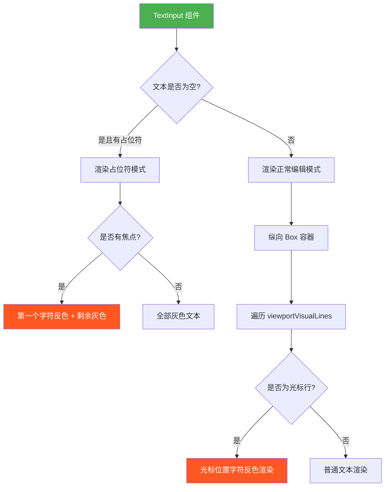
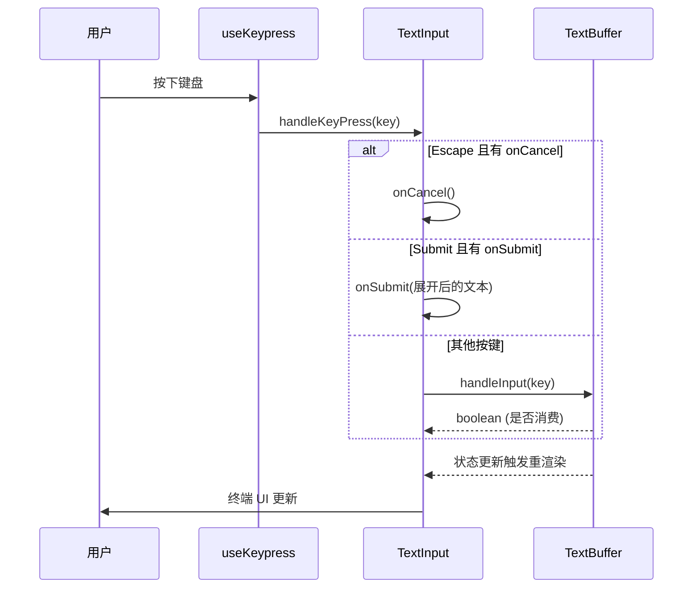
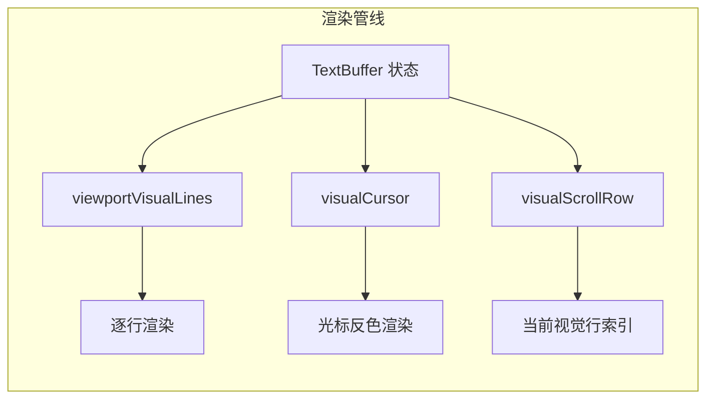

# TextInput.tsx

## 概述

`TextInput` 是一个基于 Ink 的 React 终端文本输入组件，负责将 `TextBuffer`（文本缓冲区）的状态渲染为可视的终端 UI，同时处理用户按键输入的分发。它是文本编辑系统的"视图层"，而 `text-buffer.ts` 是"模型层"。

该组件的核心职责有三个：
1. **渲染视觉行**：将 `TextBuffer` 计算好的视觉行（已换行、已变换）渲染到终端。
2. **渲染光标**：使用 `chalk.inverse` 反色显示光标位置的字符，模拟终端光标效果。
3. **按键分发**：通过 `useKeypress` 监听按键事件，将 Escape（取消）和 Submit（提交）交给上层处理，其余按键转发给 `TextBuffer.handleInput`。

## 架构图（Mermaid）







## 核心组件

### TextInputProps 接口

| 属性 | 类型 | 必填 | 默认值 | 说明 |
|------|------|------|--------|------|
| `buffer` | `TextBuffer` | 是 | - | 文本缓冲区对象，由 `useTextBuffer` Hook 创建 |
| `placeholder` | `string` | 否 | `''` | 输入框为空时显示的占位符文本 |
| `onSubmit` | `(value: string) => void` | 否 | - | 用户提交时的回调（按 Enter/Ctrl+Enter），接收展开粘贴占位符后的完整文本 |
| `onCancel` | `() => void` | 否 | - | 用户按 Escape 时的回调 |
| `focus` | `boolean` | 否 | `true` | 是否获得输入焦点 |

### TextInput 函数组件

**组件签名：**

```tsx
export function TextInput({
  buffer, placeholder, onSubmit, onCancel, focus
}: TextInputProps): React.JSX.Element
```

## 依赖关系

### 内部依赖

| 模块 | 路径 | 用途 |
|------|------|------|
| `useKeypress` | `../../hooks/useKeypress.js` | 注册按键事件监听器 |
| `Key` | `../../hooks/useKeypress.js` | 按键事件类型定义 |
| `theme` | `../../semantic-colors.js` | 语义化颜色主题（`theme.text.secondary` 用于占位符颜色） |
| `expandPastePlaceholders` | `./text-buffer.js` | 提交时展开粘贴占位符为实际内容 |
| `TextBuffer` | `./text-buffer.js` | 文本缓冲区类型定义 |
| `cpSlice` | `../../utils/textUtils.js` | Unicode 码点安全的字符串切片 |
| `cpIndexToOffset` | `../../utils/textUtils.js` | 码点索引转换为字符串字节偏移量 |
| `Command` | `../../key/keyMatchers.js` | 命令枚举定义（`Command.SUBMIT`） |
| `useKeyMatchers` | `../../hooks/useKeyMatchers.js` | 获取按键匹配器集合 |

### 外部依赖

| 包名 | 导入内容 | 用途 |
|------|----------|------|
| `react` | `useCallback`（+ `React` 类型导入） | 回调函数记忆化、JSX 类型 |
| `ink` | `Text`, `Box` | 终端 UI 组件 |
| `chalk` | `chalk` | 终端文本样式（`chalk.inverse` 用于光标反色） |

## 关键实现细节

### 1. 按键处理流水线

`handleKeyPress` 回调函数处理按键的优先级链：

1. **Escape**：如果提供了 `onCancel` 回调，调用它并返回 `true`（已消费）。
2. **Submit（Enter/Ctrl+Enter）**：如果提供了 `onSubmit` 回调，先调用 `expandPastePlaceholders(text, buffer.pastedContent)` 将粘贴占位符展开为实际内容，然后将完整文本传递给 `onSubmit`。
3. **其他按键**：转发给 `buffer.handleInput(key)`，由 TextBuffer 内部处理。

`useKeypress` 以 `{ isActive: focus, priority: true }` 注册，意味着：
- 仅在 `focus=true` 时激活
- `priority: true` 确保优先处理

### 2. 占位符渲染

当 `text` 为空且有 `placeholder` 时进入占位符模式：

- **有焦点时**：第一个字符使用 `chalk.inverse` 反色显示（模拟光标停在第一个字符上），后续字符使用 `theme.text.secondary` 次要颜色。同时设置 `terminalCursorPosition={0}` 让终端光标定位到行首。
- **无焦点时**：全部占位符文本使用 `theme.text.secondary` 次要颜色。

### 3. 光标渲染机制

在正常编辑模式下，光标通过以下方式渲染：

```tsx
const lineDisplay = isCursorLine
  ? cpSlice(lineText, 0, cursorVisualColAbsolute) +     // 光标前的文本
    chalk.inverse(
      cpSlice(lineText, cursorVisualColAbsolute, cursorVisualColAbsolute + 1) || ' '
    ) +                                                   // 光标位置的字符（反色）
    cpSlice(lineText, cursorVisualColAbsolute + 1)        // 光标后的文本
  : lineText;
```

关键细节：
- 使用 `chalk.inverse` 实现反色效果（字符背景色和前景色互换），模拟块状光标。
- 当光标在行末（空字符）时，`cpSlice` 返回空字符串，fallback 为空格 `' '`，确保光标始终可见。
- 使用 `cpSlice` 而非 `String.slice`，确保 Unicode 码点（如中文、emoji）的正确切片。

### 4. 视觉行滚动与渲染

组件渲染的是 `viewportVisualLines`（视口内的视觉行切片），而非所有视觉行：

```tsx
viewportVisualLines.map((lineText, idx) => {
  const currentVisualRow = visualScrollRow + idx;
  const isCursorLine = focus && currentVisualRow === cursorVisualRowAbsolute;
  ...
})
```

- `idx` 是视口内的相对索引（0-based）
- `currentVisualRow = visualScrollRow + idx` 是全局视觉行索引
- 通过与 `cursorVisualRowAbsolute` 比较来确定光标行

### 5. 终端光标定位

每行都设置了 `terminalCursorFocus` 和 `terminalCursorPosition`：

```tsx
<Text
  terminalCursorFocus={isCursorLine}
  terminalCursorPosition={cpIndexToOffset(lineText, cursorVisualColAbsolute)}
>
```

- `terminalCursorFocus`：仅在光标行为 `true`，告诉 Ink 此处应放置终端硬件光标。
- `terminalCursorPosition`：使用 `cpIndexToOffset` 将码点索引转换为字节偏移量，确保多字节字符（中文等）的光标位置正确。

### 6. 提交时的粘贴展开

提交文本时不是直接提交 `text`，而是先调用 `expandPastePlaceholders(text, buffer.pastedContent)` 展开所有粘贴占位符。这确保了下游接收到的是完整文本，而非包含 `[Pasted Text: 6 lines]` 这样的占位符。

### 7. 关注点分离

`TextInput` 严格遵循关注点分离原则：
- **不管理任何文本编辑状态**：所有状态（文本内容、光标位置、视觉行等）都由外部传入的 `buffer` 对象管理。
- **不做任何文本编辑逻辑**：所有编辑操作都委托给 `buffer.handleInput`。
- **只负责**：渲染 + 按键分发 + 提交/取消的高层事件处理。

这使得 TextInput 非常轻量（约 115 行），而复杂的编辑逻辑全部封装在 `text-buffer.ts` 中。

### 8. 每行固定高度

```tsx
<Box key={idx} height={1}>
```

每个视觉行被包裹在 `height={1}` 的 Box 中，确保即使空行也占据一行高度，维持布局稳定性。使用 `idx` 作为 key，因为视觉行的内容会随编辑频繁变化，使用索引 key 更合适。
