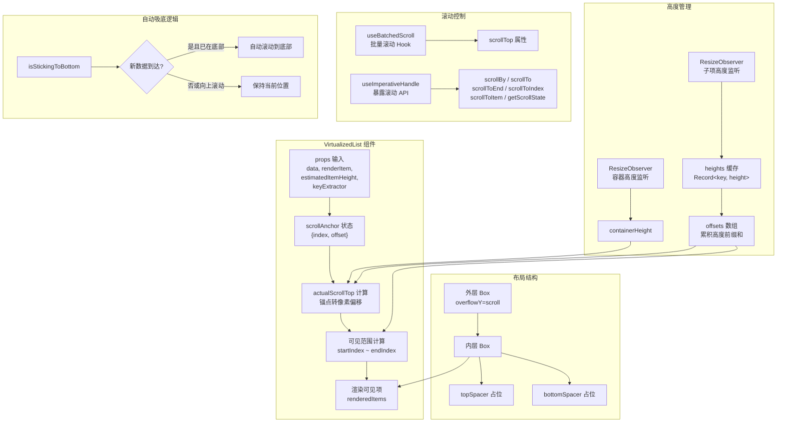
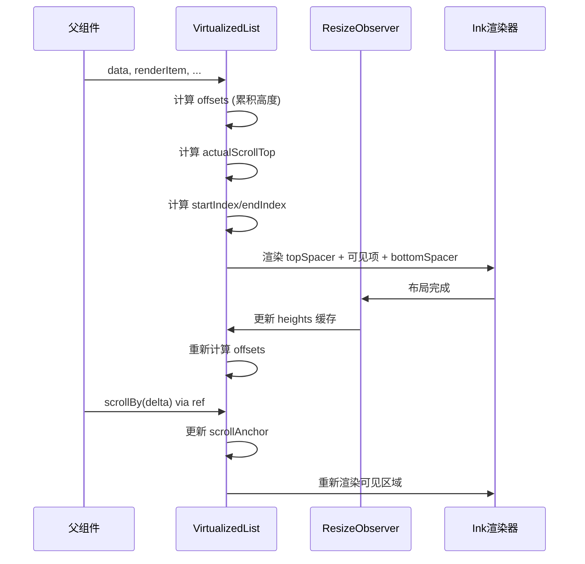

# VirtualizedList.tsx

## 概述

`VirtualizedList.tsx` 是 Gemini CLI 终端 UI 中的 **虚拟化列表组件**，基于 React（Ink 框架）实现。该组件的核心目标是在终端环境下高效渲染大量列表数据：只渲染当前视口可见范围内的列表项，通过上下 spacer 占位来模拟完整列表的高度，从而大幅减少 DOM 节点数量，提升渲染性能。

组件采用 **锚点滚动（anchor-based scrolling）** 策略，通过 `scrollAnchor`（锚定项索引 + 偏移量）来跟踪滚动位置，而非直接使用像素级 scrollTop。这种设计在列表项高度动态变化时能保持稳定的视觉位置。

同时支持 **自动吸底（stick-to-bottom）** 行为，适用于聊天/日志类场景——当用户已滚动到底部时，新增数据会自动滚动到最底端。

## 架构图（Mermaid）





## 核心组件

### 1. 常量 `SCROLL_TO_ITEM_END`

```typescript
export const SCROLL_TO_ITEM_END = Number.MAX_SAFE_INTEGER;
```

一个特殊标记值，表示"滚动到项目末尾"。用于 `scrollAnchor.offset` 或 `initialScrollIndex`，使列表项底部对齐视口底部。

### 2. `VirtualizedListProps<T>` 泛型接口

| 属性 | 类型 | 说明 |
|------|------|------|
| `data` | `T[]` | 列表数据源 |
| `renderItem` | `(info: {item: T, index: number}) => ReactElement` | 渲染每项的函数 |
| `estimatedItemHeight` | `(index: number) => number` | 估算项高度（未测量时使用） |
| `keyExtractor` | `(item: T, index: number) => string` | 提取唯一 key |
| `initialScrollIndex?` | `number` | 初始滚动位置（项索引） |
| `initialScrollOffsetInIndex?` | `number` | 初始滚动项内的偏移 |
| `scrollbarThumbColor?` | `string` | 滚动条拇指颜色 |

### 3. `VirtualizedListRef<T>` 接口（命令式 API）

通过 `forwardRef` + `useImperativeHandle` 暴露给父组件的命令式滚动控制接口：

| 方法 | 签名 | 说明 |
|------|------|------|
| `scrollBy` | `(delta: number) => void` | 相对滚动，正值向下负值向上 |
| `scrollTo` | `(offset: number) => void` | 绝对滚动到像素位置 |
| `scrollToEnd` | `() => void` | 滚动到列表末尾 |
| `scrollToIndex` | `({index, viewOffset?, viewPosition?}) => void` | 滚动到指定索引 |
| `scrollToItem` | `({item, viewOffset?, viewPosition?}) => void` | 滚动到指定数据项 |
| `getScrollIndex` | `() => number` | 获取当前锚点索引 |
| `getScrollState` | `() => {scrollTop, scrollHeight, innerHeight}` | 获取完整滚动状态 |

### 4. `findLastIndex<T>()` 辅助函数

自定义的数组反向查找函数（等效于 `Array.prototype.findLastIndex`），从数组末尾向前查找第一个满足谓词的元素索引。用于在 `offsets` 数组中进行二分定位（找到最后一个偏移量 <= 目标值的索引）。

### 5. 状态管理

#### `scrollAnchor` - 滚动锚点

```typescript
const [scrollAnchor, setScrollAnchor] = useState<{index: number; offset: number}>()
```

核心滚动状态，由两部分组成：
- `index`: 锚定的列表项索引
- `offset`: 在该项内的像素偏移量（`SCROLL_TO_ITEM_END` 表示对齐项底部）

**初始化逻辑**：
- 若 `initialScrollIndex === SCROLL_TO_ITEM_END`，锚定到最后一项末尾
- 若指定了 `initialScrollIndex`，锚定到该项
- 否则锚定到第一项，偏移 0

#### `isStickingToBottom` - 吸底标志

```typescript
const [isStickingToBottom, setIsStickingToBottom] = useState<boolean>()
```

标记列表是否处于"吸底"模式。吸底时：
- `scrollTop` 设为 `Number.MAX_SAFE_INTEGER`（确保 Ink 渲染到最底部）
- 新数据到达时自动滚动到底部
- 向上滚动（`delta < 0`）时自动取消吸底

#### `containerHeight` - 容器高度

通过 `ResizeObserver` 实时监听容器 DOM 元素高度变化。

#### `heights` - 子项高度缓存

```typescript
const [heights, setHeights] = useState<Record<string, number>>({})
```

以 key 为索引缓存每个列表项的实际测量高度。通过 `ResizeObserver` 在子项渲染后自动测量并更新。

### 6. 高度与偏移量计算

```typescript
const { totalHeight, offsets } = useMemo(() => {
  const offsets: number[] = [0];
  let totalHeight = 0;
  for (let i = 0; i < data.length; i++) {
    const key = keyExtractor(data[i], i);
    const height = heights[key] ?? estimatedItemHeight(i);
    totalHeight += height;
    offsets.push(totalHeight);
  }
  return { totalHeight, offsets };
}, [heights, data, estimatedItemHeight, keyExtractor]);
```

- `offsets` 数组：长度为 `data.length + 1` 的前缀和数组，`offsets[i]` 表示第 `i` 项的顶部偏移
- 优先使用 `heights[key]`（实际测量值），回退到 `estimatedItemHeight(i)`（估算值）
- 随着 `heights` 缓存逐步填充，偏移量会越来越精确

### 7. 滚动位置计算（`actualScrollTop`）

将 `scrollAnchor` 转换为像素级的滚动位置：

```typescript
const actualScrollTop = useMemo(() => {
  if (scrollAnchor.offset === SCROLL_TO_ITEM_END) {
    return offset + itemHeight - scrollableContainerHeight;  // 项底部对齐视口底部
  }
  return offset + scrollAnchor.offset;  // 项顶部 + 偏移
}, [...]);
```

### 8. 可见范围计算

```typescript
const startIndex = Math.max(0, findLastIndex(offsets, offset => offset <= actualScrollTop) - 1);
const endIndex = endIndexOffset === -1
  ? data.length - 1
  : Math.min(data.length - 1, endIndexOffset);
```

- `startIndex`: 比视口顶部偏移量还早一项（预渲染缓冲）
- `endIndex`: 超出视口底部的第一项（确保视口内所有项都被渲染）
- 上下 spacer 高度分别为 `offsets[startIndex]` 和 `totalHeight - offsets[endIndex + 1]`

### 9. ResizeObserver 管理

**容器 Observer**：
- 通过 `containerRefCallback` 在容器挂载时创建 `ResizeObserver`
- 监听容器高度变化，更新 `containerHeight`

**子项 Observer**：
- 使用 `useMemo` 创建单个共享的 `ResizeObserver`
- 通过 `nodeToKeyRef`（WeakMap）将 DOM 节点映射回 key
- 在 `useLayoutEffect` 中维护已观察节点的集合，确保新出现的节点被 observe、消失的节点被 unobserve

### 10. 自动吸底逻辑

在 `useLayoutEffect` 中实现复杂的吸底判断：

1. **判断是否已在底部**：内容之前完全容纳在视口内（`totalHeight <= containerHeight`），或 scrollTop 距底部在 1px 以内
2. **列表增长 + 已在底部** -> 自动吸底
3. **已吸底 + 容器大小变化** -> 保持吸底
4. **锚点越界**（数据缩减后锚点超出范围）-> 修正到最后一项

### 11. 复制模式支持

```typescript
const { copyModeEnabled } = useUIState();
```

当进入复制模式时：
- `overflowY` 设为 `hidden`（禁用滚动行为）
- `scrollTop` 设为 `0`
- 使用 `marginTop: -actualScrollTop` 将内容整体上移，模拟滚动效果
- `paddingRight` 设为 `0`（隐藏滚动条预留空间）

### 12. 渲染结构

```
Box (容器, overflowY=scroll)
  Box (内容包装)
    Box (topSpacer, height=topSpacerHeight)
    [渲染的列表项] (startIndex..endIndex)
    Box (bottomSpacer, height=bottomSpacerHeight)
```

每个列表项包裹在 `Box` 中，设置 `width="100%"`, `flexDirection="column"`, `flexShrink={0}`，并通过 ref 回调收集 DOM 引用。

## 依赖关系

### 内部依赖

| 模块路径 | 导入项 | 用途 |
|---------|-------|------|
| `../../semantic-colors.js` | `theme` | 获取 `theme.text.secondary` 作为默认滚动条颜色 |
| `../../hooks/useBatchedScroll.js` | `useBatchedScroll` | 批量滚动优化 Hook，减少频繁 setState 调用 |
| `../../contexts/UIStateContext.js` | `useUIState` | 获取 `copyModeEnabled` 状态 |

### 外部依赖

| 包名 | 导入项 | 用途 |
|-----|-------|------|
| `react` | `useState`, `useRef`, `useLayoutEffect`, `forwardRef`, `useImperativeHandle`, `useMemo`, `useCallback` | React 核心 Hooks |
| `react` | `React` (type) | 类型引用 |
| `ink` | `DOMElement` (type), `Box`, `ResizeObserver` | Ink 框架的 DOM 类型、布局组件和 ResizeObserver |

## 关键实现细节

1. **锚点式滚动而非像素式滚动**：使用 `{index, offset}` 锚点而非单一的 scrollTop 像素值来管理滚动位置。当列表项高度发生变化时，锚点可以自动适应（因为锚点引用的是项索引而非绝对像素偏移），从而避免"跳跃"现象。

2. **高度估算与实际测量混合**：初始渲染时使用 `estimatedItemHeight` 估算高度，渲染后通过 `ResizeObserver` 获取真实高度并缓存到 `heights` 中。`offsets` 数组会随着测量值的增加逐步变得更精确。这种渐进式精确化是虚拟化列表处理动态高度项的经典策略。

3. **单一共享 ResizeObserver**：所有子项共享一个 `ResizeObserver` 实例（通过 `useMemo` 创建），而非每个子项创建独立的 observer。这减少了 observer 实例数量，提高性能。通过 `WeakMap` 将 DOM 节点反向映射到 key。

4. **预渲染缓冲**：`startIndex` 比严格必要值提前一项（`-1`），确保在快速滚动时视口边缘不会出现空白闪烁。

5. **吸底行为的鲁棒性**：吸底判断考虑了多种边界情况：内容完全容纳在视口内、1px 精度误差、列表增长、容器高度变化等。向上滚动（负 delta）立即取消吸底。

6. **复制模式兼容**：复制模式下不能使用 `overflow: scroll`（会影响终端的文本选择），改用 `marginTop` 负值模拟滚动偏移，并隐藏滚动条空间。

7. **泛型 forwardRef 的类型技巧**：由于 React 的 `forwardRef` 不直接支持泛型组件，使用类型断言将其转换为保留泛型参数的函数类型：
   ```typescript
   const VirtualizedListWithForwardRef = forwardRef(VirtualizedList) as <T>(
     props: VirtualizedListProps<T> & { ref?: React.Ref<VirtualizedListRef<T>> },
   ) => React.ReactElement;
   ```

8. **useBatchedScroll 优化**：滚动操作通过 `useBatchedScroll` Hook 进行批量处理，避免在快速连续滚动时产生过多的 React 状态更新和重渲染。

9. **稳定的 Observer 管理**：通过 `observedNodes` ref 维护当前被观察的 DOM 节点集合，在每次 `useLayoutEffect` 中对比新旧集合，只对变化的节点调用 `observe`/`unobserve`，避免不必要的重复注册。

10. **scrollTop 的双轨制**：正常模式下 `scrollTop` 可以是 `actualScrollTop`（精确像素值）或 `Number.MAX_SAFE_INTEGER`（吸底模式）；复制模式下固定为 `0`，通过 `marginTop` 实现视觉偏移。
