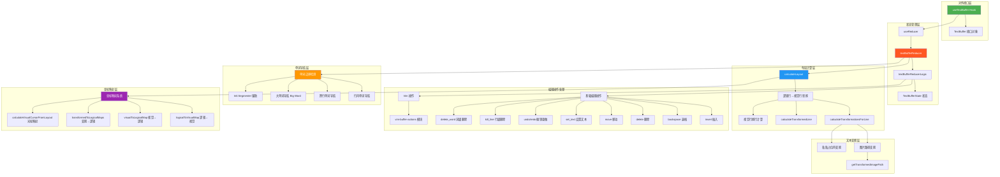
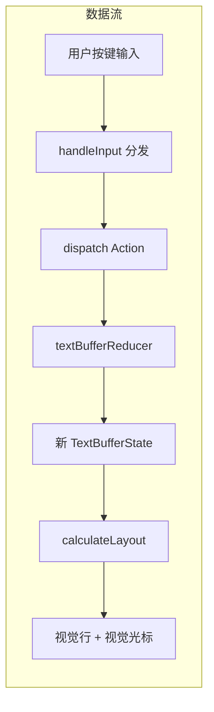
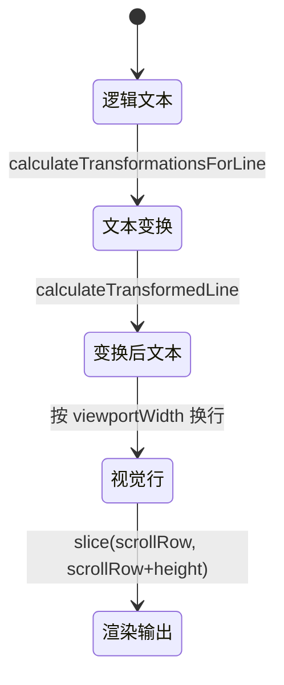

# text-buffer.ts

## 概述

`text-buffer.ts` 是整个 CLI 文本编辑系统的核心模块，实现了一个功能完备的多行文本编辑缓冲区。该模块约 4300+ 行，是项目中最大、最复杂的单文件之一。它提供了：

1. **完整的文本编辑引擎**：基于 React `useReducer` 的不可变状态管理，支持插入、删除、光标移动、撤销/重做等全套编辑操作。
2. **Vim 模式支持**：实现了大量 Vim 命令（约 60+ 种 action），包括单词跳转（w/b/e/W/B/E）、删除/修改操作（dw/cw/dd/cc/D/C 等）、字符查找（f/t/F/T）、yank/paste 等。
3. **视觉行布局系统**：将逻辑行按终端宽度自动换行为视觉行，并维护逻辑坐标与视觉坐标之间的双向映射。
4. **文本变换系统**：支持图片路径折叠显示（如 `@path/to/image.png` 显示为 `[Image image.png]`）和大段粘贴内容的折叠/展开。
5. **Unicode 与国际化支持**：正确处理 Unicode 码点、组合字符、多脚本文字（中文、日文、阿拉伯文等）的单词边界检测。
6. **性能优化**：LRU 缓存、useMemo/useCallback 记忆化、按行缓存布局计算结果。

该模块导出一个 `useTextBuffer` React Hook 作为主要的对外接口，返回一个 `TextBuffer` 对象，封装了所有状态和操作方法。

## 架构图（Mermaid）







## 核心组件

### 常量与类型

| 名称 | 类型 | 值/描述 |
|------|------|---------|
| `LARGE_PASTE_LINE_THRESHOLD` | `number` | `5` — 超过此行数的粘贴内容自动折叠 |
| `LARGE_PASTE_CHAR_THRESHOLD` | `number` | `500` — 超过此字符数的粘贴内容自动折叠 |
| `PASTED_TEXT_PLACEHOLDER_REGEX` | `RegExp` | 匹配粘贴占位符，如 `[Pasted Text: 6 lines]` |
| `Direction` | 类型 | `'left' \| 'right' \| 'up' \| 'down' \| 'wordLeft' \| 'wordRight' \| 'home' \| 'end'` |
| `historyLimit` | `number` | `100` — 撤销栈最大深度 |

### TextBufferState 接口

核心状态对象，包含所有编辑缓冲区的状态：

| 字段 | 类型 | 说明 |
|------|------|------|
| `lines` | `string[]` | 逻辑行数组（按 `\n` 分割） |
| `cursorRow` | `number` | 光标所在逻辑行 |
| `cursorCol` | `number` | 光标所在逻辑列（码点索引） |
| `transformationsByLine` | `Transformation[][]` | 每行的文本变换（图片折叠、粘贴占位符） |
| `preferredCol` | `number \| null` | 垂直移动时的首选列（用于跨短行保持水平位置） |
| `undoStack` | `UndoHistoryEntry[]` | 撤销历史栈 |
| `redoStack` | `UndoHistoryEntry[]` | 重做历史栈 |
| `clipboard` | `string \| null` | 内部剪贴板 |
| `selectionAnchor` | `[number, number] \| null` | 选区锚点 |
| `viewportWidth` | `number` | 视口宽度 |
| `viewportHeight` | `number` | 视口高度 |
| `visualLayout` | `VisualLayout` | 预计算的视觉布局 |
| `pastedContent` | `Record<string, string>` | 粘贴占位符 ID → 原始粘贴内容的映射 |
| `expandedPaste` | `ExpandedPasteInfo \| null` | 当前展开的粘贴区域信息 |
| `yankRegister` | `{ text, linewise } \| null` | Vim yank 寄存器 |

### TextBufferAction 联合类型

约 70+ 种 Action 类型，分为以下大类：

**基础编辑：**
- `insert` — 插入文本（支持粘贴标记）
- `set_text` — 替换全部文本
- `backspace` — 退格删除
- `delete` — 前向删除
- `delete_word_left/right` — 词级删除
- `kill_line_right/left` — 行级删除

**光标移动：**
- `move` — 方向移动（含视觉行和逻辑行）
- `set_cursor` — 设置光标位置
- `move_to_offset` — 按偏移量定位光标

**撤销/重做：**
- `undo`、`redo`、`create_undo_snapshot`

**Vim 操作（60+ 种）：**
- 移动：`vim_move_left/right/up/down`、`vim_move_word_forward/backward/end`、`vim_move_big_word_*`、`vim_move_to_line_start/end`、`vim_move_to_first_line/last_line` 等
- 删除：`vim_delete_word_forward/backward/end`、`vim_delete_big_word_*`、`vim_delete_line`、`vim_delete_to_end_of_line`、`vim_delete_char`、`vim_delete_to_char_forward/backward` 等
- 修改：`vim_change_word_*`、`vim_change_big_word_*`、`vim_change_line`、`vim_change_to_end_of_line`、`vim_change_movement` 等
- Yank/Paste：`vim_yank_line`、`vim_yank_word_*`、`vim_paste_after/before`
- 模式切换：`vim_insert_at_cursor`、`vim_append_at_cursor`、`vim_open_line_below/above`、`vim_escape_insert_mode`
- 其他：`vim_toggle_case`、`vim_replace_char`、`vim_find_char_forward/backward`

**粘贴管理：**
- `add_pasted_content` — 添加粘贴内容映射
- `toggle_paste_expansion` — 展开/折叠粘贴占位符

### Transformation 接口

定义文本变换（折叠/展开），用于图片路径和粘贴占位符：

| 字段 | 类型 | 说明 |
|------|------|------|
| `logStart` | `number` | 变换在逻辑行中的起始码点位置 |
| `logEnd` | `number` | 变换在逻辑行中的结束码点位置 |
| `logicalText` | `string` | 原始逻辑文本（如 `@path/to/image.png`） |
| `collapsedText` | `string` | 折叠后的显示文本（如 `[Image image.png]`） |
| `type` | `'image' \| 'paste'` | 变换类型 |
| `id` | `string \| undefined` | 粘贴占位符的 ID |

### VisualLayout 接口

视觉布局计算结果：

| 字段 | 类型 | 说明 |
|------|------|------|
| `visualLines` | `string[]` | 所有视觉行（按 viewportWidth 换行后） |
| `logicalToVisualMap` | `Array<Array<[number, number]>>` | 每个逻辑行对应的视觉行映射 |
| `visualToLogicalMap` | `Array<[number, number]>` | 每个视觉行对应的逻辑行映射 |
| `transformedToLogicalMaps` | `number[][]` | 变换列到逻辑列的映射 |
| `visualToTransformedMap` | `number[]` | 视觉行到变换行起始列的映射 |

### TextBuffer 接口

`useTextBuffer` Hook 的返回类型，包含所有状态属性和 90+ 个操作方法。这是外部组件与文本缓冲区交互的唯一接口。

### UseTextBufferProps 接口

Hook 的入参：

| 属性 | 类型 | 默认值 | 说明 |
|------|------|--------|------|
| `initialText` | `string` | `''` | 初始文本 |
| `initialCursorOffset` | `number` | `0` | 初始光标偏移量 |
| `viewport` | `Viewport` | 必填 | 视口尺寸 `{ width, height }` |
| `stdin` | `NodeJS.ReadStream \| null` | - | 标准输入流（外部编辑器用） |
| `setRawMode` | `(mode: boolean) => void` | - | 设置终端原始模式 |
| `onChange` | `(text: string) => void` | - | 文本变化回调 |
| `escapePastedPaths` | `boolean` | `false` | 是否转义粘贴的路径 |
| `shellModeActive` | `boolean` | `false` | Shell 模式 |
| `inputFilter` | `(text: string) => string` | - | 输入过滤函数 |
| `singleLine` | `boolean` | `false` | 单行模式 |
| `getPreferredEditor` | `() => EditorType \| undefined` | - | 获取首选编辑器 |

## 依赖关系

### 内部依赖

| 模块 | 路径 | 用途 |
|------|------|------|
| `textUtils` | `../../utils/textUtils.js` | Unicode 码点操作（`toCodePoints`、`cpLen`、`cpSlice`、`stripUnsafeCharacters`、`getCachedStringWidth`） |
| `clipboardUtils` | `../../utils/clipboardUtils.js` | 剪贴板路径解析（`parsePastedPaths`） |
| `KeypressContext` | `../../contexts/KeypressContext.js` | `Key` 类型定义 |
| `keyMatchers` | `../../key/keyMatchers.js` | `Command` 枚举，按键匹配命令定义 |
| `vim-buffer-actions` | `./vim-buffer-actions.js` | Vim 操作处理函数 `handleVimAction` 和 `VimAction` 类型 |
| `constants` | `../../constants.js` | `LRU_BUFFER_PERF_CACHE_LIMIT` 缓存大小常量 |
| `editorUtils` | `../../utils/editorUtils.js` | `openFileInEditor` 外部编辑器启动函数 |
| `useKeyMatchers` | `../../hooks/useKeyMatchers.js` | 按键匹配器 Hook |

### 外部依赖

| 包名 | 导入内容 | 用途 |
|------|----------|------|
| `react` | `useState`, `useCallback`, `useEffect`, `useMemo`, `useReducer` | React Hooks |
| `mnemonist` | `LRUCache` | LRU 缓存，用于变换计算和布局计算的性能缓存 |
| `@google/gemini-cli-core` | `coreEvents`, `debugLogger`, `unescapePath`, `EditorType` | 核心事件系统、调试日志、路径反转义、编辑器类型 |
| `node:fs` | `fs` | 文件系统操作（外部编辑器临时文件读写） |
| `node:os` | `os` | 获取临时目录路径 |
| `node:path` | `path`, `pathMod` | 路径操作 |

## 关键实现细节

### 1. 基于 Reducer 的不可变状态管理

整个文本缓冲区的状态通过 `useReducer` + `textBufferReducer` 管理。每个操作（Action）都不直接修改状态，而是返回一个新的 `TextBufferState` 对象。这种不可变模式带来了：
- 天然的撤销/重做支持（快照入栈/出栈）
- React 的高效差异检测（引用对比）
- 可预测的状态变化流

Reducer 分为两层：
- **`textBufferReducerLogic`**：处理所有 action 的核心逻辑
- **`textBufferReducer`**：包装层，在核心逻辑之后自动重算 `transformationsByLine` 和 `visualLayout`

### 2. 三层坐标系统

文本缓冲区维护三层坐标系统及其映射关系：

| 层次 | 说明 | 示例 |
|------|------|------|
| **逻辑坐标** | 原始文本的行/列位置（码点索引） | `cursorRow=2, cursorCol=5` |
| **变换坐标** | 应用折叠变换后的列位置 | 图片路径折叠后列数变化 |
| **视觉坐标** | 按 viewportWidth 换行后的行/列 | 长行分成多个视觉行 |

映射函数链：
```
逻辑坐标 → calculateTransformedLine → 变换坐标 → calculateLayout(换行) → 视觉坐标
视觉坐标 → visualToLogicalMap + transformedToLogicalMaps → 逻辑坐标
```

### 3. Unicode 多脚本单词边界检测

模块实现了复杂的单词边界检测系统，支持：

- **字符分类**：`isWordCharStrict`（字母/数字/下划线）、`isWhitespace`（空白）、`isCombiningMark`（组合标记/变音符号）
- **脚本检测**：`getCharScript` 识别 Latin、Han（中文）、Arabic、Hiragana、Katakana、Cyrillic 等脚本
- **脚本边界**：`isDifferentScript` 在不同脚本之间创建单词边界（如中文和英文之间）
- **两类单词**：
  - **小单词（w/b/e）**：字母/数字序列，标点序列各为独立单词
  - **大单词（W/B/E）**：以空白为唯一分隔符

单词导航函数族：
- 行内：`findNextWordStartInLine`、`findPrevWordStartInLine`、`findWordEndInLine`
- 行内大单词：`findNextBigWordStartInLine`、`findPrevBigWordStartInLine`、`findBigWordEndInLine`
- 跨行：`findNextWordAcrossLines`、`findPrevWordAcrossLines`
- 跨行大单词：`findNextBigWordAcrossLines`、`findPrevBigWordAcrossLines`
- Intl 辅助：`findPrevWordBoundary`、`findNextWordBoundary`（使用 `Intl.Segmenter`）

### 4. 文本变换与折叠系统

**图片路径变换**：
- 正则 `imagePathRegex` 匹配 `@path/to/file.{png|jpg|...}` 格式
- `getTransformedImagePath` 将完整路径折叠为 `[Image filename.ext]`，文件名超过 10 字符时前面加 `...`
- 当光标进入折叠区域时自动展开显示完整路径

**粘贴内容折叠**：
- 超过 5 行或 500 字符的粘贴自动生成占位符（如 `[Pasted Text: 6 lines]`）
- `togglePasteExpansion` 支持展开/折叠切换
- 展开时记录 `ExpandedPasteInfo`（起始行、行数、前后缀）以便精确折叠回去
- `shiftExpandedRegions` 处理编辑操作对展开区域位置的影响
- `detachExpandedPaste` 在展开区域内编辑时将其转为普通文本
- `pruneOrphanedPastedContent` 清理已删除占位符对应的粘贴内容

### 5. 视觉行布局计算（calculateLayout）

将逻辑行转换为视觉行（软换行）：

1. 对每个逻辑行，先计算文本变换（折叠图片路径等）
2. 对变换后的文本，按 `viewportWidth` 进行换行：
   - 优先在空格处断行（word break）
   - 无空格时硬断行
   - 单个字符宽度超过视口时强制显示
3. 构建 `logicalToVisualMap` 和 `visualToLogicalMap` 双向映射
4. 使用 LRU 缓存避免重复计算（缓存 key 包含行内容、视口宽度、是否光标行、光标列）

### 6. 视觉光标计算（calculateVisualCursorFromLayout）

从逻辑光标位置计算视觉光标位置：
1. 找到逻辑行对应的视觉行段列表
2. 找到光标所在的视觉行段
3. 通过 `transformedToLogicalMap` 将逻辑列转换为变换列
4. 将变换列减去视觉行段的起始变换列得到视觉列
5. Clamp 到视觉行长度范围内

### 7. 撤销/重做机制

- `pushUndo` 将当前状态快照（lines、cursor、pastedContent、expandedPaste）压入 `undoStack`，同时清空 `redoStack`
- `undo` 从 `undoStack` 弹出最后一个快照恢复，当前状态压入 `redoStack`
- `redo` 反向操作
- 栈深度限制为 `historyLimit = 100`，超出时移除最早的快照

### 8. 外部编辑器集成

`openInExternalEditor` 方法：
1. 在系统临时目录创建 `buffer.txt`
2. 将缓冲区内容（展开粘贴占位符后）写入文件
3. 创建撤销快照
4. 调用 `openFileInEditor` 启动外部编辑器（$VISUAL / $EDITOR / vi）
5. 等待编辑器关闭后读回文件内容
6. 尝试将未修改的粘贴内容重新折叠为占位符
7. 用 `set_text` 更新缓冲区
8. 清理临时文件

### 9. 滚动管理

- `scrollRowState` 记录视觉滚动位置（第一个可见视觉行的索引）
- 通过 `useEffect` 监听 `visualCursor` 变化，自动调整滚动位置确保光标可见
- `renderedVisualLines` 是 `visualLines.slice(scrollRow, scrollRow + height)` 的窗口切片

### 10. 输入处理（handleInput）

`handleInput` 方法接收 Ink 的 `Key` 对象，按优先级分发处理：
1. 粘贴事件 → `insert(input, { paste: true })`
2. 回车/换行 → `newline()`（单行模式返回 false）
3. 方向键 → `move(dir)`（边界检查后返回 false 让上层处理）
4. 词级移动（Ctrl+Left/Right）→ `move('wordLeft'/'wordRight')`
5. Home/End → `move('home'/'end')`
6. Ctrl+U → `setText('')` 清空
7. 退格/删除 → `backspace()/del()`
8. 词级删除 → `deleteWordLeft()/deleteWordRight()`
9. 撤销/重做 → `undo()/redo()`
10. 可插入字符 → `insert(input)`

返回 `boolean` 表示是否消费了该按键事件。

### 11. LRU 缓存优化

模块使用两层 LRU 缓存：
- **`transformationsCache`**：缓存每行的文本变换计算结果
- **`lineLayoutCache`**：缓存每行的视觉布局计算结果

缓存大小由 `LRU_BUFFER_PERF_CACHE_LIMIT` 常量控制。缓存 key 设计考虑了：非光标行使用简化 key（`{width}:N:{line}`），光标行使用完整 key（`{width}:C:{col}:{line}`），减少 99.9% 的非光标行的字符串分配开销。

### 12. 原子占位符删除

图片路径和粘贴占位符作为"原子单元"处理：
- `findAtomicPlaceholderForBackspace`：当光标在占位符末尾按退格时，整个占位符作为一个单元被删除
- `findAtomicPlaceholderForDelete`：当光标在占位符开头按 Delete 时，整个占位符被删除
- 删除粘贴占位符时同步清理 `pastedContent` 中对应的内容
