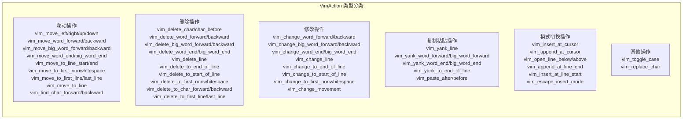

# vim-buffer-actions.ts

## 概述

`vim-buffer-actions.ts` 是 Gemini CLI 文本编辑器中 **Vim 模式操作处理器** 的核心实现文件。该文件定义了所有 Vim 风格的文本缓冲区操作（action），并通过一个统一的 `handleVimAction` 函数，将各类 Vim 命令（移动、删除、修改、复制、粘贴等）映射为对 `TextBufferState` 的不可变状态转换。

该模块是一个纯函数式的状态机：接收当前文本缓冲区状态和一个动作，返回新的状态。不产生任何副作用。

文件总行数约 1850 行，涵盖了 Vim 编辑器的大部分常用操作。

## 架构图（Mermaid）

```mermaid
graph TD
    A[外部调用者] -->|"dispatch(VimAction)"| B["handleVimAction()"]
    B -->|读取/修改| C["TextBufferState"]

    subgraph 辅助函数
        D["findCharInLine() - 行内字符搜索"]
        E["clampNormalCursor() - 普通模式光标约束"]
        F["extractRange() - 提取范围文本"]
    end

    subgraph 导入的文本缓冲区工具
        G["replaceRangeInternal() - 范围替换"]
        H["pushUndo() - 撤销栈入栈"]
        I["detachExpandedPaste() - 分离粘贴展开"]
        J["getLineRangeOffsets() - 行范围偏移计算"]
        K["getPositionFromOffsets() - 偏移转行列"]
        L["isCombiningMark() - 组合字符判断"]
    end

    subgraph 跨行单词查找
        M["findNextWordAcrossLines()"]
        N["findPrevWordAcrossLines()"]
        O["findNextBigWordAcrossLines()"]
        P["findPrevBigWordAcrossLines()"]
        Q["findWordEndInLine()"]
        R["findBigWordEndInLine()"]
    end

    subgraph Unicode 工具
        S["cpLen() - 码点长度"]
        T["toCodePoints() - 转码点数组"]
    end

    B --> D
    B --> E
    B --> F
    B --> G
    B --> H
    B --> I
    B --> J
    B --> K
    B --> L
    B --> M
    B --> N
    B --> O
    B --> P
    B --> Q
    B --> R
    B --> S
    B --> T
```





## 核心组件

### 1. `VimAction` 类型

通过 TypeScript 的 `Extract` 工具类型，从 `TextBufferAction` 联合类型中提取所有以 `vim_` 前缀开头的操作类型，形成一个覆盖 **60+ 种 Vim 操作** 的严格联合类型。每种操作都是一个带 `type` 字段的可辨识联合成员。

主要分为以下几大类：

| 操作类别 | 对应 Vim 命令 | 典型 action type |
|---------|-------------|-----------------|
| 光标移动 | `h`, `j`, `k`, `l`, `w`, `b`, `e`, `W`, `B`, `E`, `0`, `$`, `^`, `gg`, `G` | `vim_move_left`, `vim_move_down`, `vim_move_word_forward` 等 |
| 字符查找 | `f`, `F`, `t`, `T` | `vim_find_char_forward`, `vim_find_char_backward` |
| 删除 | `x`, `X`, `dw`, `db`, `de`, `dd`, `D`, `d0`, `d^`, `df`, `dF`, `dgg`, `dG` | `vim_delete_char`, `vim_delete_word_forward`, `vim_delete_line` 等 |
| 修改 | `cw`, `cb`, `ce`, `cc`, `C`, `c0`, `c^`, `ch`, `cj`, `ck`, `cl` | `vim_change_word_forward`, `vim_change_line`, `vim_change_movement` 等 |
| 复制粘贴 | `yy`, `yw`, `yW`, `ye`, `yE`, `y$`, `p`, `P` | `vim_yank_line`, `vim_yank_word_forward`, `vim_paste_after` 等 |
| 模式切换 | `i`, `a`, `o`, `O`, `A`, `I`, `Esc` | `vim_insert_at_cursor`, `vim_append_at_cursor`, `vim_open_line_below` 等 |
| 字符操作 | `~`, `r` | `vim_toggle_case`, `vim_replace_char` |

### 2. `findCharInLine()` 函数

行内字符搜索辅助函数，用于实现 Vim 的 `f`/`F`/`t`/`T`/`df`/`dF` 等字符查找命令。

```typescript
function findCharInLine(
  codePoints: string[],  // 已转为码点数组的行内容
  char: string,          // 要查找的目标字符
  count: number,         // 第 N 次出现（支持 2fx 等计数前缀）
  start: number,         // 搜索起始位置
  direction: 1 | -1,     // 搜索方向：1 向前，-1 向后
): number                // 返回找到的位置索引，未找到返回 -1
```

**实现细节**：通过一个简单的 for 循环遍历码点数组，统计匹配次数 `hits`，当 `hits >= count` 时返回当前索引。

### 3. `clampNormalCursor()` 函数

普通模式光标位置约束函数。在 Vim 的 NORMAL 模式下，光标不能停留在行末尾字符之后（与 INSERT 模式不同）。此函数在每次删除操作后调用，确保光标不越界。

```typescript
function clampNormalCursor(state: TextBufferState): TextBufferState
```

**关键逻辑**：
- 计算当前行的最大合法列 `maxCol = max(0, len - 1)`
- 如果当前光标列超过 `maxCol`，则修正为 `maxCol`
- **注意**：修改（change）操作不使用此函数，因为 change 会立即进入 INSERT 模式

### 4. `extractRange()` 函数

从文本行数组中提取指定范围的文本，用于在删除/复制操作中获取被操作的文本，存入 `yankRegister`。

```typescript
function extractRange(
  lines: string[],
  startRow: number, startCol: number,
  endRow: number, endCol: number,
): string
```

**实现细节**：
- 单行情况：直接对码点数组 slice
- 多行情况：分别取首行（从 startCol 到末尾）、中间完整行、末行（从开头到 endCol），用 `\n` 连接

### 5. `handleVimAction()` 主函数

这是模块的核心导出函数，接收当前 `TextBufferState` 和一个 `VimAction`，返回新的 `TextBufferState`。内部通过一个巨大的 `switch` 语句对每种操作分别处理。

```typescript
export function handleVimAction(
  state: TextBufferState,
  action: VimAction,
): TextBufferState
```

以下按功能分类详细说明各操作的实现：

#### 5.1 单词删除/修改操作

**`vim_delete_word_forward` / `vim_change_word_forward` (dw/cw)**：
- 使用 `findNextWordAcrossLines` 跨行查找下一个单词起始位置
- 支持 count 前缀（如 `3dw`）
- 如果到达文档末尾找不到下一个单词，尝试删到当前单词末尾
- 删除操作会将被删文本存入 `yankRegister`，并调用 `clampNormalCursor`
- 修改操作不调用 `clampNormalCursor`（因为会进入 INSERT 模式）

**`vim_delete_big_word_forward` / `vim_change_big_word_forward` (dW/cW)**：
- 与 word 版本类似，但使用 `findNextBigWordAcrossLines`（WORD 以空白分隔）

**`vim_delete_word_backward` / `vim_change_word_backward` (db/cb)**：
- 使用 `findPrevWordAcrossLines` 向后查找
- 删除从找到的位置到当前光标之间的文本

**`vim_delete_word_end` / `vim_change_word_end` (de/ce)**：
- 使用 `findNextWordAcrossLines(lines, row, col, false)` 查找单词末尾
- endCol 设为 `wordEnd.col + 1` 以包含末尾字符
- 多次迭代时，每次需要先跳到下一个单词起始再继续

#### 5.2 行操作

**`vim_delete_line` (dd)**：
- 支持 count（如 `3dd` 删除 3 行）
- 如果只有一行或删除所有行，保留一个空行 `['']`
- 被删行文本存入 `yankRegister`，标记为 `linewise: true`
- 光标放在删除区域的起始行（或最后一行）

**`vim_change_line` (cc)**：
- 使用 `getLineRangeOffsets` 和 `getPositionFromOffsets` 计算行范围
- 将整行内容替换为空字符串（进入 INSERT 模式编辑）

**`vim_delete_to_end_of_line` / `vim_change_to_end_of_line` (D/C)**：
- 单行时：从光标位置删到行尾
- 多行时（如 `2D`）：删到行尾 + 下面 (count-1) 行
- 被删文本存入 `yankRegister`，标记为 `linewise: false`

**`vim_delete_to_start_of_line` (d0)**：
- 从行首删到光标位置

**`vim_delete_to_first_nonwhitespace` (d^)**：
- 查找行首第一个非空白字符的位置
- 删除光标和该位置之间的文本（双向：可以向左也可以向右）

#### 5.3 跨行删除

**`vim_delete_to_first_line` (dgg)**：
- 支持 count（如 `d5gg` 删除到第 5 行）
- 删除当前行到目标行之间的所有行（包含两端）

**`vim_delete_to_last_line` (dG)**：
- 支持 count（如 `d5G` 删除到第 5 行）
- 与 dgg 类似但默认目标是最后一行

#### 5.4 修改动作操作

**`vim_change_movement` (ch/cj/ck/cl)**：
- 接收一个 `movement` 参数（h/j/k/l）
- `h`: 向左修改 N 个字符
- `l`: 向右修改 N 个字符
- `j`: 修改当前行 + 下方 count 行（整行删除）
- `k`: 修改当前行 + 上方 count 行（整行删除）

#### 5.5 光标移动操作

**基本方向移动 (`vim_move_left/right/up/down`)**：
- left/right 支持跨行移动（左到上一行末尾，右到下一行开头）
- right 移动时跳过 Unicode 组合标记（combining marks）
- up/down 保持列位置不超过目标行长度
- 所有移动操作都重置 `preferredCol` 为 null

**单词移动 (`vim_move_word_forward/backward/end`)**：
- 使用 `findNextWordAcrossLines` / `findPrevWordAcrossLines`
- 支持 count 前缀

**WORD 移动 (`vim_move_big_word_forward/backward/end`)**：
- 使用 Big Word 版本的查找函数（仅以空白分隔）

**行内位置移动**：
- `vim_move_to_line_start` (0): 列设为 0
- `vim_move_to_line_end` ($): 列设为 `lineLength - 1`
- `vim_move_to_first_nonwhitespace` (^): 查找第一个非空白字符

**跨行位置移动**：
- `vim_move_to_first_line` (gg): 跳到第一行
- `vim_move_to_last_line` (G): 跳到最后一行
- `vim_move_to_line` (Ngg/NG): 跳到第 N 行（1-based）

**字符查找移动 (`vim_find_char_forward/backward`)**：
- 使用 `findCharInLine` 查找字符
- 支持 `till` 参数（`t`/`T` 命令，光标停在目标字符前一个位置）

#### 5.6 模式切换操作

- `vim_insert_at_cursor` (i): 仅返回原状态（模式切换由外部处理）
- `vim_append_at_cursor` (a): 光标右移一列
- `vim_open_line_below` (o): 在当前行末插入换行
- `vim_open_line_above` (O): 在当前行首插入换行，光标留在新行
- `vim_append_at_line_end` (A): 光标移到行尾
- `vim_insert_at_line_start` (I): 光标移到行首第一个非空白字符
- `vim_escape_insert_mode` (Esc): 光标左移一列（Vim 退出插入模式行为）

#### 5.7 字符操作

**`vim_toggle_case` (~)**：
- 逐个码点切换大小写
- 支持 count 前缀

**`vim_replace_char` (r)**：
- 将光标处 N 个字符替换为指定字符
- 光标停在替换区域最后一个字符上

#### 5.8 字符删除操作

**`vim_delete_char` (x)**：
- 从光标位置向右删除 N 个字符
- 被删文本存入 `yankRegister`

**`vim_delete_char_before` (X)**：
- 从光标位置向左删除 N 个字符

**`vim_delete_to_char_forward` (df/dt)**：
- 使用 `findCharInLine` 从光标后搜索目标字符
- 支持 `till` 参数（dt 在字符前停止）
- 删除范围包含光标到目标字符

**`vim_delete_to_char_backward` (dF/dT)**：
- 向后搜索并删除

#### 5.9 复制粘贴操作

**复制 (Yank)**：
- `vim_yank_line` (yy): 复制 N 行，标记为 `linewise`
- `vim_yank_word_forward` (yw): 复制到下一个 word
- `vim_yank_big_word_forward` (yW): 复制到下一个 WORD
- `vim_yank_word_end` (ye): 复制到 word 末尾
- `vim_yank_big_word_end` (yE): 复制到 WORD 末尾
- `vim_yank_to_end_of_line` (y$): 复制到行尾
- 所有复制操作仅修改 `yankRegister`，不修改文本

**粘贴 (Paste)**：
- `vim_paste_after` (p):
  - linewise: 在当前行下方插入行
  - 非 linewise: 在光标后插入文本，光标停在最后一个粘贴字符上
- `vim_paste_before` (P):
  - linewise: 在当前行上方插入行
  - 非 linewise: 在光标位置插入文本
- 支持 count 前缀（如 `3p` 粘贴 3 次）

#### 5.10 穷尽性检查

`switch` 语句的 `default` 分支调用 `assumeExhaustive(action)`，确保 TypeScript 编译器在添加新 action 类型时能发现未处理的 case。

## 依赖关系

### 内部依赖

| 模块路径 | 导入项 | 用途 |
|---------|-------|------|
| `./text-buffer.js` | `TextBufferState`, `TextBufferAction` | 状态和动作的核心类型 |
| `./text-buffer.js` | `getLineRangeOffsets`, `getPositionFromOffsets` | 行范围偏移量计算 |
| `./text-buffer.js` | `replaceRangeInternal` | 核心文本范围替换 |
| `./text-buffer.js` | `pushUndo` | 撤销栈管理 |
| `./text-buffer.js` | `detachExpandedPaste` | 分离展开的粘贴内容 |
| `./text-buffer.js` | `isCombiningMark` | Unicode 组合标记检测 |
| `./text-buffer.js` | `findNextWordAcrossLines`, `findPrevWordAcrossLines` | 跨行 word 查找 |
| `./text-buffer.js` | `findNextBigWordAcrossLines`, `findPrevBigWordAcrossLines` | 跨行 WORD 查找 |
| `./text-buffer.js` | `findWordEndInLine`, `findBigWordEndInLine` | 行内词尾查找 |
| `../../utils/textUtils.js` | `cpLen`, `toCodePoints` | Unicode 码点长度计算和转换 |

### 外部依赖

| 包名 | 导入项 | 用途 |
|-----|-------|------|
| `@google/gemini-cli-core` | `assumeExhaustive` | TypeScript 穷尽性检查辅助函数 |

## 关键实现细节

1. **不可变状态管理**：所有操作都返回新的状态对象，不修改传入的 state。使用展开运算符 `{ ...state, ... }` 和数组拷贝 `[...lines]` 确保不可变性。

2. **Unicode 正确性**：所有字符处理都基于 Unicode 码点（code points）而非 JavaScript 的 UTF-16 编码单元。使用 `toCodePoints()` 将字符串转为码点数组，使用 `cpLen()` 获取正确的字符长度。光标移动时还会跳过 Unicode 组合标记（combining marks），防止光标停在组合字符中间。

3. **delete vs change 的关键区别**：
   - delete 操作（如 `dw`）停留在 NORMAL 模式，需要调用 `clampNormalCursor()` 约束光标
   - change 操作（如 `cw`）会进入 INSERT 模式，不调用 `clampNormalCursor()`
   - 许多 case 被合并处理（如 `vim_delete_word_forward` 和 `vim_change_word_forward` 共用同一个 case 块），仅在最后通过 `action.type` 判断分支

4. **Yank Register**：Vim 的复制寄存器通过 `state.yankRegister` 实现，包含 `text`（文本内容）和 `linewise`（是否按行复制）两个字段。删除操作也会更新 yank register（与 Vim 行为一致）。

5. **count 前缀支持**：几乎所有操作都从 `action.payload.count` 读取计数值，通过循环执行 N 次基本操作实现 `Ncommand` 语义。

6. **撤销栈管理**：每个修改操作前都调用 `pushUndo(state)` 保存当前状态到撤销栈，再调用 `detachExpandedPaste()` 处理粘贴展开的分离。

7. **空文档保护**：删除全部内容时（如在单行文档执行 `dd`），始终保留一个空行 `['']`，防止文本缓冲区完全为空。

8. **穷尽性检查**：`default` 分支调用 `assumeExhaustive(action)` 确保编译时类型安全，当 `VimAction` 联合类型新增成员而 switch 未覆盖时，TypeScript 会报编译错误。

9. **粘贴操作的光标定位**：`vim_paste_after`/`vim_paste_before` 在粘贴后将光标回退 1 位，停在最后一个粘贴字符上（与 Vim 行为一致）。linewise 粘贴时光标移到新行的第 0 列。
