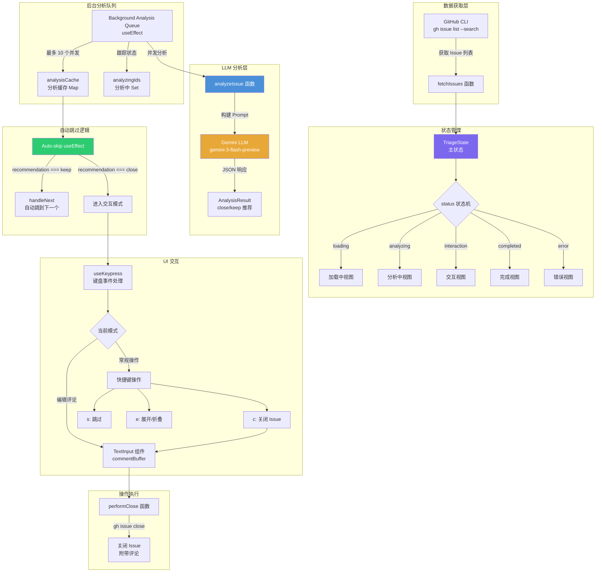

# TriageIssues.tsx

## 概述

`TriageIssues` 是一个 React 函数组件，用于在终端中提供 GitHub Issue 质量分诊的交互式工作流。该组件从 GitHub 仓库中拉取标记为 `status/need-triage` 的 Issue 列表（排除 Task、Workstream、Feature、Epic 类型和 workstream-rollup 标签），利用 Gemini LLM（`gemini-3-flash-preview` 模型）分析每个 Issue 是否应该被关闭。

与 `TriageDuplicates` 不同，该组件专注于 Issue 质量筛查——识别伪造、不可复现、滥用、乱码、超范围或非确定性模型输出相关的 Issue。对于 LLM 推荐 "keep" 的 Issue 会自动跳过，仅将推荐 "close" 的 Issue 呈现给用户进行人工确认。该组件还支持内联编辑关闭评论的功能。

## 架构图（Mermaid）

## 核心组件

### 接口定义

#### `Issue`
GitHub Issue 的基础数据结构：

| 字段 | 类型 | 说明 |
|------|------|------|
| `number` | `number` | Issue 编号 |
| `title` | `string` | Issue 标题 |
| `body` | `string` | Issue 正文内容 |
| `url` | `string` | Issue URL |
| `author` | `{ login: string }` | 作者信息 |
| `labels` | `Array<{ name: string }>` | 标签列表 |
| `comments` | `Array<{ body: string; author: { login: string } }>` | 评论列表 |
| `reactionGroups` | `Array<{ content: string; users: { totalCount: number } }>` | 表情反应分组 |

#### `AnalysisResult`
LLM 分析结果结构：

| 字段 | 类型 | 说明 |
|------|------|------|
| `recommendation` | `'close' \| 'keep'` | 推荐操作 |
| `reason` | `string` | 推荐原因 |
| `suggested_comment` | `string` | 建议的关闭评论 |

#### `ProcessedIssue`
已处理 Issue 的历史记录：

| 字段 | 类型 | 说明 |
|------|------|------|
| `number` | `number` | Issue 编号 |
| `title` | `string` | Issue 标题 |
| `action` | `'close' \| 'skip'` | 执行的操作 |

#### `TriageState`
组件主状态：

| 字段 | 类型 | 说明 |
|------|------|------|
| `status` | `'loading' \| 'analyzing' \| 'interaction' \| 'completed' \| 'error'` | 当前状态机阶段 |
| `message` | `string?` | 当前状态消息 |
| `issues` | `Issue[]` | 所有待分诊的 Issue 列表 |
| `currentIndex` | `number` | 当前正在处理的 Issue 索引 |
| `analysisCache` | `Map<number, AnalysisResult>` | 分析结果缓存 |
| `analyzingIds` | `Set<number>` | 正在分析中的 Issue 编号集合 |

### 常量配置

| 常量 | 值 | 说明 |
|------|-----|------|
| `VISIBLE_LINES_COLLAPSED` | 8 | Issue 正文折叠时可见行数 |
| `VISIBLE_LINES_EXPANDED` | 20 | Issue 正文展开时可见行数 |
| `MAX_CONCURRENT_ANALYSIS` | 10 | 最大并发分析任务数 |

### 辅助函数

#### `getReactionCount(issue)`
计算 Issue 的总表情反应数，遍历所有 `reactionGroups` 累加 `users.totalCount`。

### 主组件 Props

| 属性 | 类型 | 默认值 | 说明 |
|------|------|--------|------|
| `config` | `Config` | - | 应用配置对象，用于获取 LLM 客户端 |
| `onExit` | `() => void` | - | 退出分诊模式的回调函数 |
| `initialLimit` | `number` | `100` | 初始拉取的 Issue 数量上限 |
| `until` | `string?` | - | 日期过滤器，格式 `YYYY-MM-DD`，仅拉取该日期之前创建的 Issue |

### 核心业务逻辑

#### `fetchIssues(limit)`
通过 `gh issue list --search` 命令获取 Issue 列表。搜索条件：
- `is:issue` + `state:open`
- `label:status/need-triage`
- 排除类型：`-type:Task,Workstream,Feature,Epic`
- 排除标签：`-label:workstream-rollup`
- 可选日期过滤：`created:<=${until}`

#### `analyzeIssue(issue)`
核心分析函数，使用 `gemini-3-flash-preview` 模型（较轻量的模型，适合快速分类），执行以下流程：
1. 构建分析 Prompt，包含 Issue 的完整信息（正文截取前 8000 字符，评论截取前 2000 字符）
2. 明确定义关闭标准：伪造、不可复现、滥用、乱码、超范围、非确定性模型输出
3. 要求返回 JSON 格式的 `recommendation`（close/keep）、`reason` 和 `suggested_comment`
4. 对于"非确定性模型输出"的关闭原因，强制使用预定义的标准化评论文本

#### `performClose()`
执行关闭操作：
1. 从 `commentBuffer` 获取可能已编辑的评论文本
2. 调用 `gh issue close` 命令，附带评论和 `--reason not planned`
3. 记录到处理历史
4. 跳转到下一个 Issue

#### 自动跳过逻辑
当分析结果就绪时（`analysisCache` 中有数据），如果推荐为 `keep`，则自动调用 `handleNext()` 跳到下一个 Issue，用户不需要手动干预。只有推荐为 `close` 的 Issue 才会进入 `interaction` 状态展示给用户。

### 键盘交互

| 按键 | 上下文 | 操作 |
|------|--------|------|
| `h` | 非编辑模式 | 切换历史记录视图 |
| `Esc` / `q` | 非编辑模式 | 退出分诊 |
| `Esc` | 编辑评论模式 | 取消编辑 |
| `c` | 交互模式 | 进入评论编辑模式（准备关闭 Issue） |
| `s` | 交互模式 | 跳过当前 Issue |
| `e` | 交互模式 | 展开/折叠 Issue 正文 |
| `Up/Down` | 交互模式 | 滚动 Issue 正文 |
| `Enter` | 编辑评论模式 | 确认关闭（提交评论并关闭 Issue） |

### 渲染视图

组件根据状态渲染不同的视图：

1. **加载视图**（`status === 'loading'`）：旋转动画和加载消息
2. **历史记录视图**（`showHistory === true`）：双线黄色边框，列出所有已处理的 Issue 及其操作（close 为红色，skip 为灰色）
3. **完成视图**（`status === 'completed'`）：绿色粗体完成消息
4. **错误视图**（`status === 'error'`）：红色粗体错误消息
5. **分析中视图**（无 `currentIssue` 且 `status === 'analyzing'`）：旋转动画
6. **主交互视图**：
   - **顶部状态栏**：当前进度（如 "3/50"）、日期过滤提示、快捷键提示
   - **Issue 详情区域**：青色单线边框，显示编号、标题、作者、反应数、URL、可滚动正文
   - **Gemini 分析区域**：蓝色圆角边框，显示推荐（始终为 CLOSE，因为 keep 被自动跳过）和原因
   - **操作区域**：
     - 正常模式：显示操作列表（c/s/e）和建议评论
     - 编辑评论模式：品红色单线边框，内嵌 `TextInput` 组件，支持 Enter 确认和 Esc 取消

## 依赖关系

### 内部依赖

| 模块 | 导入内容 | 用途 |
|------|----------|------|
| `../../hooks/useKeypress.js` | `useKeypress` | 键盘事件监听 Hook |
| `../../key/keyMatchers.js` | `Command` | 键盘命令枚举 |
| `../../hooks/useKeyMatchers.js` | `useKeyMatchers` | 键盘命令匹配器 Hook |
| `../shared/TextInput.js` | `TextInput` | 文本输入组件，用于编辑关闭评论 |
| `../shared/text-buffer.js` | `useTextBuffer` | 文本缓冲区 Hook，管理评论文本的编辑状态 |

### 外部依赖

| 包名 | 导入内容 | 用途 |
|------|----------|------|
| `react` | `useState`, `useEffect`, `useCallback`, `useRef` | React Hooks |
| `ink` | `Box`, `Text` | Ink 终端 UI 组件 |
| `ink-spinner` | `Spinner` | 终端加载动画组件 |
| `@google/gemini-cli-core` | `debugLogger`, `spawnAsync`, `LlmRole`, `Config`（类型） | 核心工具库 |

## 关键实现细节

1. **自动跳过 "keep" 推荐**：这是该组件与 `TriageDuplicates` 最大的设计差异。通过 `useEffect` 监听 `analysisCache` 变化，当当前 Issue 的推荐为 "keep" 时自动跳到下一个。这意味着用户只需要处理需要关闭的 Issue，大大提高分诊效率。在大量 Issue 中，大部分是合法的，只有少数需要关闭，自动跳过设计显著减少了用户的交互负担。

2. **使用 `gemini-3-flash-preview` 模型**：与 `TriageDuplicates` 使用 `gemini-3-pro-preview` 不同，Issue 质量分诊使用更轻量的 Flash 模型。这是因为质量判断（是否为伪造/乱码/不可复现）相对简单，不需要 Pro 模型的深度推理能力，Flash 模型可以更快地完成分析。

3. **AbortController 生命周期管理**：使用 `useRef` 保存 `AbortController` 实例，并在组件卸载时（`useEffect` 的清理函数）调用 `abort()`，确保所有进行中的 LLM 请求在组件卸载时被取消，防止内存泄漏和状态更新错误。

4. **评论编辑功能**：通过 `useTextBuffer` Hook 管理评论文本的可编辑缓冲区，初始内容为 LLM 建议的评论。当分析结果变化且用户未处于编辑状态时，自动更新缓冲区内容。用户可以按 `c` 键进入编辑模式，修改评论后按 Enter 直接触发 `performClose`。

5. **非确定性输出的标准化评论**：LLM Prompt 中明确要求，当关闭原因为"非确定性模型输出"时，必须使用预定义的固定评论文本。这确保了此类常见关闭原因的回复一致性和专业性。

6. **搜索条件过滤**：使用 `gh issue list --search` 的高级搜索语法，同时过滤标签、类型和创建日期。排除 `Task`、`Workstream`、`Feature`、`Epic` 类型和 `workstream-rollup` 标签，确保只处理需要分诊的普通 Bug 报告和功能请求。

7. **后台并发分析队列**：与 `TriageDuplicates` 采用相同的并发分析策略（最多 10 个并发，向前预查看 30 个 Issue）。由于使用了更快的 Flash 模型，分析吞吐量更高。

8. **关闭原因**：使用 `--reason "not planned"` 作为关闭原因，这是 GitHub 提供的标准关闭原因之一，表示该 Issue 不在项目计划中。

9. **`until` 日期参数**：支持通过 `--until YYYY-MM-DD` 参数过滤只处理指定日期之前创建的 Issue，便于分批处理积压的分诊工作。当未提供 `until` 时，UI 会显示提示信息建议使用该参数。

10. **键盘输入隔离**：当处于评论编辑模式（`isEditingComment === true`）时，`useKeypress` 只处理 Esc 退出编辑，其他键盘输入全部交给 `TextInput` 组件处理，避免快捷键冲突。
