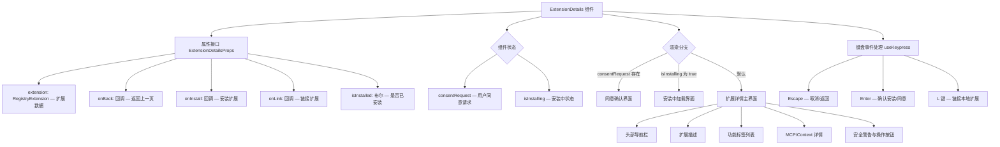

# ExtensionDetails.tsx

## 概述

`ExtensionDetails` 是一个 React (Ink) 组件，用于在终端 CLI 界面中展示单个扩展（Extension）的详情页面。它提供了扩展的完整信息展示、安装/链接操作、以及安装前的用户同意确认流程。该组件是扩展注册表（Extension Registry）浏览体验的核心子视图，当用户从扩展列表中选择某个扩展后进入此详情页。

## 架构图（Mermaid）



## 核心组件

### 1. ExtensionDetailsProps 接口

组件的属性接口定义，包含以下字段：

| 属性 | 类型 | 描述 |
|------|------|------|
| `extension` | `RegistryExtension` | 从扩展注册表获取的扩展完整数据对象 |
| `onBack` | `() => void` | 用户按 Escape 返回列表时的回调 |
| `onInstall` | `(requestConsentOverride) => void \| Promise<void>` | 安装扩展的回调，接收一个同意确认函数 |
| `onLink` | `(requestConsentOverride) => void \| Promise<void>` | 链接本地扩展的回调，接收一个同意确认函数 |
| `isInstalled` | `boolean` | 标识该扩展是否已经安装 |

### 2. 状态管理

组件内部维护两个状态：

- **`consentRequest`**: 类型为 `{ prompt: string; resolve: (value: boolean) => void } | null`。当安装或链接操作需要用户同意时，通过 Promise 模式暂停流程，等待用户在 UI 中确认或取消。这是一个巧妙的"阻塞式 UI 确认"模式。
- **`isInstalling`**: 布尔值，标识当前是否正在执行安装操作，用于防止重复触发和展示加载状态。

### 3. 可链接性判断 (`isLinkable`)

```typescript
const isLinkable =
  !extension.url.startsWith('http') &&
  !extension.url.startsWith('git@') &&
  !extension.url.startsWith('sso://');
```

当扩展 URL 不以 `http`、`git@` 或 `sso://` 开头时，认为该扩展是本地路径，可以使用"链接"（Link）模式安装而非远程克隆。

### 4. 键盘事件处理

通过 `useKeypress` Hook 注册全局键盘监听，优先级为最高（`priority: true`）：

- **同意确认模式下**：
  - `Escape` — 拒绝同意，取消安装，清除状态
  - `Enter` — 接受同意，继续安装流程
- **正常模式下**：
  - `Escape` — 调用 `onBack()` 返回列表
  - `Enter` — 触发安装流程（仅当未安装且未安装中时）
  - `L` 键 — 触发链接流程（仅当扩展可链接、未安装且未安装中时）

### 5. 渲染逻辑（三种视图状态）

#### 5.1 同意确认视图 (`consentRequest` 存在时)

以警告色边框包裹的确认弹窗，展示同意提示文本，底部提供 `[Esc] Cancel` 和 `[Enter] Accept` 操作提示。

#### 5.2 安装中视图 (`isInstalling` 为 true 时)

居中显示 "Installing {扩展名}..." 的加载提示。

#### 5.3 扩展详情主视图（默认状态）

布局从上到下依次为：

1. **头部导航栏**：显示面包屑路径 `> Extensions > {扩展名}`，右侧显示版本号、星标数、Google 所有标识 `[G]`、完整名称
2. **描述区域**：优先展示 `extensionDescription`，回退到 `repoDescription`
3. **功能标签列表**：以管道符分隔展示扩展支持的功能类型：
   - `MCP` — 主题色
   - `Context file` — 错误色（红色）
   - `Hooks` — 警告色（黄色）
   - `Skills` — 成功色（绿色）
   - `Commands` — 主题色
4. **MCP/Context 详情说明**：若扩展包含 MCP 服务器或 Context 文件，显示对应说明
5. **安全警告框**（未安装时）：以警告色边框展示第三方扩展安全提醒，底部提供 `[Enter] Install` 和可选的 `[L] Link` 操作
6. **已安装标识**（已安装时）：居中显示绿色 "Already Installed" 文本

## 依赖关系

### 内部依赖

| 模块 | 路径 | 用途 |
|------|------|------|
| `RegistryExtension` | `../../../config/extensionRegistryClient.js` | 扩展注册表数据类型定义 |
| `useKeypress` | `../../hooks/useKeypress.js` | 自定义键盘事件监听 Hook |
| `Command` | `../../key/keyMatchers.js` | 键盘命令枚举（ESCAPE、RETURN 等） |
| `useKeyMatchers` | `../../hooks/useKeyMatchers.js` | 获取按键匹配器的 Hook |
| `theme` | `../../semantic-colors.js` | 语义化主题色定义（含 text、border、status 等） |

### 外部依赖

| 包名 | 用途 |
|------|------|
| `react` | React 核心库（`useState`、类型定义） |
| `ink` | 终端 UI 渲染框架（`Box`、`Text` 组件） |

## 关键实现细节

### Promise 式同意确认机制

这是该组件最精妙的设计模式。`onInstall` 和 `onLink` 回调接收一个 `requestConsentOverride` 函数参数，该函数返回 `Promise<boolean>`。当外部调用方需要用户同意时：

1. 调用 `requestConsentOverride(prompt)` 传入提示文本
2. 组件内部创建一个 Promise，将其 `resolve` 函数和提示文本存入 `consentRequest` 状态
3. UI 切换到同意确认视图
4. 用户按 Enter 则 `resolve(true)` 继续流程，按 Escape 则 `resolve(false)` 中止流程

这种模式让异步的用户交互流程可以像同步代码一样被调用方串联使用，是一种经典的"命令式弹窗"实现方式。

### 防重复安装保护

通过 `isInstalling` 状态和 `isInstalled` 属性双重检查，确保用户不会在安装过程中重复触发安装，也不会对已安装的扩展重复安装。

### 功能标签的动态过滤

功能标签列表使用 `filter` + 类型守卫的方式动态过滤掉 `false` 值（即扩展不支持的功能），只展示扩展实际拥有的功能标签。每个功能标签使用不同的语义化颜色以便快速区分。

### 安全警告设计

对于未安装的第三方扩展，组件在底部固定展示安全警告文本，提醒用户扩展可能来自第三方开发者和公共仓库，Google 不对其功能或安全性做担保。这体现了 Gemini CLI 在扩展生态安全方面的审慎态度。
