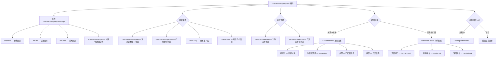

# ExtensionRegistryView.tsx

## 概述

`ExtensionRegistryView` 是 Gemini CLI 扩展注册表的主视图组件，提供了一个完整的扩展浏览、搜索、查看详情和安装的交互界面。它是扩展管理系统的入口页面，包含一个可搜索的扩展列表和一个扩展详情子视图，两者通过状态切换实现"列表 - 详情"的导航模式。该组件整合了扩展注册表数据获取、已安装扩展状态管理、扩展更新检测等多项功能。

## 架构图（Mermaid）



## 核心组件

### 1. ExtensionRegistryViewProps 接口

| 属性 | 类型 | 必填 | 描述 |
|------|------|------|------|
| `onSelect` | `(extension, requestConsentOverride?) => void \| Promise<void>` | 否 | 用户确认安装扩展时的回调 |
| `onLink` | `(extension, requestConsentOverride?) => void \| Promise<void>` | 否 | 用户确认链接本地扩展时的回调 |
| `onClose` | `() => void` | 否 | 关闭注册表视图的回调 |
| `extensionManager` | `ExtensionManager` | 是 | 扩展管理器实例，用于获取已安装扩展和管理扩展生命周期 |

### 2. ExtensionItem 内部接口

继承自 `GenericListItem`，额外包含 `extension: RegistryExtension` 字段，作为 `SearchableList` 的列表项数据类型。

```typescript
interface ExtensionItem extends GenericListItem {
  extension: RegistryExtension;
}
```

### 3. 数据获取与状态

#### 注册表数据 (`useExtensionRegistry`)
从配置中获取注册表 URI，初始化时加载全部扩展数据，返回 `extensions`、`loading`、`error` 和 `search` 函数。

#### 扩展更新状态 (`useExtensionUpdates`)
通过 `extensionManager` 检测已安装扩展的更新状态，返回 `extensionsUpdateState` 映射表（扩展名 -> `ExtensionUpdateState`）。

#### 已安装扩展 (`installedExtensions`)
通过 `useState` 初始化为 `extensionManager.getExtensions()`，在每次安装/链接完成后刷新。

### 4. 核心回调函数

#### `handleSelect(item: ExtensionItem)`
用户在列表中选中某个扩展时调用，将 `selectedExtension` 设为对应扩展对象，触发视图切换到详情页。

#### `handleBack()`
从详情页返回列表时调用，将 `selectedExtension` 置为 `null`。

#### `handleInstall(extension, requestConsentOverride?)`
安装扩展的完整流程：
1. 调用外部传入的 `onSelect` 回调执行实际安装
2. 刷新 `installedExtensions` 列表
3. 清除 `selectedExtension` 回到列表视图

#### `handleLink(extension, requestConsentOverride?)`
链接扩展的完整流程，与 `handleInstall` 类似但调用 `onLink` 回调。

### 5. 自定义列表项渲染 (`renderItem`)

每个列表项的渲染布局：

```
● 扩展名称 | [Installed] [Update available] 描述文本...    ⭐ 123
```

- 左侧选中指示器（`●` / 空白）
- 扩展名称（选中时加粗、绿色）
- 管道分隔符
- 可选的 `[Installed]` 标签（绿色）
- 可选的 `[Update available]` 标签（黄色）
- 描述文本（超长时截断）
- 右侧固定宽度的星标数

### 6. 动态高度计算 (`maxItemsToShow`)

根据终端高度动态计算可显示的列表项数量：

```
可用高度 = 终端高度 - 静态额外高度 - 布局开销(10行)
列表项数 = max(4, floor(可用高度 / 每项高度(2行)))
```

布局开销包括：标题(2行) + 搜索框(4行) + 头部(2行) + 底部(2行) = 10行。

### 7. 视图渲染逻辑

组件根据状态展示不同视图：

1. **加载中** (`loading` 为 true)：显示 "Loading extensions..." 提示
2. **错误** (`error` 存在)：显示红色错误标题和错误详情
3. **正常状态**：
   - **列表视图** (`selectedExtension` 为 null)：`SearchableList` 组件，当详情页打开时通过 `display: 'none'` 隐藏但保持 DOM 挂载
   - **详情视图** (`selectedExtension` 存在)：`ExtensionDetails` 组件

注意列表视图使用了 `display: 'none'` 而非条件渲染来隐藏，这样在返回列表时可以保持搜索状态和滚动位置不丢失。

## 依赖关系

### 内部依赖

| 模块 | 路径 | 用途 |
|------|------|------|
| `RegistryExtension` | `../../../config/extensionRegistryClient.js` | 注册表扩展数据类型 |
| `SearchableList` / `GenericListItem` | `../shared/SearchableList.js` | 可搜索列表通用组件和列表项接口 |
| `theme` | `../../semantic-colors.js` | 语义化主题色 |
| `useExtensionRegistry` | `../../hooks/useExtensionRegistry.js` | 扩展注册表数据获取 Hook |
| `ExtensionUpdateState` | `../../state/extensions.js` | 扩展更新状态枚举 |
| `useExtensionUpdates` | `../../hooks/useExtensionUpdates.js` | 扩展更新检测 Hook |
| `useConfig` | `../../contexts/ConfigContext.js` | 配置上下文 |
| `ExtensionManager` | `../../../config/extension-manager.js` | 扩展管理器类型 |
| `useRegistrySearch` | `../../hooks/useRegistrySearch.js` | 注册表搜索 Hook |
| `useUIState` | `../../contexts/UIStateContext.js` | UI 状态上下文（终端尺寸） |
| `ExtensionDetails` | `./ExtensionDetails.js` | 扩展详情子视图组件 |

### 外部依赖

| 包名 | 用途 |
|------|------|
| `react` | React 核心库（`useMemo`、`useCallback`、`useState`） |
| `ink` | 终端 UI 渲染框架（`Box`、`Text` 组件） |

## 关键实现细节

### 列表-详情导航模式

组件采用单页面内的状态切换实现列表到详情的导航，而非路由系统。`selectedExtension` 状态作为导航开关：
- `null` 时显示列表
- 有值时显示详情

列表视图使用 `display: 'none'` 隐藏而非卸载组件，这样返回列表时搜索关键词、滚动位置等状态得以保留，提供了更好的用户体验。

### 搜索集成

搜索功能通过两层实现：
1. `useExtensionRegistry` 提供 `search` 函数用于向注册表服务端发起搜索请求
2. `useRegistrySearch` Hook 传给 `SearchableList` 的 `useSearch` 属性，处理搜索的防抖、状态管理等客户端逻辑

`SearchableList` 的 `resetSelectionOnItemsChange={true}` 确保搜索结果变化时选中项重置到第一个。

### 安装后状态刷新

安装或链接扩展完成后，组件通过 `extensionManager.getExtensions()` 重新获取已安装扩展列表并更新 `installedExtensions` 状态。这确保列表项上的 `[Installed]` 标签能即时反映最新状态。

### 响应式布局

`maxItemsToShow` 通过 `useMemo` 依赖 `terminalHeight` 和 `staticExtraHeight` 动态计算，确保在不同终端窗口大小下都能合理利用可用空间，最少显示 4 个列表项。
