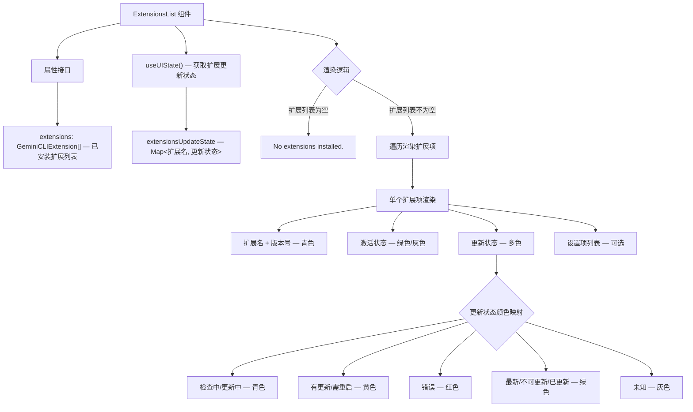

# ExtensionsList.tsx

## 概述

`ExtensionsList` 是一个 React (Ink) 函数组件，用于在终端界面中展示当前已安装的所有扩展列表。它是一个纯展示型组件，不包含交互逻辑，主要用于 `/extensions` 等命令的输出场景。组件会显示每个扩展的名称、版本、激活状态、更新状态，以及扩展的已解析设置项（settings）信息。

## 架构图（Mermaid）



## 核心组件

### 1. 组件属性接口

```typescript
interface ExtensionsList {
  extensions: readonly GeminiCLIExtension[];
}
```

| 属性 | 类型 | 描述 |
|------|------|------|
| `extensions` | `readonly GeminiCLIExtension[]` | 已安装扩展的只读数组，来自扩展管理器 |

### 2. 更新状态获取

通过 `useUIState()` Hook 获取 `extensionsUpdateState`，这是一个 `Map<string, ExtensionUpdateState>` 结构，键为扩展名，值为当前更新状态枚举值。

### 3. 空状态处理

当 `extensions.length === 0` 时，直接返回 "No extensions installed." 文本提示。

### 4. 扩展项渲染

每个扩展项包含以下信息：

#### 4.1 基本信息行

```
扩展名 (v版本号) - active/disabled (更新状态)
```

- **扩展名 + 版本号**：固定青色（`cyan`）
- **激活状态**：`active` 为绿色，`disabled` 为灰色
- **更新状态**：根据 `ExtensionUpdateState` 枚举值动态着色

#### 4.2 更新状态颜色映射

| 状态枚举值 | 颜色 | 含义 |
|-----------|------|------|
| `CHECKING_FOR_UPDATES` | 青色 (`cyan`) | 正在检查更新 |
| `UPDATING` | 青色 (`cyan`) | 正在更新 |
| `UPDATE_AVAILABLE` | 黄色 (`yellow`) | 有可用更新 |
| `UPDATED_NEEDS_RESTART` | 黄色 (`yellow`) | 已更新但需重启 |
| `ERROR` | 红色 (`red`) | 更新出错 |
| `UP_TO_DATE` | 绿色 (`green`) | 已是最新版 |
| `NOT_UPDATABLE` | 绿色 (`green`) | 不可更新（如本地链接） |
| `UPDATED` | 绿色 (`green`) | 已成功更新 |
| `undefined` | 灰色 (`gray`) | 状态未知，显示 "unknown state" |

对于未处理的枚举值，会通过 `debugLogger.warn` 输出警告日志。

#### 4.3 设置项列表（可选）

当扩展存在 `resolvedSettings` 且不为空时，在扩展名下方缩进展示设置项：

```
settings:
  - 设置名: 格式化后的值 (作用域 - 来源)
```

- 设置值通过 `getFormattedSettingValue(setting)` 进行格式化
- 作用域（scope）首字母大写展示，灰色显示
- 来源（source）如果存在则追加在作用域后面

## 依赖关系

### 内部依赖

| 模块 | 路径 | 用途 |
|------|------|------|
| `useUIState` | `../../contexts/UIStateContext.js` | 获取 UI 状态上下文中的扩展更新状态映射 |
| `ExtensionUpdateState` | `../../state/extensions.js` | 扩展更新状态枚举类型 |
| `GeminiCLIExtension` | `@google/gemini-cli-core` | 扩展数据类型定义 |
| `debugLogger` | `@google/gemini-cli-core` | 调试日志记录器 |
| `getFormattedSettingValue` | `../../../commands/extensions/utils.js` | 格式化扩展设置项的显示值 |

### 外部依赖

| 包名 | 用途 |
|------|------|
| `react` | React 核心库（类型定义 `React.FC`） |
| `ink` | 终端 UI 渲染框架（`Box`、`Text` 组件） |

## 关键实现细节

### 纯展示组件设计

与 `ExtensionRegistryView` 和 `ExtensionDetails` 不同，`ExtensionsList` 是一个纯展示组件，不包含任何交互逻辑（无键盘事件监听、无点击处理）。它仅负责将传入的扩展数据渲染为格式化的终端输出，适用于命令行输出场景。

### 使用 `React.FC` 范式

这是文件集中唯一使用 `React.FC` 范式定义的组件（`const ExtensionsList: React.FC<ExtensionsList> = ...`），其他组件使用了函数声明式定义。这是一个风格差异，可能由不同开发者或不同时期编写。

### 颜色直接使用字符串而非主题变量

与其他组件不同，此组件直接使用颜色字符串（如 `'cyan'`、`'green'`、`'grey'`、`'yellow'`、`'red'`）而非从 `theme` 对象获取语义化颜色。这可能是因为该组件较早编写（Copyright 2025 vs 其他组件的 2026），尚未迁移到统一的主题系统。

### `readonly` 修饰符

`extensions` 属性使用 `readonly GeminiCLIExtension[]` 类型，明确表示组件不会修改传入的扩展数组，体现了良好的不可变性设计。

### 设置项的格式化展示

扩展的 `resolvedSettings` 是扩展在运行时解析后的配置项，包含名称、值、作用域（scope，如 `global`/`project`）和来源（source）。通过 `getFormattedSettingValue` 工具函数对不同类型的设置值进行格式化，确保在终端中的可读性。
