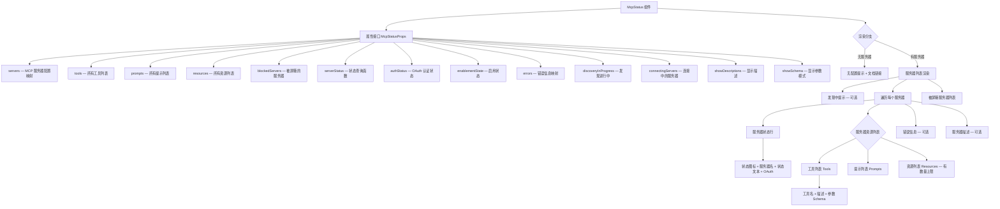

# McpStatus.tsx

## 概述

`McpStatus` 是一个 React (Ink) 函数组件，用于在终端界面中展示所有已配置 MCP（Model Context Protocol）服务器的状态信息。它是 `/mcp` 命令的核心渲染组件，提供了 MCP 服务器的连接状态、工具（Tools）、提示（Prompts）、资源（Resources）的详细列表，以及 OAuth 认证状态、错误信息、服务器启用/禁用状态等全面的诊断信息。该组件是 Gemini CLI 中 MCP 生态的"仪表盘"。

## 架构图（Mermaid）



## 核心组件

### 1. McpStatusProps 接口

| 属性 | 类型 | 描述 |
|------|------|------|
| `servers` | `Record<string, MCPServerConfig>` | 所有已配置 MCP 服务器的配置映射，键为服务器名 |
| `tools` | `JsonMcpTool[]` | 所有服务器提供的工具列表 |
| `prompts` | `JsonMcpPrompt[]` | 所有服务器提供的提示列表 |
| `resources` | `JsonMcpResource[]` | 所有服务器提供的资源列表 |
| `blockedServers` | `Array<{ name: string; extensionName: string }>` | 被用户屏蔽的服务器列表 |
| `serverStatus` | `(serverName: string) => MCPServerStatus` | 根据服务器名查询连接状态的函数 |
| `authStatus` | `HistoryItemMcpStatus['authStatus']` | 各服务器的 OAuth 认证状态映射 |
| `enablementState` | `HistoryItemMcpStatus['enablementState']` | 各服务器的启用/禁用状态映射 |
| `errors` | `Record<string, string>` | 各服务器的错误信息映射 |
| `discoveryInProgress` | `boolean` | 是否有服务器仍在发现/连接过程中 |
| `connectingServers` | `string[]` | 当前正在连接的服务器名称列表 |
| `showDescriptions` | `boolean` | 是否显示工具/提示/资源/服务器的详细描述 |
| `showSchema` | `boolean` | 是否显示工具的参数 JSON Schema |

### 2. 服务器过滤

首先从 `servers` 中过滤掉被屏蔽的服务器，得到 `serverNames` 列表。被屏蔽的服务器会在列表末尾单独展示。

### 3. 空状态处理

当没有任何配置的服务器且没有被屏蔽的服务器时，展示引导信息和 MCP 文档链接 (`https://goo.gle/gemini-cli-docs-mcp`)。

### 4. 发现进行中提示

当 `discoveryInProgress` 为 `true` 时，顶部显示黄色提示：
```
⏳ MCP servers are starting up (N initializing)...
Note: First startup may take longer. Tool availability will update automatically.
```

### 5. 服务器状态判断

#### 5.1 状态修正逻辑

当服务器原始状态为 `DISCONNECTED` 但仍有缓存的工具/提示/资源时，将其状态修正为 `CONNECTED`。这处理了断开连接但缓存仍可用的边缘情况。

#### 5.2 启用状态检查

优先检查服务器的 `enablementState`：
- 如果被禁用（`!enabled`），根据是否是会话级禁用显示 "Disabled (session)" 或 "Disabled"，使用暂停图标 `⏸️`

#### 5.3 连接状态映射

| 状态 | 图标 | 文本 | 颜色 |
|------|------|------|------|
| `CONNECTED` | `🟢` | Ready | 绿色（success） |
| `CONNECTING` | `🔄` | Starting... (first startup may take longer) | 黄色（warning） |
| `DISCONNECTED` | `🔴` | Disconnected | 红色（error） |

### 6. 服务器显示名称

如果服务器来自某个扩展（`server.extension?.name` 存在），则在服务器名后追加 `(from 扩展名)`。

### 7. 资源统计

对每个服务器的工具、提示、资源数量进行统计，在状态行中以 `(N tools, M prompts, K resources)` 格式展示，仅在服务器已连接且有资源时显示。单复数自动处理。

### 8. OAuth 认证状态

| 状态值 | 显示 | 颜色 |
|--------|------|------|
| `authenticated` | (OAuth) | 默认色 |
| `expired` | (OAuth expired) | 红色（error） |
| `unauthenticated` | (OAuth not authenticated) | 黄色（warning） |

### 9. 工具列表渲染

每个工具项展示：
- 工具名称（主色）
- 描述（仅在 `showDescriptions` 启用时，灰色）
- 参数 JSON Schema（仅在 `showSchema` 启用时，格式化为 2 空格缩进的 JSON，优先使用 `parametersJsonSchema`，回退到 `parameters`）

### 10. 提示列表渲染

每个提示项展示：
- 提示名称（主色）
- 描述（仅在 `showDescriptions` 启用时）

### 11. 资源列表渲染

资源列表有数量上限，由 `MAX_MCP_RESOURCES_TO_SHOW` 常量控制：
- 每个资源项展示：名称（或 URI，或 "resource"）、URI、MIME 类型
- 描述（仅在 `showDescriptions` 启用时）
- 超过上限的资源显示 `... N resources hidden` 提示

### 12. 被屏蔽服务器渲染

在所有正常服务器之后，单独渲染被屏蔽的服务器，显示红色圆点和 "Blocked" 状态文本，附带来源扩展名（如果有）。

## 依赖关系

### 内部依赖

| 模块 | 路径 | 用途 |
|------|------|------|
| `MCPServerStatus` / `MCPServerConfig` | `@google/gemini-cli-core` | MCP 服务器状态枚举和配置类型 |
| `MAX_MCP_RESOURCES_TO_SHOW` | `../../constants.js` | 资源展示数量上限常量 |
| `theme` | `../../semantic-colors.js` | 语义化主题色 |
| `HistoryItemMcpStatus` / `JsonMcpTool` / `JsonMcpPrompt` / `JsonMcpResource` | `../../types.js` | MCP 相关数据类型定义 |

### 外部依赖

| 包名 | 用途 |
|------|------|
| `react` | React 核心库（类型定义） |
| `ink` | 终端 UI 渲染框架（`Box`、`Text` 组件） |

## 关键实现细节

### 断开连接但有缓存的状态修正

```typescript
const status =
  originalStatus === MCPServerStatus.DISCONNECTED && hasCachedItems
    ? MCPServerStatus.CONNECTED
    : originalStatus;
```

这是一个重要的状态修正逻辑：当服务器实际已断开连接，但本地缓存中仍有其工具/提示/资源数据时，将状态视为"已连接"。这可能是为了处理 MCP 服务器按需连接（lazy connection）的场景——服务器可能在空闲时断开，但其元数据仍然可用。

### 资源展示数量限制

资源列表通过 `slice(0, MAX_MCP_RESOURCES_TO_SHOW)` 进行截断，避免某些服务器提供大量资源时撑爆终端输出。超出部分用 "... N resources hidden" 提示用户存在隐藏内容。

### 层次化的信息展示

组件通过 `showDescriptions` 和 `showSchema` 两个布尔参数控制信息的详细程度：
- 基础模式：仅显示名称和状态
- 描述模式（`showDescriptions`）：额外显示工具/提示/资源/服务器描述
- Schema 模式（`showSchema`）：额外显示工具的参数 JSON Schema

这种分层设计让用户可以根据需要选择信息粒度，避免信息过载。

### 错误信息内联展示

每个服务器如果存在错误信息，会在该服务器块内缩进展示红色错误文本，不会中断整个列表的渲染。这确保了即使某个服务器出错，用户仍能看到其他服务器的状态。

### 纯展示组件

与 `ExtensionsList` 类似，`McpStatus` 也是纯展示组件，不包含任何交互逻辑。所有数据通过 props 传入，组件仅负责格式化输出。这使得它易于测试和复用。
