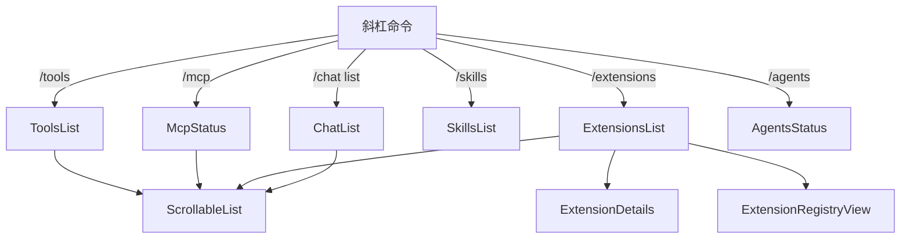

# views

## 概述

`views` 目录包含信息展示视图组件，用于渲染扩展列表、工具列表、MCP 服务器状态、技能列表、Agent 状态、聊天历史列表等信息面板。这些视图通常由斜杠命令（如 `/tools`、`/mcp`、`/extensions`）触发显示。

## 目录结构

```
views/
├── AgentsStatus.tsx           # Agent 代理状态展示
├── ChatList.tsx               # 聊天历史会话列表
├── ExtensionDetails.tsx       # 扩展详情视图
├── ExtensionRegistryView.tsx  # 扩展注册表浏览视图
├── ExtensionsList.tsx         # 已安装扩展列表
├── McpStatus.tsx              # MCP 服务器状态展示
├── SkillsList.tsx             # 可用技能列表
├── ToolsList.tsx              # 可用工具列表
└── __snapshots__/             # 测试快照
```

## 架构图



## 核心组件

| 组件 | 职责 |
|------|------|
| `ToolsList` | 列出所有可用工具及其描述 |
| `McpStatus` | 展示 MCP 服务器连接状态、已注册工具/提示/资源 |
| `ExtensionsList` | 展示已安装的 Gemini CLI 扩展 |
| `ExtensionDetails` | 单个扩展的详细信息（版本、工具、主题等） |
| `ExtensionRegistryView` | 扩展注册表浏览和安装 |
| `SkillsList` | 展示可用的 AI 技能（Skills） |
| `AgentsStatus` | 展示可用的 Agent 代理信息 |
| `ChatList` | 展示保存的聊天会话列表 |

## 依赖关系

### 内部依赖
- `../shared/`: ScrollableList、Scrollable 等布局组件
- `../../contexts/`: UIStateContext、ConfigContext
- `../../types.ts`: HistoryItem 类型定义

### 外部依赖
- `ink`: Box、Text

## 数据流

1. 用户输入斜杠命令（如 `/tools`）
2. `slashCommandProcessor` 处理命令，生成对应的 `HistoryItem`（如 `tools_list`）
3. `HistoryItemDisplay` 根据类型分派到对应的 views 组件
4. 组件从 `HistoryItem` 中读取数据并渲染列表
