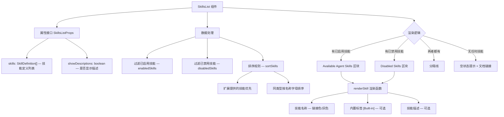

# SkillsList.tsx

## 概述

`SkillsList` 是一个 React (Ink) 函数组件，用于在终端界面中展示 Gemini CLI 所有可用的 Agent 技能（Skills）列表。它将技能分为"已启用"和"已禁用"两组分别展示，每组内部按来源（扩展提供 vs 内置）和名称排序。该组件是 `/skills` 命令的核心渲染组件，提供了清晰的技能概览和文档引导。

## 架构图（Mermaid）



## 核心组件

### 1. SkillsListProps 接口

| 属性 | 类型 | 描述 |
|------|------|------|
| `skills` | `readonly SkillDefinition[]` | 所有技能定义的只读数组 |
| `showDescriptions` | `boolean` | 是否显示每个技能的详细描述文本 |

### 2. 排序规则 (`sortSkills`)

```typescript
const sortSkills = (a: SkillDefinition, b: SkillDefinition) => {
  if (a.isBuiltin === b.isBuiltin) {
    return a.name.localeCompare(b.name);
  }
  return a.isBuiltin ? 1 : -1;
};
```

排序逻辑分两级：
1. **第一级**：扩展提供的技能（`isBuiltin: false`）排在内置技能（`isBuiltin: true`）之前
2. **第二级**：同类型技能按名称字母顺序排列（使用 `localeCompare` 支持多语言排序）

### 3. 数据分组

- **`enabledSkills`**：过滤 `disabled` 为 `false`/`undefined` 的技能，排序后展示
- **`disabledSkills`**：过滤 `disabled` 为 `true` 的技能，排序后展示

### 4. 单个技能渲染 (`renderSkill`)

每个技能项的布局：

```
  - 技能名称 [Built-in]
      技能描述文本（可选）
```

- **技能名称**：加粗显示。启用时使用链接色（`theme.text.link`），禁用时使用次要色（`theme.text.secondary`）
- **内置标签**：若技能为内置（`isBuiltin: true`），在名称后追加灰色 `[Built-in]` 标签
- **描述文本**：仅在 `showDescriptions` 为 `true` 且技能有描述时展示，缩进 2 格。启用技能用主色，禁用技能用次要色

### 5. 整体布局

组件的渲染分为三个可选区块：

#### 5.1 已启用技能区块
标题为粗体主色 "Available Agent Skills:"，后跟一个空行，然后是已启用技能列表。

#### 5.2 分隔线
当同时存在已启用和已禁用技能时，在两个区块之间显示 20 个短横线的灰色分隔线。

#### 5.3 已禁用技能区块
标题为粗体灰色 "Disabled Skills:"，后跟一个空行，然后是已禁用技能列表。

#### 5.4 空状态
当技能数组为空时，显示 "No skills available." 和技能文档链接（`SKILLS_DOCS_URL`），引导用户了解如何添加技能。

## 依赖关系

### 内部依赖

| 模块 | 路径 | 用途 |
|------|------|------|
| `theme` | `../../semantic-colors.js` | 语义化主题色定义 |
| `SkillDefinition` | `../../types.js` | 技能定义数据类型 |
| `SKILLS_DOCS_URL` | `../../constants.js` | 技能文档 URL 常量 |

### 外部依赖

| 包名 | 用途 |
|------|------|
| `react` | React 核心库（类型定义 `React.FC`） |
| `ink` | 终端 UI 渲染框架（`Box`、`Text` 组件） |

## 关键实现细节

### 扩展技能优先展示

排序逻辑中，扩展提供的技能（`isBuiltin: false`）排在内置技能之前。这是一个有意义的设计决策——用户自行安装的扩展技能通常是他们更关心的内容，将其放在前面可以提高可见性。

### 启用/禁用分组展示

组件不是简单地在技能名旁标注状态，而是将启用和禁用技能完全分成两个区块，用分隔线隔开。这种分组设计让用户可以快速区分哪些技能当前可用、哪些被禁用，比混合列表更清晰。

### 颜色语义化

- 启用的技能名使用 `theme.text.link`（链接色），暗示这些是可调用的"指令"
- 禁用的技能名和描述统一使用 `theme.text.secondary`（次要色），视觉上"淡化"以区分于可用技能
- 内置标签 `[Built-in]` 使用灰色，不过分突出但提供必要信息

### 纯展示组件

与 `ExtensionsList` 和 `McpStatus` 一样，`SkillsList` 是纯展示组件，不包含任何交互逻辑。所有数据通过 props 传入，适合在命令输出场景中使用。

### 空状态引导

空状态不仅告知用户"没有技能"，还提供文档链接引导用户了解如何添加技能，降低了新用户的学习门槛。
