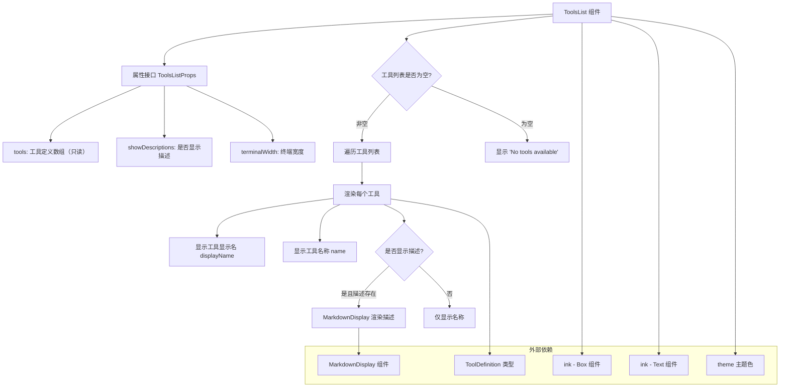

# ToolsList.tsx

## 概述

`ToolsList.tsx` 是 Gemini CLI 项目中的一个 React 函数组件，用于在终端 (CLI) 界面中展示当前可用的工具列表。该组件基于 [Ink](https://github.com/vadimdemedes/ink) 框架构建，Ink 是一个用 React 构建命令行界面的库。组件接收工具定义数组，并以格式化列表的形式渲染每个工具的名称、显示名称及可选的描述信息。当没有可用工具时，会显示"No tools available"的提示。

该文件位于 `packages/cli/src/ui/components/views/` 目录下，属于 CLI 应用的视图层组件。

## 架构图（Mermaid）

## 核心组件

### ToolsListProps 接口

组件的属性类型定义，包含三个字段：

| 属性 | 类型 | 说明 |
|------|------|------|
| `tools` | `readonly ToolDefinition[]` | 工具定义的只读数组，每个元素包含工具的名称、显示名称、描述等信息 |
| `showDescriptions` | `boolean` | 控制是否展示每个工具的描述文本 |
| `terminalWidth` | `number` | 终端宽度（像素/字符列数），传递给 MarkdownDisplay 用于自适应排版 |

### ToolsList 函数组件

`ToolsList` 是一个无状态的 React 函数组件（`React.FC<ToolsListProps>`），采用箭头函数 + 解构参数的写法。核心逻辑如下：

1. **外层容器**：使用 `<Box flexDirection="column" marginBottom={1}>` 作为根容器，垂直方向排列子元素，底部留 1 行边距。
2. **标题**：渲染加粗的 "Available Gemini CLI tools:" 文本，使用主题主文本色（`theme.text.primary`）。
3. **空行间隔**：通过 `<Box height={1} />` 在标题与列表之间插入一行空白。
4. **条件渲染**：
   - 当 `tools.length > 0` 时，使用 `tools.map()` 遍历每个工具，渲染工具卡片。
   - 当工具列表为空时，显示 " No tools available" 提示。
5. **工具卡片**：每个工具渲染为水平 `<Box>`，包含：
   - 列表前缀 `  - `（两个空格 + 短横线）
   - 垂直布局的名称区域：加粗的显示名称和工具名称（使用主题强调色 `theme.text.accent`）
   - 当 `showDescriptions` 为 true 且工具存在描述时，通过 `MarkdownDisplay` 组件渲染 Markdown 格式的描述文本。

## 依赖关系

### 内部依赖

| 模块路径 | 导入内容 | 用途 |
|----------|----------|------|
| `../../semantic-colors.js` | `theme` | 语义化颜色主题对象，提供 `text.primary` 和 `text.accent` 等颜色值 |
| `../../types.js` | `ToolDefinition`（类型导入） | 工具定义的 TypeScript 类型接口，描述工具的数据结构（name, displayName, description 等字段） |
| `../../utils/MarkdownDisplay.js` | `MarkdownDisplay` | Markdown 文本渲染组件，用于在终端中格式化展示工具的描述文本 |

### 外部依赖

| 包名 | 导入内容 | 用途 |
|------|----------|------|
| `react` | `React`（类型导入） | React 类型系统，用于 `React.FC` 类型注解 |
| `ink` | `Box`, `Text` | Ink 框架的布局和文本组件，用于构建终端 UI |

## 关键实现细节

1. **只读数组约束**：`tools` 参数使用 `readonly ToolDefinition[]` 类型，确保组件内部不会意外修改传入的工具列表，体现了不可变数据的设计理念。

2. **纯函数式组件**：整个组件没有使用任何 Hook（如 `useState`、`useEffect`），是一个纯粹的展示型组件，输出完全由输入 props 决定，便于测试和复用。

3. **条件渲染策略**：描述信息的展示受两个条件控制——`showDescriptions` 布尔标志和 `tool.description` 是否存在（truthy 检查）。这意味着即使开启了描述显示开关，没有描述内容的工具也不会渲染多余的空白区域。

4. **主题化设计**：所有颜色值均通过 `theme` 对象引用，未硬编码任何具体颜色值，支持全局主题切换。

5. **Markdown 描述渲染**：工具描述通过 `MarkdownDisplay` 组件渲染，而不是简单的 `<Text>` 组件，这意味着工具描述支持 Markdown 格式（如加粗、链接、代码块等），提供了更丰富的展示效果。`isPending={false}` 参数表示描述内容已加载完成，非等待状态。

6. **Key 属性**：在 `tools.map()` 遍历时使用 `tool.name` 作为 React key，假定每个工具名称是唯一的标识符。

7. **布局结构**：整体采用垂直（column）布局，每个工具项内部采用水平（row）布局，前缀符号与内容分离，内容区域再嵌套垂直布局以容纳名称和描述两行信息，形成清晰的视觉层次。
