# constants.ts

## 概述

`constants.ts` 是 Gemini CLI 项目中 UI 层的核心常量定义文件，位于 `packages/cli/src/ui/` 目录下。该文件集中管理了 CLI 界面所需的各类配置常量，包括 Shell 相关命名、消息行数限制、工具状态符号、延迟时间配置、UI 透明度参数、外部链接地址、显示行数限制以及上下文压缩阈值等。

所有常量均通过 `export` 导出，供 UI 层的各个组件和模块引用，是 UI 系统配置的"单一数据源"（Single Source of Truth）。

## 架构图（Mermaid）

```mermaid
graph TD
    A[constants.ts 常量定义文件] --> B[Shell 相关常量]
    A --> C[消息与显示限制]
    A --> D[工具状态符号 TOOL_STATUS]
    A --> E[时间延迟常量]
    A --> F[UI 透明度常量]
    A --> G[外部链接 URL]
    A --> H[上下文压缩配置]

    B --> B1["SHELL_COMMAND_NAME = 'Shell Command'"]
    B --> B2["SHELL_NAME = 'Shell'"]

    C --> C1["MAX_GEMINI_MESSAGE_LINES = 65536"]
    C --> C2["MAX_MCP_RESOURCES_TO_SHOW = 10"]
    C --> C3["ACTIVE_SHELL_MAX_LINES = 15"]
    C --> C4["COMPLETED_SHELL_MAX_LINES = 15"]
    C --> C5["SUBAGENT_MAX_LINES = 15"]
    C --> C6["LRU_BUFFER_PERF_CACHE_LIMIT = 20000"]

    D --> D1["SUCCESS = '✓'"]
    D --> D2["PENDING = 'o'"]
    D --> D3["EXECUTING = '⊷'"]
    D --> D4["CONFIRMING = '?'"]
    D --> D5["CANCELED = '-'"]
    D --> D6["ERROR = 'x'"]

    E --> E1["SHELL_FOCUS_HINT_DELAY_MS = 5000"]
    E --> E2["WARNING_PROMPT_DURATION_MS = 3000"]
    E --> E3["QUEUE_ERROR_DISPLAY_DURATION_MS = 3000"]
    E --> E4["SHELL_ACTION_REQUIRED_TITLE_DELAY_MS = 30000"]
    E --> E5["SHELL_SILENT_WORKING_TITLE_DELAY_MS = 120000"]
    E --> E6["EXPAND_HINT_DURATION_MS = 5000"]

    F --> F1["DEFAULT_BACKGROUND_OPACITY = 0.16"]
    F --> F2["DEFAULT_INPUT_BACKGROUND_OPACITY = 0.24"]
    F --> F3["DEFAULT_SELECTION_OPACITY = 0.2"]
    F --> F4["DEFAULT_BORDER_OPACITY = 0.4"]

    G --> G1["KEYBOARD_SHORTCUTS_URL"]
    G --> G2["SKILLS_DOCS_URL"]

    H --> H1["MIN_TERMINAL_WIDTH_FOR_FULL_LABEL = 100"]
    H --> H2["DEFAULT_COMPRESSION_THRESHOLD = 0.5"]
```

## 核心组件

### Shell 相关常量

| 常量名 | 值 | 说明 |
|--------|-----|------|
| `SHELL_COMMAND_NAME` | `'Shell Command'` | Shell 命令的显示名称，用于 UI 中展示 Shell 命令类工具 |
| `SHELL_NAME` | `'Shell'` | Shell 的简短名称标识 |

### 消息与显示行数限制

| 常量名 | 值 | 说明 |
|--------|-----|------|
| `MAX_GEMINI_MESSAGE_LINES` | `65536` | Gemini 消息的最大行数限制。这是一个防护性限制，用于缓解极端情况下巨大响应导致的性能问题。该阈值设置得足够高，不会影响正常使用 |
| `MAX_MCP_RESOURCES_TO_SHOW` | `10` | 每个 MCP 服务器最多显示的资源数量，超出部分将被截断 |
| `ACTIVE_SHELL_MAX_LINES` | `15` | 活动 Shell 输出在未聚焦时显示的最大行数 |
| `COMPLETED_SHELL_MAX_LINES` | `15` | 已完成的 Shell 命令在历史记录中保留的最大行数 |
| `SUBAGENT_MAX_LINES` | `15` | 子代理（Subagent）结果在折叠前显示的最大行数 |
| `LRU_BUFFER_PERF_CACHE_LIMIT` | `20000` | LRU 缓冲区性能缓存的最大条目数 |

### 工具状态符号 (TOOL_STATUS)

`TOOL_STATUS` 是一个 `as const` 不可变对象，定义了工具消息组件（ToolMessage）中使用的各种状态符号：

| 状态 | 符号 | 含义 |
|------|------|------|
| `SUCCESS` | `✓` | 工具执行成功 |
| `PENDING` | `o` | 工具等待执行 |
| `EXECUTING` | `⊷` | 工具正在执行中 |
| `CONFIRMING` | `?` | 工具等待用户确认 |
| `CANCELED` | `-` | 工具执行已取消 |
| `ERROR` | `x` | 工具执行出错 |

### 时间延迟常量（毫秒）

| 常量名 | 值 | 说明 |
|--------|-----|------|
| `SHELL_FOCUS_HINT_DELAY_MS` | `5000`（5秒） | Shell 聚焦提示的延迟时间 |
| `WARNING_PROMPT_DURATION_MS` | `3000`（3秒） | 警告提示的显示持续时间 |
| `QUEUE_ERROR_DISPLAY_DURATION_MS` | `3000`（3秒） | 队列错误信息的显示持续时间 |
| `SHELL_ACTION_REQUIRED_TITLE_DELAY_MS` | `30000`（30秒） | Shell 需要操作的标题延迟时间 |
| `SHELL_SILENT_WORKING_TITLE_DELAY_MS` | `120000`（2分钟） | Shell 静默工作状态标题的延迟时间 |
| `EXPAND_HINT_DURATION_MS` | `5000`（5秒） | 展开提示的显示持续时间 |

### UI 透明度常量

| 常量名 | 值 | 说明 |
|--------|-----|------|
| `DEFAULT_BACKGROUND_OPACITY` | `0.16` | 默认背景透明度 |
| `DEFAULT_INPUT_BACKGROUND_OPACITY` | `0.24` | 默认输入区域背景透明度 |
| `DEFAULT_SELECTION_OPACITY` | `0.2` | 默认选中状态透明度 |
| `DEFAULT_BORDER_OPACITY` | `0.4` | 默认边框透明度 |

### 外部链接 URL

| 常量名 | 值 | 说明 |
|--------|-----|------|
| `KEYBOARD_SHORTCUTS_URL` | `https://geminicli.com/docs/cli/keyboard-shortcuts/` | 键盘快捷键文档地址 |
| `SKILLS_DOCS_URL` | `https://github.com/google-gemini/gemini-cli/blob/main/docs/cli/skills.md` | Skills 功能设置与配置的文档地址 |

### 上下文压缩配置

| 常量名 | 值 | 说明 |
|--------|-----|------|
| `MIN_TERMINAL_WIDTH_FOR_FULL_LABEL` | `100` | 显示完整上下文使用标签所需的最小终端宽度（字符列数） |
| `DEFAULT_COMPRESSION_THRESHOLD` | `0.5` | 默认的上下文压缩触发阈值（50%），当上下文使用量达到此比例时触发压缩 |

## 依赖关系

### 内部依赖

无。该文件是纯常量定义文件，不依赖项目内其他模块。

### 外部依赖

无。该文件不依赖任何外部 npm 包，仅使用 TypeScript 原生语法（`as const` 断言等）。

## 关键实现细节

1. **`as const` 断言**：`TOOL_STATUS` 对象使用了 TypeScript 的 `as const` 断言，使其所有属性变为字面量类型（literal type）和只读属性。这意味着 `TOOL_STATUS.SUCCESS` 的类型是 `'✓'` 而非 `string`，提供了更精确的类型推断，同时防止运行时被意外修改。

2. **防护性限制设计**：`MAX_GEMINI_MESSAGE_LINES` 设为 65536（2^16），是一个防护性极限值。注释明确说明这是为了缓解"极端情况下收到巨大响应"的性能问题，而非日常使用的限制。

3. **一致的显示行数**：`ACTIVE_SHELL_MAX_LINES`、`COMPLETED_SHELL_MAX_LINES` 和 `SUBAGENT_MAX_LINES` 统一设为 15 行，确保 UI 中不同类型的输出区域有一致的视觉高度。

4. **时间常量命名规范**：所有时间相关常量统一使用 `_MS` 后缀，明确表示单位为毫秒，避免单位混淆。

5. **分层透明度设计**：四个透明度常量形成了递增的层次关系（0.16 < 0.2 < 0.24 < 0.4），背景最透明，边框最不透明，构建出合理的视觉层次感。

6. **纯导出模块**：该文件不包含任何函数逻辑或类定义，完全由 `export const` 语句组成，是典型的配置常量模块，易于维护和查找。
