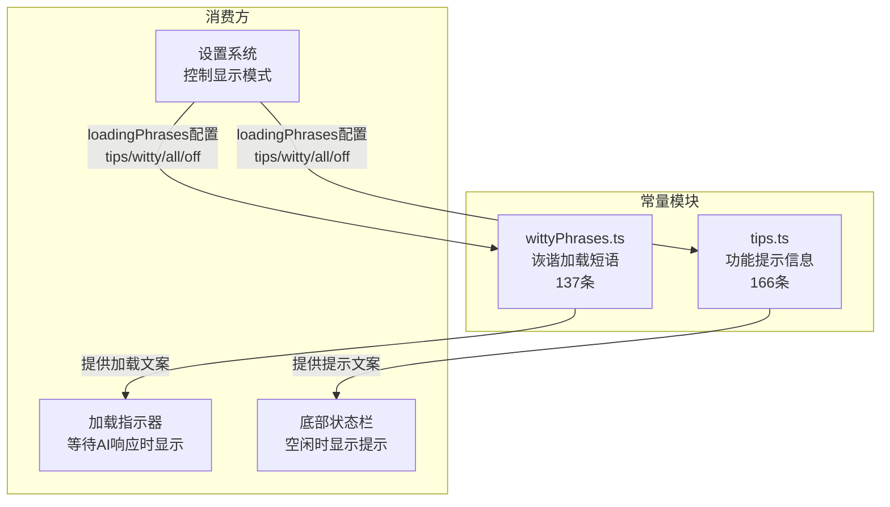
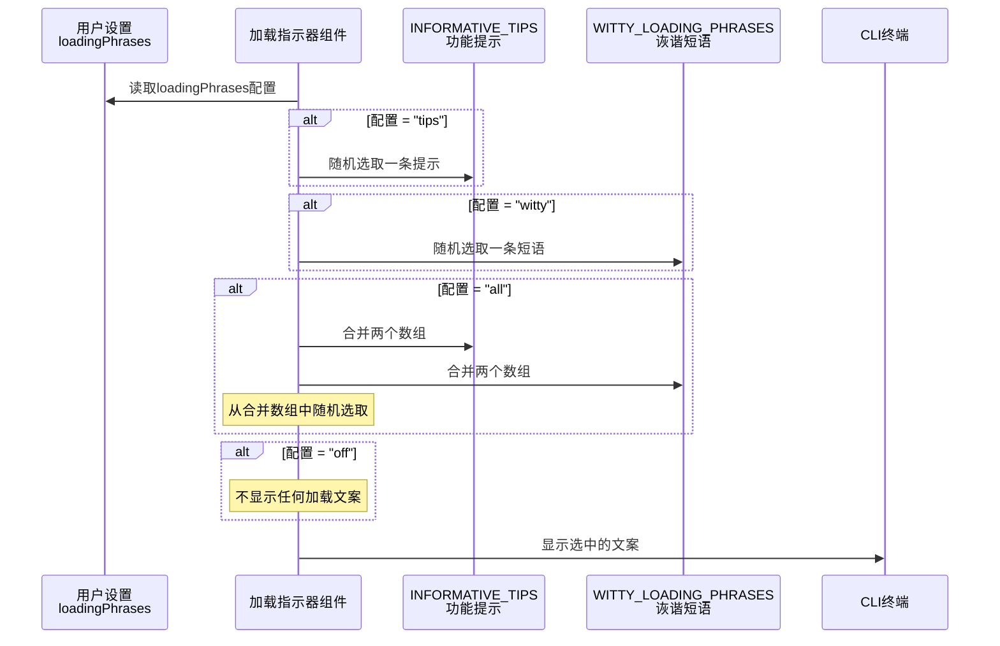

# constants - UI 常量模块

## 概述

`constants` 目录存放 Gemini CLI 用户界面使用的静态常量数据。目前包含两个核心文件：提示信息集合和诙谐加载短语集合。这些常量用于在 CLI 等待加载或空闲时向用户展示有用的操作提示或轻松幽默的文案，提升用户体验。

## 目录结构

```
constants/
├── tips.ts             # 功能提示信息集合（INFORMATIVE_TIPS）
└── wittyPhrases.ts     # 诙谐加载短语集合（WITTY_LOADING_PHRASES）
```

## 架构图



## 核心组件

### tips.ts - 功能提示信息集合

导出 `INFORMATIVE_TIPS` 常量数组，包含约 166 条操作提示字符串，按类别组织为三大分组：

**设置相关提示（约 82 条）：**
涵盖所有可通过 `/settings` 命令或 `settings.json` 文件配置的功能，例如：
- 编辑器配置、Vim 模式、自动更新
- 主题定制、UI 元素显示/隐藏
- 模型选择、上下文管理、会话压缩
- 沙箱安全、工具权限控制
- MCP 服务器配置
- 认证与安全策略
- 遥测与调试选项
- 实验性功能开关

**键盘快捷键提示（约 38 条）：**
覆盖所有键盘操作，包括：
- 基本操作：Esc 关闭、Ctrl+C 取消、Ctrl+D 退出
- 编辑操作：光标移动、删除、撤销/重做
- 模式切换：YOLO 模式（Ctrl+Y）、Vim 模式、Shell 模式
- 历史导航：上下箭头、Ctrl+R 搜索
- 特殊功能：Ctrl+O 查看完整响应、F12 调试控制台

**命令提示（约 46 条）：**
介绍所有斜杠命令用法，包括：
- 会话管理：`/resume`、`/compress`、`/clear`、`/restore`
- 配置管理：`/auth`、`/model`、`/theme`、`/editor`、`/settings`
- 开发工具：`/mcp`、`/tools`、`/extensions`
- 信息查看：`/help`、`/about`、`/stats`、`/docs`、`/privacy`

### wittyPhrases.ts - 诙谐加载短语集合

导出 `WITTY_LOADING_PHRASES` 常量数组，包含约 137 条幽默加载短语，在 AI 处理请求期间随机展示。主题涵盖：

- **极客幽默**："Reticulating splines"、"Trying to exit Vim"、"Rewriting in Rust for no particular reason"
- **流行文化**："Don't panic"（银河系漫游指南）、"Engage."（星际迷航）、"Constructing additional pylons"（星际争霸）
- **程序员梗**："Converting coffee into code"、"Resolving dependencies... and existential crises"
- **自嘲调侃**："Almost there... probably"、"Our hamsters are working as fast as they can"
- **冷笑话**："What do you call a fish with no eyes? A fsh"

## 依赖关系

| 依赖 | 用途 |
|------|------|
| 无外部依赖 | 纯静态数据文件，不导入任何模块 |

被以下模块消费：
| 消费方 | 用途 |
|--------|------|
| UI 加载组件 | 在等待 AI 响应时随机选取短语显示 |
| 设置系统 | 通过 `loadingPhrases` 配置项控制显示 `tips`、`witty`、`all` 或 `off` |

## 数据流


