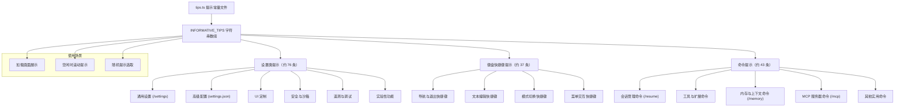

# tips.ts

## 概述

`tips.ts` 是 Gemini CLI 项目中的提示信息常量文件，位于 `packages/cli/src/ui/constants/` 目录下。该文件定义并导出了一个名为 `INFORMATIVE_TIPS` 的字符串数组常量，包含了大量面向用户的实用提示信息。这些提示会在 CLI 的加载画面或空闲时展示，帮助用户了解各种功能、快捷键和命令。

整个提示列表包含约 160 条提示，按类别分为三大板块：设置相关提示、键盘快捷键提示和命令提示。

## 架构图（Mermaid）

## 核心组件

### INFORMATIVE_TIPS 常量

`INFORMATIVE_TIPS` 是一个 `string[]` 类型的导出常量数组，包含面向用户的功能提示文本。数组通过注释分为三个逻辑区块：

#### 1. 设置类提示（Settings Tips）

约占提示总数的一半，涵盖了 Gemini CLI 几乎所有可配置的设置项。每条提示末尾会标注配置方式：

- **`(/settings)` 标注**：表示可以通过交互式 `/settings` 命令直接修改的设置
- **`(settings.json)` 标注**：表示需要手动编辑 `settings.json` 配置文件的高级设置

设置类提示涵盖的主题包括：

| 类别 | 示例提示 |
|------|----------|
| 编辑器偏好 | 设置首选编辑器、启用 Vim 模式 |
| 更新管理 | 禁用自动更新、关闭更新通知 |
| UI 定制 | 更换颜色主题、自定义主题、隐藏启动横幅/页脚/上下文摘要 |
| 加载画面 | 自定义加载短语类型（tips/witty/all/off）、添加自定义幽默短语 |
| 模型选择 | 选择特定 Gemini 模型 |
| 会话管理 | 启用检查点恢复、限制历史轮次、自动清理旧会话 |
| 上下文管理 | 自定义上下文文件名、设置扫描目录数、控制压缩阈值 |
| 工具与安全 | 沙箱环境、自动批准安全工具、限制可用工具、绕过确认 |
| MCP 服务器 | 定义和管理 MCP 服务器连接 |
| 安全性 | 文件夹信任、禁用 YOLO 模式、阻止 Git 扩展 |
| 认证 | 更改认证方式、强制企业认证类型 |
| 性能 | Node.js 内存自动配置、DNS 解析顺序 |
| 遥测 | 启用/禁用遥测、配置 OTLP 端点 |
| 可访问性 | 屏幕阅读器模式、终端全宽输出 |
| 实验性功能 | 子代理、扩展管理、AI 提示补全 |

#### 2. 键盘快捷键提示（Keyboard Shortcut Tips）

约 37 条提示，涵盖 CLI 中可用的所有键盘快捷键操作：

| 分类 | 快捷键示例 |
|------|-----------|
| 退出与取消 | `Esc` 关闭对话框、`Ctrl+C` 取消请求、`Ctrl+D` 退出 |
| 显示切换 | `F12` 调试控制台、`Ctrl+T` 待办列表、`Ctrl+O` 完整响应 |
| 模式切换 | `Ctrl+Y` YOLO 模式、`Shift+Tab` 审批模式循环、`Alt+M` Markdown 渲染 |
| Shell 模式 | `!` 前缀进入 Shell 模式 |
| 文本编辑 | 标准 Emacs 式快捷键（`Ctrl+A/E/B/F/W/U/K` 等） |
| 历史导航 | `Up/Down` 箭头、`Ctrl+P/N`、`Ctrl+R` 搜索 |
| 剪贴板 | `Ctrl+V` 粘贴 |
| 撤销/重做 | `Alt+Z`/`Shift+Alt+Z` 或 `Cmd+Z`/`Shift+Cmd+Z` |
| 菜单操作 | `k/j` 或箭头导航、数字选择 |

#### 3. 命令提示（Command Tips）

约 43 条提示，介绍所有可用的斜杠命令：

| 命令 | 用途 |
|------|------|
| `/about` | 显示版本信息 |
| `/auth` | 更改认证方式 |
| `/bug` | 提交 Bug 报告 |
| `/resume` | 会话管理（保存/恢复/删除/分享/列表） |
| `/clear` | 清屏并清除历史 |
| `/compress` | 汇总上下文以节省 Token |
| `/copy` | 复制最近响应到剪贴板 |
| `/docs` | 在浏览器中打开完整文档 |
| `/directory` (`/dir`) | 工作区目录管理 |
| `/editor` | 设置外部编辑器 |
| `/extensions` | 扩展管理（列表/更新） |
| `/help` | 获取命令帮助 |
| `/ide` | IDE 集成管理 |
| `/init` | 创建项目 GEMINI.md 文件 |
| `/mcp` | MCP 服务器管理（列表/认证/重载） |
| `/memory` | 指令上下文管理（显示/添加/重载/列表） |
| `/model` | 选择 Gemini 模型 |
| `/privacy` | 显示隐私声明 |
| `/restore` | 恢复项目文件到之前状态 |
| `/quit`/`/exit` | 退出 CLI |
| `/stats` | 使用统计（模型/工具） |
| `/theme` | 更换颜色主题 |
| `/tools` | 列出可用工具 |
| `/settings` | 查看和编辑设置 |
| `/vim` | 切换 Vim 键绑定 |
| `/setup-github` | 设置 GitHub Actions |
| `/terminal-setup` | 配置终端多行输入键绑定 |
| `/find-docs` | 查找相关文档 |
| `!<command>` | 执行任意 Shell 命令 |

## 依赖关系

### 内部依赖

无。该文件是纯数据定义文件，不依赖项目内其他模块。

### 外部依赖

无。该文件不依赖任何外部 npm 包。

## 关键实现细节

1. **注释分区组织**：数组内容通过注释清晰地划分为三个区块（`//Settings tips start here` / `end here`、`// Keyboard shortcut tips start here` / `end here`、`// Command tips start here` / `end here`），便于维护者快速定位和添加新提示。

2. **非 `as const` 声明**：与 `TOOL_STATUS` 不同，`INFORMATIVE_TIPS` 没有使用 `as const` 断言，因此其类型为 `string[]` 而非只读元组类型。这意味着消费者理论上可以修改数组内容（虽然通常不会这样做）。

3. **提示文本风格一致性**：
   - 设置类提示统一以省略号 `…` 结尾，给人一种"还有更多"的暗示感
   - 键盘快捷键和命令提示则不使用省略号，风格更为直接
   - 所有提示均为简短的一句话描述，便于在有限空间中展示

4. **配置方式标注**：设置类提示通过括号标注配置方式（`(/settings)` 或 `(settings.json)`），直接告知用户在哪里进行修改，降低使用门槛。这是一种良好的 UX 写作实践。

5. **平台兼容性考虑**：键盘快捷键提示中同时列出了 `Alt+Z` 和 `Cmd+Z`（macOS），兼顾不同操作系统的用户习惯。

6. **数据驱动设计**：提示内容以纯数据数组的形式存在，与展示逻辑完全分离。消费方可以自由选择展示方式（随机抽取、顺序轮播、按类别过滤等），实现了良好的关注点分离。

7. **功能发现（Feature Discovery）**：该提示列表本质上是一个功能发现机制，通过在用户等待时展示功能提示，引导用户探索和使用 CLI 的高级功能，提升产品的使用深度。
