# wittyPhrases.ts

## 概述

`wittyPhrases.ts` 是 Gemini CLI 项目中的幽默加载短语常量文件，位于 `packages/cli/src/ui/constants/` 目录下。该文件定义并导出了一个名为 `WITTY_LOADING_PHRASES` 的字符串数组，包含约 130 条风趣幽默的加载提示短语。当 Gemini CLI 在等待模型响应或执行耗时操作时，会从中随机选取一条展示给用户，缓解等待焦虑感并增加产品的趣味性和个性化体验。

这些短语涵盖了编程文化梗、科幻影视引用、经典游戏彩蛋、程序员笑话等多种类型，体现了 Google 一贯的"极客幽默"产品风格。

## 架构图（Mermaid）

```mermaid
graph TD
    A["wittyPhrases.ts 幽默短语文件"] --> B["WITTY_LOADING_PHRASES 字符串数组"]

    B --> C["编程与技术幽默"]
    B --> D["科幻影视引用"]
    B --> E["游戏文化彩蛋"]
    B --> F["程序员笑话"]
    B --> G["自嘲与元幽默"]
    B --> H["日常生活趣味"]

    C --> C1["'Reticulating splines'"]
    C --> C2["'Converting coffee into code'"]
    C --> C3["'Trying to exit Vim'"]
    C --> C4["'Rewriting in Rust for no particular reason'"]

    D --> D1["'Calibrating the flux capacitor' (回到未来)"]
    D --> D2["'Engaging the improbability drive' (银河搭车指南)"]
    D --> D3["'Channeling the Force' (星球大战)"]
    D --> D4["'Following the white rabbit' (黑客帝国)"]

    E --> E1["'Constructing additional pylons' (星际争霸)"]
    E --> E2["'Loading… Do a barrel roll!' (星际火狐)"]
    E --> E3["'The cake is not a lie' (传送门)"]

    F --> F1["'What do you call a fish with no eyes? A fsh'"]
    F --> F2["'Why do programmers prefer dark mode?'"]

    G --> G1["'Distracting you with this witty phrase'"]
    G --> G2["'Finding a suitable loading screen pun'"]

    subgraph 消费场景
        I1["加载等待画面"]
        I2["模型响应等待"]
        I3["耗时操作提示"]
    end

    B --> I1
    B --> I2
    B --> I3
```

## 核心组件

### WITTY_LOADING_PHRASES 常量

`WITTY_LOADING_PHRASES` 是一个 `string[]` 类型的导出常量数组，包含约 130 条幽默短语。与 `INFORMATIVE_TIPS` 不同，这些短语不提供功能指导，而纯粹以娱乐和缓解等待焦虑为目的。

按主题分类，短语可大致归为以下几类：

#### 1. 编程与技术幽默

这类短语以编程文化和技术概念为笑点来源：

| 短语 | 梗的来源/解释 |
|------|-------------|
| `'Reticulating splines'` | 经典的模拟城市（SimCity）加载提示，已成为编程界通用的加载占位文案 |
| `'Converting coffee into code'` | 程序员依赖咖啡的经典梗 |
| `'Trying to exit Vim'` | Vim 编辑器难以退出的经典梗（`:q!`） |
| `'Rewriting in Rust for no particular reason'` | 调侃"用 Rust 重写一切"的技术圈潮流 |
| `'Looking for a misplaced semicolon'` | 找不到分号导致编译错误的经典编程痛点 |
| `'Searching for the correct USB orientation'` | USB 总是插不对方向的日常困扰 |
| `'Resolving dependencies… and existential crises'` | 依赖解析（npm/pip 等）的双关 |
| `'Garbage collecting… be right back'` | 垃圾回收机制的双关 |
| `'That's not a bug, it's an undocumented feature'` | 经典的开发者辩解 |

#### 2. 科幻影视引用

大量引用经典科幻作品中的台词和概念：

| 短语 | 引用来源 |
|------|---------|
| `'Calibrating the flux capacitor'` | 《回到未来》- 通量电容器 |
| `'Engaging the improbability drive'` | 《银河系漫游指南》- 无限不可能引擎 |
| `"Don't panic"` | 《银河系漫游指南》- 经典标语 |
| `'Channeling the Force'` | 《星球大战》- 原力 |
| `'So say we all'` | 《太空堡垒卡拉狄加》- 经典台词 |
| `'Finishing the Kessel Run in less than 12 parsecs'` | 《星球大战》- 千年隼号的记录 |
| `'Following the white rabbit'` | 《黑客帝国》- 跟随白兔 |
| `'The truth is in here… somewhere'` | 改编自《X档案》- "The truth is out there" |
| `'Engage.'` | 《星际迷航》- 皮卡德舰长的口头禅 |
| `"I'll be back… with an answer."` | 《终结者》- 改编经典台词 |
| `'My other process is a TARDIS'` | 《神秘博士》- 时间机器 TARDIS |
| `'Mining for more Dilithium crystals'` | 《星际迷航》- 双锂晶体 |
| `'Warp speed engaged'` | 《星际迷航》- 曲速航行 |

#### 3. 游戏文化彩蛋

引用经典电子游戏中的梗：

| 短语 | 引用来源 |
|------|---------|
| `'Constructing additional pylons'` | 《星际争霸》- 星灵建造水晶塔的经典提示 |
| `'Loading… Do a barrel roll!'` | 《星际火狐》/Google 彩蛋 |
| `"The cake is not a lie, it's just still loading"` | 《传送门》- "The cake is a lie" |
| `'Waiting for the respawn'` | FPS 游戏复活机制 |
| `'Fiddling with the character creation screen'` | RPG 游戏角色创建 |
| `"Pressing 'A' to continue"` | 主机游戏"按 A 继续" |
| `'Blowing on the cartridge'` | 任天堂卡带时代的经典"修复"方法 |

#### 4. 程序员笑话

冷笑话和文字游戏：

| 短语 | 笑点 |
|------|------|
| `'What do you call a fish with no eyes? A fsh'` | fish 去掉 i（eyes）= fsh |
| `'Why did the computer go to therapy? It had too many bytes'` | bytes/bites 双关 |
| `"Why don't programmers like nature? It has too many bugs"` | bugs 双关（虫子/程序错误） |
| `'Why do programmers prefer dark mode? Because light attracts bugs'` | 光引虫/Light Mode 双关 |
| `'Why did the developer go broke? Because they used up all their cache'` | cache/cash 双关 |
| `"Why do Java developers wear glasses? Because they don't C#."` | C#/see sharp 双关 |
| `"What's a computer's favorite snack? Microchips."` | 芯片/薯片双关 |

#### 5. 自嘲与元幽默（Meta-humor）

短语本身就在调侃"加载中显示幽默短语"这件事：

| 短语 |
|------|
| `'Distracting you with this witty phrase'` |
| `'Finding a suitable loading screen pun'` |
| `'Figuring out how to make this more witty'` |
| `'My other loading screen is even funnier.'` |
| `'Are you not entertained? (Working on it!)'` |
| `"I've seen things you people wouldn't believe… like a user who reads loading messages."` |

#### 6. Google/Gemini 自家梗

| 短语 | 来源 |
|------|------|
| `"I'm Feeling Lucky"` | Google 搜索首页经典按钮 |
| `'Giving Cloudy a pat on the head'` | Gemini/Google Cloud 吉祥物相关 |

## 依赖关系

### 内部依赖

无。该文件是纯数据定义文件，不依赖项目内其他模块。

### 外部依赖

无。该文件不依赖任何外部 npm 包。

## 关键实现细节

1. **纯数据数组**：与 `tips.ts` 相同，该文件是纯粹的字符串数组导出，没有任何逻辑代码，实现了数据与逻辑的完全分离。消费方负责随机选取和展示。

2. **非 `as const` 声明**：数组未使用 `as const`，类型为 `string[]`。这与该数据的使用方式一致——消费方只需要知道它是字符串数组，不需要精确到具体字面量类型。

3. **长度和多样性**：约 130 条短语确保了在长时间使用过程中用户不太容易看到重复的短语，保持新鲜感。按每次加载随机选取一条计算，理论上需要约 65 次加载才有 50% 概率看到一条重复的短语（生日悖论）。

4. **文化广度**：短语引用了横跨数十年的流行文化内容——从 1985 年的《回到未来》到近年来的 Rust 语言潮流，覆盖不同年龄段程序员的文化共鸣点。

5. **用户可扩展**：根据 `tips.ts` 中的提示 `'Add custom witty phrases to the loading screen (settings.json)…'`，用户可以通过 `settings.json` 添加自定义的幽默短语，该数组作为默认/内置的短语库存在。

6. **品牌个性塑造**：这些短语是 Gemini CLI 品牌个性的重要组成部分，传递了"技术但不枯燥、专业但有趣"的产品调性，与 Google 产品一贯的"极客幽默"风格一致（如 Google 搜索彩蛋）。

7. **无注释分区**：与 `tips.ts` 的三段注释分区不同，该文件没有使用注释对短语进行分类，所有短语平铺在同一个数组中，反映了其使用方式的差异——不需要按类别筛选，只需随机选取。
