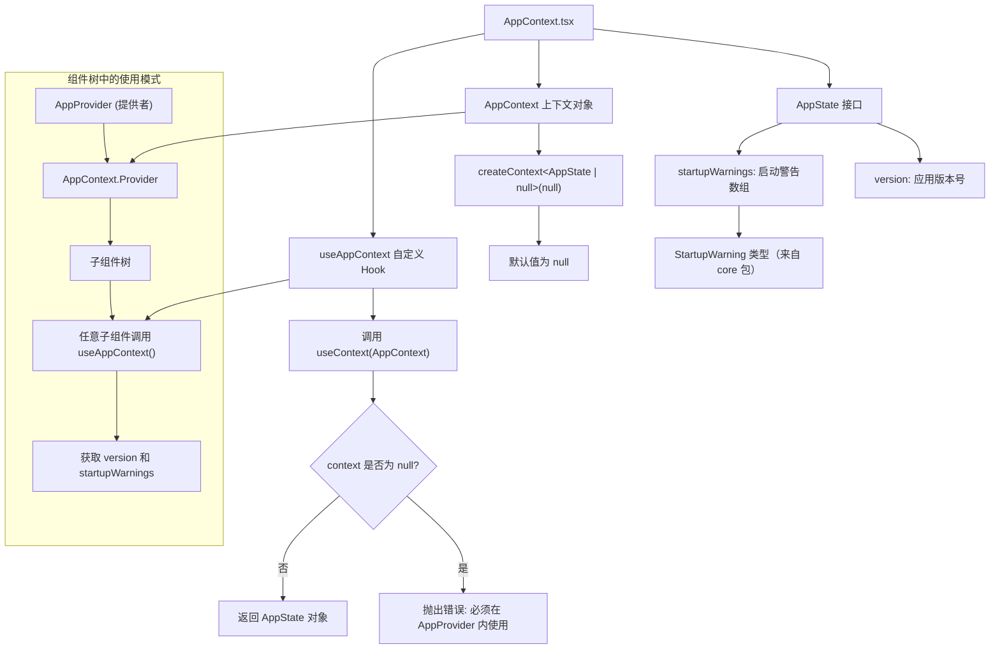

# AppContext.tsx

## 概述

`AppContext.tsx` 是 Gemini CLI 项目中的应用级 React Context 定义文件，位于 `packages/cli/src/ui/contexts/` 目录下。该文件定义了应用的全局状态上下文（`AppContext`）、状态接口（`AppState`）以及对应的自定义 Hook（`useAppContext`），用于在组件树中共享应用级别的状态数据——当前包括应用版本号和启动警告信息。

这是一个典型的 React Context 模式实现，遵循了"创建 Context + 导出 Provider + 提供自定义 Hook"的标准实践，并加入了安全校验以确保 Hook 只在正确的上下文中使用。

## 架构图（Mermaid）



## 核心组件

### AppState 接口

定义应用全局状态的 TypeScript 接口：

| 字段 | 类型 | 说明 |
|------|------|------|
| `version` | `string` | 应用的版本号字符串，用于在 UI 中展示当前 Gemini CLI 的版本信息（如 `/about` 命令输出） |
| `startupWarnings` | `StartupWarning[]` | 启动时产生的警告信息数组。`StartupWarning` 类型来自 `@google/gemini-cli-core` 核心包，可能包含配置异常、环境问题等需要用户关注的警告 |

### AppContext 上下文对象

```typescript
export const AppContext = createContext<AppState | null>(null);
```

通过 `React.createContext` 创建的上下文对象，泛型参数为 `AppState | null`：

- **默认值 `null`**：上下文初始值设为 `null`，表示在没有 Provider 包裹时，上下文值为空。这是一种常见的安全模式，配合自定义 Hook 中的空值检查，可以在开发时快速发现遗漏 Provider 的问题。
- **类型联合 `AppState | null`**：使用联合类型而非直接给默认值让 TypeScript 感知到"上下文可能为空"的情况，从而强制消费者进行空值处理（或通过自定义 Hook 封装）。

### useAppContext 自定义 Hook

```typescript
export const useAppContext = () => {
  const context = useContext(AppContext);
  if (!context) {
    throw new Error('useAppContext must be used within an AppProvider');
  }
  return context;
};
```

封装了 `useContext(AppContext)` 调用的自定义 Hook，提供了两层价值：

1. **空值保护（Null Guard）**：通过 `if (!context)` 检查，确保 Hook 只在 `AppContext.Provider` 包裹的组件内被调用。如果在 Provider 外部调用，会立即抛出描述性错误，帮助开发者快速定位问题。
2. **类型收窄（Type Narrowing）**：通过空值检查，返回类型从 `AppState | null` 收窄为 `AppState`，消费者无需再进行额外的空值判断，可以直接解构使用 `version` 和 `startupWarnings`。

## 依赖关系

### 内部依赖

| 模块路径 | 导入内容 | 用途 |
|----------|----------|------|
| `@google/gemini-cli-core` | `StartupWarning`（类型导入） | 启动警告的类型定义，来自 Gemini CLI 的核心包。该类型描述了启动阶段可能产生的各种警告信息的数据结构 |

### 外部依赖

| 包名 | 导入内容 | 用途 |
|------|----------|------|
| `react` | `createContext`, `useContext` | React 的上下文 API，`createContext` 用于创建上下文对象，`useContext` 用于在函数组件中消费上下文 |

## 关键实现细节

1. **防御性编程模式**：`useAppContext` Hook 中的空值检查是 React 社区推荐的最佳实践。当开发者忘记在组件树上层添加 Provider 时，不会得到难以理解的 `undefined` 属性访问错误，而是看到清晰的 `'useAppContext must be used within an AppProvider'` 错误消息。

2. **Provider 与 Context 分离**：值得注意的是，该文件只定义了 Context 对象和消费 Hook，并未定义 `AppProvider` 组件。Provider 的实现（包含 `<AppContext.Provider value={...}>` 的组件）位于其他文件中，实现了创建与使用的解耦。错误消息中提到的 `AppProvider` 暗示了该 Provider 组件的命名约定。

3. **轻量级状态设计**：`AppState` 接口只包含两个字段（`version` 和 `startupWarnings`），体现了"最小化全局状态"的设计原则。更复杂的、频繁变化的状态（如用户输入、工具执行状态等）可能由其他更专门的 Context 管理，避免不必要的组件重渲染。

4. **类型安全的 Context 消费**：通过自定义 Hook 封装 `useContext`，所有消费者获得的类型都是非空的 `AppState`，无需在每个消费点重复进行空值检查，减少了样板代码并提升了代码的整洁度。

5. **`type` 关键字导入**：`StartupWarning` 使用 `import type` 语法导入，确保该导入只在编译时存在、不会出现在最终的 JavaScript 输出中，有助于减小打包体积（Tree-shaking 友好）。

6. **模块导出策略**：文件导出了三个成员——`AppState`（接口）、`AppContext`（上下文对象）和 `useAppContext`（Hook）。其中 `AppState` 接口的导出允许其他模块在类型层面引用应用状态的结构，`AppContext` 的导出允许 Provider 组件引用上下文对象，而 `useAppContext` 是面向普通消费组件的 API。
