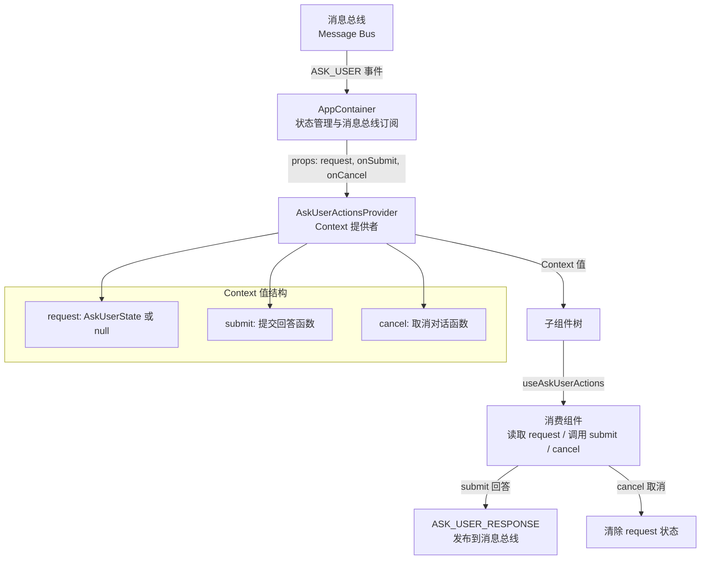

# AskUserActionsContext.tsx

## 概述

`AskUserActionsContext.tsx` 是 Gemini CLI 用户界面中用于管理"向用户提问"对话框状态与操作的 React Context 模块。当 AI 模型需要向用户发出 `ask_user` 请求（例如确认操作、收集额外信息）时，该 Context 负责在组件树中传递当前的提问状态，并提供提交回答和取消对话的操作接口。

该模块遵循与 `ToolActionsProvider` 相同的设计模式：状态由上层容器组件 `AppContainer` 管理（通过订阅消息总线），然后以 props 形式传入 Provider，再通过 Context 分发给子组件消费。

## 架构图（Mermaid）



## 核心组件

### 1. `AskUserState` 接口

```typescript
export interface AskUserState {
  questions: Question[];
  correlationId: string;
}
```

- **`questions`**: 类型为 `Question[]`，来自 `@google/gemini-cli-core`，表示当前需要用户回答的问题列表。一个 `ask_user` 请求可能包含多个问题。
- **`correlationId`**: 字符串类型，用于将用户的回答与原始请求进行关联匹配。这是消息总线中请求-响应模式的关键标识符。

### 2. `AskUserActionsContextValue` 接口

```typescript
interface AskUserActionsContextValue {
  request: AskUserState | null;
  submit: (answers: { [questionIndex: string]: string }) => Promise<void>;
  cancel: () => void;
}
```

定义了 Context 传递的完整值结构：

| 字段 | 类型 | 说明 |
|------|------|------|
| `request` | `AskUserState \| null` | 当前的 `ask_user` 请求；为 `null` 时表示无需显示对话框 |
| `submit` | `(answers) => Promise<void>` | 提交回答的异步函数。参数 `answers` 是一个以问题索引为键、用户回答为值的字典 |
| `cancel` | `() => void` | 取消当前对话的同步函数，会清除 `request` 状态 |

### 3. `AskUserActionsContext`

```typescript
export const AskUserActionsContext =
  createContext<AskUserActionsContextValue | null>(null);
```

使用 `createContext` 创建的 React Context 实例，默认值为 `null`。这意味着如果组件在 Provider 外部使用该 Context，将得到 `null`。

### 4. `useAskUserActions` Hook

```typescript
export const useAskUserActions = () => {
  const context = useContext(AskUserActionsContext);
  if (!context) {
    throw new Error(
      'useAskUserActions must be used within an AskUserActionsProvider',
    );
  }
  return context;
};
```

自定义 Hook，用于安全地消费 `AskUserActionsContext`：
- 内部调用 `useContext(AskUserActionsContext)` 获取 Context 值
- **防御性编程**：如果 Context 值为 `null`（即组件不在 Provider 内部），抛出明确的错误信息
- 返回类型经过 null 检查后保证为 `AskUserActionsContextValue`，调用方无需再做空值判断

### 5. `AskUserActionsProviderProps` 接口

```typescript
interface AskUserActionsProviderProps {
  children: React.ReactNode;
  request: AskUserState | null;
  onSubmit: (answers: { [questionIndex: string]: string }) => Promise<void>;
  onCancel: () => void;
}
```

Provider 组件的 Props 定义：
- **`children`**: 子组件节点
- **`request`**: 当前请求状态，由 `AppContainer` 管理并传入
- **`onSubmit`**: 提交回答的回调，由 `AppContainer` 实现（内部会发布 `ASK_USER_RESPONSE` 到消息总线）
- **`onCancel`**: 取消操作的回调，由 `AppContainer` 实现（内部会清除请求状态）

### 6. `AskUserActionsProvider` 组件

```typescript
export const AskUserActionsProvider: React.FC<AskUserActionsProviderProps> = ({
  children,
  request,
  onSubmit,
  onCancel,
}) => {
  const value = useMemo(
    () => ({
      request,
      submit: onSubmit,
      cancel: onCancel,
    }),
    [request, onSubmit, onCancel],
  );

  return (
    <AskUserActionsContext.Provider value={value}>
      {children}
    </AskUserActionsContext.Provider>
  );
};
```

Context Provider 包装组件：
- 使用 `useMemo` 对 Context 值进行记忆化，依赖项为 `[request, onSubmit, onCancel]`，避免不必要的子组件重渲染
- 将 props 中的 `onSubmit` 映射为 Context 值中的 `submit`，`onCancel` 映射为 `cancel`，对外提供更简洁的 API 命名
- 渲染 `AskUserActionsContext.Provider` 并传入计算后的 value

## 依赖关系

### 内部依赖

| 依赖 | 来源 | 说明 |
|------|------|------|
| `Question` 类型 | `@google/gemini-cli-core` | 定义了单个问题的数据结构，用于 `AskUserState.questions` |

### 外部依赖

| 依赖 | 来源 | 说明 |
|------|------|------|
| `React` | `react` | 类型导入，用于 `React.FC` 和 `React.ReactNode` 类型注解 |
| `createContext` | `react` | 创建 Context 对象 |
| `useContext` | `react` | 在 Hook 中消费 Context |
| `useMemo` | `react` | 记忆化 Context 值，优化性能 |

## 关键实现细节

1. **状态提升模式（Lifting State Up）**：该模块本身不管理任何状态。所有状态（`request`）和操作（`onSubmit`、`onCancel`）都由上层的 `AppContainer` 管理，通过 props 注入 Provider。这种设计使得状态逻辑集中在一处，Context 仅作为"传递管道"。

2. **消息总线集成**：`submit` 操作最终会将 `ASK_USER_RESPONSE` 事件发布到消息总线，使得 core 层能够接收到用户的回答并继续执行流程。这是 CLI 工具中 UI 层与核心逻辑层解耦的关键桥梁。

3. **answers 参数的键设计**：`submit` 函数接收的 `answers` 参数以 `questionIndex`（字符串类型的索引）为键，这意味着一个 `ask_user` 请求可以包含多个问题，每个问题按索引独立回答。这种设计支持批量问答场景。

4. **useMemo 优化**：Context 值通过 `useMemo` 包装，确保只有在 `request`、`onSubmit` 或 `onCancel` 实际变化时才创建新的对象引用。这对于避免下游消费组件不必要的重渲染至关重要。

5. **与 ToolActionsProvider 的一致性**：文件注释明确指出该模块遵循与 `ToolActionsProvider` 相同的架构模式，体现了代码库中的一致性设计原则。

6. **严格的 Context 消费保护**：`useAskUserActions` Hook 中的 null 检查确保了组件必须在 Provider 内部使用，违反此约束时会立即抛出有意义的错误，而不是在后续逻辑中出现难以追踪的 `undefined` 错误。
