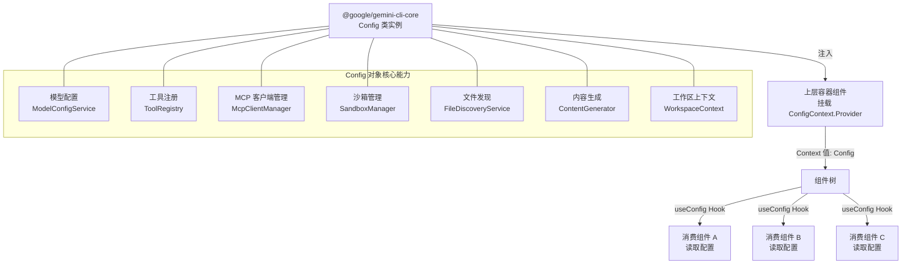

# ConfigContext.tsx

## 概述

`ConfigContext.tsx` 是 Gemini CLI 用户界面中用于在组件树中共享全局配置对象的 React Context 模块。它封装了来自 `@google/gemini-cli-core` 的 `Config` 类实例，使得 UI 层的任何子组件都可以通过 `useConfig` Hook 便捷地访问完整的应用配置，而无需逐层传递 props。

该模块非常精简（仅 19 行），遵循最小职责原则：只负责创建 Context 和提供安全的消费 Hook，不包含 Provider 组件的实现——Provider 的挂载由上层容器组件负责。

## 架构图（Mermaid）



## 核心组件

### 1. `ConfigContext`

```typescript
export const ConfigContext = React.createContext<Config | undefined>(undefined);
```

使用 `React.createContext` 创建的 Context 对象：
- **泛型类型**：`Config | undefined`，其中 `Config` 是 `@google/gemini-cli-core` 导出的核心配置类
- **默认值**：`undefined`，意味着在没有 Provider 包裹的情况下，消费组件将获得 `undefined`
- 该 Context 仅导出 Context 对象本身，不提供内置的 Provider 组件封装。上层容器组件需要直接使用 `<ConfigContext.Provider value={configInstance}>` 来提供值

### 2. `useConfig` Hook

```typescript
export const useConfig = () => {
  const context = useContext(ConfigContext);
  if (context === undefined) {
    throw new Error('useConfig must be used within a ConfigProvider');
  }
  return context;
};
```

安全消费 `ConfigContext` 的自定义 Hook：
- 调用 `useContext(ConfigContext)` 获取当前 Context 值
- **空值守卫**：使用 `=== undefined` 严格比较检测是否在 Provider 外部使用。如果是，则抛出明确的错误信息 `'useConfig must be used within a ConfigProvider'`
- **返回类型**：经过 undefined 检查后，TypeScript 能够将返回类型收窄为 `Config`（非 undefined），调用方无需再做空值判断
- **注意**：错误消息中提到 "ConfigProvider"，但实际代码中并没有导出名为 `ConfigProvider` 的组件，上层使用的是 `ConfigContext.Provider`

## 依赖关系

### 内部依赖

| 依赖 | 来源 | 说明 |
|------|------|------|
| `Config` 类 | `@google/gemini-cli-core` | 应用的核心配置类，实现了 `McpContext` 和 `AgentLoopContext` 接口 |

`Config` 类是一个大型的配置管理类，包含以下关键成员（部分列举）：

| 成员 | 类型 | 说明 |
|------|------|------|
| `_toolRegistry` | `ToolRegistry` | 工具注册表 |
| `mcpClientManager` | `McpClientManager` | MCP 客户端管理器 |
| `modelConfigService` | `ModelConfigService` | 模型配置服务 |
| `_sandboxManager` | `SandboxManager` | 沙箱管理器 |
| `contentGenerator` | `ContentGenerator` | 内容生成器 |
| `workspaceContext` | `WorkspaceContext` | 工作区上下文 |
| `fileDiscoveryService` | `FileDiscoveryService` | 文件发现服务 |
| `_geminiClient` | `GeminiClient` | Gemini API 客户端 |
| `model` | `string` | 当前使用的模型名称 |
| `debugMode` | `boolean` | 是否为调试模式 |
| `cwd` | `string` | 当前工作目录 |

### 外部依赖

| 依赖 | 来源 | 说明 |
|------|------|------|
| `React` | `react` | 默认导入，用于 `React.createContext` 调用 |
| `useContext` | `react` | React Hook，用于在自定义 Hook 中消费 Context |

## 关键实现细节

1. **极简设计**：整个文件仅 19 行代码，只包含一个 Context 创建和一个消费 Hook。这种极简设计使得该模块职责清晰，易于维护。

2. **无内置 Provider 组件**：与 `AskUserActionsContext.tsx` 不同，该模块没有导出专门的 Provider 组件。这是因为 `Config` 对象是一个稳定的、在应用生命周期内很少变化的对象，不需要复杂的 `useMemo` 优化或 props 映射。上层组件直接使用 `<ConfigContext.Provider value={config}>` 即可。

3. **undefined vs null 的选择**：默认值使用 `undefined` 而非 `null`，并且守卫条件使用 `=== undefined` 严格比较。这与 `AskUserActionsContext` 使用 `null` 的模式不同。`undefined` 在语义上表示"尚未提供"，而 `null` 表示"明确的空值"。对于配置 Context 来说，`undefined` 更准确地表达了"Provider 未挂载"的含义。

4. **Config 类的重量级特性**：虽然 Context 模块本身很轻量，但它传递的 `Config` 对象是一个实现了 `McpContext` 和 `AgentLoopContext` 两个接口的重量级类，包含了工具注册、MCP 管理、沙箱、模型配置、内容生成等几乎所有核心服务。通过 Context 传递这个对象，UI 层的任何组件都能访问完整的应用能力。

5. **类型安全保证**：`useConfig` Hook 的类型收窄机制确保了消费方拿到的始终是有效的 `Config` 实例，而不是可能为 `undefined` 的值。这在 TypeScript 开发中极大地减少了空值检查的冗余代码。

6. **type-only 导入**：`Config` 使用 `type` 关键字导入（`import { type Config }`），表明在运行时不需要该类的值，仅在类型检查时使用。这有助于 Tree Shaking 和减小打包体积。
