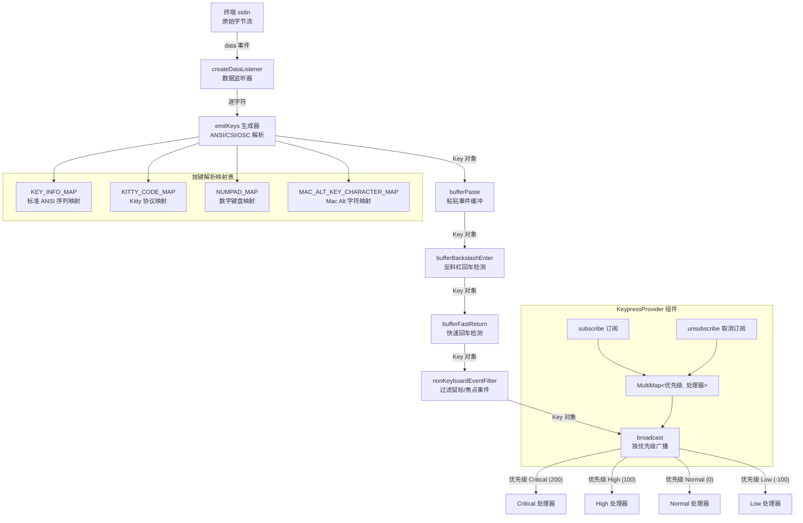

# KeypressContext.tsx

## 概述

`KeypressContext.tsx` 是 Gemini CLI 中最核心、最复杂的 UI Context 模块之一，负责将终端原始输入数据解析为结构化的按键事件，并通过优先级订阅机制将这些事件广播给整个组件树中的消费者。

该文件实现了一套完整的终端按键解析引擎，涵盖：
- **ANSI 转义序列解析**：处理方向键、功能键、Home/End 等特殊键
- **Kitty 键盘协议（CSI u）**：支持现代终端的增强键盘协议
- **数字键盘（Numpad）映射**：处理应用键盘模式下的数字键盘输入
- **Mac Alt 键字符映射**：将 macOS Alt 组合键生成的特殊 Unicode 字符还原为标准按键
- **粘贴事件缓冲**：通过括号粘贴模式（Bracketed Paste Mode）将多字符粘贴聚合为单个事件
- **反斜杠+回车换行检测**：将 `\` + Enter 组合转换为 Shift+Enter（换行）
- **快速回车检测**：将非括号粘贴终端中的快速连续回车转换为换行
- **OSC 52 剪贴板响应解析**：处理来自终端的剪贴板数据响应

整个模块约 900 行代码，是键盘输入处理的"大脑"。

## 架构图（Mermaid）



## 核心组件

### 1. 常量定义

```typescript
export const BACKSLASH_ENTER_TIMEOUT = 5;    // 反斜杠+回车检测超时（毫秒）
export const ESC_TIMEOUT = 50;               // ESC 序列超时（毫秒）
export const PASTE_TIMEOUT = 30_000;         // 粘贴事件超时（毫秒）
export const FAST_RETURN_TIMEOUT = 30;       // 快速回车检测超时（毫秒）
```

这些超时值控制了各种输入缓冲机制的行为：
- `BACKSLASH_ENTER_TIMEOUT`（5ms）：极短的超时，用于判断 `\` 后是否紧跟 Enter
- `ESC_TIMEOUT`（50ms）：用于区分独立的 ESC 键按下和 ANSI 转义序列的开始
- `PASTE_TIMEOUT`（30s）：粘贴操作允许的最长时间，超时后触发 `PasteTimeout` 事件
- `FAST_RETURN_TIMEOUT`（30ms）：用于检测粘贴文本中嵌入的换行符

### 2. `KeypressPriority` 枚举

```typescript
export enum KeypressPriority {
  Low = -100,
  Normal = 0,
  High = 100,
  Critical = 200,
}
```

定义了四个按键事件处理的优先级级别：

| 级别 | 值 | 用途 |
|------|-----|------|
| `Low` | -100 | 低优先级处理器，最后接收事件 |
| `Normal` | 0 | 默认优先级 |
| `High` | 100 | 高优先级处理器，优先接收事件 |
| `Critical` | 200 | 最高优先级，最先接收事件（如模态对话框） |

### 3. `KEY_INFO_MAP` 映射表

```typescript
const KEY_INFO_MAP: Record<string, { name: string; shift?: boolean; ctrl?: boolean }> = { ... };
```

标准 ANSI 转义序列到按键名称的映射表，包含约 70 个映射条目，覆盖：
- 方向键（`up`, `down`, `left`, `right`）及其 Shift/Ctrl 变体
- 功能键（`f1` - `f20`）
- 导航键（`home`, `end`, `pageup`, `pagedown`, `insert`, `delete`）
- 粘贴模式标记（`paste-start`, `paste-end`）
- Tab 键及其 Shift 变体

### 4. `KITTY_CODE_MAP` 映射表

```typescript
const KITTY_CODE_MAP: Record<number, { name: string; sequence?: string }> = { ... };
```

Kitty 键盘协议（CSI u 编码）的按键映射。Kitty 协议使用数字编码表示按键：
- 标准键：Insert(2), Delete(3), PageUp(5), PageDown(6), Tab(9), Enter(13), Escape(27), Space(32), Backspace(127)
- 特殊键：CapsLock(57358), ScrollLock(57359), NumLock(57360), PrintScreen(57361)
- 数字键盘键：Numpad0-9(57399-57408), 运算符(57409-57416)
- 扩展功能键：F13-F35(302-324)

### 5. `NUMPAD_MAP` 映射表

```typescript
const NUMPAD_MAP: Record<string, string> = { ... };
```

应用键盘模式（SS3 序列）下数字键盘的字符映射，将 `Oj`-`Oy`、`On` 等序列映射为对应的数字和运算符字符。

### 6. `MAC_ALT_KEY_CHARACTER_MAP` 映射表

```typescript
const MAC_ALT_KEY_CHARACTER_MAP: Record<string, string> = { ... };
```

macOS 上按 Alt（Option）键时终端发送的 Unicode 特殊字符到实际字母的映射：

| Unicode 字符 | 映射到 | 功能 |
|-------------|--------|------|
| `\u222B` (∫) | `b` | 后退一个单词 |
| `\u0192` (ƒ) | `f` | 前进一个单词 |
| `\u00B5` (µ) | `m` | 切换标记视图 |
| `\u03A9` (Ω) | `z` | Option+z |
| `\u00B8` (¸) | `Z` | Option+Shift+z |
| `\u2202` (∂) | `d` | 向前删除单词 |

特殊处理：希腊语用户（`LANG`/`LC_ALL` 以 `el` 开头）的 Ω 字符被视为可插入字符而非 Alt+z。

### 7. `Key` 接口

```typescript
export interface Key {
  name: string;
  shift: boolean;
  alt: boolean;
  ctrl: boolean;
  cmd: boolean;
  insertable: boolean;
  sequence: string;
}
```

| 字段 | 类型 | 说明 |
|------|------|------|
| `name` | `string` | 按键名称，如 `'enter'`、`'a'`、`'f1'`、`'paste'` |
| `shift` | `boolean` | Shift 修饰键是否被按下 |
| `alt` | `boolean` | Alt/Option 修饰键是否被按下 |
| `ctrl` | `boolean` | Ctrl 修饰键是否被按下 |
| `cmd` | `boolean` | Command/Windows/Super 修饰键是否被按下 |
| `insertable` | `boolean` | 该按键是否可以作为文本插入（如字母、数字、空格） |
| `sequence` | `string` | 原始字符序列 |

### 8. `KeypressHandler` 类型

```typescript
export type KeypressHandler = (key: Key) => boolean | void;
```

按键处理器函数签名。返回 `true` 表示该事件已被消费，不再传递给更低优先级的处理器（事件拦截机制）。

### 9. 输入处理管道函数

#### `nonKeyboardEventFilter`
过滤掉鼠标事件和焦点事件（`FOCUS_IN`/`FOCUS_OUT`），只将真正的键盘事件传递给下游处理器。

#### `bufferFastReturn`
处理旧终端不支持括号粘贴模式的情况。当可插入字符后在 `FAST_RETURN_TIMEOUT`（30ms）内紧跟 Enter 键时，将 Enter 转换为 Shift+Enter（换行而非提交），以正确处理粘贴的多行文本。

#### `bufferBackslashEnter`
使用 JavaScript Generator 实现的状态机。当检测到 `\` 字符后：
- 在 `BACKSLASH_ENTER_TIMEOUT`（5ms）内收到 Enter → 转换为 Shift+Enter（换行）
- 超时或收到其他键 → 原样发送 `\` 和后续键

#### `bufferPaste`
使用 JavaScript Generator 实现的粘贴缓冲器。在 `paste-start` 和 `paste-end` 标记之间收集所有字符，聚合为单个 `paste` 事件。超时后触发 `AppEvent.PasteTimeout` 事件。

### 10. `emitKeys` 生成器

```typescript
function* emitKeys(keypressHandler: KeypressHandler): Generator<void, void, string>
```

核心按键解析引擎，使用 Generator 函数实现逐字符状态机：

1. **ESC 检测**：如果首字符是 ESC，标记为转义序列开始
2. **ANSI 序列分支**：
   - `ESC [` → CSI 序列（最常见的转义序列）
   - `ESC O` → SS3 序列（较旧的终端）
   - `ESC ]` → OSC 序列（操作系统命令，如剪贴板）
3. **CSI 序列解析**：收集数字参数和修饰符，支持：
   - 标准格式：`ESC [ <数字> ; <修饰符> ~`
   - CSI u 格式：`ESC [ <code> ; <修饰符> u`
   - modifyOtherKeys 格式：`ESC [ 27 ; <修饰符> ; <code> ~`
   - SGR 鼠标模式：`ESC [ < <参数> M/m`
   - X11 鼠标模式：`ESC [ M <三字节>`
4. **修饰符解析**：使用位掩码从修饰符值提取 Shift(1)、Alt(2)、Ctrl(4)、Cmd(8)
5. **普通字符处理**：回车、Tab、退格、Ctrl+字母、可打印字符等
6. **OSC 52 剪贴板响应**：解析 `ESC ] 52;c;<base64> BEL` 格式的剪贴板数据

### 11. `createDataListener` 函数

```typescript
function createDataListener(keypressHandler: KeypressHandler)
```

创建 stdin `data` 事件的监听器。内部维护 `emitKeys` Generator 实例，将每个字符逐个送入解析器。在数据接收后设置 `ESC_TIMEOUT` 超时，用于终结未完成的转义序列。

### 12. `KeypressProvider` 组件

```typescript
export function KeypressProvider({ children, config }: { children: React.ReactNode; config?: Config })
```

核心 Provider 组件，负责：

1. **订阅管理**：使用 `MultiMap<number, KeypressHandler>` 按优先级存储处理器，`Map<KeypressHandler, number>` 反向查找优先级
2. **subscribe**：注册按键处理器，支持 `KeypressPriority` 枚举或布尔值（`true` = High, `false` = Normal）。新增优先级级别时重新排序缓存
3. **unsubscribe**：移除按键处理器，清理后重新排序缓存
4. **broadcast**：按优先级从高到低遍历处理器，同一优先级内按栈行为（后注册先处理）。处理器返回 `true` 则停止传播
5. **Effect 初始化**：
   - 启用终端能力（`terminalCapabilityManager.enableSupportedModes()`）
   - 设置 raw mode（获取原始按键数据）
   - 设置 UTF-8 编码
   - 构建处理管道：`broadcast` → `nonKeyboardEventFilter` → `bufferFastReturn`（非 Kitty 终端） → `bufferBackslashEnter` → `bufferPaste` → `createDataListener`
   - 可选启用调试日志（`debugKeystrokeLogging`）
   - 清理时移除监听器并恢复 raw mode 状态

## 依赖关系

### 内部依赖

| 依赖 | 来源 | 说明 |
|------|------|------|
| `ESC` | `../utils/input.js` | ESC 字符常量（`\x1b`） |
| `parseMouseEvent` | `../utils/mouse.js` | 鼠标事件解析函数，用于过滤鼠标事件 |
| `FOCUS_IN`, `FOCUS_OUT` | `../hooks/useFocus.js` | 焦点事件序列常量，用于过滤焦点事件 |
| `appEvents`, `AppEvent` | `../../utils/events.js` | 应用事件发射器，用于发布粘贴超时事件 |
| `terminalCapabilityManager` | `../utils/terminalCapabilityManager.js` | 终端能力管理器，启用支持的模式并检测 Kitty 协议 |
| `useSettingsStore` | `./SettingsContext.js` | 设置存储 Hook，读取 `debugKeystrokeLogging` 配置 |

### 外部依赖

| 依赖 | 来源 | 说明 |
|------|------|------|
| `debugLogger` | `@google/gemini-cli-core` | 调试日志记录器 |
| `Config` 类型 | `@google/gemini-cli-core` | 配置类型（作为 Provider 的可选 prop） |
| `useStdin` | `ink` | Ink 框架 Hook，获取 stdin 对象和 setRawMode 函数 |
| `MultiMap` | `mnemonist` | 多值映射数据结构，支持一个键对应多个值（Set 模式） |
| `React` 类型 | `react` | React 类型定义 |
| `createContext` | `react` | 创建 Context |
| `useCallback` | `react` | 记忆化回调函数 |
| `useContext` | `react` | 消费 Context |
| `useEffect` | `react` | 副作用管理（stdin 监听） |
| `useMemo` | `react` | 记忆化 Context 值 |
| `useRef` | `react` | 持久化引用（订阅者存储） |

## 关键实现细节

1. **Generator 驱动的状态机**：`emitKeys`、`bufferPaste`、`bufferBackslashEnter` 三个核心函数都使用 JavaScript Generator 实现状态机。Generator 的 `yield` 语义天然适合"等待下一个字符"的场景，比传统的显式状态变量更清晰、更不容易出错。

2. **处理管道的组装顺序**：处理管道的构建是从内到外的：
   ```
   broadcast → nonKeyboardEventFilter → bufferFastReturn → bufferBackslashEnter → bufferPaste → createDataListener
   ```
   数据流则是从外到内：stdin → createDataListener → bufferPaste → bufferBackslashEnter → bufferFastReturn → nonKeyboardEventFilter → broadcast。这种设计使得每一层都只关注自己的职责。

3. **优先级事件拦截机制**：broadcast 函数按优先级从高到低遍历处理器。任何处理器返回 `true` 都会立即停止事件传播，这使得高优先级的组件（如模态对话框）可以拦截所有按键，防止后台组件响应。

4. **同优先级栈行为**：在同一优先级内，后注册的处理器先被调用（`Array.from(set).reverse()`）。这确保了后打开的 UI 面板能够优先处理按键。

5. **优先级缓存优化**：`sortedPriorities` 使用 `useRef` 缓存排序后的优先级数组，仅在新增或完全移除某个优先级级别时才重新排序，避免每次按键事件都进行排序操作。

6. **Kitty 协议自适应**：`bufferFastReturn` 仅在非 Kitty 协议终端中启用，因为 Kitty 协议支持括号粘贴模式，不需要通过快速回车来检测粘贴操作。

7. **OSC 52 剪贴板支持**：解析 OSC 52 响应（`ESC ] 52;c;<base64> BEL`），将 Base64 编码的剪贴板内容解码为 UTF-8 字符串，生成 `paste` 事件。这是终端应用实现系统剪贴板访问的标准方式。

8. **希腊语特殊处理**：Mac Alt 字符映射中的 Ω（`\u03A9`）对于希腊语用户是常用字符而非快捷键。通过检测 `LANG`/`LC_ALL` 环境变量中的 `el` 前缀来避免误映射。

9. **UTF-16 代理对处理**：`charLengthAt` 函数正确处理了 Unicode 补充平面字符（码点 >= 0x10000），这些字符在 JavaScript 字符串中占用 2 个 UTF-16 编码单元。

10. **Raw Mode 状态恢复**：Effect 清理函数会检查原始的 raw mode 状态并在组件卸载时恢复，确保不破坏外部终端设置。

11. **调试日志双层记录**：当 `debugKeystrokeLogging` 启用时，同时记录原始 stdin 数据和解析后的 Key 对象，便于排查终端兼容性问题。

12. **modifyOtherKeys 格式支持**：除了标准 CSI u 格式外，还支持 `CSI 27 ; modifier ; key ~` 格式的 modifyOtherKeys 协议，这是某些终端（如 xterm）使用的替代编码方式。
