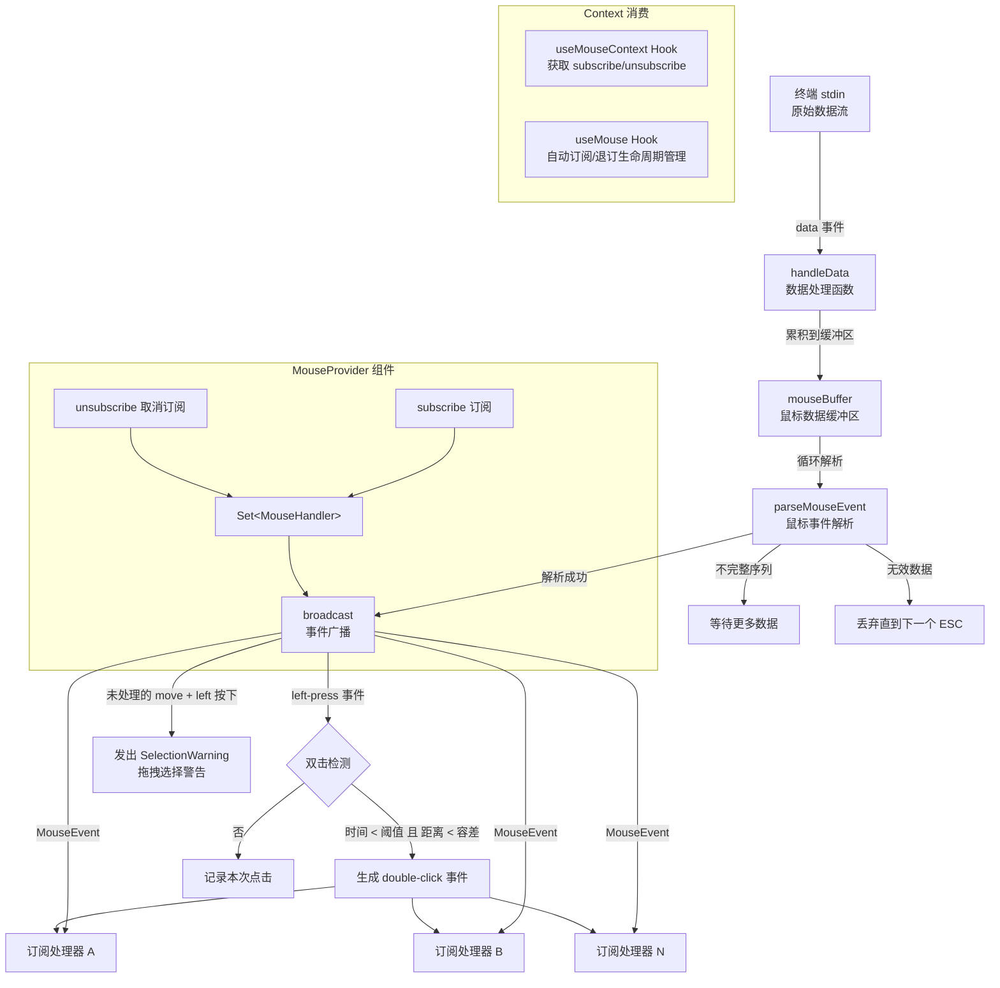

# MouseContext.tsx

## 概述

`MouseContext.tsx` 是 Gemini CLI 用户界面中负责鼠标事件处理的 React Context 模块。它从终端 stdin 中解析鼠标事件数据，通过发布-订阅机制将解析后的鼠标事件广播给所有已注册的处理器。

该模块实现了以下核心功能：
- **鼠标事件解析**：从 stdin 原始数据流中识别并解析鼠标转义序列
- **双击检测**：通过时间间隔和位置容差自动检测双击操作
- **拖拽选择警告**：当用户尝试拖拽选择文本但无处理器响应时，发出选择警告事件
- **缓冲区管理**：安全地处理不完整的鼠标序列和无效数据
- **发布-订阅广播**：将解析后的鼠标事件分发给所有订阅者

与 `KeypressContext` 不同，`MouseContext` 的订阅机制不包含优先级系统，所有处理器平等接收事件。

## 架构图（Mermaid）



## 核心组件

### 1. 常量与类型重导出

```typescript
const MAX_MOUSE_BUFFER_SIZE = 4096;
export type { MouseEvent, MouseEventName, MouseHandler };
```

- **`MAX_MOUSE_BUFFER_SIZE`**（4096）：鼠标数据缓冲区的最大字节数。当缓冲区超过此值时，会截取最后 4096 字节，防止因垃圾数据导致内存无限增长。
- 重导出 `MouseEvent`、`MouseEventName`、`MouseHandler` 类型，使消费者可以从本模块统一导入所需类型。

### 2. `MouseContextValue` 接口

```typescript
interface MouseContextValue {
  subscribe: (handler: MouseHandler) => void;
  unsubscribe: (handler: MouseHandler) => void;
}
```

Context 传递的值结构，仅包含订阅和取消订阅两个操作：

| 字段 | 类型 | 说明 |
|------|------|------|
| `subscribe` | `(handler: MouseHandler) => void` | 注册鼠标事件处理器 |
| `unsubscribe` | `(handler: MouseHandler) => void` | 移除鼠标事件处理器 |

### 3. `MouseContext`

```typescript
const MouseContext = createContext<MouseContextValue | undefined>(undefined);
```

React Context 实例，默认值为 `undefined`。注意该 Context 未被导出（`const` 而非 `export const`），外部只能通过 `useMouseContext` Hook 访问。

### 4. `useMouseContext` Hook

```typescript
export function useMouseContext() {
  const context = useContext(MouseContext);
  if (!context) {
    throw new Error('useMouseContext must be used within a MouseProvider');
  }
  return context;
}
```

安全消费 `MouseContext` 的底层 Hook，包含 null 检查守卫。返回 `MouseContextValue` 对象。

### 5. `useMouse` Hook

```typescript
export function useMouse(handler: MouseHandler, { isActive = true } = {})
```

高级便捷 Hook，自动管理鼠标事件处理器的订阅生命周期：

- **`handler`**：鼠标事件处理函数
- **`isActive`**：可选参数，默认为 `true`。设为 `false` 时不订阅事件（用于条件性监听）
- 内部使用 `useEffect` 在组件挂载时自动调用 `subscribe`，卸载时自动调用 `unsubscribe`
- 依赖项包含 `isActive`、`handler`、`subscribe`、`unsubscribe`，确保在任何相关值变化时正确重新订阅

### 6. `MouseProvider` 组件

```typescript
export function MouseProvider({
  children,
  mouseEventsEnabled,
}: {
  children: React.ReactNode;
  mouseEventsEnabled?: boolean;
})
```

核心 Provider 组件，负责鼠标事件的完整处理流程：

#### Props

| 属性 | 类型 | 说明 |
|------|------|------|
| `children` | `React.ReactNode` | 子组件节点 |
| `mouseEventsEnabled` | `boolean \| undefined` | 是否启用鼠标事件。为 `false` 或 `undefined` 时跳过 stdin 监听 |

#### 内部状态

- **`subscribers`**：`Set<MouseHandler>` 类型的 ref，存储所有已注册的鼠标处理器
- **`lastClickRef`**：记录上次左键点击的时间和位置，用于双击检测
- **`mouseBuffer`**：字符串缓冲区，累积未完全解析的鼠标序列数据

#### `broadcast` 函数

事件广播的核心逻辑：

1. **基础广播**：遍历所有订阅者，调用每个处理器。如果任一处理器返回 `true`，标记事件为已处理
2. **双击检测**：
   - 对 `left-press` 事件，检查与上次点击的时间间隔是否小于 `DOUBLE_CLICK_THRESHOLD_MS`
   - 同时检查点击位置与上次的列差和行差是否都在 `DOUBLE_CLICK_DISTANCE_TOLERANCE` 范围内
   - 满足条件则生成 `double-click` 事件并广播给所有订阅者，然后清除上次点击记录
   - 不满足条件则更新上次点击记录
3. **选择警告**：
   - 如果 `move` 事件未被任何处理器处理，且鼠标位置有效（col >= 0, row >= 0），且左键被按下
   - 则发出 `AppEvent.SelectionWarning`，提示用户终端应用无法像原生终端那样进行文本选择

#### `handleData` 函数

stdin 数据处理的核心逻辑：

1. **缓冲累积**：将接收到的数据追加到 `mouseBuffer`
2. **安全截断**：如果缓冲区超过 `MAX_MOUSE_BUFFER_SIZE`，截取最后的部分
3. **循环解析**：
   - 调用 `parseMouseEvent(mouseBuffer)` 尝试解析
   - 解析成功 → 广播事件，移除已解析数据，继续循环
   - `isIncompleteMouseSequence` 返回 `true` → 等待更多数据
   - 无效数据 → 查找下一个 ESC 字符位置，丢弃之前的垃圾数据；若找不到 ESC 则清空缓冲区

## 依赖关系

### 内部依赖

| 依赖 | 来源 | 说明 |
|------|------|------|
| `ESC` | `../utils/input.js` | ESC 字符常量，用于在缓冲区中定位下一个可能的序列起始 |
| `isIncompleteMouseSequence` | `../utils/mouse.js` | 检测缓冲区是否包含不完整的鼠标序列 |
| `parseMouseEvent` | `../utils/mouse.js` | 从缓冲区起始位置解析鼠标事件 |
| `MouseEvent` 类型 | `../utils/mouse.js` | 鼠标事件数据结构 |
| `MouseEventName` 类型 | `../utils/mouse.js` | 鼠标事件名称类型 |
| `MouseHandler` 类型 | `../utils/mouse.js` | 鼠标事件处理器函数签名 |
| `DOUBLE_CLICK_THRESHOLD_MS` | `../utils/mouse.js` | 双击时间阈值常量 |
| `DOUBLE_CLICK_DISTANCE_TOLERANCE` | `../utils/mouse.js` | 双击位置容差常量 |
| `appEvents`, `AppEvent` | `../../utils/events.js` | 应用事件发射器，用于发布选择警告事件 |
| `useSettingsStore` | `./SettingsContext.js` | 设置存储 Hook，读取调试日志配置 |

### 外部依赖

| 依赖 | 来源 | 说明 |
|------|------|------|
| `useStdin` | `ink` | Ink 框架 Hook，获取 stdin 对象 |
| `debugLogger` | `@google/gemini-cli-core` | 调试日志记录器 |
| `React` 类型 | `react` | React 类型定义 |
| `createContext` | `react` | 创建 Context |
| `useCallback` | `react` | 记忆化回调函数 |
| `useContext` | `react` | 消费 Context |
| `useEffect` | `react` | 副作用管理（stdin 监听、订阅生命周期） |
| `useMemo` | `react` | 记忆化 Context 值 |
| `useRef` | `react` | 持久化引用（订阅者集合、上次点击记录） |

## 关键实现细节

1. **与 KeypressContext 的并行处理**：`MouseProvider` 和 `KeypressProvider` 都监听 stdin 的 `data` 事件。键盘事件中通过 `nonKeyboardEventFilter` 过滤掉鼠标序列，鼠标事件在此模块中独立解析。两者通过序列格式的不同自然分流。

2. **无优先级的平等广播**：与 `KeypressContext` 的优先级机制不同，`MouseContext` 中所有处理器平等接收事件。但处理器仍然可以通过返回 `true` 来标记事件为"已处理"（目前仅用于判断 move 事件是否需要触发选择警告）。

3. **双击检测算法**：
   - 使用 `lastClickRef` 记录上次点击的时间戳和坐标
   - 时间维度：两次点击间隔必须小于 `DOUBLE_CLICK_THRESHOLD_MS`
   - 空间维度：两次点击的列差和行差必须都在 `DOUBLE_CLICK_DISTANCE_TOLERANCE` 范围内
   - 成功检测后清除记录（不支持三击检测）

4. **选择警告机制**：终端应用接管鼠标事件后，用户无法像在普通终端中那样拖拽选择文本。当检测到未处理的左键拖拽 move 事件时，发出 `SelectionWarning` 事件提示用户。这是一个用户体验优化——终端中鼠标事件由应用处理时，原生文本选择会失效。

5. **缓冲区安全管理**：
   - `MAX_MOUSE_BUFFER_SIZE`（4096 字节）上限防止了内存泄漏
   - 不完整序列会保留在缓冲区等待更多数据
   - 无效数据通过查找下一个 ESC 字符来跳过，而不是简单丢弃所有数据，最大限度保留有效数据

6. **条件性 Effect**：当 `mouseEventsEnabled` 为 `false` 时，`useEffect` 提前返回，不注册任何 stdin 监听器。这使得鼠标支持可以根据终端能力或用户设置动态开关。

7. **`useMouse` 的便捷封装**：提供了比直接使用 `useMouseContext().subscribe/unsubscribe` 更方便的 API，自动处理 Effect 生命周期和条件性激活（`isActive` 参数），是组件消费鼠标事件的推荐方式。

8. **类型重导出策略**：从 `../utils/mouse.js` 导入的 `MouseEvent`、`MouseEventName`、`MouseHandler` 类型被重导出，使消费者可以从单一入口（`MouseContext.tsx`）获取所有鼠标相关类型，减少导入路径的分散。

9. **数据格式兼容**：`handleData` 函数接受 `Buffer | string` 类型的数据，确保对 Buffer 模式和字符串模式的 stdin 都能正确处理。
