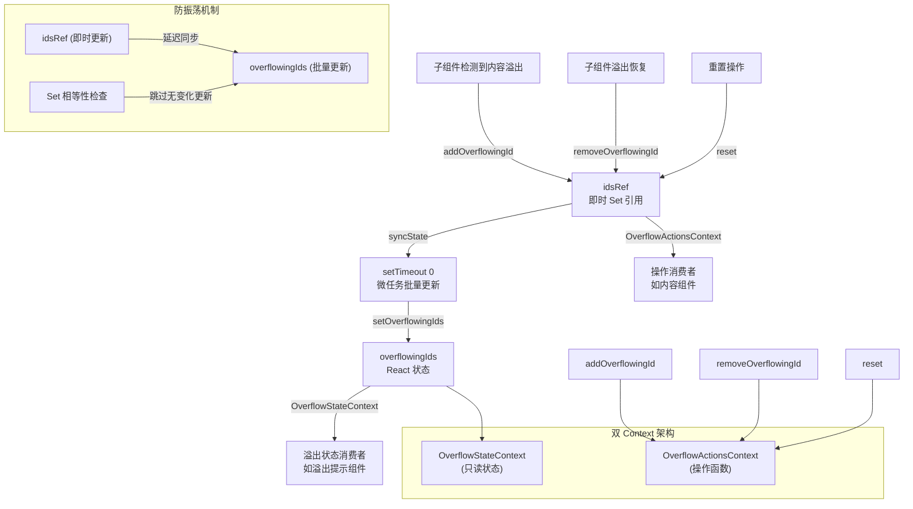

# OverflowContext.tsx

## 概述

`OverflowContext.tsx` 是 Gemini CLI 用户界面中用于管理内容溢出状态的 React Context 模块。当 UI 组件的内容超出可见区域（如终端窗口的宽度或高度）时，该模块跟踪哪些组件发生了溢出，并为其他组件（如溢出提示 UI）提供这些信息。

该模块采用了 **状态与操作分离的双 Context 模式**（State/Actions Split Context Pattern），将只读的溢出状态和修改状态的操作分别放在两个独立的 Context 中。这种设计确保了只关心操作的组件不会因为状态变化而被不必要地重渲染。

此外，该模块实现了精巧的 **批量更新与防振荡机制**，通过 ref + setTimeout(0) 微任务延迟策略，解决了溢出检测与布局变化之间可能产生的无限渲染循环问题。

## 架构图（Mermaid）



## 核心组件

### 1. `OverflowState` 接口

```typescript
export interface OverflowState {
  overflowingIds: ReadonlySet<string>;
}
```

| 字段 | 类型 | 说明 |
|------|------|------|
| `overflowingIds` | `ReadonlySet<string>` | 当前处于溢出状态的组件 ID 集合（只读） |

使用 `ReadonlySet` 而非 `Set` 确保消费者无法直接修改集合，只能通过 Actions 操作。

### 2. `OverflowActions` 接口

```typescript
export interface OverflowActions {
  addOverflowingId: (id: string) => void;
  removeOverflowingId: (id: string) => void;
  reset: () => void;
}
```

| 方法 | 参数 | 说明 |
|------|------|------|
| `addOverflowingId` | `id: string` | 标记某个组件为溢出状态 |
| `removeOverflowingId` | `id: string` | 取消某个组件的溢出标记 |
| `reset` | 无 | 清除所有溢出标记 |

### 3. 双 Context 创建

```typescript
const OverflowStateContext = createContext<OverflowState | undefined>(undefined);
const OverflowActionsContext = createContext<OverflowActions | undefined>(undefined);
```

两个独立的 Context 实例：
- **`OverflowStateContext`**：承载 `OverflowState`，包含只读的溢出 ID 集合
- **`OverflowActionsContext`**：承载 `OverflowActions`，包含修改溢出状态的操作函数

两者均未导出（非 `export`），只能通过对应的 Hook 访问。

### 4. `useOverflowState` Hook

```typescript
export const useOverflowState = (): OverflowState | undefined =>
  useContext(OverflowStateContext);
```

消费溢出状态的 Hook。注意：与其他 Context 的 Hook 不同，此 Hook **不包含 null 检查守卫**，当在 Provider 外部使用时返回 `undefined` 而非抛出错误。这是一种更宽松的设计，允许组件在有无 Provider 的环境中都能工作。

### 5. `useOverflowActions` Hook

```typescript
export const useOverflowActions = (): OverflowActions | undefined =>
  useContext(OverflowActionsContext);
```

消费溢出操作的 Hook。同样不包含 null 检查，返回类型包含 `undefined`。

### 6. `OverflowProvider` 组件

```typescript
export const OverflowProvider: React.FC<{ children: React.ReactNode }> = ({ children })
```

核心 Provider 组件，同时管理状态和操作。

#### 内部状态管理

- **`overflowingIds`（React State）**：通过 `useState` 管理的 `Set<string>`，驱动组件重渲染
- **`idsRef`（Ref）**：即时更新的 `Set<string>` 引用，不触发重渲染
- **`timeoutRef`（Ref）**：跟踪当前是否有挂起的同步任务

#### `syncState` 函数

```typescript
const syncState = useCallback(() => {
  if (timeoutRef.current) return;
  timeoutRef.current = setTimeout(() => {
    timeoutRef.current = null;
    setOverflowingIds((prevIds) => {
      if (prevIds.size === idsRef.current.size &&
          [...prevIds].every((id) => idsRef.current.has(id))) {
        return prevIds;
      }
      return new Set(idsRef.current);
    });
  }, 0);
}, []);
```

状态同步的核心机制：
1. **防重入**：如果已有挂起的 setTimeout，直接返回，避免重复调度
2. **微任务延迟**：使用 `setTimeout(0)` 将状态更新推迟到下一个事件循环，打破同步递归循环
3. **Set 相等性检查**：在更新前比较新旧 Set 的内容，只有实际发生变化时才创建新的 Set 对象。这避免了不必要的重渲染

#### `addOverflowingId` / `removeOverflowingId` / `reset`

三个操作函数都遵循相同的模式：
1. 先检查 `idsRef.current` 确认是否需要操作（幂等性保护）
2. 修改 `idsRef.current`（即时生效）
3. 调用 `syncState()` 调度延迟状态同步

#### 清理 Effect

```typescript
useEffect(
  () => () => {
    if (timeoutRef.current) {
      clearTimeout(timeoutRef.current);
    }
  },
  [],
);
```

组件卸载时清理挂起的 setTimeout，防止内存泄漏和对已卸载组件的状态更新。

#### Provider 渲染结构

```jsx
<OverflowStateContext.Provider value={stateValue}>
  <OverflowActionsContext.Provider value={actionsValue}>
    {children}
  </OverflowActionsContext.Provider>
</OverflowStateContext.Provider>
```

嵌套两个 Provider，外层提供状态，内层提供操作。`stateValue` 和 `actionsValue` 分别通过 `useMemo` 记忆化。

## 依赖关系

### 内部依赖

无内部依赖。该模块是完全自包含的，不依赖任何项目内部模块。

### 外部依赖

| 依赖 | 来源 | 说明 |
|------|------|------|
| `React` 类型 | `react` | React 类型定义（`React.FC`、`React.ReactNode`） |
| `createContext` | `react` | 创建两个 Context 实例 |
| `useContext` | `react` | 在 Hook 中消费 Context |
| `useState` | `react` | 管理 `overflowingIds` 状态 |
| `useCallback` | `react` | 记忆化操作函数和 syncState |
| `useMemo` | `react` | 记忆化 Context 值 |
| `useRef` | `react` | 持久化 idsRef 和 timeoutRef |
| `useEffect` | `react` | 清理 setTimeout |

## 关键实现细节

1. **双 Context 分离模式（State/Actions Split）**：这是 React 社区推荐的性能优化模式。将状态和操作分为两个 Context 后：
   - 只调用 `addOverflowingId`/`removeOverflowingId` 的组件只订阅 ActionsContext，不会因为 `overflowingIds` 变化而重渲染
   - 只需要读取溢出状态的组件只订阅 StateContext
   - 这在频繁的溢出状态变化场景中显著减少不必要的渲染

2. **防布局振荡（Layout Oscillation Prevention）**：这是该模块最精妙的设计。考虑以下场景：
   - 组件检测到溢出 → 调用 `addOverflowingId` → 显示溢出提示
   - 显示提示导致布局变化 → 内容不再溢出 → 调用 `removeOverflowingId` → 隐藏提示
   - 隐藏提示导致布局恢复 → 内容再次溢出 → 调用 `addOverflowingId` → 无限循环

   通过 ref + setTimeout(0) 机制打破了这个循环：
   - ref 的修改不触发重渲染，避免同步递归
   - setTimeout(0) 将状态更新推迟到事件循环的下一帧
   - 多次 add/remove 在同一帧内被合并为一次状态更新

3. **Set 相等性比较优化**：`syncState` 中通过比较 `prevIds.size` 和逐元素 `every` 检查来判断集合是否变化。只有在内容确实不同时才创建新的 Set 对象，避免引用变化触发不必要的下游重渲染。

4. **幂等性操作**：`addOverflowingId` 在添加前检查 `idsRef.current.has(id)`，`removeOverflowingId` 同理。重复的 add 或 remove 调用不会触发不必要的 `syncState`。

5. **ReadonlySet 类型安全**：`OverflowState` 中使用 `ReadonlySet<string>` 而非 `Set<string>`，在 TypeScript 层面防止消费者直接修改集合（如调用 `.add()` 或 `.delete()`），强制通过 Actions 接口操作。

6. **无严格 Provider 守卫**：两个消费 Hook 都不抛出错误，而是允许返回 `undefined`。这种设计暗示某些组件可能在 `OverflowProvider` 外部使用，此时溢出功能自动降级为无操作。这提高了组件的可复用性和测试便利性。

7. **清理函数的简洁写法**：`useEffect(() => () => { ... }, [])` 使用了返回清理函数的简写形式，仅在组件卸载时执行，不执行任何挂载逻辑。
