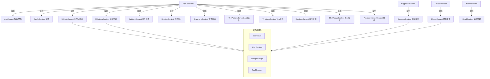

# contexts

## 概述

`contexts` 目录定义了 Gemini CLI UI 层的所有 React Context。这些 Context 实现了自上而下的状态分发机制，将应用状态、配置、用户操作、键盘事件、鼠标事件、滚动控制等从 `AppContainer` 传递到深层子组件。

## 目录结构

```
contexts/
├── AppContext.tsx           # 应用基础信息（版本号、启动警告）
├── ConfigContext.tsx        # 核心配置对象
├── UIStateContext.tsx       # UI 状态（历史记录、对话框、流式状态等全部 UI 状态）
├── UIActionsContext.tsx     # UI 操作回调（打开/关闭对话框、提交、选择等）
├── SettingsContext.tsx      # 用户设置（支持响应式更新）
├── SessionContext.tsx       # 会话统计（token 使用、API 调用等）
├── KeypressContext.tsx      # 键盘事件分发系统
├── MouseContext.tsx         # 鼠标事件分发系统
├── ScrollProvider.tsx       # 滚动管理（注册可滚动区域、分发滚动事件）
├── StreamingContext.tsx     # 流式状态（Idle / Responding / WaitingForConfirmation）
├── ToolActionsContext.tsx   # 工具确认操作（Accept / Reject / Cancel）
├── VimModeContext.tsx       # Vim 模式状态（启用/禁用、NORMAL/INSERT 模式）
├── OverflowContext.tsx      # 溢出检测（跟踪哪些组件内容溢出）
├── ShellFocusContext.tsx    # Shell 焦点状态
└── AskUserActionsContext.tsx # AI 向用户提问的对话框状态和操作
```

## 架构图



## 核心组件

### 应用状态 Context

| Context | 职责 | Provider 位置 |
|---------|------|--------------|
| `AppContext` | 提供应用版本号和启动警告列表 | AppContainer |
| `ConfigContext` | 提供 `Config` 配置对象（模型、认证、扩展等） | AppContainer |
| `UIStateContext` | 提供所有 UI 状态（230+ 字段的大对象） | AppContainer |
| `UIActionsContext` | 提供所有 UI 操作回调（40+ 方法） | AppContainer |
| `SettingsContext` | 提供用户设置，支持 `useSyncExternalStore` 响应式订阅 | AppContainer |
| `SessionContext` | 提供会话级统计（SessionStatsProvider 内部管理） | SessionStatsProvider |

### 事件分发 Context

| Context | 职责 | Provider 位置 |
|---------|------|--------------|
| `KeypressContext` | 键盘事件的发布/订阅系统，支持优先级 | KeypressProvider |
| `MouseContext` | 鼠标事件的发布/订阅系统 | MouseProvider |
| `ScrollProvider` | 滚动区域注册和鼠标滚轮事件分发 | ScrollProvider |

### 功能性 Context

| Context | 职责 | Provider 位置 |
|---------|------|--------------|
| `StreamingContext` | 当前流式状态（idle/responding/waiting） | App |
| `ToolActionsContext` | 工具确认操作（confirm/cancel），集成 IDE Diff | ToolActionsProvider |
| `VimModeContext` | Vim 模式开关和当前模式 | VimModeProvider |
| `OverflowContext` | 跟踪溢出的组件 ID 集合 | OverflowProvider |
| `ShellFocusContext` | Shell 是否获得焦点 | ShellFocusContext.Provider |
| `AskUserActionsContext` | AI 提问对话框的提交/取消回调 | AskUserActionsProvider |

## 依赖关系

### 内部依赖
- `../types.ts`: HistoryItem、StreamingState 等类型
- `../hooks/`: useHistoryManager、shellCommandProcessor 等
- `../utils/`: input、mouse 工具函数
- `../../config/settings.ts`: SettingScope、LoadedSettings
- `@google/gemini-cli-core`: Config、SessionMetrics、事件系统

### 外部依赖
- `react`: createContext、useContext、useState、useCallback 等
- `ink`: useStdin、getBoundingBox
- `mnemonist`: MultiMap（键盘事件优先级管理）

## 数据流

### UIState 数据流
```
AppContainer (状态所有者)
    ↓ 计算 UIState 对象
    ↓ 通过 UIStateContext.Provider 分发
    ↓
子组件 (通过 useUIState() 消费)
    ↓ 调用 UIActions 中的回调
    ↓ 通过 UIActionsContext.Provider 获取
    ↓
AppContainer (执行状态更新)
```

### 键盘事件分发机制
1. `KeypressProvider` 通过 `stdin.on('data')` 接收原始输入
2. 原始数据经 `emitKeys` 生成器解析为 `Key` 对象
3. 经过管道处理：粘贴缓冲 -> 反斜杠回车 -> 快速回车
4. 过滤非键盘事件（鼠标序列、焦点事件）
5. 按优先级广播（Critical > High > Normal > Low）
6. 同优先级内采用栈行为（后注册的先处理）
7. 任一 handler 返回 `true` 停止传播

### 设置响应式更新
1. `SettingsContext` 包装 `LoadedSettings` 对象
2. 组件通过 `useSettingsStore()` 订阅设置变更
3. 内部使用 `useSyncExternalStore` 确保变更时自动重渲染
4. `setSetting()` 调用 `LoadedSettings.setValue()` 触发变更事件
