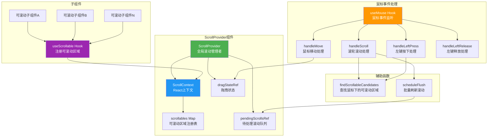

# ScrollProvider.tsx

## 概述

`ScrollProvider.tsx` 是 Gemini CLI 项目中负责**全局滚动管理**的 React 上下文提供者。它实现了一个集中式的滚动协调系统，管理终端 UI 中所有可滚动区域的注册、注销、鼠标滚轮滚动、滚动条拖拽等交互行为。

该文件基于 React Context API，提供了 `ScrollProvider` 组件和 `useScrollable` Hook，允许任意子组件将自身注册为可滚动区域，并由 `ScrollProvider` 统一处理鼠标事件分发。

**文件路径**: `packages/cli/src/ui/contexts/ScrollProvider.tsx`

## 架构图（Mermaid）



## 核心组件

### 1. 接口定义

#### `ScrollState`

描述可滚动区域的当前滚动状态：

| 属性 | 类型 | 说明 |
|------|------|------|
| `scrollTop` | `number` | 当前滚动偏移量（距顶部的距离） |
| `scrollHeight` | `number` | 内容总高度 |
| `innerHeight` | `number` | 可视区域高度 |

#### `ScrollableEntry`

每个可滚动区域的注册条目：

| 属性 | 类型 | 说明 |
|------|------|------|
| `id` | `string` | 唯一标识符 |
| `ref` | `React.RefObject<DOMElement>` | 对应 Ink DOM 元素的引用 |
| `getScrollState` | `() => ScrollState` | 获取当前滚动状态的回调 |
| `scrollBy` | `(delta: number) => void` | 按增量滚动 |
| `scrollTo` | `(scrollTop: number, duration?: number) => void` | 滚动到指定位置（可选，支持动画时长） |
| `hasFocus` | `() => boolean` | 是否拥有焦点 |
| `flashScrollbar` | `() => void` | 闪烁显示滚动条（提示用户可滚动） |

#### `ScrollContextType`

Context 暴露给消费者的接口：

| 方法 | 说明 |
|------|------|
| `register(entry)` | 注册一个可滚动区域 |
| `unregister(id)` | 注销一个可滚动区域 |

### 2. `findScrollableCandidates` 函数

这是一个纯辅助函数，用于在鼠标事件发生时，找到鼠标指针下所有匹配的可滚动区域。

**工作流程**:
1. 遍历所有已注册的 `scrollables`
2. 通过 Ink 的 `getBoundingBox` 获取每个区域的边界框
3. 判断鼠标坐标是否落在边界框内（注意：宽度额外加 1 以包含滚动条列）
4. 将所有命中的区域按面积**从小到大**排序（确保最内层/最小的区域优先）

### 3. `ScrollProvider` 组件

核心提供者组件，管理以下状态和逻辑：

#### 状态管理

- **`scrollables`** (`Map<string, ScrollableEntry>`): 所有已注册的可滚动区域映射表
- **`scrollablesRef`**: scrollables 的 ref 版本，避免事件处理器中的闭包陈旧问题
- **`pendingScrollsRef`** (`Map<string, number>`): 批量滚动队列，累积同一帧内的多次滚动
- **`flushScheduledRef`** (`boolean`): 标记是否已安排批量刷新
- **`dragStateRef`**: 滚动条拖拽状态（是否激活、目标 ID、偏移量）

#### `scheduleFlush` - 批量滚动刷新

使用 `setTimeout(fn, 0)` 实现微任务级别的批量刷新。同一事件循环内的多次滚动增量会被累积到 `pendingScrollsRef` 中，在下一个 tick 统一应用。这样可以避免快速滚轮事件导致的频繁重渲染。

#### `handleScroll` - 滚轮滚动处理

处理 `scroll-up` 和 `scroll-down` 事件：
1. 调用 `findScrollableCandidates` 找到鼠标下的可滚动区域
2. 按从内到外的顺序遍历候选区域
3. 检查当前区域是否还能继续滚动（考虑已累积的 pending delta）
4. 使用 epsilon（0.001）容差处理浮点精度问题
5. 找到第一个可以滚动的区域后，将 delta 累积到待处理队列并调度刷新

#### `handleLeftPress` - 鼠标左键按下处理

处理滚动条的点击和拖拽开始：

1. **滚动条交互检测**: 遍历所有有焦点的可滚动区域，检查点击是否在滚动条列上（`x + width` 位置）
2. **滑块（thumb）计算**:
   - 计算滑块高度：`Math.max(1, Math.floor((innerHeight / scrollHeight) * innerHeight))`
   - 计算当前滑块的 Y 位置
   - 扩展命中区域（非边界位置各扩展 1 像素）
3. **点击类型判断**:
   - **滑块点击**: 记录偏移量，准备进入拖拽模式
   - **轨道点击**: 将滑块中心跳转到点击位置，然后进入拖拽模式
4. **闪烁滚动条**: 如果点击在可滚动内容区域内但不在滚动条上，则对最内层区域闪烁滚动条

#### `handleMove` - 鼠标移动处理（拖拽滚动条）

当拖拽状态激活时：
1. 根据鼠标当前 Y 坐标和初始偏移量计算目标滑块位置
2. 将滑块位置映射为 scrollTop 值
3. 优先使用 `scrollTo`（如果可用），否则用 `scrollBy` 实现

#### `handleLeftRelease` - 鼠标左键释放

重置拖拽状态，结束滚动条拖拽交互。

#### 鼠标事件监听

通过 `useMouse` Hook 注册全局鼠标事件监听器，分发到对应的处理函数：

| 事件 | 处理函数 |
|------|---------|
| `scroll-up` | `handleScroll('up', ...)` |
| `scroll-down` | `handleScroll('down', ...)` |
| `left-press` | `handleLeftPress(...)` |
| `move` | `handleMove(...)` |
| `left-release` | `handleLeftRelease()` |

### 4. `useScrollable` Hook

供子组件使用的注册 Hook：

```typescript
export const useScrollable = (
  entry: Omit<ScrollableEntry, 'id'>,
  isActive: boolean,
) => { ... }
```

**功能**:
- 自动生成唯一 ID（`scrollable-0`, `scrollable-1`, ...）使用模块级自增计数器 `nextId`
- 当 `isActive` 为 `true` 时，将组件注册到 ScrollProvider
- 组件卸载或 `isActive` 变为 `false` 时自动注销
- 必须在 `ScrollProvider` 内使用，否则抛出错误

## 依赖关系

### 内部依赖

| 依赖 | 路径 | 用途 |
|------|------|------|
| `useMouse` Hook | `../hooks/useMouse.js` | 全局鼠标事件监听（滚轮、点击、拖拽等） |
| `MouseEvent` 类型 | `../hooks/useMouse.js` | 鼠标事件类型定义（包含 `col`、`row`、`name` 等字段） |

### 外部依赖

| 依赖 | 版本/来源 | 用途 |
|------|-----------|------|
| `react` | npm | `createContext`、`useCallback`、`useContext`、`useEffect`、`useMemo`、`useRef`、`useState` |
| `ink` | npm | `getBoundingBox`（获取 Ink DOM 元素边界框）、`DOMElement` 类型 |

## 关键实现细节

### 1. 嵌套滚动区域处理

当鼠标位于多个嵌套的可滚动区域之上时，系统通过**面积排序**（从小到大）确保最内层的区域优先接收滚动事件。只有当内层区域无法继续滚动时，滚动事件才会冒泡到外层区域。

### 2. 批量滚动优化

使用 `pendingScrollsRef` + `scheduleFlush` 实现了一个简单的批处理机制。多个快速连续的滚轮事件不会立即触发 `scrollBy`，而是先累积 delta 值，通过 `setTimeout(fn, 0)` 在下一个事件循环统一应用。这避免了快速滚动时的重复渲染开销。

### 3. 滚动条拖拽的精确计算

滚动条拖拽使用了标准的滑块映射算法：
- **滑块高度** = `max(1, floor((visibleHeight / totalHeight) * visibleHeight))`
- **滑块位置** = `(scrollTop / maxScrollTop) * maxThumbY`
- 拖拽时通过记录初始偏移量（`offset`）确保滑块不会跳动
- 轨道点击时将滑块中心对齐到点击位置

### 4. 命中区域扩展

- 滚动条宽度检测时，`width` 额外加 1 以包含滚动条所在列
- 滑块命中区域在非边界位置各扩展 1 像素，提高拖拽的易用性

### 5. 浮点精度容差

在判断是否可以继续滚动时，使用 `0.001` 的 epsilon 值来避免浮点运算累积误差导致的边界判断错误。

### 6. 模块级 ID 计数器

`nextId` 是模块级变量，通过闭包在 `useScrollable` 中使用 `useState(() => ...)` 的惰性初始化确保每个可滚动组件实例获得唯一且稳定的 ID。注意：此计数器在模块生命周期内持续递增，不会因组件卸载而回收。

### 7. Ref 与 State 双轨同步

`scrollables` 同时维护为 state（用于触发重渲染和 Context 更新）和 ref（`scrollablesRef`，用于事件处理器中访问最新值避免闭包陈旧问题）。这是 React 中处理事件回调和最新状态之间同步的经典模式。
