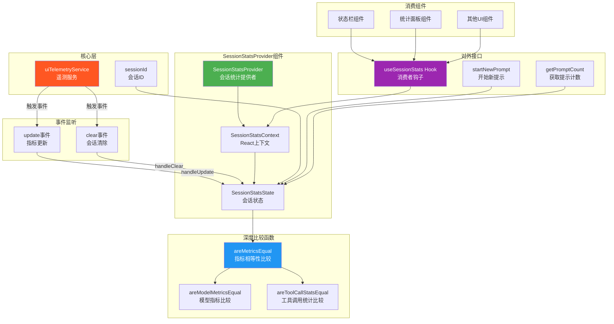

# SessionContext.tsx

## 概述

`SessionContext.tsx` 是 Gemini CLI 项目中负责**会话统计信息管理**的 React 上下文提供者。它追踪和维护当前 CLI 会话的各项指标数据，包括 API 调用指标、Token 使用量、工具调用统计、文件变更统计等。

该文件通过监听核心层 `uiTelemetryService` 的事件来获取实时更新的指标数据，并通过 React Context 将这些数据分发给 UI 层的消费组件。同时，它还实现了深度比较优化，避免指标数据未变化时触发不必要的重渲染。

**文件路径**: `packages/cli/src/ui/contexts/SessionContext.tsx`

## 架构图（Mermaid）



## 核心组件

### 1. 枚举定义

#### `ToolCallDecision`

工具调用决策类型：

| 值 | 说明 |
|---|------|
| `ACCEPT` | 用户接受工具调用 |
| `REJECT` | 用户拒绝工具调用 |
| `MODIFY` | 用户修改后执行 |
| `AUTO_ACCEPT` | 自动接受（无需用户确认） |

### 2. 接口定义

#### `SessionStatsState`

会话统计状态的核心数据结构：

| 属性 | 类型 | 说明 |
|------|------|------|
| `sessionId` | `string` | 当前会话唯一标识符 |
| `sessionStartTime` | `Date` | 会话开始时间 |
| `metrics` | `SessionMetrics` | 来自核心层的完整指标数据 |
| `lastPromptTokenCount` | `number` | 上一次提示的 Token 数量 |
| `promptCount` | `number` | 当前会话中的提示总数 |

#### `ComputedSessionStats`

计算后的会话统计（导出供外部使用）：

| 属性 | 类型 | 说明 |
|------|------|------|
| `totalApiTime` | `number` | API 调用总耗时 |
| `totalToolTime` | `number` | 工具执行总耗时 |
| `agentActiveTime` | `number` | Agent 活跃总时间 |
| `apiTimePercent` | `number` | API 时间占比 |
| `toolTimePercent` | `number` | 工具时间占比 |
| `cacheEfficiency` | `number` | 缓存效率 |
| `totalDecisions` | `number` | 决策总数 |
| `successRate` | `number` | 成功率 |
| `agreementRate` | `number` | 同意率 |
| `totalCachedTokens` | `number` | 缓存 Token 总数 |
| `totalInputTokens` | `number` | 输入 Token 总数 |
| `totalPromptTokens` | `number` | 提示 Token 总数 |
| `totalLinesAdded` | `number` | 新增行数总计 |
| `totalLinesRemoved` | `number` | 删除行数总计 |

#### `SessionStatsContextValue`

Context 暴露给消费者的完整接口：

| 属性/方法 | 类型 | 说明 |
|-----------|------|------|
| `stats` | `SessionStatsState` | 当前会话统计状态 |
| `startNewPrompt` | `() => void` | 标记新提示开始，递增 promptCount |
| `getPromptCount` | `() => number` | 获取当前提示计数 |

### 3. 深度比较函数

为避免不必要的重渲染，该文件实现了三个层级的深度比较函数：

#### `areModelMetricsEqual(a, b)`
比较两个 `ModelMetrics` 对象是否相等，逐字段比较：
- **API 指标**: `totalRequests`、`totalErrors`、`totalLatencyMs`
- **Token 指标**: `input`、`prompt`、`candidates`、`total`、`cached`、`thoughts`、`tool`

#### `areToolCallStatsEqual(a, b)`
比较两个 `ToolCallStats` 对象是否相等：
- **基础统计**: `count`、`success`、`fail`、`durationMs`
- **决策统计**: 四种决策类型（ACCEPT、REJECT、MODIFY、AUTO_ACCEPT）的计数

#### `areMetricsEqual(a, b)`
顶层比较函数，比较两个完整的 `SessionMetrics`：
1. 引用相等性快速路径
2. 文件指标比较（`totalLinesAdded`、`totalLinesRemoved`）
3. 工具聚合指标比较（`totalCalls`、`totalSuccess`、`totalFail`、`totalDurationMs`）
4. 工具决策总计比较
5. `tools.byName` 逐工具比较（先比较键数，再逐个调用 `areToolCallStatsEqual`）
6. `models` 逐模型比较（先比较键数，再逐个调用 `areModelMetricsEqual`）

### 4. `SessionStatsProvider` 组件

核心提供者组件的工作流程：

#### 初始化
- 使用 `sessionId`（从核心层导入）作为初始会话 ID
- 设置 `sessionStartTime` 为当前时间
- 通过 `uiTelemetryService.getMetrics()` 获取初始指标数据
- `promptCount` 从 0 开始

#### 事件监听（useEffect）
- **`update` 事件**: 当遥测服务有新数据时触发。在 `handleUpdate` 中使用 `areMetricsEqual` 比较，仅在数据实际变化时才更新 state
- **`clear` 事件**: 会话清除时触发。重置 `sessionStartTime`、`promptCount`，可选更新 `sessionId`
- 立即调用一次 `handleUpdate` 获取初始数据
- 组件卸载时清理事件监听器

#### `startNewPrompt`
使用 `useCallback` 缓存的回调函数，每次调用将 `promptCount` 加 1。

#### `getPromptCount`
返回当前的 `promptCount`，依赖 `stats.promptCount` 的变化进行更新。

### 5. `useSessionStats` Hook

消费者 Hook，从 Context 中获取会话统计数据和操作方法。如果在 `SessionStatsProvider` 外部使用，会抛出明确的错误信息。

## 依赖关系

### 内部依赖

| 依赖 | 来源 | 用途 |
|------|------|------|
| `SessionMetrics` 类型 | `@google/gemini-cli-core` | 会话指标数据类型定义 |
| `ModelMetrics` 类型 | `@google/gemini-cli-core` | 模型级别指标数据类型定义 |
| `ToolCallStats` 类型 | `@google/gemini-cli-core` | 工具调用统计数据类型定义 |
| `uiTelemetryService` | `@google/gemini-cli-core` | 遥测服务实例，提供事件监听和指标获取 |
| `sessionId` | `@google/gemini-cli-core` | 全局会话唯一标识符 |

### 外部依赖

| 依赖 | 版本/来源 | 用途 |
|------|-----------|------|
| `react` | npm | `createContext`、`useCallback`、`useContext`、`useState`、`useMemo`、`useEffect` |

## 关键实现细节

### 1. 手动深度比较优化

该文件没有使用通用的深度比较库（如 `lodash.isEqual`），而是为每种数据类型手写了专用的比较函数。这种方式的优势：
- **性能优化**: 逐字段比较避免了通用深比较的递归遍历开销
- **短路求值**: 一旦发现不相等立即返回 `false`
- **引用相等快速路径**: `areMetricsEqual` 首先检查 `a === b`

这些比较函数在 `setStats` 的更新函数中被调用。如果新旧 metrics 相等，则返回 `prevState`（同一引用），React 不会触发重渲染。

### 2. 事件驱动的数据流

数据流向为单向：
```
uiTelemetryService (核心层) → 事件 → SessionStatsProvider → Context → 消费组件
```

Provider 不直接查询核心层的状态（除了初始化时），而是被动地监听 `update` 和 `clear` 事件。这种事件驱动模式解耦了核心层和 UI 层。

### 3. 会话重置机制

`clear` 事件处理器支持可选的新 `sessionId` 参数，当用户使用 `/clear` 命令重置会话时：
- 更新 `sessionId`（如有新值）
- 重置 `sessionStartTime` 为当前时间
- 重置 `promptCount` 为 0
- 注意：不会重置 `metrics`，因为 metrics 的重置由核心层的下一个 `update` 事件负责

### 4. 导出类型的再导出

文件通过 `export type { SessionMetrics, ModelMetrics }` 将核心层的类型再导出，使得 UI 层的其他文件可以直接从此 Context 文件导入这些类型，而不需要直接依赖 `@google/gemini-cli-core`。

### 5. ComputedSessionStats 的设计意图

`ComputedSessionStats` 接口虽然在此文件中定义和导出，但并未在 Provider 内计算。它的设计意图是由消费组件根据 `SessionStatsState` 中的原始数据自行计算派生值，遵循了"存储最小化原始数据，按需计算派生数据"的原则。
