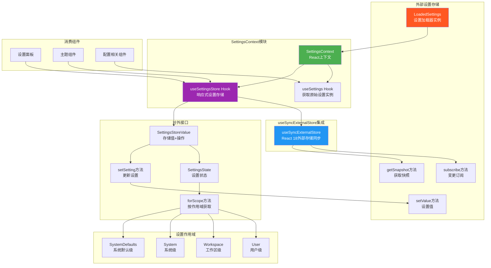

# SettingsContext.tsx

## 概述

`SettingsContext.tsx` 是 Gemini CLI 项目中负责**设置/配置管理**的 React 上下文模块。它为 UI 层提供了一个响应式的设置存储系统，支持多层级配置作用域（用户、工作区、系统、系统默认），并利用 React 18 的 `useSyncExternalStore` API 实现了与外部设置存储的高效同步。

该文件设计精炼，仅包含 Context 定义和两个消费者 Hook，不包含 Provider 组件（Provider 在外部构建并传入 `LoadedSettings` 实例）。

**文件路径**: `packages/cli/src/ui/contexts/SettingsContext.tsx`

## 架构图（Mermaid）



## 核心组件

### 1. Context 定义

```typescript
export const SettingsContext = React.createContext<LoadedSettings | undefined>(undefined);
```

Context 的值类型为 `LoadedSettings | undefined`。`LoadedSettings` 是一个外部存储实例，提供 `subscribe`、`getSnapshot`、`setValue` 等方法。Provider 组件不在此文件中定义，而是由上层组件直接使用 `<SettingsContext.Provider value={loadedSettings}>` 注入。

### 2. 接口定义

#### `SettingsState`

继承自 `LoadedSettingsSnapshot`，并扩展了一个便捷方法：

| 属性/方法 | 类型 | 说明 |
|-----------|------|------|
| （继承自 `LoadedSettingsSnapshot`） | - | 包含 `user`、`workspace`、`system`、`systemDefaults` 等字段 |
| `forScope` | `(scope: LoadableSettingScope) => SettingsFile` | 根据作用域枚举值获取对应的设置文件对象 |

#### `SettingsStoreValue`

暴露给消费组件的完整接口：

| 属性/方法 | 类型 | 说明 |
|-----------|------|------|
| `settings` | `SettingsState` | 当前设置快照（含 `forScope` 便捷方法） |
| `setSetting` | `(scope, key, value) => void` | 更新指定作用域下的指定设置项 |

### 3. `useSettings` Hook

最基础的消费者 Hook，直接返回 `LoadedSettings` 实例：

```typescript
export const useSettings = (): LoadedSettings => {
  const context = useContext(SettingsContext);
  if (context === undefined) {
    throw new Error('useSettings must be used within a SettingsProvider');
  }
  return context;
};
```

**特点**:
- 返回原始的 `LoadedSettings` 实例，不经过 `useSyncExternalStore` 处理
- 适合需要直接访问底层 API 而不需要响应式更新的场景
- 当 Context 为 `undefined` 时抛出明确错误

### 4. `useSettingsStore` Hook

高级消费者 Hook，提供响应式的设置数据和修改能力：

#### 工作流程

1. **获取 store 实例**: 从 `SettingsContext` 获取 `LoadedSettings` 实例
2. **同步外部存储**: 使用 `useSyncExternalStore` 订阅设置变更
   - `subscribe`: 将 React 的 listener 注册到 store 的变更事件
   - `getSnapshot`: 获取当前设置快照
3. **构建 SettingsState**: 使用 `useMemo` 基于快照创建带 `forScope` 方法的增强对象
4. **构建返回值**: 使用 `useMemo` 组合 `settings` 和 `setSetting`

#### `forScope` 方法

通过 switch 语句将 `SettingScope` 枚举映射到对应的设置文件：

| 作用域 | 返回值 |
|--------|--------|
| `SettingScope.User` | `snapshot.user` |
| `SettingScope.Workspace` | `snapshot.workspace` |
| `SettingScope.System` | `snapshot.system` |
| `SettingScope.SystemDefaults` | `snapshot.systemDefaults` |

使用 `checkExhaustive(scope)` 确保穷尽性检查，如果将来添加新的作用域但忘记处理，TypeScript 编译器会报错。

#### `setSetting` 方法

代理调用 `store.setValue(scope, key, value)`，为消费组件提供统一的设置修改接口。

## 依赖关系

### 内部依赖

| 依赖 | 路径 | 用途 |
|------|------|------|
| `LoadableSettingScope` 类型 | `../../config/settings.js` | 可加载的设置作用域类型 |
| `LoadedSettings` 类型 | `../../config/settings.js` | 已加载设置的实例类型（含 subscribe/getSnapshot/setValue） |
| `LoadedSettingsSnapshot` 类型 | `../../config/settings.js` | 设置快照类型（user/workspace/system/systemDefaults） |
| `SettingsFile` 类型 | `../../config/settings.js` | 单个设置文件类型 |
| `SettingScope` 枚举 | `../../config/settings.js` | 设置作用域枚举（User/Workspace/System/SystemDefaults） |
| `checkExhaustive` | `@google/gemini-cli-core` | TypeScript 穷尽性检查辅助函数 |

### 外部依赖

| 依赖 | 版本/来源 | 用途 |
|------|-----------|------|
| `react` | npm | `React`（命名空间导入）、`useContext`、`useMemo`、`useSyncExternalStore` |

## 关键实现细节

### 1. useSyncExternalStore 的使用

这是 React 18 引入的官方 API，专为订阅外部数据源设计。与传统的 `useEffect` + `useState` 模式相比：
- **避免撕裂（tearing）**: 在并发模式下保证 UI 一致性
- **自动去重**: 只有 `getSnapshot()` 返回的引用变化时才触发重渲染
- **无需手动管理订阅生命周期**: React 自动处理订阅和取消订阅

```typescript
const snapshot = useSyncExternalStore(
  (listener) => store.subscribe(listener),  // 订阅函数，返回取消订阅函数
  () => store.getSnapshot(),                // 获取当前快照
);
```

### 2. 无内置 Provider 组件

与其他 Context 文件不同，`SettingsContext.tsx` 没有定义 Provider 组件。它只导出 `SettingsContext` 本身，由上层组件负责创建 `LoadedSettings` 实例并通过 `<SettingsContext.Provider>` 注入。这种设计将"设置加载逻辑"与"设置消费逻辑"解耦。

### 3. 双层 useMemo 优化

`useSettingsStore` 使用了两层 `useMemo`：
1. **第一层**: 基于 `snapshot` 构建 `SettingsState`（添加 `forScope` 方法）
2. **第二层**: 基于 `settings` 和 `store` 构建最终返回值

这确保只有在实际依赖变化时才重新创建对象，避免消费组件因引用变化而不必要地重渲染。

### 4. 穷尽性检查

`forScope` 方法的 `default` 分支调用 `checkExhaustive(scope)`。这是一个 TypeScript 技巧：当所有可能的枚举值都已被 case 覆盖时，`scope` 的类型在 default 分支中变为 `never`。如果未来新增了枚举值但忘记添加对应的 case，TypeScript 会在编译时报错。

### 5. 两个 Hook 的分工

- **`useSettings`**: 轻量级，直接返回 store 实例，不触发响应式更新。适合只需要调用 store 方法而不需要监听变化的场景。
- **`useSettingsStore`**: 完整的响应式方案，通过 `useSyncExternalStore` 自动感知变化并触发重渲染。适合需要在 UI 中展示设置值的组件。
