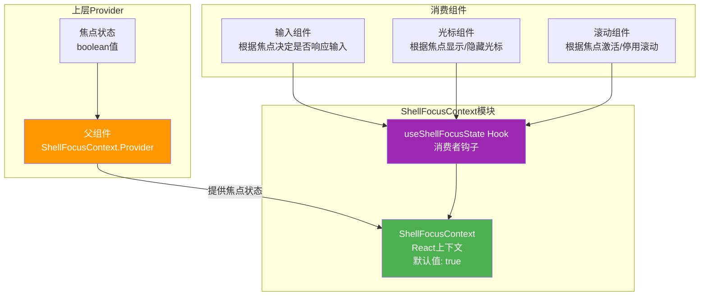

# ShellFocusContext.tsx

## 概述

`ShellFocusContext.tsx` 是 Gemini CLI 项目中负责**Shell 焦点状态管理**的 React 上下文模块。它提供了一个简洁的布尔值上下文，用于追踪当前终端 Shell 是否处于焦点状态（即是否被用户活跃操作）。

这是整个 Context 体系中最精简的模块，仅包含 Context 定义和一个消费者 Hook，共 12 行代码（含许可证头）。

**文件路径**: `packages/cli/src/ui/contexts/ShellFocusContext.tsx`

## 架构图（Mermaid）



## 核心组件

### 1. Context 定义

```typescript
export const ShellFocusContext = createContext<boolean>(true);
```

- **类型**: `boolean`
- **默认值**: `true`（Shell 默认处于焦点状态）
- **语义**: `true` 表示 Shell 当前拥有焦点，`false` 表示 Shell 失去焦点（例如用户切换到其他面板或覆盖层）

默认值为 `true` 意味着在没有 Provider 包裹的情况下，所有消费组件都会假定 Shell 处于焦点状态，这是一个合理的安全默认值。

### 2. `useShellFocusState` Hook

```typescript
export const useShellFocusState = () => useContext(ShellFocusContext);
```

一个极简的消费者 Hook，直接透传 `useContext` 的返回值。

**特点**:
- 返回类型为 `boolean`
- 不包含 `undefined` 检查（因为 Context 有默认值 `true`，永远不会是 `undefined`）
- 不会抛出错误，即使在 Provider 外部使用也会返回默认值 `true`

## 依赖关系

### 内部依赖

无。此模块不依赖项目中的其他模块。

### 外部依赖

| 依赖 | 版本/来源 | 用途 |
|------|-----------|------|
| `react` | npm | `createContext`、`useContext` |

## 关键实现细节

### 1. 无 Provider 组件

与 `SettingsContext` 类似，此文件不包含 Provider 组件。Provider 的创建和焦点状态的管理由上层组件负责。上层组件通常会监听终端焦点事件，并通过 `<ShellFocusContext.Provider value={isFocused}>` 将当前焦点状态传递给子组件树。

### 2. 安全的默认值设计

`createContext<boolean>(true)` 提供了默认值 `true`，这意味着：
- 消费组件在 Provider 之外使用时不会出错
- 不需要进行 `undefined` 检查
- 默认假设 Shell 拥有焦点是一种"失效安全"设计——即使焦点检测机制出现问题，UI 也会正常响应用户输入

### 3. 极简设计原则

整个文件只有两行有效代码。这种设计体现了：
- **单一职责原则**: 仅负责焦点状态的上下文传递
- **关注点分离**: 焦点状态的计算逻辑不在此文件中
- **最小 API**: 只暴露必要的接口

### 4. 典型使用场景

Shell 焦点状态通常用于以下场景：
- **输入处理**: 当 Shell 失去焦点时，禁用文本输入或快捷键响应
- **光标显示**: 当 Shell 失去焦点时，隐藏或改变光标样式
- **滚动控制**: 在失去焦点时暂停自动滚动或禁用鼠标滚轮处理
- **动画/更新**: 在失去焦点时暂停非必要的 UI 更新以节省资源

### 5. 与 ScrollProvider 的关联

`ScrollProvider` 中的 `ScrollableEntry` 接口包含 `hasFocus()` 方法，该方法的实现可能间接使用了 `ShellFocusContext` 来判断当前 Shell 的焦点状态，从而决定是否响应鼠标滚轮等交互事件。
