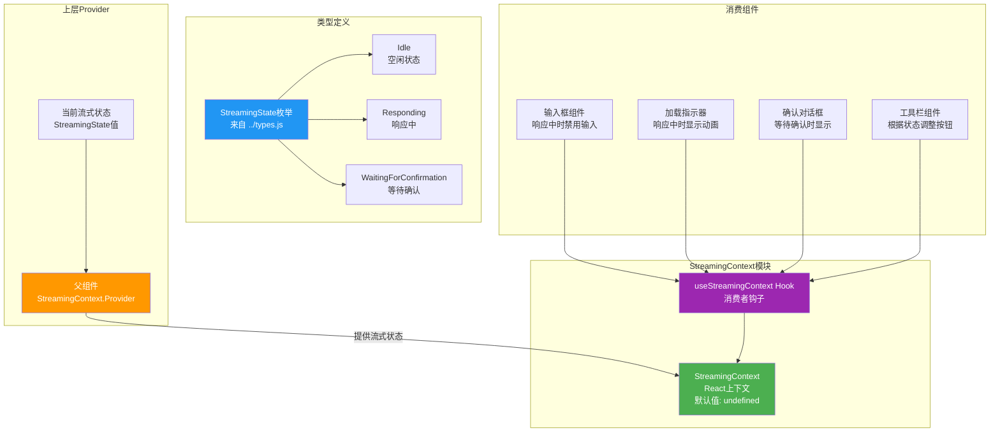
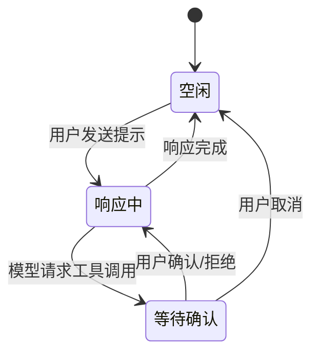

# StreamingContext.tsx

## 概述

`StreamingContext.tsx` 是 Gemini CLI 项目中负责**流式响应状态管理**的 React 上下文模块。它追踪 AI 模型当前的流式交互状态，让 UI 组件能够根据模型是否正在响应、是否空闲或是否等待用户确认来调整自身行为和展示。

该文件与 `ShellFocusContext` 类似，采用极简设计，仅包含 Context 定义和一个消费者 Hook。

**文件路径**: `packages/cli/src/ui/contexts/StreamingContext.tsx`

## 架构图（Mermaid）



## 核心组件

### 1. `StreamingState` 枚举（引用类型）

`StreamingState` 定义在 `../types.js` 中，表示 AI 模型的流式交互状态：

| 枚举值 | 字符串值 | 说明 |
|--------|----------|------|
| `Idle` | `'idle'` | 空闲状态，模型没有在处理请求 |
| `Responding` | `'responding'` | 响应中，模型正在生成流式输出 |
| `WaitingForConfirmation` | `'waiting_for_confirmation'` | 等待用户确认，通常是工具调用需要用户批准 |

### 2. Context 定义

```typescript
export const StreamingContext = createContext<StreamingState | undefined>(undefined);
```

- **类型**: `StreamingState | undefined`
- **默认值**: `undefined`
- **语义**: 当值为 `undefined` 时表示 Context 未被 Provider 包裹（错误状态）

与 `ShellFocusContext` 不同，此 Context 的默认值为 `undefined`，这意味着它**必须**在 Provider 内使用。

### 3. `useStreamingContext` Hook

```typescript
export const useStreamingContext = (): StreamingState => {
  const context = React.useContext(StreamingContext);
  if (context === undefined) {
    throw new Error(
      'useStreamingContext must be used within a StreamingContextProvider',
    );
  }
  return context;
};
```

消费者 Hook，具备安全检查：

**特点**:
- 返回类型为 `StreamingState`（非 `undefined`），通过运行时检查保证类型安全
- 如果在 `StreamingContextProvider` 外部使用，抛出明确的错误信息
- 使用 `React.useContext` 而非直接导入 `useContext`（与文件顶部同时导入 `React` 命名空间和 `createContext` 的风格一致）

## 依赖关系

### 内部依赖

| 依赖 | 路径 | 用途 |
|------|------|------|
| `StreamingState` 类型 | `../types.js` | 流式交互状态枚举（Idle / Responding / WaitingForConfirmation） |

### 外部依赖

| 依赖 | 版本/来源 | 用途 |
|------|-----------|------|
| `react` | npm | `React`（命名空间导入）、`createContext` |

## 关键实现细节

### 1. 严格的 Provider 要求

与 `ShellFocusContext`（默认值 `true`，可在 Provider 外使用）不同，`StreamingContext` 的默认值为 `undefined`，并在 `useStreamingContext` 中进行了显式的 `undefined` 检查。这是一种**故意的设计选择**：

- 流式状态是应用的核心运行状态，不应有"默认猜测值"
- 如果组件在 Provider 外部意外使用，应该立即崩溃而非静默使用错误的默认值
- 这种"快速失败"模式有助于开发阶段尽早发现组件树配置问题

### 2. 无 Provider 组件

与 `ShellFocusContext` 和 `SettingsContext` 相同，此文件不包含 Provider 组件。Provider 由上层组件负责创建，通常会结合核心层的事件系统来驱动状态变化。Provider 的典型实现形式为：

```tsx
<StreamingContext.Provider value={currentStreamingState}>
  {children}
</StreamingContext.Provider>
```

### 3. 状态机语义

`StreamingState` 的三个值构成了一个简单的状态机：



### 4. UI 层的状态影响

不同的流式状态会影响多个 UI 组件的行为：

| 状态 | 输入框 | 加载指示器 | 工具确认框 | 停止按钮 |
|------|--------|-----------|-----------|---------|
| `Idle` | 可编辑 | 隐藏 | 隐藏 | 隐藏 |
| `Responding` | 禁用/只读 | 显示动画 | 隐藏 | 显示 |
| `WaitingForConfirmation` | 禁用 | 暂停/特殊状态 | 显示 | 可能隐藏 |

### 5. 与 SessionContext 的协作

当流式状态从 `Idle` 变为 `Responding` 时，通常意味着一次新的提示开始处理。此时 `SessionContext` 的 `startNewPrompt` 可能会被调用以递增提示计数。两个 Context 共同协作，分别管理"当前正在做什么"（StreamingContext）和"累计做了什么"（SessionContext）两个维度的会话信息。

### 6. 导入风格说明

该文件同时使用了命名空间导入（`import React`）和具名导入（`import { createContext }`），然后在代码中混用了 `createContext`（直接调用）和 `React.useContext`（通过命名空间调用）。这虽然不影响功能，但在风格上与其他 Context 文件（如 `ShellFocusContext` 仅使用具名导入）略有差异。
