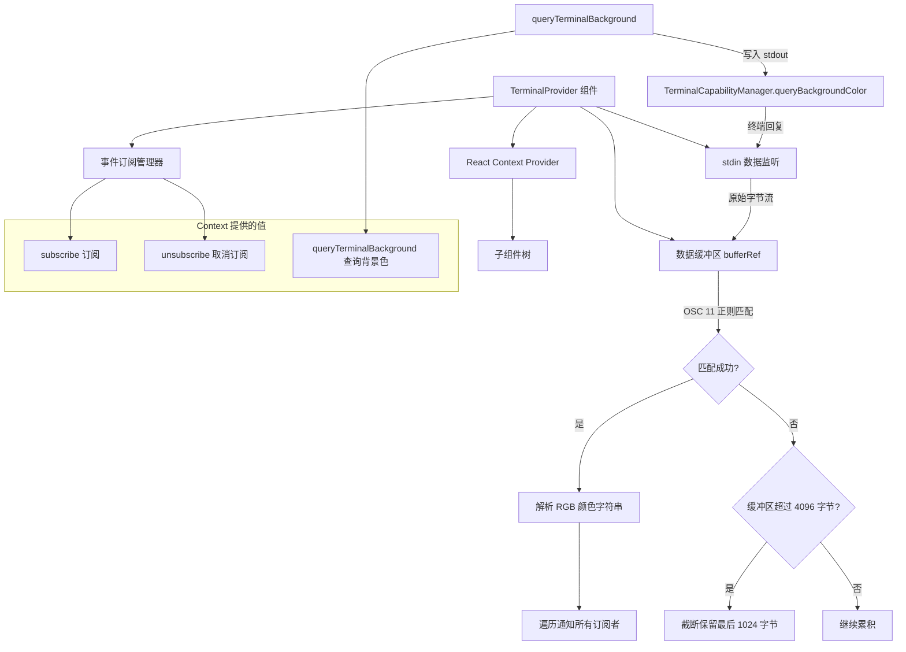

# TerminalContext.tsx

## 概述

`TerminalContext.tsx` 是 Gemini CLI 终端能力感知系统的核心上下文模块。它通过 React Context 机制为整个 UI 组件树提供终端事件的订阅/取消订阅能力，以及终端背景色查询功能。该模块主要用于检测终端的 OSC 11 背景色响应，从而让 UI 能够根据终端主题（深色/浅色）做出自适应渲染。

核心职责：
- 监听终端 stdin 的原始数据流，解析 OSC 11 协议响应
- 提供发布-订阅模式的事件分发机制
- 封装终端背景色查询的异步流程（带超时保护）
- 管理数据缓冲区，处理流式数据拼接与安全截断

## 架构图（Mermaid）



## 核心组件

### 1. 类型定义

#### `TerminalEventHandler`
```typescript
export type TerminalEventHandler = (event: string) => void;
```
终端事件处理函数的类型签名。`event` 参数为解析后的颜色字符串，格式为 `rgb:RRRR/GGGG/BBBB`。

#### `TerminalContextValue`
```typescript
interface TerminalContextValue {
  subscribe: (handler: TerminalEventHandler) => void;
  unsubscribe: (handler: TerminalEventHandler) => void;
  queryTerminalBackground: () => Promise<void>;
}
```
Context 向消费者暴露的三个核心方法。

### 2. `useTerminalContext()` Hook

自定义 Hook，用于在子组件中安全地获取 TerminalContext 的值。内置了 Context 存在性检查，若在 `TerminalProvider` 外部调用会抛出明确的错误提示。

### 3. `TerminalProvider` 组件

核心 Provider 组件，负责整个终端事件系统的生命周期管理。

#### 内部状态

| 状态/引用 | 类型 | 说明 |
|-----------|------|------|
| `stdin` | `NodeJS.ReadStream` | 通过 Ink 的 `useStdin()` 获取的标准输入流 |
| `stdout` | `NodeJS.WriteStream` | 通过 Ink 的 `useStdout()` 获取的标准输出流 |
| `subscribers` | `Set<TerminalEventHandler>` | 通过 `useRef` 维护的订阅者集合，跨渲染周期保持稳定 |
| `bufferRef` | `string` | 用于累积 stdin 数据的字符串缓冲区引用 |

#### 核心方法

**`subscribe(handler)`**
将事件处理函数添加到订阅者集合中。使用 `useCallback` 包装以保持引用稳定性。

**`unsubscribe(handler)`**
从订阅者集合中移除事件处理函数。使用 `useCallback` 包装。

**`queryTerminalBackground()`**
异步方法，封装了完整的终端背景色查询流程：
1. 创建一个 Promise
2. 注册一个一次性事件处理器（收到响应后自动取消订阅）
3. 调用 `TerminalCapabilityManager.queryBackgroundColor(stdout)` 向终端发送 OSC 11 查询序列
4. 设置 100ms 超时保护，防止终端不支持 OSC 11 时 Promise 永远挂起

#### stdin 数据处理（useEffect）

在组件挂载时注册 stdin 的 `data` 事件监听器，核心处理逻辑：

1. **数据累积**：将接收到的 Buffer 或字符串数据追加到 `bufferRef.current`
2. **OSC 11 匹配**：使用 `TerminalCapabilityManager.OSC_11_REGEX` 正则表达式检测缓冲区中是否包含 OSC 11 响应
3. **成功分支**：若匹配成功，提取 RGB 分量构造 `rgb:R/G/B` 格式字符串，遍历所有订阅者进行通知，然后从缓冲区中移除已处理部分
4. **安全阀机制**：若缓冲区长度超过 4096 字节且仍未匹配，截断缓冲区只保留最后 1024 字节，避免内存泄漏。保留尾部数据是为了防止截断不完整的 OSC 序列

组件卸载时自动移除 `data` 事件监听器，防止内存泄漏。

## 依赖关系

### 内部依赖

| 模块 | 路径 | 用途 |
|------|------|------|
| `TerminalCapabilityManager` | `../utils/terminalCapabilityManager.js` | 提供 OSC 11 背景色查询方法 `queryBackgroundColor()` 和 OSC 11 响应匹配正则 `OSC_11_REGEX` |

### 外部依赖

| 包名 | 导入内容 | 用途 |
|------|----------|------|
| `ink` | `useStdin`, `useStdout` | 获取 Ink 框架管理的标准输入/输出流 |
| `react` | `createContext`, `useCallback`, `useContext`, `useEffect`, `useRef` | React 核心 Hook 和 Context API |
| `react` (类型) | `React` (type import) | 用于 `React.ReactNode` 类型标注 |

## 关键实现细节

1. **发布-订阅模式**：使用 `Set<TerminalEventHandler>` 管理订阅者，天然支持去重。通过 `useRef` 而非 `useState` 持有订阅者集合，避免订阅/取消订阅操作触发不必要的重渲染。

2. **流式缓冲区设计**：终端的 OSC 11 响应可能分多次 `data` 事件到达，因此采用累积缓冲区 `bufferRef` 拼接数据直到完整匹配。缓冲区同样使用 `useRef` 避免触发渲染。

3. **安全阀机制（4096/1024）**：当缓冲区超过 4096 字节仍未匹配到 OSC 11 响应时，保守地截断到最后 1024 字节。这防止了在不支持 OSC 11 的终端中缓冲区无限增长导致内存泄漏，同时保留尾部数据避免切断正在接收的不完整序列。

4. **100ms 超时保护**：`queryTerminalBackground()` 中的 `setTimeout` 确保即使终端不响应 OSC 11 查询，Promise 也会在 100ms 后自动 resolve，不会阻塞调用方。注意使用了先 `unsubscribe` 再 `resolve` 的顺序，确保清理干净。

5. **一次性订阅模式**：`queryTerminalBackground()` 内部创建的 handler 在收到第一个事件后立即取消订阅自身（`unsubscribe(handler)`），实现了"查询一次、响应一次"的语义。

6. **OSC 11 协议**：OSC（Operating System Command）11 是 xterm 兼容终端的标准查询序列，用于获取终端当前背景色。响应格式通常为 `\x1b]11;rgb:RRRR/GGGG/BBBB\x1b\\` 或 `\x1b]11;rgb:RRRR/GGGG/BBBB\x07`。
