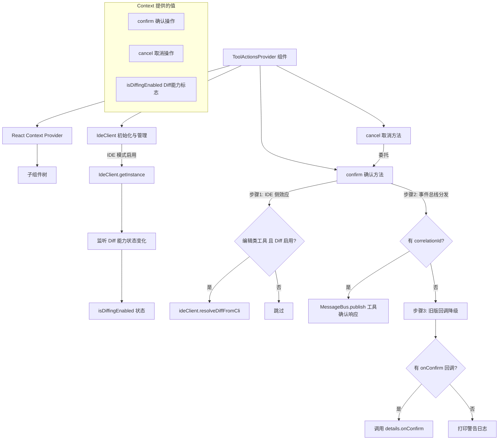

# ToolActionsContext.tsx

## 概述

`ToolActionsContext.tsx` 是 Gemini CLI 工具操作确认系统的核心上下文模块。它通过 React Context 为 UI 组件提供统一的工具调用确认（confirm）和取消（cancel）操作接口。该模块封装了工具确认的多种分发策略：IDE Diff 侧效应处理、事件总线分发、以及兼容旧版回调函数的降级方案。

核心职责：
- 提供统一的工具确认/取消 API 给 UI 组件使用
- 管理 IDE 客户端（IdeClient）生命周期及其 Diff 能力状态
- 处理文件编辑类工具与 IDE Diff 的集成交互
- 通过消息总线（MessageBus）分发工具确认响应
- 兼容旧版（Legacy）的回调式确认机制

## 架构图（Mermaid）



## 核心组件

### 1. 类型定义

#### `LegacyConfirmationDetails`
```typescript
type LegacyConfirmationDetails = SerializableConfirmationDetails & {
  onConfirm: (
    outcome: ToolConfirmationOutcome,
    payload?: ToolConfirmationPayload,
  ) => Promise<void>;
};
```
扩展自 `SerializableConfirmationDetails`，额外包含 `onConfirm` 回调函数。这是旧版工具确认的兼容类型，新版本已迁移到基于消息总线的确认机制。

#### `ToolActionsContextValue`
```typescript
interface ToolActionsContextValue {
  confirm: (callId: string, outcome: ToolConfirmationOutcome, payload?: ToolConfirmationPayload) => Promise<void>;
  cancel: (callId: string) => Promise<void>;
  isDiffingEnabled: boolean;
}
```
Context 暴露的三个值：确认操作、取消操作、以及 IDE Diff 能力是否可用的标志位。

#### `ToolActionsProviderProps`
```typescript
interface ToolActionsProviderProps {
  children: React.ReactNode;
  config: Config;
  toolCalls: IndividualToolCallDisplay[];
}
```
Provider 组件的属性：子节点、全局配置对象、以及当前所有工具调用的显示数据列表。

### 2. `hasLegacyCallback()` 类型守卫

```typescript
function hasLegacyCallback(
  details: SerializableConfirmationDetails | undefined,
): details is LegacyConfirmationDetails
```
类型守卫函数，通过检测 `details` 对象是否包含 `onConfirm` 函数属性来判断是否为旧版确认数据结构。

### 3. `useToolActions()` Hook

自定义 Hook，用于在子组件中安全获取 ToolActionsContext 的值。内置 Context 存在性检查。

### 4. `ToolActionsProvider` 组件

#### 状态管理

| 状态 | 类型 | 说明 |
|------|------|------|
| `ideClient` | `IdeClient \| null` | IDE 客户端实例，仅在 IDE 模式下初始化 |
| `isDiffingEnabled` | `boolean` | IDE Diff 功能是否启用，实时监听状态变化 |

#### IdeClient 初始化（useEffect）

在组件挂载时检查是否处于 IDE 模式（`config.getIdeMode()`）：
1. 若处于 IDE 模式，异步获取 `IdeClient` 单例
2. 获取成功后设置 `ideClient` 状态和初始 `isDiffingEnabled` 状态
3. 注册状态变化监听器 `handleStatusChange`，在 IDE Diff 能力变化时更新 `isDiffingEnabled`
4. 使用 `isMounted` 标志防止组件卸载后更新状态（防止内存泄漏）
5. 获取失败时通过 `debugLogger.error` 记录错误

#### `confirm(callId, outcome, payload)` 方法

核心确认方法，采用三级分发策略：

**第一级：IDE Diff 侧效应处理**
- 条件：确认详情类型为 `edit`、Diff 功能启用、且详情中包含 `filePath`
- 行为：调用 `ideClient.resolveDiffFromCli(filePath, cliOutcome)` 通知 IDE 处理 Diff 结果
- 将 `Cancel` 映射为 `rejected`，其他映射为 `accepted`

**第二级：消息总线分发（推荐路径）**
- 条件：工具调用包含 `correlationId`
- 行为：通过 `config.getMessageBus().publish()` 发布 `TOOL_CONFIRMATION_RESPONSE` 消息
- 消息体包含：correlationId、确认标志、outcome、payload
- 分发后直接 return，不进入第三级

**第三级：旧版回调降级**
- 条件：确认详情中包含 `onConfirm` 回调（通过 `hasLegacyCallback` 类型守卫检查）
- 行为：直接调用 `details.onConfirm(outcome, payload)`
- 若三级都不匹配，记录警告日志

#### `cancel(callId)` 方法

取消操作的快捷方法，内部委托给 `confirm(callId, ToolConfirmationOutcome.Cancel)`。

## 依赖关系

### 内部依赖

| 模块 | 路径 | 用途 |
|------|------|------|
| `IndividualToolCallDisplay` | `../types.js` | 单个工具调用的显示数据类型，包含 callId、confirmationDetails、correlationId 等字段 |

### 外部依赖

| 包名 | 导入内容 | 用途 |
|------|----------|------|
| `react` | `createContext`, `useContext`, `useCallback`, `useState`, `useEffect` | React 核心 Hook 和 Context API |
| `react` (类型) | `React` (type import) | 用于 `React.ReactNode` 和 `React.FC` 类型标注 |
| `@google/gemini-cli-core` | `IdeClient` | IDE 客户端类，提供 Diff 能力和状态监听 |
| `@google/gemini-cli-core` | `ToolConfirmationOutcome` | 工具确认结果枚举（如 Cancel 等） |
| `@google/gemini-cli-core` | `MessageBusType` | 消息总线消息类型枚举（如 TOOL_CONFIRMATION_RESPONSE） |
| `@google/gemini-cli-core` | `Config` (类型) | 全局配置对象类型，提供 IDE 模式检查和消息总线访问 |
| `@google/gemini-cli-core` | `ToolConfirmationPayload` (类型) | 工具确认操作的附加载荷类型 |
| `@google/gemini-cli-core` | `SerializableConfirmationDetails` (类型) | 可序列化的确认详情基础类型 |
| `@google/gemini-cli-core` | `debugLogger` | 调试日志工具，用于记录警告和错误 |

## 关键实现细节

1. **三级分发策略**：`confirm` 方法按优先级依次尝试三种分发方式——IDE Diff 侧效应（第一级，不互斥）、消息总线（第二级，推荐）、旧版回调（第三级，降级）。其中第一级与后两级不互斥，即编辑类工具在处理 IDE Diff 后仍会继续走消息总线或回调路径。

2. **IDE Diff 集成**：当 CLI 运行在 IDE 模式下（如 VS Code 插件），文件编辑类工具的确认/取消会同步通知 IDE 处理 Diff 面板的接受或拒绝操作，实现 CLI 与 IDE 的双向联动。

3. **isMounted 防御**：IdeClient 的异步初始化使用 `isMounted` 标志位，在 `useEffect` 清理函数中设为 `false`，防止组件已卸载后异步回调仍尝试调用 `setState`。

4. **状态变化实时监听**：通过 `client.addStatusChangeListener` 监听 IdeClient 的状态变化事件，确保 `isDiffingEnabled` 始终反映最新的 IDE Diff 能力状态。

5. **cancel 作为 confirm 的特化**：`cancel` 方法不是独立实现，而是以 `ToolConfirmationOutcome.Cancel` 为 outcome 调用 `confirm`，确保取消操作也走完整的三级分发流程。

6. **correlationId 作为路由键**：`correlationId` 是工具调用与确认响应之间的关联标识。新版架构通过消息总线以 correlationId 为路由键进行匹配，取代了旧版的直接回调方式，更适合解耦和跨进程通信场景。
