# UIActionsContext.tsx

## 概述

`UIActionsContext.tsx` 是 Gemini CLI 用户界面操作的统一分发中心。它定义了一个庞大的 `UIActions` 接口，汇集了 UI 层所有可执行的用户操作方法，并通过 React Context 将这些方法提供给整个组件树。该文件本身只包含接口定义和 Context 创建，不包含任何方法的具体实现——实现逻辑由上层的 Provider 组件提供。

这种设计将"操作定义"与"操作实现"分离，使得 UI 组件只需通过 `useUIActions()` Hook 获取操作函数并调用，无需关心底层的业务逻辑细节。

核心职责：
- 定义所有 UI 操作的类型契约（`UIActions` 接口）
- 创建 React Context 实例
- 提供类型安全的消费者 Hook（`useUIActions`）

## 架构图（Mermaid）

```mermaid
graph TD
    A[UIActionsContext 定义层] --> B[UIActions 接口]
    A --> C[createContext 创建 Context]
    A --> D[useUIActions Hook]

    B --> E[主题操作]
    B --> F[认证操作]
    B --> G[编辑器操作]
    B --> H[对话框管理]
    B --> I[Shell 操作]
    B --> J[会话管理]
    B --> K[输入处理]
    B --> L[UI 显示控制]
    B --> M[配额与计费]
    B --> N[提示与通知]

    E --> E1[handleThemeSelect 选择主题]
    E --> E2[closeThemeDialog 关闭主题对话框]
    E --> E3[handleThemeHighlight 高亮主题]

    F --> F1[handleAuthSelect 选择认证方式]
    F --> F2[setAuthState 设置认证状态]
    F --> F3[onAuthError 认证错误处理]
    F --> F4[handleApiKeySubmit 提交 API Key]
    F --> F5[handleApiKeyCancel 取消 API Key]
    F --> F6[setAuthContext 设置认证上下文]
    F --> F7[clearAccountSuspension 清除账户冻结]

    H --> H1[closeSettingsDialog 关闭设置]
    H --> H2[closeModelDialog 关闭模型选择]
    H --> H3[openAgentConfigDialog 打开代理配置]
    H --> H4[closeAgentConfigDialog 关闭代理配置]
    H --> H5[openPermissionsDialog 打开权限]
    H --> H6[closePermissionsDialog 关闭权限]

    I --> I1[setShellModeActive Shell模式]
    I --> I2[setEmbeddedShellFocused 嵌入Shell焦点]
    I --> I3[dismissBackgroundShell 关闭后台Shell]
    I --> I4[setActiveBackgroundShellPid 活动Shell PID]
    I --> I5[setIsBackgroundShellListOpen 后台Shell列表]

    O[上层 Provider 组件] -->|注入实现| C
    C --> D
    D --> P[消费者组件]
```



## 核心组件

### 1. `UIActions` 接口

这是整个 UI 层最核心的操作契约接口，共包含 **46 个方法**，按功能领域可分为以下几类：

#### 主题管理（3 个方法）

| 方法 | 签名 | 说明 |
|------|------|------|
| `handleThemeSelect` | `(themeName: string, scope: LoadableSettingScope) => Promise<void>` | 选择并应用主题，支持不同作用域（全局/项目） |
| `closeThemeDialog` | `() => void` | 关闭主题选择对话框 |
| `handleThemeHighlight` | `(themeName: string \| undefined) => void` | 高亮预览主题，传 undefined 取消高亮 |

#### 认证管理（7 个方法）

| 方法 | 签名 | 说明 |
|------|------|------|
| `handleAuthSelect` | `(authType: AuthType \| undefined, scope: LoadableSettingScope) => void` | 选择认证方式 |
| `setAuthState` | `(state: AuthState) => void` | 设置认证状态 |
| `onAuthError` | `(error: string \| null) => void` | 处理认证错误 |
| `handleApiKeySubmit` | `(apiKey: string) => Promise<void>` | 提交 API Key |
| `handleApiKeyCancel` | `() => void` | 取消 API Key 输入 |
| `setAuthContext` | `(context: { requiresRestart?: boolean }) => void` | 设置认证上下文（如是否需要重启） |
| `clearAccountSuspension` | `() => void` | 清除账户冻结状态 |

#### 编辑器管理（3 个方法）

| 方法 | 签名 | 说明 |
|------|------|------|
| `handleEditorSelect` | `(editorType: EditorType \| undefined, scope: LoadableSettingScope) => void` | 选择编辑器类型 |
| `exitEditorDialog` | `() => void` | 退出编辑器选择对话框 |
| `getPreferredEditor` | `() => EditorType \| undefined` | 获取首选编辑器类型 |

#### 对话框管理（8 个方法）

| 方法 | 签名 | 说明 |
|------|------|------|
| `closeSettingsDialog` | `() => void` | 关闭设置对话框 |
| `closeModelDialog` | `() => void` | 关闭模型选择对话框 |
| `openAgentConfigDialog` | `(name, displayName, definition) => void` | 打开代理配置对话框 |
| `closeAgentConfigDialog` | `() => void` | 关闭代理配置对话框 |
| `openPermissionsDialog` | `(props?: PermissionsDialogProps) => void` | 打开权限修改对话框 |
| `closePermissionsDialog` | `() => void` | 关闭权限修改对话框 |
| `exitPrivacyNotice` | `() => void` | 退出隐私声明 |
| `setIsPolicyUpdateDialogOpen` | `(value: boolean) => void` | 设置策略更新对话框开关 |

#### Shell 与后台进程管理（5 个方法）

| 方法 | 签名 | 说明 |
|------|------|------|
| `setShellModeActive` | `(value: boolean) => void` | 切换 Shell 模式的激活状态 |
| `setEmbeddedShellFocused` | `(value: boolean) => void` | 设置嵌入式 Shell 的焦点状态 |
| `dismissBackgroundShell` | `(pid: number) => Promise<void>` | 关闭指定 PID 的后台 Shell |
| `setActiveBackgroundShellPid` | `(pid: number) => void` | 设置当前活动的后台 Shell PID |
| `setIsBackgroundShellListOpen` | `(isOpen: boolean) => void` | 切换后台 Shell 列表的显示状态 |

#### 会话管理（4 个方法）

| 方法 | 签名 | 说明 |
|------|------|------|
| `openSessionBrowser` | `() => void` | 打开会话浏览器 |
| `closeSessionBrowser` | `() => void` | 关闭会话浏览器 |
| `handleResumeSession` | `(session: SessionInfo) => Promise<void>` | 恢复指定会话 |
| `handleDeleteSession` | `(session: SessionInfo) => Promise<void>` | 删除指定会话 |

#### 输入处理（5 个方法）

| 方法 | 签名 | 说明 |
|------|------|------|
| `vimHandleInput` | `(key: Key) => boolean` | Vim 模式下的按键处理，返回是否消费了该按键 |
| `handleFinalSubmit` | `(value: string) => Promise<void>` | 最终提交用户输入 |
| `onHintInput` | `(char: string) => void` | 提示模式下的字符输入 |
| `onHintBackspace` | `() => void` | 提示模式下的退格 |
| `onHintClear` | `() => void` | 清除提示输入 |

#### 配额与计费（4 个方法）

| 方法 | 签名 | 说明 |
|------|------|------|
| `handleProQuotaChoice` | `(choice: 'retry_later' \| 'retry_once' \| 'retry_always' \| 'upgrade') => void` | 处理 Pro 配额用尽后的用户选择 |
| `handleValidationChoice` | `(choice: 'verify' \| 'change_auth' \| 'cancel') => void` | 处理验证选择 |
| `handleOverageMenuChoice` | `(choice: OverageMenuIntent) => void` | 处理超额菜单选择 |
| `handleEmptyWalletChoice` | `(choice: EmptyWalletIntent) => void` | 处理钱包余额为零时的选择 |

#### UI 显示控制（7 个方法）

| 方法 | 签名 | 说明 |
|------|------|------|
| `setConstrainHeight` | `(value: boolean) => void` | 设置是否约束 UI 高度 |
| `onEscapePromptChange` | `(show: boolean) => void` | 控制 Escape 提示的显示 |
| `refreshStatic` | `() => void` | 刷新静态 UI 内容 |
| `handleClearScreen` | `() => void` | 清屏操作 |
| `setBannerVisible` | `(visible: boolean) => void` | 设置顶部横幅可见性 |
| `setShortcutsHelpVisible` | `(visible: boolean) => void` | 设置快捷键帮助可见性 |
| `setCleanUiDetailsVisible` | `(visible: boolean) => void` | 设置简洁 UI 详情可见性 |

#### 其他操作（5 个方法）

| 方法 | 签名 | 说明 |
|------|------|------|
| `toggleCleanUiDetailsVisible` | `() => void` | 切换简洁 UI 详情显示 |
| `revealCleanUiDetailsTemporarily` | `(durationMs?: number) => void` | 临时显示简洁 UI 详情，可指定持续毫秒数 |
| `handleWarning` | `(message: string) => void` | 处理警告消息 |
| `handleIdePromptComplete` | `(result: IdeIntegrationNudgeResult) => void` | IDE 集成提示完成回调 |
| `handleFolderTrustSelect` | `(choice: FolderTrustChoice) => void` | 文件夹信任选择回调 |
| `onHintSubmit` | `(hint: string) => void` | 提交提示内容 |
| `setQueueErrorMessage` | `(message: string \| null) => void` | 设置队列错误消息 |
| `popAllMessages` | `() => string \| undefined` | 弹出所有消息 |
| `handleRestart` | `() => void` | 处理重启 |
| `handleNewAgentsSelect` | `(choice: NewAgentsChoice) => Promise<void>` | 处理新代理选择 |

### 2. `UIActionsContext`

```typescript
export const UIActionsContext = createContext<UIActions | null>(null);
```
以 `null` 为初始值创建的 React Context 实例。直接导出，允许上层 Provider 组件直接使用 `<UIActionsContext.Provider>` 包装。

### 3. `useUIActions()` Hook

```typescript
export const useUIActions = () => {
  const context = useContext(UIActionsContext);
  if (!context) {
    throw new Error('useUIActions must be used within a UIActionsProvider');
  }
  return context;
};
```
类型安全的消费者 Hook，强制要求在 Provider 内部使用。

## 依赖关系

### 内部依赖

| 模块 | 路径 | 用途 |
|------|------|------|
| `Key` (类型) | `../hooks/useKeypress.js` | 按键事件的类型定义，用于 `vimHandleInput` |
| `IdeIntegrationNudgeResult` (类型) | `../IdeIntegrationNudge.js` | IDE 集成提示结果类型 |
| `FolderTrustChoice` (类型) | `../components/FolderTrustDialog.js` | 文件夹信任选择类型 |
| `LoadableSettingScope` (类型) | `../../config/settings.js` | 可加载设置的作用域类型（全局/项目等） |
| `AuthState` (类型) | `../types.js` | 认证状态类型 |
| `PermissionsDialogProps` (类型) | `../components/PermissionsModifyTrustDialog.js` | 权限修改对话框属性类型 |
| `SessionInfo` (类型) | `../../utils/sessionUtils.js` | 会话信息类型 |
| `NewAgentsChoice` (类型) | `../components/NewAgentsNotification.js` | 新代理选择类型 |
| `OverageMenuIntent`, `EmptyWalletIntent` (类型) | `./UIStateContext.js` | 超额菜单意图和空钱包意图类型 |

### 外部依赖

| 包名 | 导入内容 | 用途 |
|------|----------|------|
| `react` | `createContext`, `useContext` | React Context API |
| `@google/gemini-cli-core` | `AuthType` (类型) | 认证类型枚举 |
| `@google/gemini-cli-core` | `EditorType` (类型) | 编辑器类型枚举 |
| `@google/gemini-cli-core` | `AgentDefinition` (类型) | 代理定义类型 |

## 关键实现细节

1. **纯声明式设计**：该文件只包含类型定义和 Context 创建，不包含任何业务逻辑实现。所有 46 个方法的实现由使用 `<UIActionsContext.Provider value={...}>` 的上层组件提供。这是一种典型的"接口分离"模式。

2. **操作与状态分离**：`UIActionsContext` 只负责"操作"（写），而 `UIStateContext`（同目录下的另一个文件）负责"状态"（读）。这种读写分离设计避免了操作调用导致不必要的状态消费者重渲染。

3. **Context 直接导出**：不同于 `TerminalContext` 和 `ToolActionsContext` 将 Context 设为私有（模块内部变量），`UIActionsContext` 直接 `export` 导出。这允许上层 Provider 直接引用 Context 对象来创建 Provider，而不必在本模块中定义 Provider 组件。

4. **广泛的类型导入**：该接口从 9 个不同的内部模块和 1 个外部包导入类型，反映了它作为 UI 操作枢纽的中心位置——它需要了解几乎所有 UI 子系统的类型定义。

5. **异步与同步混合**：46 个方法中，部分是同步操作（如 `closeThemeDialog`、`setShellModeActive`），部分是异步操作（如 `handleThemeSelect`、`handleFinalSubmit`、`handleResumeSession`）。异步方法通常涉及 I/O 操作（配置持久化、会话恢复等）。

6. **LoadableSettingScope 参数**：多个设置相关的方法（主题、认证、编辑器）都接受 `scope` 参数，支持在不同作用域（如全局配置 vs 项目配置）下进行设置，体现了多层配置管理架构。
