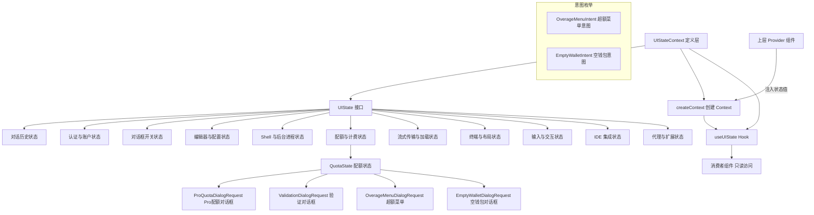

# UIStateContext.tsx

## 概述

`UIStateContext.tsx` 是 Gemini CLI 整个用户界面的全局状态定义中心。它定义了庞大的 `UIState` 接口（包含 **100+ 个字段**），涵盖了 UI 层所有可读状态——从对话历史、认证状态、对话框开关、编辑器配置、Shell 模式，到配额管理、终端尺寸、会话统计等。该文件还定义了多个配额/计费相关的对话框请求类型和意图枚举。

与 `UIActionsContext`（操作/写）配对使用，`UIStateContext`（状态/读）实现了经典的读写分离架构。该文件同样只包含类型定义和 Context 创建，不包含状态管理的具体实现。

核心职责：
- 定义 UI 全局状态的完整类型契约（`UIState` 接口）
- 定义配额/计费相关的对话框请求类型（Pro 配额、验证、超额、空钱包）
- 定义超额菜单意图和空钱包意图类型
- 创建 React Context 实例并提供类型安全的消费者 Hook

## 架构图（Mermaid）



## 核心组件

### 1. 配额/计费对话框请求类型

#### `ProQuotaDialogRequest`
```typescript
export interface ProQuotaDialogRequest {
  failedModel: string;        // 因配额不足失败的模型
  fallbackModel: string;      // 备选降级模型
  message: string;            // 展示给用户的消息
  isTerminalQuotaError: boolean; // 是否为终极配额错误
  isModelNotFoundError?: boolean; // 是否为模型未找到错误
  authType?: AuthType;        // 当前认证类型
  resolve: (intent: FallbackIntent) => void; // 解决 Promise 的回调
}
```
当用户的 Pro 配额用尽时，触发此对话框请求。包含失败模型信息、备选方案和用户选择的回调。

#### `ValidationDialogRequest`
```typescript
export interface ValidationDialogRequest {
  validationLink?: string;         // 验证链接
  validationDescription?: string;  // 验证描述
  learnMoreUrl?: string;           // 了解更多链接
  resolve: (intent: ValidationIntent) => void; // 解决回调
}
```
当需要用户进行身份验证时触发的对话框请求。

#### `OverageMenuIntent` 类型
```typescript
export type OverageMenuIntent = 'use_credits' | 'use_fallback' | 'manage' | 'stop';
```
超额菜单的用户意图选项：
- `use_credits` - 使用 AI 积分
- `use_fallback` - 使用降级模型
- `manage` - 管理配额
- `stop` - 停止操作

#### `OverageMenuDialogRequest`
```typescript
export interface OverageMenuDialogRequest {
  failedModel: string;       // 失败的模型
  fallbackModel?: string;    // 备选模型
  resetTime?: string;        // 配额重置时间
  creditBalance: number;     // 积分余额
  userEmail?: string;        // 用户邮箱
  resolve: (intent: OverageMenuIntent) => void;
}
```
G1 AI Credits 超额流程中的菜单对话框请求。

#### `EmptyWalletIntent` 类型
```typescript
export type EmptyWalletIntent = 'get_credits' | 'use_fallback' | 'stop';
```
空钱包时的用户意图选项：
- `get_credits` - 获取积分
- `use_fallback` - 使用降级模型
- `stop` - 停止操作

#### `EmptyWalletDialogRequest`
```typescript
export interface EmptyWalletDialogRequest {
  failedModel: string;       // 失败的模型
  fallbackModel?: string;    // 备选模型
  resetTime?: string;        // 配额重置时间
  userEmail?: string;        // 用户邮箱
  onGetCredits: () => void;  // 获取积分的回调
  resolve: (intent: EmptyWalletIntent) => void;
}
```
钱包余额为零时的对话框请求。

#### `QuotaState`
```typescript
export interface QuotaState {
  userTier: UserTierId | undefined;
  stats: QuotaStats | undefined;
  proQuotaRequest: ProQuotaDialogRequest | null;
  validationRequest: ValidationDialogRequest | null;
  overageMenuRequest: OverageMenuDialogRequest | null;
  emptyWalletRequest: EmptyWalletDialogRequest | null;
}
```
配额相关的聚合状态，包含用户层级、统计数据以及各类对话框请求的当前状态。

#### `AccountSuspensionInfo`
```typescript
export interface AccountSuspensionInfo {
  message: string;           // 冻结消息
  appealUrl?: string;        // 申诉链接
  appealLinkText?: string;   // 申诉链接文本
}
```
账户冻结相关信息。

### 2. `UIState` 接口

这是整个 UI 层最核心的状态类型定义，包含 100+ 个字段。按功能领域分类如下：

#### 对话历史与消息（8 个字段）

| 字段 | 类型 | 说明 |
|------|------|------|
| `history` | `HistoryItem[]` | 对话历史记录列表 |
| `historyManager` | `UseHistoryManagerReturn` | 历史管理器，提供历史操作方法 |
| `quittingMessages` | `HistoryItem[] \| null` | 退出时的消息列表 |
| `pendingSlashCommandHistoryItems` | `HistoryItemWithoutId[]` | 待处理的斜杠命令历史条目 |
| `pendingGeminiHistoryItems` | `HistoryItemWithoutId[]` | 待处理的 Gemini 响应历史条目 |
| `pendingHistoryItems` | `HistoryItemWithoutId[]` | 待处理的通用历史条目 |
| `userMessages` | `string[]` | 用户消息列表 |
| `messageQueue` | `string[]` | 消息队列 |

#### 认证与账户（8 个字段）

| 字段 | 类型 | 说明 |
|------|------|------|
| `isAuthenticating` | `boolean` | 是否正在认证中 |
| `isConfigInitialized` | `boolean` | 配置是否已初始化 |
| `authError` | `string \| null` | 认证错误信息 |
| `accountSuspensionInfo` | `AccountSuspensionInfo \| null` | 账户冻结信息 |
| `isAuthDialogOpen` | `boolean` | 认证对话框是否打开 |
| `isAwaitingApiKeyInput` | `boolean` | 是否等待 API Key 输入 |
| `apiKeyDefaultValue` | `string \| undefined` | API Key 输入框的默认值 |
| `authConsentRequest` | `ConfirmationRequest \| null` | 认证同意请求 |

#### 对话框状态（16 个字段）

| 字段 | 类型 | 说明 |
|------|------|------|
| `isThemeDialogOpen` | `boolean` | 主题对话框是否打开 |
| `themeError` | `string \| null` | 主题错误信息 |
| `isEditorDialogOpen` | `boolean` | 编辑器对话框是否打开 |
| `editorError` | `string \| null` | 编辑器错误信息 |
| `showPrivacyNotice` | `boolean` | 是否显示隐私声明 |
| `isSettingsDialogOpen` | `boolean` | 设置对话框是否打开 |
| `isSessionBrowserOpen` | `boolean` | 会话浏览器是否打开 |
| `isModelDialogOpen` | `boolean` | 模型对话框是否打开 |
| `isAgentConfigDialogOpen` | `boolean` | 代理配置对话框是否打开 |
| `isPermissionsDialogOpen` | `boolean` | 权限对话框是否打开 |
| `permissionsDialogProps` | `{ targetDirectory?: string } \| null` | 权限对话框属性 |
| `isFolderTrustDialogOpen` | `boolean` | 文件夹信任对话框是否打开 |
| `isPolicyUpdateDialogOpen` | `boolean` | 策略更新对话框是否打开 |
| `policyUpdateConfirmationRequest` | `PolicyUpdateConfirmationRequest \| undefined` | 策略更新确认请求 |
| `dialogsVisible` | `boolean` | 对话框是否可见（总开关） |
| `customDialog` | `React.ReactNode \| null` | 自定义对话框节点 |

#### 代理与扩展（7 个字段）

| 字段 | 类型 | 说明 |
|------|------|------|
| `selectedAgentName` | `string \| undefined` | 选中的代理名称 |
| `selectedAgentDisplayName` | `string \| undefined` | 选中的代理显示名称 |
| `selectedAgentDefinition` | `AgentDefinition \| undefined` | 选中的代理定义 |
| `extensionsUpdateState` | `Map<string, ExtensionUpdateState>` | 扩展更新状态映射 |
| `confirmUpdateExtensionRequests` | `ConfirmationRequest[]` | 扩展更新确认请求列表 |
| `newAgents` | `AgentDefinition[] \| null` | 新发现的代理列表 |
| `adminSettingsChanged` | `boolean` | 管理员设置是否变更 |

#### Shell 与后台进程（9 个字段）

| 字段 | 类型 | 说明 |
|------|------|------|
| `shellModeActive` | `boolean` | Shell 模式是否激活 |
| `activePtyId` | `number \| undefined` | 当前活动的 PTY ID |
| `backgroundShellCount` | `number` | 后台 Shell 数量 |
| `isBackgroundShellVisible` | `boolean` | 后台 Shell 是否可见 |
| `embeddedShellFocused` | `boolean` | 嵌入式 Shell 是否聚焦 |
| `backgroundShells` | `Map<number, BackgroundShell>` | 后台 Shell 映射（PID -> Shell） |
| `activeBackgroundShellPid` | `number \| null` | 当前活动的后台 Shell PID |
| `backgroundShellHeight` | `number` | 后台 Shell 显示高度 |
| `isBackgroundShellListOpen` | `boolean` | 后台 Shell 列表是否打开 |

#### 流式传输与加载状态（6 个字段）

| 字段 | 类型 | 说明 |
|------|------|------|
| `streamingState` | `StreamingState` | 当前流式传输状态 |
| `thought` | `ThoughtSummary \| null` | 当前思考摘要 |
| `elapsedTime` | `number` | 已用时间 |
| `currentLoadingPhrase` | `string \| undefined` | 当前加载提示语 |
| `currentTip` | `string \| undefined` | 当前提示信息 |
| `currentWittyPhrase` | `string \| undefined` | 当前趣味短语 |

#### 输入与交互（13 个字段）

| 字段 | 类型 | 说明 |
|------|------|------|
| `buffer` | `TextBuffer` | 文本输入缓冲区 |
| `inputWidth` | `number` | 输入框宽度 |
| `suggestionsWidth` | `number` | 建议框宽度 |
| `isInputActive` | `boolean` | 输入是否激活 |
| `ctrlCPressedOnce` | `boolean` | Ctrl+C 是否已按下一次 |
| `ctrlDPressedOnce` | `boolean` | Ctrl+D 是否已按下一次 |
| `showEscapePrompt` | `boolean` | 是否显示 Escape 提示 |
| `slashCommands` | `readonly SlashCommand[] \| undefined` | 可用的斜杠命令列表 |
| `commandContext` | `CommandContext` | 命令上下文 |
| `copyModeEnabled` | `boolean` | 复制模式是否启用 |
| `hintMode` | `boolean` | 提示模式是否启用 |
| `hintBuffer` | `string` | 提示输入缓冲区 |
| `showIsExpandableHint` | `boolean` | 是否显示可展开提示 |

#### 确认请求（4 个字段）

| 字段 | 类型 | 说明 |
|------|------|------|
| `commandConfirmationRequest` | `ConfirmationRequest \| null` | 命令确认请求 |
| `loopDetectionConfirmationRequest` | `LoopDetectionConfirmationRequest \| null` | 循环检测确认请求 |
| `permissionConfirmationRequest` | `PermissionConfirmationRequest \| null` | 权限确认请求 |
| `queueErrorMessage` | `string \| null` | 队列错误消息 |

#### 终端与布局（12 个字段）

| 字段 | 类型 | 说明 |
|------|------|------|
| `constrainHeight` | `boolean` | 是否约束高度 |
| `availableTerminalHeight` | `number \| undefined` | 可用终端高度 |
| `stableControlsHeight` | `number` | 稳定控件高度 |
| `mainAreaWidth` | `number` | 主区域宽度 |
| `staticAreaMaxItemHeight` | `number` | 静态区域最大项高度 |
| `staticExtraHeight` | `number` | 静态额外高度 |
| `terminalWidth` | `number` | 终端宽度 |
| `terminalHeight` | `number` | 终端高度 |
| `mainControlsRef` | `React.RefCallback<DOMElement \| null>` | 主控件 DOM 引用回调 |
| `rootUiRef` | `React.MutableRefObject<DOMElement \| null>` | 根 UI DOM 引用（性能分析用） |
| `terminalBackgroundColor` | `TerminalBackgroundColor` | 终端背景色 |
| `historyRemountKey` | `number` | 历史组件重新挂载的 key |

#### IDE 集成（5 个字段）

| 字段 | 类型 | 说明 |
|------|------|------|
| `ideContextState` | `IdeContext \| undefined` | IDE 上下文状态 |
| `currentIDE` | `IdeInfo \| null` | 当前 IDE 信息 |
| `showIdeRestartPrompt` | `boolean` | 是否显示 IDE 重启提示 |
| `ideTrustRestartReason` | `RestartReason` | IDE 信任重启原因 |
| `shouldShowIdePrompt` | `boolean` | 是否应显示 IDE 提示 |

#### 配额与模型（3 个字段）

| 字段 | 类型 | 说明 |
|------|------|------|
| `quota` | `QuotaState` | 配额聚合状态 |
| `currentModel` | `string` | 当前使用的模型名称 |
| `contextFileNames` | `string[]` | 上下文文件名列表 |

#### 其他杂项（14 个字段）

| 字段 | 类型 | 说明 |
|------|------|------|
| `corgiMode` | `boolean` | Corgi 模式（彩蛋？） |
| `debugMessage` | `string` | 调试消息 |
| `initError` | `string \| null` | 初始化错误 |
| `geminiMdFileCount` | `number` | Gemini MD 文件计数 |
| `isResuming` | `boolean` | 是否正在恢复会话 |
| `isRestarting` | `boolean` | 是否正在重启 |
| `folderDiscoveryResults` | `FolderDiscoveryResults \| null` | 文件夹发现结果 |
| `isTrustedFolder` | `boolean \| undefined` | 当前文件夹是否受信任 |
| `showErrorDetails` | `boolean` | 是否显示错误详情 |
| `renderMarkdown` | `boolean` | 是否渲染 Markdown |
| `showApprovalModeIndicator` | `ApprovalMode` | 审批模式指示器 |
| `allowPlanMode` | `boolean` | 是否允许计划模式 |
| `errorCount` | `number` | 错误计数 |
| `nightly` | `boolean` | 是否为 nightly 版本 |
| `branchName` | `string \| undefined` | 分支名称 |
| `sessionStats` | `SessionStatsState` | 会话统计状态 |
| `updateInfo` | `UpdateObject \| null` | 更新信息 |
| `shortcutsHelpVisible` | `boolean` | 快捷键帮助是否可见 |
| `cleanUiDetailsVisible` | `boolean` | 简洁 UI 详情是否可见 |
| `showDebugProfiler` | `boolean` | 是否显示调试分析器 |
| `showFullTodos` | `boolean` | 是否显示完整待办事项 |
| `activeHooks` | `ActiveHook[]` | 活动的 Hook 列表 |
| `bannerData` | `{ defaultText, warningText }` | 横幅数据 |
| `bannerVisible` | `boolean` | 横幅是否可见 |
| `settingsNonce` | `number` | 设置随机数（用于触发刷新） |
| `transientMessage` | `{ text, type } \| null` | 临时消息（含类型） |

### 3. `UIStateContext`

```typescript
export const UIStateContext = createContext<UIState | null>(null);
```
以 `null` 为初始值创建的 React Context 实例，直接导出供上层 Provider 使用。

### 4. `useUIState()` Hook

```typescript
export const useUIState = () => {
  const context = useContext(UIStateContext);
  if (!context) {
    throw new Error('useUIState must be used within a UIStateProvider');
  }
  return context;
};
```
类型安全的消费者 Hook，内置 Provider 存在性检查。

## 依赖关系

### 内部依赖

| 模块 | 路径 | 用途 |
|------|------|------|
| `HistoryItem`, `ThoughtSummary`, `ConfirmationRequest`, `QuotaStats`, `LoopDetectionConfirmationRequest`, `HistoryItemWithoutId`, `StreamingState`, `ActiveHook`, `PermissionConfirmationRequest` | `../types.js` | 核心 UI 数据类型 |
| `CommandContext`, `SlashCommand` | `../commands/types.js` | 命令系统类型 |
| `TextBuffer` | `../components/shared/text-buffer.js` | 文本缓冲区类型 |
| `TransientMessageType` | `../../utils/events.js` | 临时消息类型枚举 |
| `SessionStatsState` | `../contexts/SessionContext.js` | 会话统计状态类型 |
| `ExtensionUpdateState` | `../state/extensions.js` | 扩展更新状态类型 |
| `UpdateObject` | `../utils/updateCheck.js` | 更新对象类型 |
| `UseHistoryManagerReturn` | `../hooks/useHistoryManager.js` | 历史管理器返回值类型 |
| `RestartReason` | `../hooks/useIdeTrustListener.js` | 重启原因类型 |
| `TerminalBackgroundColor` | `../utils/terminalCapabilityManager.js` | 终端背景色类型 |
| `BackgroundShell` | `../hooks/shellCommandProcessor.js` | 后台 Shell 类型 |

### 外部依赖

| 包名 | 导入内容 | 用途 |
|------|----------|------|
| `react` | `createContext`, `useContext` | React Context API |
| `ink` | `DOMElement` (类型) | Ink 框架的 DOM 元素类型，用于 Ref 类型标注 |
| `@google/gemini-cli-core` | `IdeContext`, `ApprovalMode`, `UserTierId`, `IdeInfo`, `AuthType`, `FallbackIntent`, `ValidationIntent`, `AgentDefinition`, `FolderDiscoveryResults`, `PolicyUpdateConfirmationRequest` (类型) | 核心业务类型 |

## 关键实现细节

1. **状态与操作分离**：`UIStateContext` 只负责"读"（状态），`UIActionsContext` 负责"写"（操作）。这种分离意味着只消费状态的组件不会因操作引用变化而重渲染，反之亦然。这对于包含 100+ 字段的巨大状态对象尤为重要。

2. **Promise resolve 回调模式**：配额/计费相关的对话框请求类型（`ProQuotaDialogRequest`、`ValidationDialogRequest`、`OverageMenuDialogRequest`、`EmptyWalletDialogRequest`）都包含 `resolve` 函数字段。这是一种"挂起 Promise + UI 选择 resolve"的异步交互模式——业务层创建 Promise 并将 resolve 函数传入状态，UI 层显示对话框后用户选择时调用 resolve，从而完成异步流程。

3. **双重退出确认**：`ctrlCPressedOnce` 和 `ctrlDPressedOnce` 字段实现了"按两次才退出"的防误操作机制。第一次按下标记为 true 并显示提示，第二次按下才真正执行退出。

4. **响应式布局系统**：多个尺寸字段（`terminalWidth`、`terminalHeight`、`availableTerminalHeight`、`mainAreaWidth`、`stableControlsHeight`、`staticAreaMaxItemHeight`、`backgroundShellHeight` 等）构成了完整的响应式布局系统，确保 TUI（文本用户界面）在不同终端尺寸下正确渲染。

5. **historyRemountKey 强制重新挂载**：这是一个递增的数字 key，通过修改该值可以强制 React 重新挂载整个历史组件子树，用于需要完全重置组件状态的场景。

6. **settingsNonce 刷新触发器**：类似 `historyRemountKey`，`settingsNonce` 是一个随机数，用于在设置变更后触发依赖设置的组件刷新，无需直接传递设置值。

7. **背景 Shell 管理**：`backgroundShells`（Map 结构）、`activeBackgroundShellPid`、`backgroundShellCount`、`isBackgroundShellListOpen` 等字段共同构成了多后台 Shell 管理系统，支持同时运行和切换多个后台终端进程。

8. **类型导出的桥梁作用**：`OverageMenuIntent` 和 `EmptyWalletIntent` 类型在此文件中定义并导出，被 `UIActionsContext.tsx` 导入使用，形成了状态定义层到操作定义层的类型桥梁。
